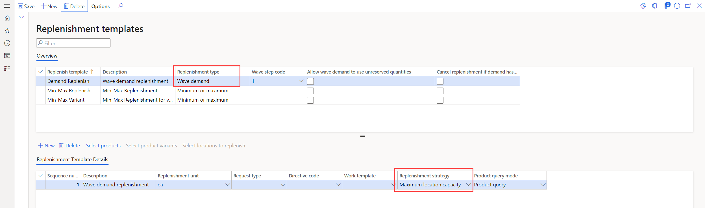
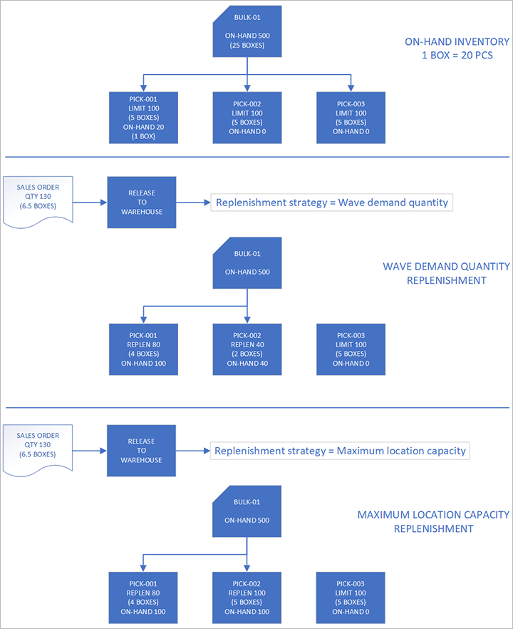
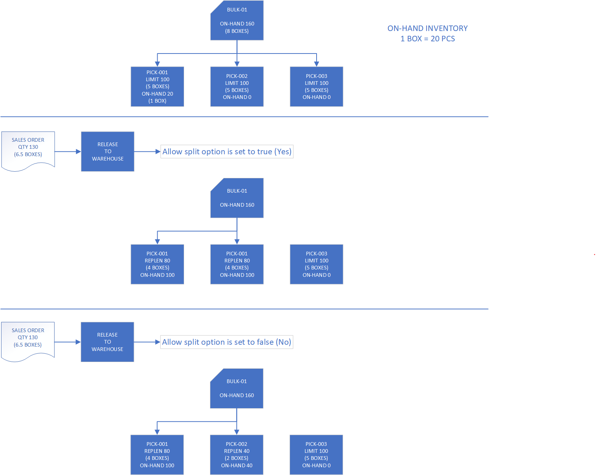

# Replenishment strategies

[!include [banner](../includes/banner.md)]

The templates that are defined on the **Replenishment templates** page include wave demand replenishment template lines that let you select how replenishment is done. Each line now includes a **Replenishment strategy** field.

The *Wave demand quantity* strategy is the default strategy. It's the replenishment strategy that was used before the introduction of the **Replenishment strategy** field. It uses the replenishment location directives to find locations that can be replenished. It then replenishes those locations until the demand is covered.

The *Maximum location capacity* strategy introduces some new functionality. Like the *Wave demand quantity* strategy, this strategy uses the replenishment location directives to find locations that can be replenished, and then it replenishes those locations until the demand is covered. It differs from the *Wave demand quantity* strategy in that all the replenished locations are replenished to their maximum capacity, as defined by the location stocking limits. The *Maximum location capacity* strategy tries to create work to bring in the requested quantity, plus some extra quantity, to fill the locations that are being replenished. However, in some cases, that attempt might fail. For example, the bulk locations might not have enough inventory to cover the extra quantity. In these cases, the system detects the failure and tries to recover.

Peak season is one example of a situation where the *Maximum location capacity* strategy is preferable to the *Wave demand quantity* strategy. During peak season, some items might be selling at high volume. Therefore, you might want to proactively replenish the relevant picking locations as much as possible, to reduce the number of work IDs that are created for replenishment.

> [!IMPORTANT]
> To take full advantage of the *Maximum location capacity* strategy, you must redefine the stocking limits for the relevant locations. Otherwise, this strategy works just like the *Wave demand quantity* strategy.

## Turn on the Replenish to max based on stocking limits feature

Before you can use this feature, it must be turned on for your system. Administrators can use the [Feature management](../../fin-ops-core/fin-ops/get-started/feature-management/feature-management-overview.md) workspace to check the status of this feature and turn it on if it's required. There, the feature is listed in the following way:

- **Module:** *Warehouse management*
- **Feature name:** *Replenish to max based on stocking limits*

## Set up replenishment strategies

To access the templates, go to **Warehouse management \> Setup \> Replenishment \> Replenishment templates**. In the **Overview** section, select or create a wave demand replenishment template where the **Replenishment type** field is set to *Wave demand*. Then set up the replenishment template lines in the **Replenishment template details** section. For each line, in the **Replenishment strategy** field, select the replenishment strategy that you want to use.

If the **Replenishment strategy** column doesn't appear in the grid in the **Replenishment template details** section, make sure that the feature has been turned on, and that the selected replenishment template has a replenishment type of *Wave demand*.

> [!NOTE]
> The *Wave demand quantity* strategy is the default strategy. Therefore, you just have to update the replenishment template lines where you want to use the *Maximum location capacity* strategy instead.

## Example scenarios

### Example 1

For this example, there is only one replenishment template that has only one replenishment template line.

You create a sales order for 130 pieces (pcs) of item A0001. Before you release the order to the warehouse, the warehouse is set up in the following way:

- There is only one bulk location, and it has 500 pcs of available on-hand inventory.
- There are three pick locations, each of which has a stocking limit of 100 pcs. (Remember that stocking limits are required for the *Maximum location capacity* strategy.)
- The replenishment put locations are the same as the sales pick locations.
- The replenishment unit is a box (1 box = 20 pcs).

At the time of the order, the following inventory is on hand at the sales pick locations:

- **Pick-001:** 20 pcs (1 box)
- **Pick-002:** 0 pcs
- **Pick-003:** 0 pcs

Initially, the replenishment strategy is set to *Wave demand quantity*.

After you release the sales order to the warehouse, and wave processing runs for the wave, you get the following replenishment work:

- **Replenishment work 1:** Pick 4 boxes from the bulk location, and put them in location pick-001.
- **Replenishment work 2:** Pick 2 boxes from the bulk location, and put them in location pick-002.

You get two replenishment work IDs because you must replenish two locations, and multi-puts aren't supported.

If you set the replenishment strategy to *Maximum location capacity* instead, you get the following replenishment work:

- **Replenishment work 1:** Pick 4 boxes from the bulk location, and put them in location pick-001.
- **Replenishment work 2:** Pick 5 boxes from the bulk location, and put them in location pick-002.

### Example 2

This example shows what happens when the bulk location doesn't have enough inventory to cover the extra quantity. It uses the same scenario as example 1, but the bulk location has 160 pcs (8 boxes).

The *Wave demand quantity* strategy creates the same work that it did in example 1.

However, because the *Maximum location capacity* strategy tries to create the work IDs as it did in example 1, it might fail. At that point, the system tries to recover.

Depending on the setting of the **Allow split** option on the location directives for replenishment picking, two outcomes are possible:

- If the **Allow split** option is set to *Yes*, the following replenishment work is created:

    - **Replenishment work 1:** Pick 4 boxes from the bulk location, and put them in location pick-001.
    - **Replenishment work 2:** Pick 4 boxes from the bulk location, and put them in location pick-002.

- If the **Allow split** option is set to *No*, the following replenishment work is created:

    - **Replenishment work 1:** Pick 4 boxes from the bulk location, and put them in location pick-001.
    - **Replenishment work 2:** Pick 2 boxes from the bulk location, and put them in location pick-002.

The outcomes differ because of the information that is available when you create the work. When the **Allow split** is set to *Yes* on the location directives for replenishment picking, you know that you managed to find 160 pcs. Therefore, you can create work for that quantity. However, when the **Allow split** option is set to *No*, you don't know about the existence of the 160 pcs. Because the extra quantity that you decided to replenish was 3 boxes, you drop that extra quantity and try the original quantity again.

Therefore, to get the maximum quantity to the replenished locations, you should set the **Allow split** option to *Yes* on the location directives for replenishment picking.

[!INCLUDE[footer-include](../../includes/footer-banner.md)]