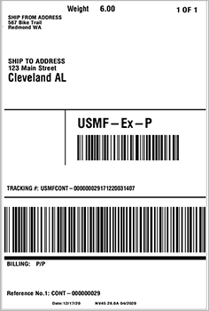

---
# required metadata

title: Small parcel shipping
description: This article provides information about the small parcel shipping (SPS) feature. This feature enables Microsoft Dynamics 365 Supply Chain Management to submit details about a packed container to the carrier, and then receive a shipping label, shipping rate, and tracking number back from that carrier.
author: Mirzaab
ms.date: 08/09/2022
ms.topic: article
ms.prod: 
ms.technology: 

# optional metadata

ms.search.form: TMSRateEngine, TMSCarrier, CustTable, TMSShippingCarrierCustomerAccount, TMSSmallParcelShippingFeature
audience: Application User
# ms.devlang: 
ms.reviewer: kamaybac

# ms.tgt_pltfrm: 
# ms.custom: [used by loc for articles migrated from the wiki]
ms.search.region: Global
# ms.search.industry: [leave blank for most, retail, public sector]
ms.author: mirzaab
ms.search.validFrom: 2021-01-08
ms.dyn365.ops.version: 10.0.16
---

# Small parcel shipping

[!include [banner](../../includes/banner.md)]

The small parcel shipping (SPS) feature enables Microsoft Dynamics 365 Supply Chain Management to interact directly with shipping carriers by providing a framework for communication through carrier APIs. This functionality is useful when you're shipping individual sales orders via commercial shipping carriers instead of using container shipping or less-than-truckload (LTL) shipping.

The SPS feature interacts with your shipping carrier through a dedicated *rate engine*. Your organization must develop this rate engine in collaboration with your carrier or carrier hub service. The rate engine enables Supply Chain Management to submit details about a packed container to your carrier, and then receive a shipping label, shipping rate, and tracking number back from that carrier.

The shipping rate that is returned is added to the associated sales order as a miscellaneous charge. The shipping label that is returned can then automatically be printed by using a Zebra Programming Language (ZPL) printer and applied to the shipment. The carrier will scan this shipping label when it picks up the packages at your warehouse.

## Prepare your system to support SPS

Before you can start to use SPS functionality, you must turn on the SPS feature in Feature management, add your rate engine, and set up the **Transportation management** and **Warehouse management** modules to support it.

### Turn the SPS feature on or off

To use this feature, it must be turned on for your system. As of Supply Chain Management version 10.0.29, the feature is mandatory and can't be turned off. If you're running a version older than 10.0.29, then admins can turn this functionality on or off by searching for the *Small parcel shipping* feature in the [Feature management](../../fin-ops-core/fin-ops/get-started/feature-management/feature-management-overview.md) workspace.

### Deploy and set up rate engines

Supply Chain Management doesn't include any rate engines. You must obtain or create any rate engines that you require, and then add them to your system. However, Microsoft provides a demo rate engine that you can use for testing.

#### Download and deploy the demo rate engine

Follow these steps to get the demo rate engine.

1. On GitHub, download the [dynamic-link library (DLL) for the demo rate engine](https://github.com/microsoft/Dynamics-365-FastTrack-Implementation-Assets/tree/master/SCM/SPS).
1. On your Supply Chain Management server, save the DLL in the 
**\\AOSService\\PackagesLocalDirectory\\ApplicationSuite\\bin** folder.

#### Create and deploy functional rate engines

For information about how to create and deploy functional rate engines so that they can be used in a production or test environment, see the following articles:

- [Create a new transportation management engine](../transportation/create-new-transportation-management-engine.md)
- [Set up transportation management engines](/dynamicsax-2012/appuser-itpro/set-up-transportation-management-engines)

#### Set up a rate engine in Supply Chain Management

After you've created and deployed a rate engine for SPS, follow these steps to set it up.

1. Go to **Transportation management \> Setup \> Engines \> Rate engine**.
1. On the Action Pane, select **New** to add a row to the grid.
1. In the new row, set the following fields:

    - **Rating engine** – Enter a unique name for the rate engine. If you're using the demo rate engine, enter *Demo rate engine*.
    - **Name** – Enter a short description of the rate engine. If you're using the demo rate engine, enter *Demo rate engine*.
    - **Rating metadata ID** – Select the basis that should be used to calculate your rate. For example, your rate might be calculated based on distance. If you're using the demo rate engine, you can leave this field blank.
    - **Engine assembly** – Enter the file name of the DLL package that you deployed. If you're using the demo rate engine, enter *TMSSmallParcelShippingEngine.dll*.
    - **Engine class** – Enter the class name that was established for your rate engine. If you're using the demo rate engine, enter *TMSSmallParcelShippingEngine.SmallParcelShippingRateEngine*.

## Example scenario

This example scenario shows how to set up and use SPS after you've prepared your system as described earlier in this article. This scenario uses the previously mentioned demo rate engine.

### Make demo data available

To work through this scenario by using the demo records and values that are specified here, you must be on a system where the standard [demo data](../../fin-ops-core/fin-ops/get-started/demo-data.md) is installed. Additionally, you must select the **USMF** legal entity before you begin.

### Set up the scenario

For this example scenario, you must have a demo carrier, carrier group, packing policy, and packing profile. The following subsections explain how to prepare the records that are required for the scenario. In a production scenario, the setup process typically resembles the process that is described here. However, you will set different values.

#### Set up carriers

Follow these steps to set up a carrier.

1. Go to **Transportation management \> Setup \> Carriers \> Shipping carriers**.
1. On the Action Pane, select **New** to add a carrier.
1. On the header, set the following values:

    - **Shipping carrier:** *Demo Carrier*
    - **Name:** *Demo Carrier*
    - **Mode:** *Ground*

1. On the **Overview** FastTab, set the following values:

    - **Activate shipping carrier:** *Yes*
    - **Activate carrier rating:** *Yes*

1. On the **Services** FastTab, select **New** to add a service to the grid.
1. Set the following values for the new service:

    - **Carrier service:** *Demo carrier service*
    - **Name:** *Demo carrier service*
    - **Transportation method:** *Ground*

    Enter arbitrary values for all the other fields, as required. (When you save the new shipping carrier record, a new mode of delivery will be created, and the **Mode of delivery** field will be set automatically.)

1. On the **Rating profiles** FastTab, select **New** to add a rating profile to the grid.
1. Set the following values for the new profile:

    - **Rating profile:** *Demo carrier service*
    - **Name:** *Demo carrier service*
    - **Rate engine:** *Demo rate engine*

    Enter arbitrary values for all the other fields, as required.

1. On the Action Pane, select **Save**.

For more information about how to set up carriers, see [Set up shipping carriers](../transportation/tasks/set-up-shipping-carriers.md).

#### Set up carrier service accounts

Follow these steps to set up a carrier service account.

1. Go to **Transportation management \> Setup \> Rating \> Carrier service account**.
1. On the Action Pane, select **New** to add a carrier service account.
1. Set the following values for the new account:

    - **Shipping Carrier:** *Demo Carrier*
    - **Carrier service:** *Demo carrier service*
    - **Carrier customer account number:** The carrier customer account number that is used to verify and authenticate the connection to the shipping carrier. Your carrier will provide this value. If you're using the demo service, you can enter an arbitrary value.
    - **Site:** *6*
    - **Warehouse:** *62*

    > [!NOTE]
    > Often, the **Carrier customer account number** value is the only value that is required to authenticate the connection. However, if your carrier requires additional authentication parameters, your organization should customize this page to add extra fields as appropriate.

#### Set up a container packing policy

Follow these steps to set up a container packing policy.

1. If you haven't already set up a ZPL printer definition, use the Document Routing Agent application to set it up. For more information, see [Document printing overview](../../fin-ops-core/dev-itpro/analytics/print-documents.md) and related articles.
1. Go to **Warehouse Management \> Setup \> Containers \> Container packing policies**.
1. On the Action Pane, select **New** to add a container packing policy.
1. On the header of the new policy, set the following values:

    - **Container packing policy:** *Demo packing policy*
    - **Description:** A description of the policy

1. On the **Overview** FastTab, set the following values:

    - **Warehouse:** *62*
    - **Default location for final shipment:** *Baydoor*
    - **Weight unit:** *KG*
    - **Container closing policy:** *Automatic release*
    - **Container release policy:** *Make available at final shipping location*

1. On the **Container manifest** FastTab, set the following values:

    - **Automatic manifest at container close:** *Yes*
    - **Manifest requirements for container:** *Transportation management*
    - **Print container contents:** *No*

1. On the **Carrier label printing** FastTab, set the following values:

    - **Print container shipping label:** *Always*
    - **Printer name:** The name of the ZPL printer that should print shipping labels

#### Set up a packing profile

Follow these steps to set up a packing profile.

1. Go to **Warehouse Management \> Setup \> Packing \> Packing profiles**.
1. On the Action Pane, select **New** to add a packing profile to the grid.
1. Set the following values for the new profile:

    - **Packing profile ID:** *Demo packing profile*
    - **Description:** A description of the profile
    - **Container packing policy:** *Demo packing policy*
    - **Container ID mode:** *Auto*
    - **Container type:** *SmallBox*

#### Set up a customer to use the SPS carrier

Follow these steps to set up a customer so that it can use the carrier that you created.

1. Go to **Accounts receivable \> customers \> All customers**.
1. In the grid, find and select customer *US-027*.
1. On the Action Pane, on the **General** tab, in the **Set up** group, select **Carrier customer accounts**.
1. On the **Carrier customer accounts** page, on the Action Pane, select **New** to add an account to the grid.
1. Set the following values for the new account:

    - **Shipping carrier:** *Demo Carrier*
    - **Carrier customer account number:** *12345* (The value isn't important for this scenario, but it will be referred to in the next section.)

### Go through the example scenario

After you've set up all the sample data as described in the previous section, you're ready to go through the example scenario.

#### Create a sales order and process the work

Follow these steps to create a sales order.

1. Go to **Sales and marketing \> Sales orders \> All sales orders**.
1. Select **New** to create a sales order.
1. In the **Create sales order** dialog box, set the **Customer account** field to *US-027*.
1. Select **OK** to create the sales order and close the dialog box.
1. The new sales order is opened. On the **Sales order header** FastTab, set the **Carrier customer account number** field to the value that you selected for this customer earlier (*12345*).
1. In the **Sales order lines** section, add a sales line, and set the following values for it:

    - **Item number:** *A0002*
    - **Quantity:** *1*
    - **Site:** *6*
    - **Warehouse:** *62*

1. Switch to the **Header** view.
1. On the **Delivery** FastTab, set the following values:

    - **Shipping carrier:** *Demo Carrier*
    - **Carrier service:** *Demo carrier service*

1. Switch back to the **Lines** view. If you're prompted to update the mode of delivery for the sales lines, select **Yes**.
1. In the **Sales order lines** section, select the order line that you set up earlier, and then select **Inventory \> Reservation**.
1. On the **Reservation** page, select **Reserve lot** to reserve the selected line's full quantity in the warehouse.
1. Close the **Reservation** page to return to the sales order.
1. On the Action Pane, on the **Warehouse** tab, select **Release to warehouse**.

    Work is created to move items from the picking location to the packing station.

1. In the **Sales order lines** section, select **Warehouse \> Shipment details**.
1. On the **Shipment details** page, make a note of the shipment ID. You will need it when you pack the pack the shipment at the packing station.
1. Close the **Shipment details** page to return to the sales order.
1. Make a note of the sales order number, and then go to **Warehouse management \> Work \> All work**.
1. Use the sales order number to find and select the work that was created for the order.
1. On the Action Pane, on the **Work** tab, select **Complete work**.
1. On the **Work completion** page, in the **User ID** field, select a user ID. Then, on the Action Pane, select **Validate work**.
1. If the work passes validation, select **Complete work** on the Action Pane.

    The work is marked as completed to simulate the movement of items to the packing station.

#### Pack the shipment

Follow these steps to pack the shipment.

1. Go to **Warehouse management \> Setup \> Worker**, and make sure that your user account is associated with a worker account for warehouse management.
1. Go to **Warehouse management \> Picking and containerization \> Pack**.
1. In the **Select packing station** dialog box, set the following values:

    - **Site:** *6*
    - **Warehouse:** *62*
    - **Location:** *Pack*
    - **Packing profile ID:** *Demo packing profile*

1. Select **OK**.
1. The **Pack** page appears. In a production scenario, a worker will scan a license plate or shipment ID. However, for this scenario, open the **All shipments** page, and look up the shipment number for the shipment that you just created. Then enter this value in the **License plate or shipment** field on the **Pack** page. Alternatively, enter the shipment ID that you made a note of earlier.
1. On the Action Pane, select **New container**.
1. The dialog box that appears shows details about the new container. Leave the default values, and then select **OK**.
1. On the **Pack** page, on the **Item packing** FastTab, in the **Identifier** field, select *A0002* to pack that item. The item is added to the container.
1. On the Action Pane, select **Containers for shipment**.

    The **Containers for shipment** page that appears has a row for the container that you just created. However, the **Container manifest ID** field in that row is currently blank, because you haven't yet received the shipping label and tracking number from the carrier.

1. On the Action Pane, select **Close container**.
1. In the **Close container** dialog box, set the **Gross weight** field to *1 kg*, and then select **OK**.

    The shipping label should now be printed on the ZPL printer that you selected earlier. It should resemble the following example.

    

1. Notice that the **Container manifest ID** and **Total freight** values have been added as received from the carrier.

[!INCLUDE[footer-include](../../includes/footer-banner.md)]