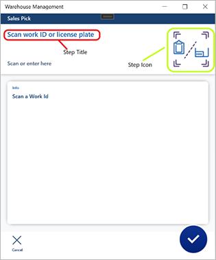
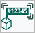
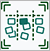
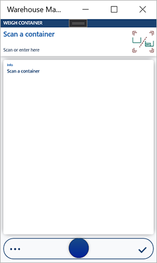

# Assign step icons and titles for the Warehouse Management mobile app

[!include [banner](../includes/banner.md)]

This topic describes on how to assign step icons and titles for new or customized task flows for the Warehouse Management mobile app.

The following screenshot shows how step titles and icons appear in the Warehouse Management mobile app.



## Turn on this feature in your system

Before you can use this feature, it must be turned on in your system. Admins can use the [Feature management](../../fin-ops-core/fin-ops/get-started/feature-management/feature-management-overview.md) settings to check the status of the feature and turn it on. In the **Feature management** workspace, the feature is listed in the following way:

- **Module**: *Warehouse management*
- **Feature name**: *User settings, icons, and step titles for the new warehouse app*

## Standard step IDs, classes, and icons

Each step in a task flow is identified by a step ID, and each step ID has its corresponding step class. The step icon and title are specified in each step class.

### <a name="step-ids-classes"></a>Step IDs and step classes

The following table provides a list of all the currently available step IDs and their corresponding step classes. The control name of the primary input field is used as the step ID.

For an example of how these are used, see the implementation for the method `WHSMobileAppStepInfoBuilder.stepId()` provided in [Example of assigning step titles and icons for a custom flow](#example), later in this topic.

| Step ID                                        | Step Class                                    |
|------------------------------------------------|-----------------------------------------------|
| MobileDeviceQueueMessageCollectionIdentifierId | WHSMobileAppStepSelectOrder                   |
| InventBatchId                                  | WHSMobileAppStepBatch                         |
| BatchDisposition                               | WHSMobileAppStepBatchDisposition              |
| Carrier                                        | WHSMobileAppStepCarrier                       |
| CatchWeight                                    | WHSMobileAppStepCatchWeight                   |
| NewCaptureWeight                               | WHSMobileAppStepCatchWeight                   |
| OutboundWeight                                 | WHSMobileAppStepCatchWeight                   |
| CatchWeightQtyOutboundWeight                   | WHSMobileAppStepCatchWeight                   |
| CatchWeightTag                                 | WHSMobileAppStepCatchWeightTag                |
| OutboundCatchWeightTag                         | WHSMobileAppStepCatchWeightTag                |
| CatchWeightTagWeight                           | WHSMobileAppStepCatchWeightTagWeight          |
| ChangeWarehouseSuccess                         | WHSMobileAppStepChangeWarehouseSuccess        |
| CheckDigit                                     | WHSMobileAppStepCheckDigit                    |
| ClusterId                                      | WHSMobileAppStepClusterId                     |
| ClusterPosition                                | WHSMobileAppStepClusterPosition               |
| ConfigId                                       | WHSMobileAppStepConfigId                      |
| Confirmation                                   | WHSMobileAppStepConfirmation                  |
| ConsolidateFromLicensePlateId                  | WHSMobileAppStepConsolidateFromLicensePlateId |
| ConsolidateLPConfirmation                      | WHSMobileAppStepConsolidateLPConfirmation     |
| ConsolidateToLicensePlateId                    | WHSMobileAppStepConsolidateToLicensePlateId   |
| ContainerType                                  | WHSMobileAppStepContainerType                 |
| CountingReasonCode                             | WHSMobileAppStepCountingReasonCode            |
| CycleCountingAddLPOrFinish                     | WHSMobileAppStepCycleCountingAddLPOrFinish    |
| CycleCountQty1                                 | WHSMobileAppStepCycleCountQty                 |
| CycleCountQty2                                 | WHSMobileAppStepCycleCountQty                 |
| CycleCountQty3                                 | WHSMobileAppStepCycleCountQty                 |
| CycleCountQty4                                 | WHSMobileAppStepCycleCountQty                 |
| Disposition                                    | WHSMobileAppStepDisposition                   |
| DriverCheckInConfirmation                      | WHSMobileAppStepDriverCheckInConfirmation     |
| DriverCheckOutConfirmation                     | WHSMobileAppStepDriverCheckOutConfirmation    |
| ExpDate                                        | WHSMobileAppStepExpDate                       |
| FromBatchDisposition                           | WHSMobileAppStepFromBatchDisposition          |
| FullQty                                        | WHSMobileAppStepFullQty                       |
| InventColorId                                  | WHSMobileAppStepInventColorId                 |
| InventLocation                                 | WHSMobileAppStepInventLocation                |
| FromInventoryStatus                            | WHSMobileAppStepInventoryStatusFrom           |
| InventSerialId                                 | WHSMobileAppStepInventSerialId                |
| InventSizeId                                   | WHSMobileAppStepInventSizeId                  |
| InventStatusId                                 | WHSMobileAppStepInventStatus                  |
| InventStyleId                                  | WHSMobileAppStepInventStyleId                 |
| InventVersionId                                | WHSMobileAppStepInventVersionId               |
| ItemId                                         | WHSMobileAppStepItem                          |
| KanbanCardId                                   | WHSMobileAppStepKanbanCard                    |
| KanbanOrCardId                                 | WHSMobileAppStepKanbanCard                    |
| KanbanCardToEmpty                              | WHSMobileAppStepKanbanCardToEmpty             |
| LicensePlateId                                 | WHSMobileAppStepLicensePlate                  |
| LoadId                                         | WHSMobileAppStepLoadId                        |
| WMSLocationId                                  | WHSMobileAppStepLocation                      |
| LocationLicensePlatePosition                   | WHSMobileAppStepLocationLicensePlatePosition  |
| LocOrLP                                        | WHSMobileAppStepLocOrLP                       |
| LocOrLPCheck                                   | WHSMobileAppStepLocOrLPCheck                  |
| LocOrLP\_From                                  | WHSMobileAppStepLocOrLPFrom                   |
| LocOrLP\_To                                    | WHSMobileAppStepLocOrLPTo                     |
| LPAdjustIn                                     | WHSMobileAppStepLPAdjustIn                    |
| LPBreakChildLP                                 | WHSMobileAppStepLPBreakChildLP                |
| LPBreakParentLP                                | WHSMobileAppStepLPBreakParentLP               |
| LPBuildChildLP                                 | WHSMobileAppStepLPBuildChildLP                |
| LPBuildParentLP                                | WHSMobileAppStepLPBuildParentLP               |
| LPVerification                                 | WHSMobileAppStepLPVerification                |
| MergeContainerId                               | WHSMobileAppStepMergeContainerId              |
| MixedLPLineNum                                 | WHSMobileAppStepMixedLPLineNum                |
| MovementConfirmCancel                          | WHSMobileAppStepMovementConfirmCancel         |
| NewQty                                         | WHSMobileAppStepNewQty                        |
| OverridePutNewLocation                         | WHSMobileAppStepOverridePutNewLocation        |
| POLineNum                                      | WHSMobileAppStepPOLineNum                     |
| PONum                                          | WHSMobileAppStepPONum                         |
| PositionFull                                   | WHSMobileAppStepPositionFull                  |
| PositionFullQty                                | WHSMobileAppStepPositionFullQty               |
| Potency                                        | WHSMobileAppStepPotency                       |
| PrinterName                                    | WHSMobileAppStepPrinterName                   |
| ProdId                                         | WHSMobileAppStepProdId                        |
| ProdLastPalletConfirmation                     | WHSMobileAppStepProdLastPalletConfirmation    |
| ProductConfirmation                            | WHSMobileAppStepProductConfirmation           |
| ProductionScrapConfirmation                    | WHSMobileAppStepProductionScrapConfirmation   |
| PutawayClusterId                               | WHSMobileAppStepPutawayClusterId              |
| Qty                                            | WHSMobileAppStepQty                           |
| QtyAdjust                                      | WHSMobileAppStepQtyAdjust                     |
| QtyWithScanningLimit                           | WHSMobileAppStepQtyAdjust                     |
| QtyShort                                       | WHSMobileAppStepQtyShort                      |
| QtyToConsume                                   | WHSMobileAppStepQtyToConsume                  |
| QtyToPick                                      | WHSMobileAppStepQtyToPick                     |
| QtyToPut                                       | WHSMobileAppStepQtyToPut                      |
| QtyToScrap                                     | WHSMobileAppStepQtyToScrap                    |
| QtyVerification                                | WHSMobileAppStepQtyVerification               |
| PieceByPieceConfirmation                       | WHSMobileAppStepQtyVerification               |
| ClusterPickQtyVerification                     | WHSMobileAppStepQtyVerification               |
| ReasonString                                   | WHSMobileAppStepReasonString                  |
| RecvLocationId                                 | WHSMobileAppStepRecvLocationId                |
| RemoveContainerId                              | WHSMobileAppStepRemoveContainerId             |
| ReprintLabelConfirmation                       | WHSMobileAppStepReprintLabelConfirmation      |
| RMANum                                         | WHSMobileAppStepRMANum                        |
| ShortPickReason                                | WHSMobileAppStepShortPickReason               |
| SortConOrLP                                    | WHSMobileAppStepSortConOrLP                   |
| SortLicensePlateId                             | WHSMobileAppStepSortLicensePlateId            |
| SortPositionId                                 | WHSMobileAppStepSortPositionId                |
| SortVerification                               | WHSMobileAppStepSortVerification              |
| StartLocationId                                | WHSMobileAppStepStartLocationId               |
| StartProdOrderConfirmation                     | WHSMobileAppStepStartProdOrderConfirmation    |
| TargetLicensePlateId                           | WHSMobileAppStepTargetLicensePlateId          |
| TOLineNum                                      | WHSMobileAppStepTOLineNum                     |
| ToLocation                                     | WHSMobileAppStepToLocation                    |
| TONum                                          | WHSMobileAppStepTONum                         |
| TransportLoadId                                | WHSMobileAppStepTransportLoadId               |
| InventLocationId                               | WHSMobileAppStepWarehouse                     |
| ToWarehouse                                    | WHSMobileAppStepWarehouseTo                   |
| WaveLabelId                                    | WHSMobileAppStepWaveLabelId                   |
| WaveLblQty                                     | WHSMobileAppStepWaveLblQty                    |
| Weight                                         | WHSMobileAppStepWeight                        |
| WeightToConsume                                | WHSMobileAppStepWeightToConsume               |
| WHSAdjustmentType                              | WHSMobileAppStepWHSAdjustmentType             |
| WHSReceivingException                          | WHSMobileAppStepWHSReceivingException         |
| WHSWorkException                               | WHSMobileAppStepWHSWorkException              |
| WorkId                                         | WHSMobileAppStepWorkId                        |
| WorkIdToCancel                                 | WHSMobileAppStepWorkIdToCancel                |
| WHSWorkLicensePlateId                          | WHSMobileAppStepWorkLicensePlateId            |
| WorkLPIdPutawayCluster                         | WHSMobileAppStepWorkLPIdPutawayCluster        |
| WorkPoolId                                     | WHSMobileAppStepWorkPoolId                    |
| ZoneId                                         | WHSMobileAppStepZoneId                        |
| ITMContainerID                                 | ITMMobileAppStepContainerId                   |
| ITMShipmentID                                  | ITMMobileAppStepShipmentId                    |
| InboundPut                                     | WHSMobileAppStepInboundPut                    |
| OutboundPut                                    | WHSMobileAppStepOutboundPut                   |
| Put                                            | WHSMobileAppStepPut                           |
| DriverCheckInId                                | WHSMobileAppStepDriverCheckInId               |
| DriverCheckOutId                               | WHSMobileAppStepDriverCheckOutId              |
| LocVerification                                | WHSMobileAppStepLocVerification               |

### <a name="step-icons"></a>Available step icons

The system includes a collection of standard step icons that you can also reuse for your custom steps. The system does not currently support uploading custom step icons, so you must always select one of the standard ones. The following table shows each standard step icon and its name.

|  |  |  |  |
|-------------------------|-------------------------|-------------------------|-------------------------|
| </br>About | </br>AddLpOrItem | </br>BatchDisposition | </br>Carrier |
| </br>CatchWeightTag | </br>CatchWeightTagWeight | </br>CheckDigit | </br>CheckInOutId |
| </br>ChildLP | </br>ClusterId | </br>ClusterPosition | </br>ConfigId |
| </br>ConfiguredField | </br>ConOrLP | </br>ConsolidateFromLicensePlateID | </br>ConsolidateToLicensePlateID |
| </br>ContainerType | </br>Counting | </br>CountingReasonCode | </br>CountryOfOrigin |
| </br>Disposition | </br>Done | </br>DriverCheckInConfirmation | </br>DriverCheckInId |
| </br>DriverCheckOutId | </br>ExpDate | </br>Field | </br>FromBatchDisposition |
| </br>FromInventoryStatus | </br>IdAttribute | </br>InventBatchID | </br>InventColorID |
| </br>InventLocation | </br>InventSerialID | </br>InventSizeID | </br>InventStatusID |
| </br>InventStyleID | </br>InventVersionID | </br>ItemID | </br>ITMContainerID |
| </br>ITMShipmentID | </br>KanbanCardID | </br>KanbanOrCardID | </br>LicensePlateID |
| </br>LoadId | </br>LocationLicensePlatePosition | </br>LocOrLP | </br>LocOrLPCheck |
| </br>LocOrLPFrom | </br>LocOrLPTo | </br>LongProcessCompleted | </br>LPBreakParentLP |
| </br>MergeContainerId | </br>MixedLPLineNum | </br>ProductConfirmation | </br>Put |
| </br>OutboundWeight | </br>Owner | </br>ParentLP | </br>PleaseConfirm |
| </br>POLineNum | </br>PONum | </br>PositionFull | </br>Potency |
| </br>PrinterName | </br>ProdId | </br>PutawayClusterId | </br>Qty |
| </br>QtyAdjustIn | </br>QtyShort | </br>QtyToConsume | </br>QtyToPut |
| </br>QtyToScrap | </br>QuantityConfirmation | </br>RAFEndJob | </br>RecvLocationID |
| </br>RemoveContainerID | </br>RMANum | </br>SelectOrder | </br>ShortPickReason |
| </br>SortPositionId | </br>TargetLicensePlateId | </br>ToLineNum | </br>ToLocation |
| </br>ToNum | </br>ToWarehouse | </br>TransportLoadId | </br>VendBatchId |
| </br>WaveLabelId | </br>WaveLblQty | </br>Weight | </br>WeightToConsume |
| </br>WHSAdjustmentType | </br>WHSReceivingException | </br>WMSLocationID | </br>WorkId |
| </br>WorkIdToCancel | </br>WorkLicensePlateId | </br>WorkLPIDPutawayCluster | </br>WorkPoolID |
| </br>ZoneID |  |  |  |

## <a name="example"></a>Example of assigning step titles and icons for a custom flow

This example illustrates how to set up step titles and icons for a custom task flow. The scenario is built on a custom task flow example that is also presented and further explored in the blog post [Customizing the Warehousing Mobile App](https://cloudblogs.microsoft.com/dynamics365/it/2017/07/06/customizing-the-warehousing-mobile-app). The task flow works as follows:

1. The app shows a screen asking the worker to provide a container ID (for example, by scanning a barcode).
1. If the container ID is valid, the app opens a new screen, asking for the weight. (If the container ID isn't valid, the worker is returned to the first screen.)
1. When the worker enters a valid weight, the system stores the weight and returns to the initial screen.

The following figure illustrates this task flow.


### Create a step class for the container input screen

The container input screen enables the worker to scan or enter a container ID.



On the container input screen, the control name of the input field is `ContainerId`, which is not in the [step ID list](#step-ids-classes), so you won't find an existing step based on this control name. Therefore, you must create a step class to present the step. The following code provides an example:

```xpp
[WHSMobileAppStepId('ContainerId')]
final internal class WHSMobileAppStepContainerId extends WHSMobileAppStep
{
    private const WHSMobileAppStepIcon PopulationIcon = 'InventBatchID';
    private const WHSMobileAppStepTitle InputNotFilledTitle = "@WAX:WHSMobileAppStepContainerID_InputNotFilled"; //Scan a container

    protected void initValues()
    {
        defaultStepIcon = PopulationIcon;
        defaultStepTitle = InputNotFilledTitle;
    }

}
```

The step icon identifier is stored in class member `defaultStepIcon` and step title is stored in class member `defaultStepTitle`.

To assign a step icon, set `defaultStepIcon` to one of the icon IDs listed in [Available step icons](#step-icons).

### Use a standard or custom step title and icon for the weight input

The weight input screen enables the worker to enter a weight.


On the weight input screen, the control name of the input field is `Weight` which is in the step ID list. So, if you can accept the step title and icon defined in class `WHSMobileAppStepWeight`, then you don't need to change anything this step.

However, if you prefer to use a different title or icon for this step, you can do so by overriding either the `stepId()` or `stepInfo()` method in the builder class. Each task flow has its own step info builder.

#### Override the stepId() method

The following code example shows one way to modify a builder class by overriding the `stepId()` method.

```xpp
[WHSWorkExecuteMode(WHSWorkExecuteMode:: WeighContainer)]
public class WHSMobileAppStepInfoBuilderWeighContainer extends WHSMobileAppStepInfoBuilder
{
    protected WHSMobileAppStepId stepId()
    {
        WHSMobileAppStepId stepIdLocal = super();

        if (stepIdLocal == 'Weight')
        {
            return 'NewWeight';
        }

        return stepIdLocal;
    }

}
```

Then create a step class for the `NewWeight` step, which should be similar to the `ContainerId` example provided previously.

#### Override method stepInfo()

The following code example shows one way to modify a builder class by overriding the `stepInfo()` method.

```xpp
[WHSWorkExecuteMode(WHSWorkExecuteMode:: WeighContainer)]
public class WHSMobileAppStepInfoBuilderWeighContainer extends WHSMobileAppStepInfoBuilder
{
    protected WHSMobileAppStepInfo stepInfo()
    {
        if (stepId != 'Weight')
        {
            return super();
        }

        WHSMobileAppStepInfo stepInfo = WHSMobileAppStepInfo::construct();
        stepInfo.parmStepIcon('NewIcon');
        stepInfo.parmStepTitle('NewTitle');
        return stepInfo;
    }

}
```

Then construct a `WHSMobileAppStepInfo` object and set the icon and/or title directly.

## Additional resources

- [Install and connect the Warehouse Management mobile app](install-configure-warehouse-management-app.md)
- [Mobile device user settings](mobile-device-user-settings.md)
