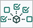
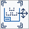
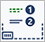
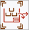
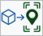
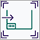
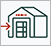
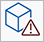
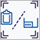
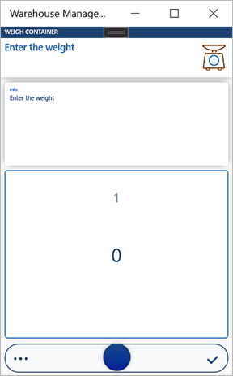

# Assign step icons and titles for the Warehouse Management mobile app

[!include [banner](../includes/banner.md)]

This article describes how to assign step icons and step titles for new or customized task flows for the Warehouse Management mobile app.

The following illustrations shows how step icons and titles appear in the Warehouse Management mobile app.


## Turn this feature on or off

To use the functionality described in this article, the *User settings, icons, and step titles for the new warehouse app* feature must be turned on for your system. As of Supply Chain Management 10.0.25, this feature is mandatory and can't be turned off. If you're running a version older than 10.0.25, then admins can turn this functionality on or off by searching for the *User settings, icons, and step titles for the new warehouse app* feature in the [Feature management](../../fin-ops-core/fin-ops/get-started/feature-management/feature-management-overview.md) workspace.

## Standard step IDs, classes, and icons

Each step in a task flow is identified by a step ID, and each step ID has a corresponding step class. The step icon and title are specified in each step class.

### <a name="step-ids-classes"></a>Step IDs and step classes

The following table lists every step ID that is currently available, and its corresponding step class. The control name of the primary input field is used as the step ID.

For an example that shows how these step IDs and classes are used, see the implementation of the `WHSMobileAppStepInfoBuilder.stepId()` method in the [Example: Assign step icons and titles for a custom flow](#example) section later in this article.

| Step ID | Step Class |
|-|-|
| BatchDisposition | WHSMobileAppStepBatchDisposition |
| Carrier | WHSMobileAppStepCarrier |
| CatchWeight | WHSMobileAppStepCatchWeight |
| CatchWeightQtyOutboundWeight | WHSMobileAppStepCatchWeight |
| CatchWeightTag | WHSMobileAppStepCatchWeightTag |
| CatchWeightTagWeight | WHSMobileAppStepCatchWeightTagWeight |
| ChangeWarehouseSuccess | WHSMobileAppStepChangeWarehouseSuccess |
| CheckDigit | WHSMobileAppStepCheckDigit |
| ClusterId | WHSMobileAppStepClusterId |
| ClusterPickQtyVerification | WHSMobileAppStepQtyVerification |
| ClusterPosition | WHSMobileAppStepClusterPosition |
| ConfigId | WHSMobileAppStepConfigId |
| Confirmation | WHSMobileAppStepConfirmation |
| ConsolidateFromLicensePlateId | WHSMobileAppStepConsolidateFromLicensePlateId |
| ConsolidateLPConfirmation | WHSMobileAppStepConsolidateLPConfirmation |
| ConsolidateToLicensePlateId | WHSMobileAppStepConsolidateToLicensePlateId |
| ContainerType | WHSMobileAppStepContainerType |
| CountingReasonCode | WHSMobileAppStepCountingReasonCode |
| CycleCountingAddLPOrFinish | WHSMobileAppStepCycleCountingAddLPOrFinish |
| CycleCountQty1 | WHSMobileAppStepCycleCountQty |
| CycleCountQty2 | WHSMobileAppStepCycleCountQty |
| CycleCountQty3 | WHSMobileAppStepCycleCountQty |
| CycleCountQty4 | WHSMobileAppStepCycleCountQty |
| Disposition | WHSMobileAppStepDisposition |
| DriverCheckInConfirmation | WHSMobileAppStepDriverCheckInConfirmation |
| DriverCheckInId | WHSMobileAppStepDriverCheckInId |
| DriverCheckOutConfirmation | WHSMobileAppStepDriverCheckOutConfirmation |
| DriverCheckOutId | WHSMobileAppStepDriverCheckOutId |
| ExpDate | WHSMobileAppStepExpDate |
| FromBatchDisposition | WHSMobileAppStepFromBatchDisposition |
| FromInventoryStatus | WHSMobileAppStepInventoryStatusFrom |
| FullQty | WHSMobileAppStepFullQty |
| InboundPut | WHSMobileAppStepInboundPut |
| InventBatchId | WHSMobileAppStepBatch |
| InventColorId | WHSMobileAppStepInventColorId |
| InventLocation | WHSMobileAppStepInventLocation |
| InventLocationId | WHSMobileAppStepWarehouse |
| InventSerialId | WHSMobileAppStepInventSerialId |
| InventSizeId | WHSMobileAppStepInventSizeId |
| InventStatusId | WHSMobileAppStepInventStatus |
| InventStyleId | WHSMobileAppStepInventStyleId |
| InventVersionId | WHSMobileAppStepInventVersionId |
| ItemId | WHSMobileAppStepItem |
| ITMContainerID | ITMMobileAppStepContainerId |
| ITMShipmentID | ITMMobileAppStepShipmentId |
| KanbanCardId | WHSMobileAppStepKanbanCard |
| KanbanCardToEmpty | WHSMobileAppStepKanbanCardToEmpty |
| KanbanOrCardId | WHSMobileAppStepKanbanCard |
| LicensePlateId | WHSMobileAppStepLicensePlate |
| LoadId | WHSMobileAppStepLoadId |
| LocationLicensePlatePosition | WHSMobileAppStepLocationLicensePlatePosition |
| LocOrLP | WHSMobileAppStepLocOrLP |
| LocOrLP_From | WHSMobileAppStepLocOrLPFrom |
| LocOrLP_To | WHSMobileAppStepLocOrLPTo |
| LocOrLPCheck | WHSMobileAppStepLocOrLPCheck |
| LocVerification | WHSMobileAppStepLocVerification |
| LPAdjustIn | WHSMobileAppStepLPAdjustIn |
| LPBreakChildLP | WHSMobileAppStepLPBreakChildLP |
| LPBreakParentLP | WHSMobileAppStepLPBreakParentLP |
| LPBuildChildLP | WHSMobileAppStepLPBuildChildLP |
| LPBuildParentLP | WHSMobileAppStepLPBuildParentLP |
| LPVerification | WHSMobileAppStepLPVerification |
| MergeContainerId | WHSMobileAppStepMergeContainerId |
| MixedLPLineNum | WHSMobileAppStepMixedLPLineNum |
| MobileDeviceQueueMessageCollectionIdentifierId | WHSMobileAppStepSelectOrder |
| MovementConfirmCancel | WHSMobileAppStepMovementConfirmCancel |
| NewCaptureWeight | WHSMobileAppStepCatchWeight |
| NewQty | WHSMobileAppStepNewQty |
| OutboundCatchWeightTag | WHSMobileAppStepCatchWeightTag |
| OutboundPut | WHSMobileAppStepOutboundPut |
| OutboundWeight | WHSMobileAppStepCatchWeight |
| OverridePutNewLocation | WHSMobileAppStepOverridePutNewLocation |
| PieceByPieceConfirmation | WHSMobileAppStepQtyVerification |
| POLineNum | WHSMobileAppStepPOLineNum |
| PONum | WHSMobileAppStepPONum |
| PositionFull | WHSMobileAppStepPositionFull |
| PositionFullQty | WHSMobileAppStepPositionFullQty |
| Potency | WHSMobileAppStepPotency |
| PrinterName | WHSMobileAppStepPrinterName |
| ProdId | WHSMobileAppStepProdId |
| ProdLastPalletConfirmation | WHSMobileAppStepProdLastPalletConfirmation |
| ProductConfirmation | WHSMobileAppStepProductConfirmation |
| ProductionScrapConfirmation | WHSMobileAppStepProductionScrapConfirmation |
| Put | WHSMobileAppStepPut |
| PutawayClusterId | WHSMobileAppStepPutawayClusterId |
| Qty | WHSMobileAppStepQty |
| QtyAdjust | WHSMobileAppStepQtyAdjust |
| QtyShort | WHSMobileAppStepQtyShort |
| QtyToConsume | WHSMobileAppStepQtyToConsume |
| QtyToPick | WHSMobileAppStepQtyToPick |
| QtyToPut | WHSMobileAppStepQtyToPut |
| QtyToScrap | WHSMobileAppStepQtyToScrap |
| QtyVerification | WHSMobileAppStepQtyVerification |
| QtyWithScanningLimit | WHSMobileAppStepQtyAdjust |
| ReasonString | WHSMobileAppStepReasonString |
| RecvLocationId | WHSMobileAppStepRecvLocationId |
| RemoveContainerId | WHSMobileAppStepRemoveContainerId |
| ReprintLabelConfirmation | WHSMobileAppStepReprintLabelConfirmation |
| RMANum | WHSMobileAppStepRMANum |
| ShortPickReason | WHSMobileAppStepShortPickReason |
| SortConOrLP | WHSMobileAppStepSortConOrLP |
| SortLicensePlateId | WHSMobileAppStepSortLicensePlateId |
| SortPositionId | WHSMobileAppStepSortPositionId |
| SortVerification | WHSMobileAppStepSortVerification |
| StartLocationId | WHSMobileAppStepStartLocationId |
| StartProdOrderConfirmation | WHSMobileAppStepStartProdOrderConfirmation |
| TargetLicensePlateId | WHSMobileAppStepTargetLicensePlateId |
| TOLineNum | WHSMobileAppStepTOLineNum |
| ToLocation | WHSMobileAppStepToLocation |
| TONum | WHSMobileAppStepTONum |
| ToWarehouse | WHSMobileAppStepWarehouseTo |
| TransportLoadId | WHSMobileAppStepTransportLoadId |
| WaveLabelId | WHSMobileAppStepWaveLabelId |
| WaveLblQty | WHSMobileAppStepWaveLblQty |
| Weight | WHSMobileAppStepWeight |
| WeightToConsume | WHSMobileAppStepWeightToConsume |
| WHSAdjustmentType | WHSMobileAppStepWHSAdjustmentType |
| WHSReceivingException | WHSMobileAppStepWHSReceivingException |
| WHSWorkException | WHSMobileAppStepWHSWorkException |
| WHSWorkLicensePlateId | WHSMobileAppStepWorkLicensePlateId |
| WMSLocationId | WHSMobileAppStepLocation |
| WorkId | WHSMobileAppStepWorkId |
| WorkIdToCancel | WHSMobileAppStepWorkIdToCancel |
| WorkLPIdPutawayCluster | WHSMobileAppStepWorkLPIdPutawayCluster |
| WorkPoolId | WHSMobileAppStepWorkPoolId |
| ZoneId | WHSMobileAppStepZoneId |

### <a name="step-icons"></a>Available step icons

The system includes a collection of standard step icons that you can also use for your custom steps. You can't currently upload custom step icons. Therefore, you must always select one of the standard step icons.

The following table shows every standard step icon that is currently available, and its name.

<table>
<tbody>
<tr>
<td><br>About</td>
<td><br>AddLpOrItem</td>
<td><br>BatchDisposition</td>
<td><br>Carrier</td>
</tr>
<tr>
<td><br>CatchWeightTag</td>
<td><br>CatchWeightTagWeight</td>
<td><br>CheckDigit</td>
<td><br>CheckInOutId</td>
</tr>
<tr>
<td><br>ChildLP</td>
<td><br>ClusterId</td>
<td><br>ClusterPosition</td>
<td><br>ConfigId</td>
</tr>
<tr>
<td><br>ConfiguredField</td>
<td><br>ConOrLP</td>
<td><br>ConsolidateFromLicensePlateID</td>
<td><br>ConsolidateToLicensePlateID</td>
</tr>
<tr>
<td><br>ContainerType</td>
<td><br>Counting</td>
<td><br>CountingReasonCode</td>
<td><br>CountryOfOrigin</td>
</tr>
<tr>
<td><br>Disposition</td>
<td><br>Done</td>
<td><br>DriverCheckInConfirmation</td>
<td><br>DriverCheckInId</td>
</tr>
<tr>
<td><br>DriverCheckOutId</td>
<td><br>ExpDate</td>
<td><br>Field</td>
<td><br>FromBatchDisposition</td>
</tr>
<tr>
<td><br>FromInventoryStatus</td>
<td><br>IdAttribute</td>
<td><br>InventBatchID</td>
<td><br>InventColorID</td>
</tr>
<tr>
<td><br>InventLocation</td>
<td><br>InventSerialID</td>
<td><br>InventSizeID</td>
<td><br>InventStatusID</td>
</tr>
<tr>
<td><br>InventStyleID</td>
<td><br>InventVersionID</td>
<td><br>ItemID</td>
<td><br>ITMContainerID</td>
</tr>
<tr>
<td><br>ITMShipmentID</td>
<td><br>KanbanCardID</td>
<td><br>KanbanOrCardID</td>
<td><br>LicensePlateID</td>
</tr>
<tr>
<td><br>LoadId</td>
<td><br>LocationLicensePlatePosition</td>
<td><br>LocOrLP</td>
<td><br>LocOrLPCheck</td>
</tr>
<tr>
<td><br>LocOrLPFrom</td>
<td><br>LocOrLPTo</td>
<td><br>LongProcessCompleted</td>
<td><br>LPBreakParentLP</td>
</tr>
<tr>
<td><br>MergeContainerId</td>
<td><br>MixedLPLineNum</td>
<td><br>OutboundWeight</td>
<td><br>Owner</td>
</tr>
<tr>
<td><br>ParentLP</td>
<td><br>PleaseConfirm</td>
<td><br>POLineNum</td>
<td><br>PONum</td>
</tr>
<tr>
<td><br>PositionFull</td>
<td><br>Potency</td>
<td><br>PrinterName</td>
<td><br>ProdId</td>
</tr>
<tr>
<td><br>ProductConfirmation</td>
<td><br>Put</td>
<td><br>PutawayClusterId</td>
<td><br>Qty</td>
</tr>
<tr>
<td><br>QtyAdjustIn</td>
<td><br>QtyShort</td>
<td><br>QtyToConsume</td>
<td><br>QtyToPut</td>
</tr>
<tr>
<td><br>QtyToScrap</td>
<td><br>QuantityConfirmation</td>
<td><br>RAFEndJob</td>
<td><br>RecvLocationID</td>
</tr>
<tr>
<td><br>RemoveContainerID</td>
<td><br>RMANum</td>
<td><br>SelectOrder</td>
<td><br>ShortPickReason</td>
</tr>
<tr>
<td><br>SortPositionId</td>
<td><br>TargetLicensePlateId</td>
<td><br>ToLineNum</td>
<td><br>ToLocation</td>
</tr>
<tr>
<td><br>ToNum</td>
<td><br>ToWarehouse</td>
<td><br>TransportLoadId</td>
<td><br>VendBatchId</td>
</tr>
<tr>
<td><br>WaveLabelId</td>
<td><br>WaveLblQty</td>
<td><br>Weight</td>
<td><br>WeightToConsume</td>
</tr>
<tr>
<td><br>WHSAdjustmentType</td>
<td><br>WHSReceivingException</td>
<td><br>WMSLocationID</td>
<td><br>WorkId</td>
</tr>
<tr>
<td><br>WorkIdToCancel</td>
<td><br>WorkLicensePlateId</td>
<td><br>WorkLPIDPutawayCluster</td>
<td><br>WorkPoolID</td>
</tr>
<tr>
<td><br>ZoneID</td>
<td></td>
<td></td>
<td></td>
</tr>
</tbody>
</table>

## <a name="example"></a>Example: Assign step icons and titles for a custom flow

This example explains how to set up step icons and titles for a custom task flow. The scenario is built on an example of a custom task flow that is presented and explored in more detail in the following blog post: [Customizing the Warehousing Mobile App](https://cloudblogs.microsoft.com/dynamics365/it/2017/07/06/customizing-the-warehousing-mobile-app). The task flow works in the following way:

1. The app shows a page that prompts the worker to provide a container ID (for example, by scanning a bar code).
1. If the container ID is valid, the app opens a new page that prompts the worker for the weight. (If the container ID isn't valid, the worker is returned to the first page.)
1. When the worker enters a valid weight, the system stores the weight and returns the worker to the first page.

The following illustration shows this task flow.


### Create a step class for the container input page

The container input page lets the worker scan or enter a container ID.


On the container input page, the control name of the input field is `ContainerId`. Because this control name isn't in the [list of step IDs](#step-ids-classes), you won't find an existing step that is based on it. Therefore, you must create a step class that represents the step. Here is an example.

```xpp
[WHSMobileAppStepId('ContainerId')]
final internal class WHSMobileAppStepContainerId extends WHSMobileAppStep
{
    private const WHSMobileAppStepIcon PopulationIcon = 'InventBatchID';
    private const WHSMobileAppStepTitle InputNotFilledTitle = "@WAX:WHSMobileAppStepContainerID_InputNotFilled"; //Scan a container
    protected void initValues()
    {
        defaultStepIcon = PopulationIcon;
        defaultStepTitle = InputNotFilledTitle;
    }
}
```

The identifier of the step icon is stored in the `defaultStepIcon` class member, and the step title is stored in the `defaultStepTitle` class member.

To assign a step icon, set `defaultStepIcon` to one of the icon IDs that are listed in the [Available step icons](#step-icons) section earlier in this article.

### Use a standard or custom step icon and title for the weight input

The weight input page lets the worker enter a weight.



On the weight input page, the control name of the input field is `Weight`, which is in the [list of step IDs](#step-ids-classes). Therefore, if the step icon and title that are defined in the `WHSMobileAppStepWeight` class are acceptable to you, you don't have to change anything for this step.

However, if you prefer to use a different icon or title for this step, you can override either the `stepId()` method or the `stepInfo()` method in the builder class. Each task flow has its own step info builder.

#### Override the stepId() method

The following example shows one way that you can modify a builder class by overriding the `stepId()` method.

```xpp
[WHSWorkExecuteMode(WHSWorkExecuteMode:: WeighContainer)]
public class WHSMobileAppStepInfoBuilderWeighContainer extends WHSMobileAppStepInfoBuilder
{
    protected WHSMobileAppStepId stepId()
    {
        WHSMobileAppStepId stepIdLocal = super();
        if (stepIdLocal == 'Weight')
        {
            return 'NewWeight';
        }
        return stepIdLocal;
    }
}
```

You then create a step class for the `NewWeight` step. The code should resemble the code for the `ContainerId` example that was shown earlier in this article.

#### Override the stepInfo() method

The following example shows one way that you can modify a builder class by overriding the `stepInfo()` method.

```xpp
[WHSWorkExecuteMode(WHSWorkExecuteMode:: WeighContainer)]
public class WHSMobileAppStepInfoBuilderWeighContainer extends WHSMobileAppStepInfoBuilder
{
    protected WHSMobileAppStepInfo stepInfo()
    {
        if (stepId != 'Weight')
        {
            return super();
        }
        WHSMobileAppStepInfo stepInfo = WHSMobileAppStepInfo::construct();
        stepInfo.parmStepIcon('NewIcon');
        stepInfo.parmStepTitle('NewTitle');
        return stepInfo;
    }
}
```

You then construct a `WHSMobileAppStepInfo` object, and set the icon and/or title directly.

## Additional resources

- [Install and connect the Warehouse Management mobile app](install-configure-warehouse-management-app.md)
- [Mobile device user settings](mobile-device-user-settings.md)
