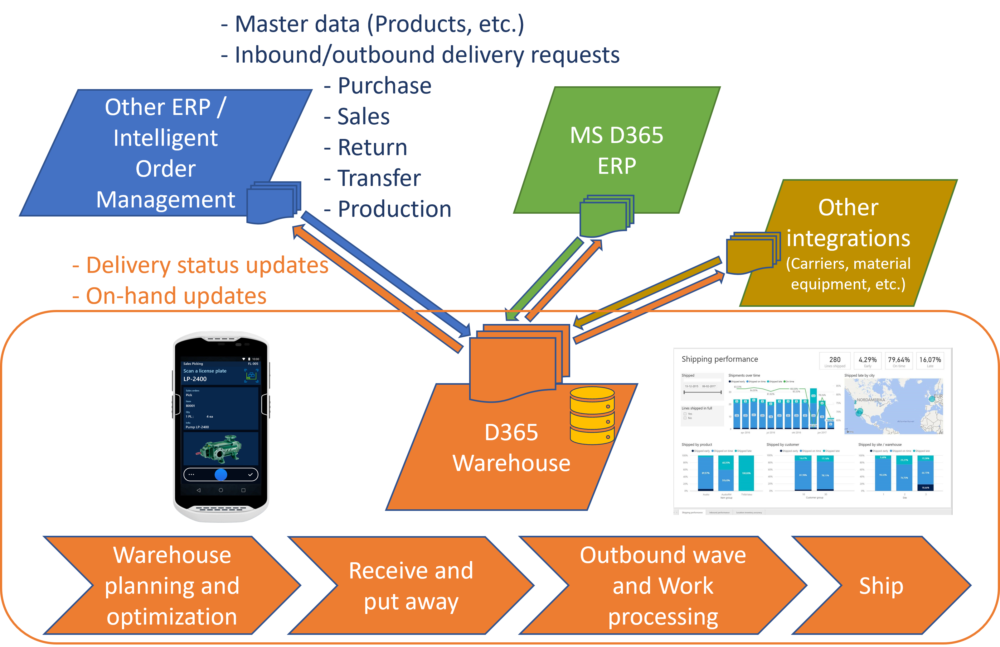
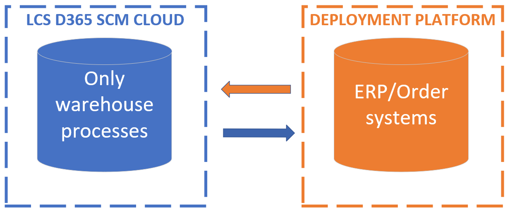
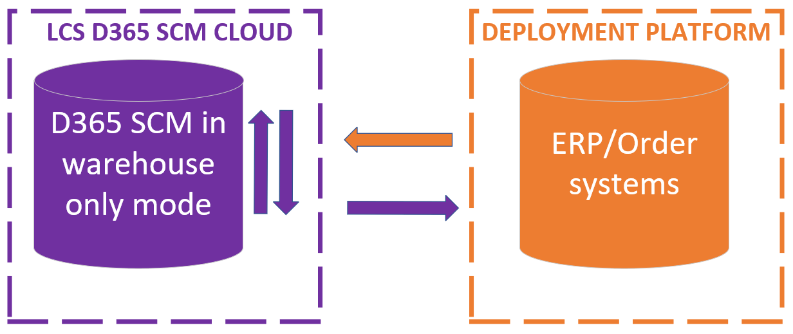
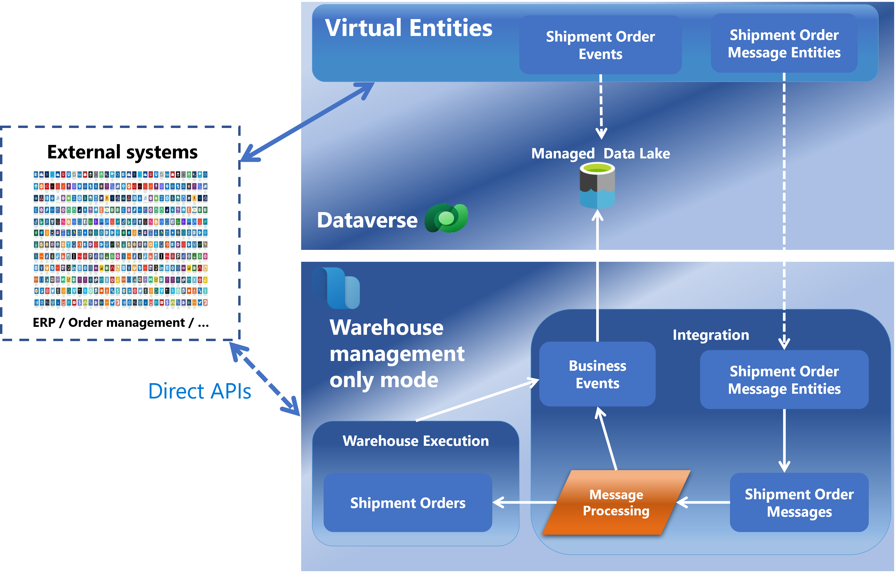
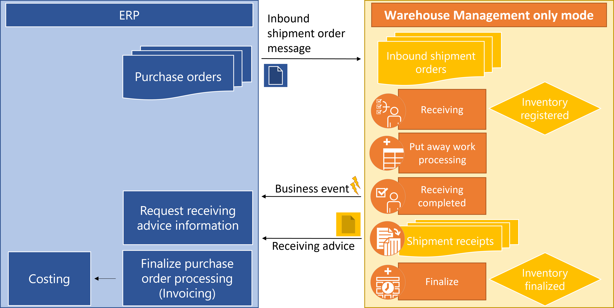
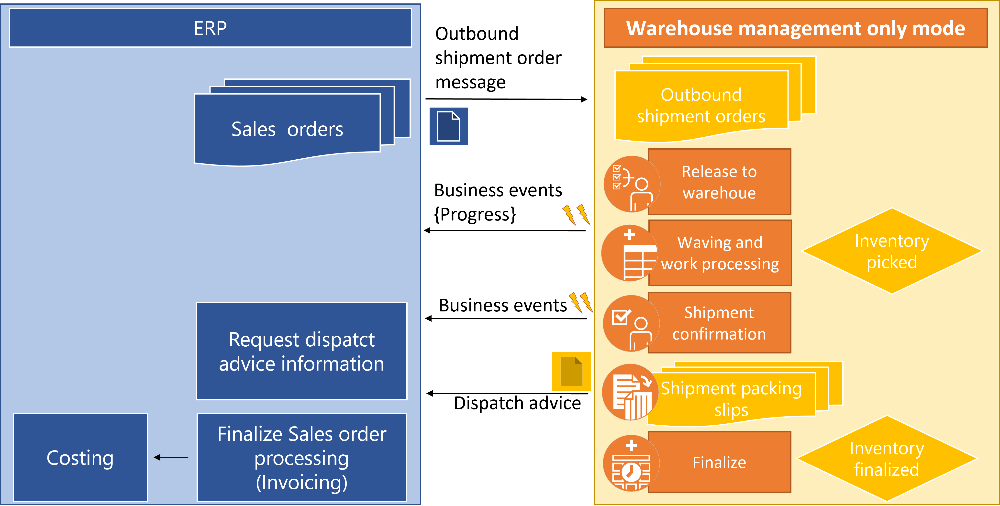
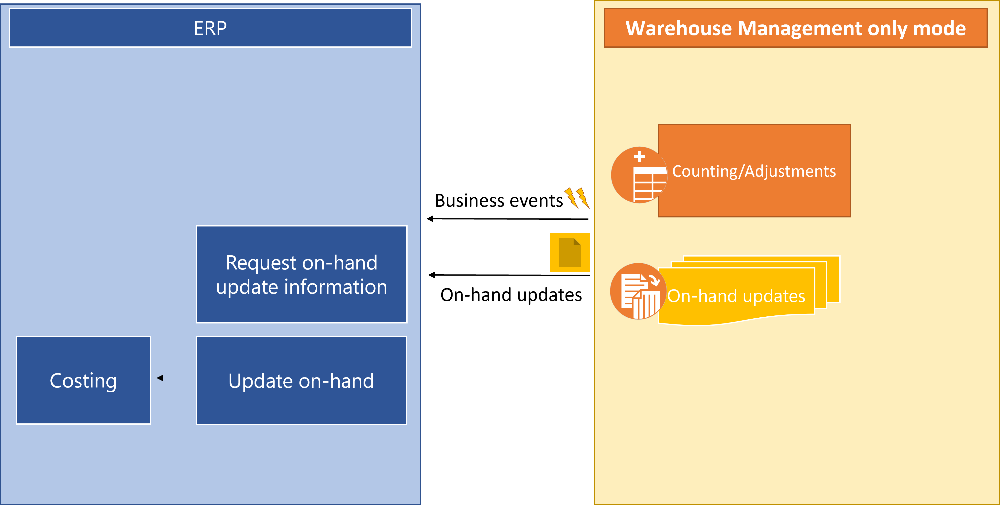

---
# required metadata

title: Supply Chain Management warehouse-only mode
description: Run all supply chain warehouse operations in Microsoft Dynamics 365 Supply Chain Management as part of a dedicated ecosystem that easily integrates with other ERP and order management systems via inbound and outbound shipment orders.
author: perlynne
ms.date: 28/04/2023
ms.topic: article
ms.prod: 
ms.technology: 

# optional metadata
ms.search.form: WHSSourceSystem, WHSShipmentOrderIntegrationMonitoringWorkspace, SysMessageProcessorMessage, BusinessEventsWorkspace, WHSInboundShipmentOrder, WHSOutboundShipmentOrder, WHSInboundLoadPlanningWorkbench, WHSShipmentPackingSlipJournal, WHSShipmentReceiptJournal, WHSParameters, ExtCodeTable, WHSOutboundShipmentOrderMessage, WHSInboundShipmentOrderMessage

audience: Application User
# ms.devlang: 
ms.reviewer: kamaybac
# ms.tgt_pltfrm: 
# ms.custom: [used by loc for articles migrated from the wiki]
ms.search.region: Global
# ms.search.industry: [leave blank for most, retail, public sector]
ms.author: perlynne
ms.search.validFrom: 2023-04-24
ms.dyn365.ops.version: 10.0.36
---
**_DRAFT DOCUMENTATION FOR:_**

# Supply Chain Management warehouse-only mode

Running your warehouse processes with the **Supply Chain Management warehouse-only mode** will provide several deployment options to support the actual business needs of running your [warehouse management](warehouse-management-overview.md) processes.



One example being a dedicated LCS D365 cloud deployment only handling the warehouse operations and all integrations related to orders and financial processing handled outside this deployment. With this implementation concept it will only be needed to configure the processes around warehouse management as part of the D365 SCM cloud deployment.  



Another example is a more SCM integrated implementation methodology, having the warehouses enabled for D365 SCM processes like sales, purchase, production orders, etc. and at the same time handling warehouse operations for other ERP/order processing systems. With this type of implementation, the same warehouse instance can handle all the logistic warehouse processes, internal as well as external integrations.



And then everything between the two above example deployment options, which for example could be running a dedicated legal entity within an existing D365 SCM deployment which only handles the warehouse management processes for external systems. All-in-all you can use the **Supply Chain Management in warehouse-only mode** exactly as needed.

## <a name="feature-management"></a>Feature management

To use the **Supply Chain Management warehouse-only mode** capability, your system must meet the following requirements:

- You must be running Microsoft Dynamics 365 Supply Chain Management version 10.0.36 or later.

- The feature that's named **(Preview) Supply Chain Management warehouse-only mode** must be turned on in [feature management](../../fin-ops-core/fin-ops/get-started/feature-management/feature-management-overview.md).
- With the feature enabled you can open the **Warehouse management > Setup > Warehouse management integration > Source systems** used to define the integration systems. To enable all the functionalities, you must at least insert one record into this entity.

## Data exchange

Running **Supply Chain Management in warehouse-only mode** requires integration to be defined between the ERP/Order systems and the Microsoft Dynamics 365 Supply Chain Management system.
Integration between systems is a widespread challenge, but nevertheless of huge importance getting to work seamlessly.
In general, three categories of interactions are needed for the **Supply Chain Management in warehouse-only mode**:

- Document data (like purchase and sales orders)
- Master data (like products)
- Progress data (like receiving, dispatch, and inventory on-hand information)

Many different integration methodologies can be used for the above, but the following is the recommended integration process.

### Document data

To inform the warehouse management system about what physical inventory to receive and ship you can easily use the inbound and outbound shipment order messages. These messages are designed with header and lines data.
With the introduction of these two new, lightweight inbound and outbound warehouse interface documents, it is no longer required to set up multiple documents for inbound and outbound operations (sales orders, purchase orders, transfer orders, etc.) that essentially serve the same purpose from a pure warehouse management perspective. This will, for example, simplify integration with ERP and order management systems and enable the use of the Dynamics 365 warehouse management functionality in an ERP agnostic manner.

#### <a name="inbound-outbound-shipment-order-messages"></a>Inbound and outbound shipment order messages

The **inbound shipment order messages** and the **outbound shipment order messages** can be imported via a [**Dataverse integration**](../../../../power-platform/admin/data-integrator.md) or directly integrated with the [Odata](../../fin-ops-core/dev-itpro/data-entities/odata.md) shipment order message entities in a optimal manner.
A following [**message processing**](warehouse-message-processor-messages.md) will validate the import process by ensuing consistent data between the systems, both when it comes to the master data like products, but also the order progress status alignments, making the D365 SCM inbound/outbound shipment orders actionable for the warehouse management processes, by not allowing creation or updating of invalid/unsupported order data. It is recommended to process the messages as part of a periodic batch job triggered by the [**Message processor**](../supply-chain-dev/message-processor.md) page where you must use the **Shipment Orders** _Message queue_.



> [!NOTE]
> Having the shipment order line field data related to the released products in the [**D365 SCM product information management module**](../pim/product-information.md) requires the products to be created before the system can accept the shipment order messages.

##### Viewing and maintaining shipment order messages
It is possible to both view and update shipment order messages in D365 SCM Warehouse-Only mode, which can be a quick way to test integrations as part of an implementation process.  When a message is in a _Failed_ message state you can update all field values, except the order header and line numbers. The pages used to view and maintain the messages are:

- **Warehouse management > Inquiries and reports > Inbound shipment order messages**
- **Warehouse management > Inquiries and reports > Outbound shipment order messages**

The **Processing status** field can be used to monitor the progress of the shipment order messages. The following states are available:
- _Receiving_ - The message is in the process of getting imported.
- _Received_ - The message has been received and in a _Queued_ [message processor](../supply-chain-dev/message-processor.md) state, ready to be picked up for processing.
- _Accepted_ - The message processor state is _Processed_ and thereby a shipment order has been created.  
- _Failed_ - The message has been processed by the [message processor](../supply-chain-dev/message-processor.md) but had one or more errors. A copy of the message can get created as part of an edit saving.
- _Draft_ - A copy of a message which can get updated. To reprocess the message you can move the message into the _Queued_ message state by using the **Queue** option.
- _Canceled_ - The message has been canceled. You can resend a message (for the same order) from the external system.
> [!TIP]
>  By selecting the **Show old versions** option you can follow the manual message updates by using the _Replaced by message_ field value.

> [!WARNING]
> Making manual message field updates in production environments might result in data inconsistency between the external source system and D365 SCM. As an example you will be able to change an _item number_ to a value which will be unknown to the related external system. This type of update will most likely cause problems as part of the further progress information flows and might not be possible to get corrected as well in the back-end external system. Make sure to have the proper user role security privilege assigned for this process.

### Master data

A few master data entities will need to be recorded to be able to run your warehouse management system, here the [**data entities**](../../fin-ops-core/dev-itpro/data-entities/data-entities.md) can be used to easily import the data.

To create the _shipment orders_ **Released products** must exist. You can read more about the support of importing product master data via the [**product data entities**](../pim/data-entities.md) and get an overview of the [**Product information management entities**](../../../../../common-data-model/schema/core/operationscommon/entities/supplychain/productinformationmanagement/overview.md).

As part of the creation of a _Released product_ you must assign an **Item model group**. Please make sure this model group gets enabled with an _Inventory model_ as **Non-valuated** which will eliminate the need for setting up any costing data for this product.

Besides the product master data you must at least have defined the [**Countries/regions**](../../fin-ops-core/fin-ops/organization-administration/global-address-book-address-setup#set-up-countryregion-information) which will be used for the outbound shipment order import process to create addresses. You will as well need this data to [create a legal entity](../../fin-ops-core/fin-ops/organization-administration/tasks/create-legal-entity.md) for the warehouses.

> [!NOTE]
> Depending on the [address setup](../../fin-ops-core/fin-ops/organization-administration/global-address-book-address-setup.md) and the use of the address fields in the order messages you might need to create additional data before the order messages can get imported. Example could be the state and county combinations.

### Progress data

External systems will have many different business process requests for the warehouse management system. One example being the progress of a sales order. Now, the external systems can of course keep polling for this kind of information, but to honor this process the D365 SCM warehouse management system can be set up to provide [**Business events**](../../fin-ops-core/dev-itpro/business-events/home-page.md).

#### <a name="business-events"></a>Business events

The D365 SCM warehouse management system can be setup to provide [**Business events**](../../fin-ops-core/dev-itpro/business-events/home-page.md) to keep the external systems informed about the progress and actions going on. With this setup the external systems don’t need to keep polling for information which might not have changed since the last request of information, but instead only need to act when getting informed.
Several out-of-the-box [**Business events**](../../fin-ops-core/dev-itpro/business-events/home-page.md) are supported for warehouse integration:
Non-exhaustive list:
| Business event ID                                 | Description                              |
|---------------------------------------------------|------------------------------------------|
| InventCountingJournalPostedBusinessEvent          | Counting journal posted                  |
| WHSOutboundNotificationCreatedBusinessEvent       | Outbound warehouse notification created  |
| WHSShipmentOrderMessageChangedStatusBusinessEvent | Status update for shipment order message |
| WHSShipmentPackingSlipJournalModifiedBusinessEvent| Shipment packing slips updated           |
| WHSShipmentReceivingJournalModifiedBusinessEvent  | Shipment receipts updated                |
| WhsWaveExecutedBusinessEvent                      | Wave executed                            |

As a minimum it is recommended to use the following  [**Business events**](../../fin-ops-core/dev-itpro/business-events/home-page.md):

- _InventCountingJournalPostedBusinessEvent_ - To be informed about an inventory on-hand adjustment has happened and where to look up the detailed information about the update.

- _WHSShipmentPackingSlipJournalModifiedBusinessEvent_ - To be informed about an outbound shipment confirmation process has happened and where to look up the detailed dispatch advice data, which for example can be used for a sales invoicing process.

- _WHSShipmentReceivingJournalModifiedBusinessEvent_ - To be informed about an inbound receiving completion process has happened and where to look up the detailed receiving advice data, which for example can be used for a purchase order invoicing process.

## <a name="source-systems"></a> Source systems

The **Supply Chain Management in warehouse-only mode** shipment order integration must be configured with information about the source systems going to provide inbound and outbound order messages. This gets defined in the **Warehouse management > Setup > Warehouse management integration > Source systems** page and is a prerequisite to be able to view the **Inbound shipment orders** and **Outbound shipment orders** and the related processes around the inbound shipment.
The **Source system** name must be identical with the name in the provided message before a message can be accepted getting imported into D365 SCM.
Additional policy settings can be used as part of the **Source systems** page to control the shipment order import processes, for example it is possible to define **Message value mapping** for item and warehouse identifications and define if loads for inbound shipment orders automatically gets created as part of the **Inbound shipment order policies** definition.
> [!NOTE]
> When mapping the items to [**Bar codes**](../pim/tasks/create-bar-code-product.md) remember to enable the _Scanning_ setting for the bar codes. For product variants it is only the "ItemNumber" field being used from the order line messages when using **Message value mapping** for the items.

## Warehouse integration monitoring

The **Warehouse management > Workspaces > Warehouse integration monitoring** page provides an overview of the warehouse integration messages and an easy way to navigate to the related areas, for example to the [**System administration > Message processor > Message processor messages**](warehouse-message-processor-messages.md) page.

# Inbound shipment orders

**Warehouse management > Inquiries and reports > Inbound shipment orders** are documents that represents information about the expected product receipts. The **Inbound shipment orders** page contains an ‘internal SCM warehouse representation’ of the available shipment orders in a **Header** and **Lines** view. For each of the lines it is possible to view detailed information about the **Receiving status**, **inventory transactions**, as well as any associated **warehouse work**. The **Receiving status** gets as well maintained on the order header and can be used to follow the inbound progress of the orders. The following **Receiving status** values are available:

- _Open_ - No quantities has been **Receiving completed**
- _Partially received_ - Partly quantities has been **Receiving completed**
- _Received_ - All quantities has been **Receiving completed**

In case you are already knowledgeable about D365 SCM, you might find this document comparable with a minimal purchase order document. No financial postings as part of the [**General ledger**](../../finance/general-ledger/general-ledger.md) will be used for this source document.

> [!WARNING]
> On the _Inbound shipment order lines_ you can use the option **Update line > Delivery remainder** to update expected order line transaction quantities.
> Make sure to have the proper user role security privilege assigned for this process, because this will (like the messages editing) allow for potential inconsistencies between the external systems and D365 SCM.

> [!NOTE]
> The internal inbound shipment order number must be unique. You can define to use the external order numbers as internal numbers and thereby not needing to use a [number sequence](#number-sequences) for the order. To ensuring unique numbers across external systems you can consider using the _Order number prefix/suffix_ options.

# Outbound shipment orders

**Warehouse management > Inquiries and reports > Outbound shipment orders** are documents that represents information about the requested product dispatch. The **Outbound shipment orders** page contains an ‘internal SCM warehouse representation’ of the available shipment orders in a **Header** and **Lines** view. For each of the lines it is possible to view detailed information about **Release status**, **Shipment status**, **inventory transactions**, as well as any associated **warehouse work**. The **Release status** and **Shipment status** gets as well maintained on the order header and can be used to follow the outbound progress of the orders. The following states are available for the **Release status**:

- _Open_ - No quantities has been [released to warehouse](release-to-warehouse-process.md)
- _Partially released_ - Partly quantities has been [released to warehouse](release-to-warehouse-process.md)
- _Released_ - All quantities has been [released to warehouse](release-to-warehouse-process.md)

And the following states are available for the **Shipment status**:

- _Open_ - No quantities has been shipped confirmed
- _Partially shipped_ - Partly quantities has been shipped confirmed
- _Shipped_ - All quantities has been shipped confirmed

> [!NOTE]
> The internal outbound shipment order number must be unique. You can define to use the external order numbers as internal numbers and thereby not needing to use a [number sequence](#number-sequences) for the order. To ensuring unique numbers across external systems you can consider using the _Order number prefix/suffix_ options.

In case you are already knowledgeable about D365 SCM, you might find this document comparable with a minimal sales order document having some of the same **Reservation** and [**Release to warehouse**](release-to-warehouse-process.md) processes. As part of the [**Source systems**](#source-systems) definitions you can trigger the reservation as part of the document import and even define to reject a shipment order which cannot get reserved partly or fully.

In the first release of the **Supply Chain Management warehouse-only mode** the outbound shipment order lines do not out-of-the-box support getting associated with loads before the [**Release to warehouse**](release-to-warehouse-process.md) process, this can only happen as part of the processing of the warehouse waving.

> [!WARNING]
> On the _Outbound shipment order lines_ you can use the option **Update line > Delivery remainder** to update expected order line transaction quantities.
> Make sure to have the proper user role security privilege assigned for this process, because this will (like the messages editing) allow for potential inconsistencies between the external systems and D365 SCM.

## Automatic release of outbound shipment orders

To enable automatically release to warehouse you can use the **Warehouse management > Release to warehouse > Automatic release of outbound shipment orders** batch job process. Please refer to the [Release to warehouse](release-to-warehouse-process.md) topic to learn more.

# Inbound process


The high-level process for inbound processing is as following:

- External systems provides _Inbound shipment order_ messages
- The messages get processed in _Supply Chain Warehouse-only mode_ and orders get created
- Inbound loads gets created manually via [**Inbound load planning workbench**](create-or-modify-an-inbound-load.md#create-an-inbound-load-manually), via [**ASN**](import-asn-data-entity), or automatically during [message processing](../supply-chain-dev/message-processor.md) based on the [**Source systems** - **Inbound shipment order policy**](#source-systems) definition.
- Inventory receiving gets processed and the inbound shipment order transactions get _Registered_ via one of the currently supported [**Warehouse management mobile app**](configure-mobile-devices-warehouse#configure-menu-items-to-create-work-for-another-worker-or-process) processes which all requires inbound loads:

  - _License plate receiving (and put away)_
  - _Load item receiving (and put away)_
  - _Mixed license plate receiving (and put away)_ for source document line identification method:
  
   - _Load item receiving_
   - _Inbound shipment order line receiving_ - when assigned to loads
   - _Inbound shipment item receiving_ - when assigned to loads
  
  - _Inbound shipment order line receiving (and put away)_ when assigned to loads
  - _Inbound shipment order item receiving (and put away)_ when assigned to loads

- **Receiving completed** processes will follow related to a load which will update the load status to _Received_ and generate [**Shipment receipts**](#shipment-receipts) and trigger **Business event** for the external systems.
- The external systems read and uses the [**Shipment receipts**](#shipment-receipts) data for further processing, like for example purchase order invoicing in case of having purchase orders associated to the _inbound shipment orders_.
- The _Inbound shipment orders_ get finalized by running the periodic back-ground [process automation](../../fin-ops-core/dev-itpro/sysadmin/process-automation.md) **Post shipment receipts** job.

> [!NOTE] <!-- perlynne#1 -->
> The **Receiving completed** process will have different behaviors depending on the **Delivery policy** assigned to the load.
>
> In case of wanting a manual process a [**detour**]( warehouse-app-detours.md) mobile device menu item for the _Complete receiving_ process can get defined as part of the inbound receiving flows.

## <a name="shipment-receipts"></a> Shipment Receipts
<!-- perlynne -->
In the **Warehouse management > Inquiries and reports > Shipment receipts** page you can view the detailed line transactions related to the received inventory. The data is version controlled and you can follow the **Posting status** on the header data.
The header will get from _Ready for posting_ into _Posted_ as part of the [process automation](../../fin-ops-core/dev-itpro/sysadmin/process-automation.md) **Post shipment receipts** job which automatically gets initialized as part of the [_source system_](#source-systems) setup where you as well can define the frequency of the processing of the batch job which will ensure the related inbound shipment order line transactions get into a finalized transaction state for the the warehouse management module.
You can see all the _Background processes_ running as part of the [**System administration > Setup > Process automations**](../../fin-ops-core/dev-itpro/sysadmin/process-automation.md) page.

> [!NOTE]
> Reversal of the receiving confirmation will be supported as long as the related inbound shipment order line transactions have not been finalized.

# Outbound process


The high-level process for outbound processing is as following:

- External system provides _Outbound shipment order_ messages
- The messages gets processed in _Supply Chain Warehouse-only mode_ and orders gets created. Based on the [**Source system**](#source-systems) policies reservations will automatically be handled as part of the [message processing](../supply-chain-dev/message-processor.md) or will need to get processed manually or as part of the release process.
- The orders gets released for further warehouse processing, either manually or automatically via the batch job **Automatic release of outbound shipment orders** and based on the [wave template](wave-templates.md) definitions warehouse work can get created and released immediately.
- The outbound warehouse work get processed and the related outbound shipment order line transactions get updated to status _Picked_.
- The loads get outbound ship confirmed which will create **Business events** and [**Shipment packing slip**](#shipment-packing-slips) data for the external systems.
- The external systems read and uses the [**Shipment packing slip**](#shipment-packing-slips) data for further processing, like for example sales order invoicing in case of having sales orders associated to _outbound shipment orders_.
- The _Outbound shipment orders_ get finalized by running the periodic back-ground [process automation](../../fin-ops-core/dev-itpro/sysadmin/process-automation.md) **Post shipment packing slips** job.

> [!NOTE]
> Reversal of the shipment confirmation will be supported as long as the related outbound shipment order line transactions have not been finalized.

## <a name="shipment-packing-slips"></a>Shipment packing slips

In the **Warehouse management > Inquiries and reports > Shipment packing slips** page you can view the detailed line transactions related to the shipped inventory and print out a report of the data via the **Preview/Print** option. You can control the printed inventory dimension values as part of the **Warehouse management > Setup > Warehouse management parameters - Reports - Shipment packing slip**.
<!-- Perlynne -->
The **Shipment packing slip** data is version controlled and you can follow the **Posting status** on the header data.
The header will get from _Ready for posting_ into _Posted_ as part of the [process automation](../../fin-ops-core/dev-itpro/sysadmin/process-automation.md) **Post shipment packing slips** job which automatically gets initialized as part of the [_source system_](#source-systems) setup where you as well can define the frequency of the processing of the batch job which will ensure the related outbound shipment order line transactions get into a finalized transaction state for the the warehouse management module.
You can see all the _Background processes_ running as part of the [**System administration > Setup > Process automations**](../../fin-ops-core/dev-itpro/sysadmin/process-automation.md) page.

> [!NOTE]
> In case of not having defined a language for the order the report will fall back to use the company specific language settings.

# Inventory on-hand updates between the systems



The warehouse management module supports multiple inventory on-hand update processes using the [Counting journal](../inventory/inventory-journals.md#counting), you can read more about the cycle counting process [here](cycle-counting.md).


As part of a journal posting process a [business event](#business-events) gets triggered and the integrated systems can read about the updates as part of the [counting journal entities](https://learn.microsoft.com/en-us/common-data-model/schema/core/operationscommon/entities/supplychain/inventoryandwarehousemanagement/inventinventorycountingjournallineentity). Here it is important only to act on the updated quantities not to get out of sync as part of the updates. Please refer to the scenario below related to this:

**PREREQUSITE:**

The external system and the D365 SCM WMS on-hand is in sync:
|Item number |ERP on-hand |WMS on-hand |
|------------|------------|------------|
|A0001       |0 pcs       |0 pcs       |

**WHEN1:**

D365 SCM WMS receives item number A0001 10 pcs against an inbound shipment order without _Receiving completed_ processing and thereby not informing the external system about this yet!

**THEN1:**

The external system and D365 SCM WMS is out of sync:
|Item number |ERP on-hand |WMS on-hand |
|------------|------------|------------|
|A0001       |0 pcs       |10 pcs      |

**WHEN2:**

In D365 SCM WMS an on-hand adjustment (Counting journal) get posted for A0001 adding 1 pcs more on-hand:
|Item number |ERP on-hand |WMS on-hand |
|------------|------------|------------|
|A0001       |0 pcs       |11 pcs      |

**THEN2:**

The external system will get informed via business event that an adjustment has happened and as part of this process the reading of the journal posting going from 10 pcs. to 11 pcs. in the WMS, it is important the external system only consider the updated quantity of 1 pcs:
|Item number |ERP on-hand |WMS on-hand |
|------------|------------|------------|
|A0001       |1 pcs       |11 pcs      |

**WHEN3:**

D365 SCM WMS will process a **Receiving completed** process related to the received 10 pcs. of A0001

**THEN3:**

The external system will get informed via business event and can read the shipment receipts information and update on-hand with an additional 10 pcs.
|Item number |ERP on-hand |WMS on-hand |
|------------|------------|------------|
|A0001       |11 pcs      |11 pcs      |

> [!NOTE] <!-- perlynne -->
> When making adjustments via the [**counting journal**](../inventory/tasks/define-inventory-counting-processes.md) for items being assigned to **Item model groups** not using _Inventory model_ as **Non-valuated** requires configuration for the [_inventory postings_](../../finance/general-ledger/inventory-posting.md) and [_fiscal calendars_](../../finance/budgeting/fiscal-calendars-fiscal-years-periods.md).

# Unsupported processes
<!-- perlynne -->
The following high-level processes are not supported out-of-the-box related to a integration to external systems.

|Process                          |Description                                       |
|---------------------------------|--------------------------------------------------|
| [Warehouse slotting](warehouse-slotting.md) processing | In current version is not yet support to include _Outbound shipment orders_ as part of the _Slotting templates_ |
| Linked quality order processing | For other type of source documents like for example _Purchase orders_ it is possible to define [_Quality associations_](../inventory/quality-management-for-warehouses-processes.md#quality-associations) to control the triggering for automatic quality orders creation. This is not yet supported for _Inbound shipment orders_ |
| Return order processing with disposition codes | When using the _Inbound shipment orders_ related to an inbound return process, it is not possible to use the same process as the [_Sales return orders_](sales-returns.md) which supports the use of _Return reason codes_ and _Disposition codes_ as part of the _Return order receiving (and put away)_ mobile device menu item flow |
| Cross docking                   | The _Outbound shipment orders_ and _Inbound shipment orders_ cannot yet be used as part of the the [planned cross docking](planned-cross-docking.md) capability. Same limitation applies for the [cross-docking from production orders to outbound docks](../production-control/cross-docking-opportunities.md). |
| Inbound Warehouse management mobile app flows | The Warehouse management mobile app flows against _Inbound shipment orders_ does not support the following processes in the same ways as the:<ul><li>[Goods in transit](../landed-cost/in-transit-processing.md#warehouse-management), having the receiving process handled against a container</li> <li>Mobile device menu items configured like _Purchase/Transfer order item receiving (and put away)_ and _Purchase/Transfer order line receiving (and put away)_. You can use the_Inbound shipment order item receiving (and put away)_ and _Inbound shipment order line receiving (and put away)_ processes as long as the order lines are associated to a load.</li> <li>_Report as finished (and put away)_ mobile device flow for production </li></ul> |
| Production flows | Production order, batch order, and kanban processing, including material consumption and report as finished via the Warehouse management mobile app are not supported in the same way against the _Inbound_ and _Outbound shipment orders_ |
| Outbound load planning with release to warehouse from loads | In the current release of the **Supply Chain Management warehouse-only mode** the outbound shipment order lines do not out-of-the-box support getting associated with loads before the [**Release to warehouse**](release-to-warehouse-process.md) process, this can only happen as part of the processing of the warehouse waving |
| Creation of orders from warehouse app | The process of creating _Outbound shipment orders_ from the Warehouse management mobile app, similar to the _Create transfer order from license plates_ mobile device menu item is not supported |
| Internal order processing information provided to external systems | When running D365 SCM and using the supported orders like transfer, sales, purchase, production, etc. all the related business process data will automatically get maintained with the D365 SCM instance, but no business events and related inbound and outbound on-hand information will get provided to external systems for these kind of processes. This means that if you for example create a transfer order and ship inventory out of one warehouse and receive it into another within D365 SCM you must use another way than the described for _inbound and outbound shipment orders_ to inform the external systems about the operations |
| [Order-committed reservations](flexible-warehouse-level-dimension-reservation.md) as part of the _Allow reservation on demand order_ capability | _Outbound shipment order line_ transaction reservations does not support having reservations on inventory dimensions below the location in the reservation hierarchy, as supported for a _Sales order line_ transaction |
| [Owner dimension](../inventory/consignment.md#inventory-owners) values different from operating legal entity | It is not yet supported to import and process _shipment order lines_ and getting an **Owner** tracking dimension value different from the used company/legal entity |
| Items enabled for [catch weight processing](catch-weight-processing.md) | Items enabled for catch weight processing is not supported as part of the _Inbound_ and _Outbound shipment orders_ processing |
| Policies defined per vendor or customer accounts | The representation of **Vendor** and **Customers** is not used for the _Inbound and Outbound shipment orders_. Thereby it is not possible to use related order processing policies with this kind of setup. An example for this is the customer and vendor specific [**Product filters**](filters-and-filter-codes.md) |
| Order line _Registration_ and _Pick_ update processing | _Inbound_ and _Outbound shipment order lines_ does not support the manual registration and un-registration process like other order types as for example _Purchase_, _Sales_, and _Transfer order lines_ |
| [Item arrival journal](../inventory/arrival-overview.md) processing  | In current version the _Inbound shipment order lines_ can get processed via an _Item arrival journal_, but no _Load ID_ will get associated with the related inventory transactions. This means that you will not be able to use the out-of-the-box [Shipment receipt](#shipment-receipts) information, nor getting the [_Inbound shipment order status_](#inbound-shipment-orders) updated |

# Example of using inbound and outbound shipment orders

This section provides an example scenario that shows how to create inbound and outbound shipment orders. To ease a tryout the examples are running on the standard [demo data](../../../fin-ops-core/fin-ops/get-started/demo-data.md) for the **USMF** legal entity.

To create inbound and outbound shipment orders, a message entity needs to be posted using [Odata](../../fin-ops-core/dev-itpro/data-entities/odata.md) requests. That message then needs to be processed by the [**Message processor**](../supply-chain-dev/message-processor.md) in D365 SCM which will create the orders in the warehouse system.
The same message structure logic applies for both the inbound and outbound shipment order messages which are:

``` Message structure:
- Order header
   - Order line 1
   - Order line 2
   - Order line … 
- Complete
```

To showcase basic examples, [Postman](../../fin-ops-core/dev-itpro/data-entities/third-party-service-test#query-odata-by-using-postman) is used in the following to create simple orders with minimal payload.
The provided example data uses the process of not being depending on the default company for the authorization user and the messages are therefore containing a _dataAreaId_ value.

> [!NOTE]
> To ease the messages processing [Postman](../../fin-ops-core/dev-itpro/data-entities/third-party-service-test#query-odata-by-using-postman) supports collections and environment variables that can be reused for all the requests, including the _Authorization_. You will in the following see the used variables within "{{" "}}" indications.

## Prerequisites

### Feature enablement

Make sure having the **Supply Chain Management in warehouse-only mode** enabled as described in the [Feature management](#feature-management) section.

### Microsoft Entra ID applications

In the **Microsoft Entra ID applications** page, assign the _Admin_ user, or a user having authentication access to the integration messages, like the default **_Warehouse System Integration Operator_** role to the client that will be utilized for authentication while interacting with the D365 SCM environment from an external source.

When posting entities via [Odata](../../fin-ops-core/dev-itpro/data-entities/odata.md), it's important to ensure that either the user's default company matches the company in which the entity will be posted or to specify the company (dataAreaId), in the request payload messages. In any case the company (dataAreId) must get specified to complete the messages for the shipment orders.

### Source systems example

Make sure a record is created in the **Source systems** page, this will enable the full use of the capability.
For this example define _Source system_ as **_ERP_**.

### <a name=”number-sequences”></a>Number sequences

For the order import process the [number sequences](../../fin-ops-core/fin-ops/organization-administration/number-sequence-overview) for _Outbound shipment orders_ and _Inbound shipment orders_ must be defined when not using the same order numbers as the external system provides in D365 SCM WMS. In general, make sure to define all the number sequences associated with the **Warehouse management > Setup > Warehouse management parameters > Number sequences** which includes the following additional number sequences:

- Outbound shipment order
- Inbound shipment order
- Shipment packing slip
- Shipment receipt
- Warehouse outbound notification id
- Load line inventory pick

> [!TIP]
> You can quickly enable all number sequences by using the **_Generate_** option on the [**Number sequences**](../../fin-ops-core/fin-ops/organization-administration/number-sequence-overview) page.

## Create shipment order messages

### <a name="simple-inbound-shipment-order-example"></a>Simple inbound shipment order message example

For the inbound shipment order header message **InboundShipmentOrderMessages**, you must provide the following data as a minimum:

- MessageId = M1
- dataAreaId = USMF (optional depending on default authorization user company)
- SourceSystemId = ERP
- OrderNumber = IO1
- ReceivingWarehouseId = 51

Using the [Postman](../../fin-ops-core/dev-itpro/data-entities/third-party-service-test#query-odata-by-using-postman) with variables the message will look like:

``` JSON InboundShipmentOrderMessages example
POST {{EnvironmentUrl}}/data/InboundShipmentOrderMessages
{
"MessageId": "{{MessageId}}",
"dataAreaId": "{{dataAreaId}}",
"SourceSystemId": "{{SourceSystem}}",
"OrderNumber": "{{OrderNumber}}",
"ReceivingWarehouseId": "{{Warehouse}}"
}
```

and post **Inbound shipment order line** message:

``` JSON InboundShipmentOrderLineMessages example
POST {{EnvironmentUrl}}/data/InboundShipmentOrderLineMessages
{
"MessageId": "{{MessageId}}",
"dataAreaId": "{{dataAreaId}}",
"SourceSystemId": "{{SourceSystem}}",
"OrderNumber": "{{OrderNumber}}",
"OrderLineNumber": 1,
"ItemNumber": "A0001",
"ExpectedQuantity": 10,
"ExpectedUnitSymbol": "Pcs"
}
```

Post **Complete** message for the header and lines to commit the messages

``` JSON InboundShipmentOrderMessages Complete example
POST {{EnvironmentUrl}}/data/InboundShipmentOrderMessages(MessageId='{{MessageId}}', dataAreaId='{{dataAreaId}}',SourceSystemId='{{SourceSystem}}', OrderNumber='{{OrderNumber}}')/Microsoft.Dynamics.DataEntities.Complete?cross-company=true
```

> [!NOTE]
> The dataAreaId is used as part of the key to match up against the released header and line messages and must be specified. The suffix _?cross-company=true_ is only needed when having messages for a different company than the used **Microsoft Entra ID applications** user default company.

### Simple outbound shipment order message example

For the outbound shipment order header message **OutboundShipmentOrderMessages**, you must provide the following data as a minimum:

- MessageId = M2
- dataAreaId = USMF  (optional depending on default authorization user company)
- SourceSystemId = ERP
- OrderNumber = OO1
- ShipFromWarehouseId = 51
- ConsigneeName or ReceiverName = Microsoft  
- ConsigneeCountryRegionId or ReceiverCountryRegionId = USA

Using the [Postman](../../fin-ops-core/dev-itpro/data-entities/third-party-service-test#query-odata-by-using-postman) with variables the message will look like:

``` JSON OutboundShipmentOrderMessages example
POST {{EnvironmentUrl}}/data/OutboundShipmentOrderMessages
{
"MessageId": "{{MessageId}}",
"dataAreaId": "{{dataAreaId}}",
"SourceSystemId": "{{SourceSystem}}",
"OrderNumber": "{{OrderNumber}}",
"ShipFromWarehouseId": "{{Warehouse}}",
"ConsigneeName": "{{ConsigneeName}}",
"ConsigneeCountryRegionId": "{{ConsigneeCountryRegionId}}"
}
```

and post **Outbound shipment order line** message:

``` JSON OutboundShipmentOrderLineMessages example
POST {{EnvironmentUrl}}/data/OutboundShipmentOrderLineMessages
{
"MessageId": "{{MessageId}}",
"dataAreaId": "{{dataAreaId}}",
"SourceSystemId": "{{SourceSystem}}",
"OrderNumber": "{{OrderNumber}}",
"OrderLineNumber": 1,
"ItemNumber": "A0001",
"OrderedQuantity": 10,
"OrderedUnitSymbol": "Pcs"
}
```

Post _Complete_ message for the header and lines to commit the messages

``` JSON OutboundShipmentOrderMessages Complete example
POST {{EnvironmentUrl}}/data/OutboundShipmentOrderMessages(MessageId='{{MessageId}}', dataAreaId='{{dataAreaId}}',SourceSystemId='{{SourceSystem}}', OrderNumber='{{OrderNumber}}')/Microsoft.Dynamics.DataEntities.Complete?cross-company=true
```

> [!NOTE]
> The dataAreaId is used as part of the key to match up against the released header and line messages and must be specified. The suffix _?cross-company=true_ is only needed when having messages for a different company than the used **Microsoft Entra ID applications** user default company.

## Message processor messages for shipment orders

Having the two documents imported into the [message queue](#inbound-outbound-shipment-order-messages) you now need to get them [processed](warehouse-message-processor-messages.md) and thereby getting the actual **Inbound and outbound shipment orders** created in the **Supply Chain Management warehouse-only mode** system.

# Troubleshooting guides

## What to do when a message processing is **Failed**?

The [message processing](../supply-chain-dev/message-processor.md) will retry three times before failing. Note that you can use [**Business events**](../../fin-ops-core/dev-itpro/business-events/home-page.md) to be notified about this. Follow the [view log](../supply-chain-dev/message-processor.md#view-message-log) information for the **Message processor messages** page and use the information to take the next appropriate action of either moving the message back into reprocessing (**Queue** option), **Cancel** the message, or manually [update the message](#viewing-and-maintaining-shipment-order-messages).
> [!NOTE]
> Typically, data updated must happen before it make sense trying to reprocess the _Failed_ message..

## Why does my message not get processed, but stays in the _Queued_ state?

In case you have multiple messages with dependencies (e.g. for same order number) which has **_Failed_**, you need to either correct the data and move the message back into **_Queued_** state for reprocessing or **_Cancel_** the depending messages beforehand.

## Why do I need to provide a **Country/Region** field value for my outbound shipment order?

The _Outbound shipment order_ requires to create an address. For this to happen you must specify at least two field values the [countries/regions](../../fin-ops-core/fin-ops/organization-administration/global-address-book-address-setup#set-up-countryregion-information) and a _Name_. The _Country/Region_ value must match existing data in the [**Address setup**](../../fin-ops-core/fin-ops/organization-administration/global-address-book-address-setup#set-up-countryregion-information). You can use the following message fields to provide the data:

- ConsigneeName
- ConsigneeCountryRegionId
- ReceiverName
- ReceiverCountryRegionId

## Why do I see all the modules and not only the needed for warehouse management processes?

The **Supply Chain Management Warehouse-Only Mode** is part of the larger Microsoft Dynamics Supply Chain Management deployment and thereby enabling you to use all the integration points being part of this. To limit the access to processes you must assign [**roles**](https://learn.microsoft.com/en-us/dynamics365/fin-ops-core/dev-itpro/sysadmin/role-based-security) only related to warehouse management processes, this will limit the access to other areas of the product.

- _Warehouse manager_ - Enables and reviews processes, maintains master data, and responds to inquiries
- _Warehouse mobile device user_ - Used to access the Warehouse Mobile Devices Portal service
- _Warehouse planner_ - Setup and planning processes
- _Warehouse system integration operator_ - Setup integration processes related to inbound and outbound shipment orders
- _Receiving clerk_ - Working with inbound processes
- _Shipping clerk_ - Working with outbound processes
- _Warehouse worker_ - Working with daily warehouse processes

## Why do I get the error "No fiscal calendar has been defined for the ledger. In general ledger setup, select a fiscal calendar for the ledger." when posting a counting journal?

Unless you setup the _Released products_ with an **Item model group** enabled with an _Inventory model_ as **Non-valuated** you will need to setup all the costing and general ledger setup data like the [_fiscal calendars_](../../finance/budgeting/fiscal-calendars-fiscal-years-periods.md).

## Why can't I just **Receive complete** what I have partly inbound registered

Depending on your setup an inbound load will either automatically get created as part of the _Inbound shipment order_ import, via _ASN_ import or via a manually process. The loads contains a [**Delivery policy**](#source-systems) which can control whether the partly receiving completion processes is allowed or not.   <!-- perlynne-- >


<!-- perlynne

- "Source systems" process automation setup enhancements
- Detour Receiving complete - search for: perlynne#1
- Enhanced inbound receiving process (policy to auto reduce)
- Shipment packing slip Id
- OData value mapping (Item/Warehouse) counting + dispatch/advice notification
- New mobile device menu items:
    - Inbound shipment order line receiving (and put away)
    - Inbound shipment order item receiving (and put away)
    - Receiving completed
    - 
  https://learn.microsoft.com/en-us/dynamics365/supply-chain/warehousing/configure-mobile-devices-warehouse

- WIZARDS:
https://learn.microsoft.com/en-us/dynamics365/supply-chain/warehousing/get-started-with-setting-up-module (Main has been updated AFTER this branch!)
... Don't make updates here!!!
- Warehouse management initiation wizard
- Inbound configuration wizard
- Outbound configuration wizard
-->