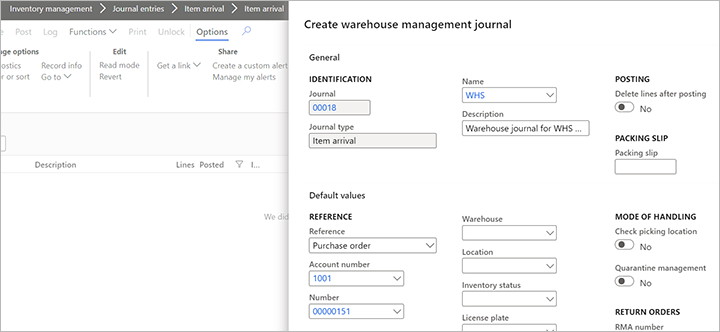

--- 
# required metadata 
 
title: Register items enabled for warehouse management processes using an item arrival journal
description: This article presents a scenario that shows how to register items using the item arrival journal when you are using warehouse management processes (WMS). 
author: Mirzaab
ms.date: 03/24/2021
ms.topic: how-to 
ms.prod:  
ms.technology:  
 
# optional metadata 
 
ms.search.form: WMSJournalTable, WMSJournalCreate, WHSLicensePlate   
audience: Application User 
# ms.devlang:  
ms.reviewer: kamaybac
# ms.tgt_pltfrm:  
# ms.custom:  
ms.search.region: Global
ms.search.industry: Distribution
ms.author: mirzaab
ms.search.validFrom: 2016-06-30 
ms.dyn365.ops.version: AX 7.0.0 
---
# Register items enabled for warehouse management processes using an item arrival journal

[!include [banner](../../includes/banner.md)]

This article presents a scenario that shows how to register items using the item arrival journal when you are using warehouse management processes (WMS). This would usually be done by a receiving clerk.

## Enable sample data

To work through this scenario using the sample records and values specified in this article, you must be using a system where the standard [demo data](../../../fin-ops-core/fin-ops/get-started/demo-data.md) is installed, and you must select the *USMF* legal entity before you begin.

You can instead work through this scenario by substituting values from your own data provided that you have the following data available:

- You must have a confirmed purchase order with an open purchase order line.
- The item on the line must be stocked. It must not use product variants, and must not have tracking dimensions.
- The item must be associated with a storage dimension group that has warehouse management process enabled.
- The warehouse that's used must be enabled for WMS and the location that you use for receiving must be license plate controlled.

## Create an item arrival journal header that uses warehouse management

The following scenario shows how to create an item arrival journal header that uses warehouse management:

1. Make sure your system contains a confirmed purchase order that fulfils the requirements outlined in the previous section. This scenario uses a purchase order for company *USMF*, vendor account *1001*, warehouse *51*, with an order line for *10 PL* (10 pallets) of item number *M9200*.
1. Make a note of the purchase order number that you will use.
1. Go to **Inventory management \> Journal entries \> Item arrival \> Item arrival**.
1. Select **New** on the Action Pane.
1. The **Create warehouse management journal** dialog box opens. Select a journal name in the **Name** field.
    - If you are using *USMF* sample data, select *WHS*.
    - If you're using your own data, the journal you choose must have **Check picking location** set to *No* and **Quarantine management** set to *No*.
1. Set **Reference** to *Purchase order*.
1. Set **Account number** to *1001*.
1. Set **Number** to the number of the purchase order that you identified for this exercise.

    

1. Select the **OK** to create the journal header.
1. In the **Journal lines** section, select **Add line** and enter the following data:
    - **Item number** – Set to *M9200*. The **Site**, **Warehouse**, and **Quantity** will get set based on the inventory transaction data for the 10 pallets (1000 ea.).
    - **Location** – Set to  *001*. This specific location does not track license plates.

    

    > [!NOTE]
    > The **Date** field determines the date on which the on-hand quantity of this item will be registered in the inventory.  
    >
    > The **Lot ID** will be populated by the system if it can be uniquely identified from the information provided. Otherwise you will have to enter this manually. This is a required field, which links this registration to a specific source document line.  

1. Select **Validate** on the Action Pane. This checks that the journal is ready to be posted. If the validation fails you will need to fix the errors before you can post the journal.  
1. The **Check journal** dialog box opens. Select **OK**.
1. Review the message bar. There should be a message denoting that the operation was completed.  
1. Select **Post** on the Action Pane.
1. The **Post journal** dialog box opens. Select **OK**.
1. Review the message bar. There should be messages denoting that the operation completed.
1. Select **Functions > Product receipt** on the Action Pane to update the purchase order line and post a product receipt.

[!INCLUDE[footer-include](../../../includes/footer-banner.md)]
