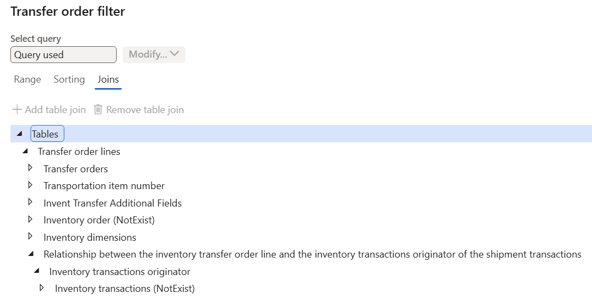
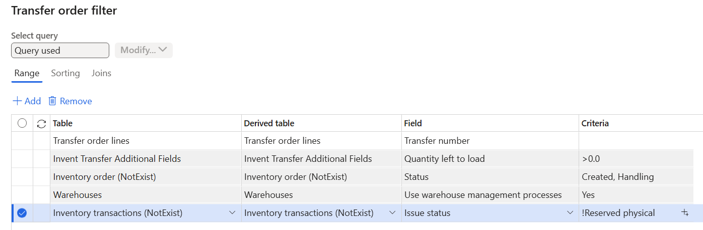

# Plan loads and shipments using the outbound load planning workbench

[!include [banner](../../includes/banner.md)]

This article shows how to use the outbound load planning workbench to create a load for a sales order. As a prerequisite we'll create the sales order first. This procedure is part of the daily work for the transportation coordinator. The demo data company used to create this procedure is USMF.

## Create a sales order

1. Go to the **Accounts receivable > Orders > All sales orders**.
2. Select **New**.
3. In the **Customer account** field, select the drop-down button to open the lookup.
4. Select account *US-004*.
5. Select **OK**.
6. In the **Item number** field, select the drop-down button to open the lookup.
7. Select item *A0001*. *A0001* is enabled for transportation management.  
8. In the **Site** field, select the drop-down button to open the lookup, then select an item.
9. In the **Quantity** field, enter a number.
10. In the **Warehouse** field, type *24* for this example. This warehouse is enabled for transportation management and warehouse management processes (WMS).  
11. Select **Save**.
12. Close the page.

## Create a new load

1. Go to the **Transportation management > Planning > Outbound load planning workbench**.
2. Select the **Sales lines** tab. Now you'll build the load for the sales order that you just created. Loads can be built based on supply and demand from purchase orders, transfer orders, and sales orders.  
3. On the Action Pane, select **Supply and demand**.
4. Select **To new load**.
5. In the **Load template ID** field, select the drop-down button to open the lookup. The Load template defines maximum measurements for weight and volume of the entire load. For example, the load template might represent the size of a container or truck. Select an item.
6. Select **OK**.

## Rate and route the load

1. Select **Rating and routing**.
2. Select **Rate route workbench**.
3. Select **Rate shop**.
4. In the list, find and select the desired record.
5. Select **Assign**.
6. Close the page.

## Load planning filters

From **Outbound load planning workbench**, go to **Filters** > **Load planning filters**. You can customize filters here to only show the lines you want. For example, you can only show fully reserved transfer order lines. Below is the set up on how to achieve this.

1. In **Load planning filters**, add a new load planning filter, set **Load planning filter type** to *Transfer order*.
2. Go to **Edit quey** > **Joins**.
3. Click on *Transfer order lines*, then **Add table join**, add *Relationship between the inventory transfer order line and the inventory transactions originator of the shipment transactions* (Join mode 1:n).
4. Click on *Relationship between the inventory transfer order line and the inventory transactions originator of the shipment transactions*, then **Add table join**, add *Inventory transactions originator (Inventory transactions originator)*.
5. Click on *Inventory transactions originator (Inventory transactions originator)*, then **Add table join**, add *Inventory transactions (NotExist Record-ID)* (Relation source *InventTrans : InventTransOrigin*). 
6. Go to **Range**, add a new range on *Inventory transactions (NotExist)* on field *Issue status* with Criteria *!Reserved physical* (not *Reserved physical*). This filter then only includes the transfer order lines with inventory transactions status *Reserved Physical*, which means those fully reserved lines. 
7. Save. Go back to **Outbound load planning workbench**, select the newly created filter in **Supply and demand filter**. You can set it as default in **Filters** > **Set as default**.

[!INCLUDE[footer-include](../../../includes/footer-banner.md)]
