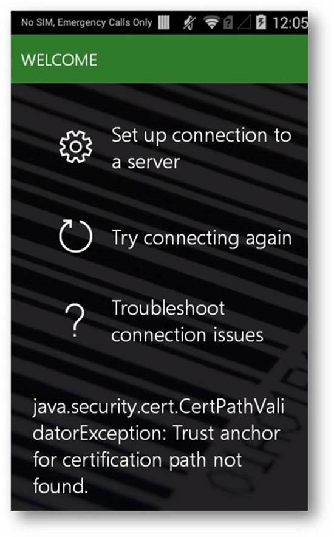

---
# required metadata

title: Troubleshoot warehouse app connection issues
description: This topic describes how to fix common issues that you might encounter while connecting the Dynamics 365 for Finance and Operations - Warehousing application to Dynamics 365 Supply Chain Management.
author: ivanv-microsoft
manager: tfehr
ms.date: 09/13/2020
ms.topic: article
ms.prod: 
ms.service: dynamics-ax-applications
ms.technology: 

# optional metadata

ms.search.form: WMA
# ROBOTS: 
audience: Warehouse manager
# ms.devlang: 
ms.reviewer: kamaybac
ms.search.scope: Core, Operations
# ms.tgt_pltfrm: 
ms.custom: 
ms.assetid: 
ms.search.region: Global
ms.search.industry: Warehousing
ms.author: ivanv
ms.search.validFrom: 2020-9-13
ms.dyn365.ops.version: AX 10.0.14

---
# Troubleshoot warehouse app connection issues

This topic describes how to fix common issues that you might encounter while connecting the *Dynamics 365 for Finance and Operations - Warehousing* application to Dynamics 365 Supply Chain Management.

> [!IMPORTANT]
> If your issue is not listed on this page, please contact Microsoft Support, or send email describing your issue to *dscmwarehousingand@microsoft.com*, so we can help you troubleshoot it, and possibly add it to this page. <!-- KFM: We don't want support questions coming through the doc feedback system, so I changed this to just "Microsoft Support". Also, is that really the right email address? -->

## Trust anchor for certification path not found

This section explains what to do if the warehousing app shows a **Trust anchor for certification path not found** error when trying to connect to Supply Chain Management.

### Scope

- **OS version**: Android 4.4.x (such as Zebra TC55). (This isn't an issue on recent Android versions.)
- **Supply Chain Management location**: Cloud or on-premises
- **Connection mode**: Client secret / Certificate

### Possible root cause

Microsoft may have updated the Server SSL certificates used by Supply Chain Management. As a result, the root certificate and/or one of the intermediate certificates may have changed, so the new certificate isn't on the list of trusted system certificates for the mobile device.

### Resolution

- Contact Zebra or Google for an update of the system trusted certifying authority (CA) certificates.
- Replace the device(s) with devices that are running a more recent version of Android (their trusted CA certificates are updated automatically).

### Workaround

#### Step 1: Export the new root certificate from Supply Chain Management

Manually download the new root certificate using your internet browser by doing the following:

1. Sign in to Dynamics Supply Chain Management and open its front page.
1. In the address bar of your browser, select the lock icon to open the **Location is secure** dialog box.
1. In the dialog box, select **Certificate (valid)** to open the **Certificate** window for that certificate.
1. Open the **Certification path** tab of the **Certificate** window.
1. Select the top certificate shown in the hierarchy (**DigiCert Global Root G2**).
1. Open the **Details** tab of the **Certificate** window.
1. Select the **Copy to file button** at the bottom of the **Details** tab.
1. The **Certificate export wizard** opens. Select **Next** to continue.
1. The **Export file format** page opens. Select the **DER encoded binary X.509 (.CER)** radio button. Then select **Next** to continue.
1. The **Files to export** page opens; use it to specify a file name and location. Then select **Next** to continue.
1. The **Completing the certificate export wizard** page opens, showing the result of your export. Select **Finish**.

#### Step 2: Install the downloaded certificate onto the impacted devices

Install the downloaded certificate by doing the following:

1. Copy the new certificate you downloaded in the previous step to an SD card.
1. Sign in to the mobile device and insert the SD card.
1. Open the **Settings**.
1. From the **Personal** section, select **Security**.
1. Select **Install from SD card**.
1. The new certificate should now be shown on teh **User** tab for trusted certificates.

