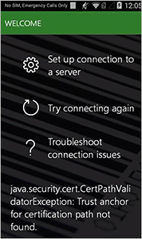

---
# required metadata

title: Troubleshoot warehouse app connection issues
description: This topic describes how to fix common issues that you might encounter while trying to connect the *Dynamics 365 for Finance and Operations - Warehousing* application to Dynamics 365 Supply Chain Management.
author: ivanv-microsoft
manager: tfehr
ms.date: 09/13/2020
ms.topic: article
ms.prod: 
ms.service: dynamics-ax-applications
ms.technology: 

# optional metadata

ms.search.form: WMA
# ROBOTS: 
audience: Warehouse manager
# ms.devlang: 
ms.reviewer: kamaybac
ms.search.scope: Core, Operations
# ms.tgt_pltfrm: 
ms.custom: 
ms.assetid: 
ms.search.region: Global
ms.search.industry: Warehousing
ms.author: ivanv
ms.search.validFrom: 2020-9-13
ms.dyn365.ops.version: AX 10.0.14

---
# Troubleshoot warehouse app connection issues

This topic describes how to fix common issues that you might encounter while trying to connect the *Dynamics 365 for Finance and Operations - Warehousing* application to Dynamics 365 Supply Chain Management.

**Important**

If your issue is not listed below, please add a comment explaining the issue in detail here in this topic, or send a mail with this information to *dscmwarehousingand@microsoft.com*, so we can help you troubleshoot it, and append the below list

## Trust anchor for certification path not found

**Scope**

- OS version: Android 4.4.x devices (e.g., Zebra TC55). Not an issue on recent Android versions.
- Dynamics 365 location: Cloud / On Prem
- Connection mode: Client secret / Certificate

**Possible root cause**

Server SSL certificates updated by Microsoft so that one of the Intermediate certificates or Root certificate changes.
As a result, this certificate is not in the lst of trusted system certificates on the mobile device.

**Resolution**

- Contact Zebra / Google for an update of the system trusted CA certificates.
- Replace the device(s) with ones that are running a more recent version of Andriod (they get the trusted CAs updated automatically)

**Workaround**

1. Manually download the new root certificate using your internet browser. Open the main Dynamics SCM URL, and click on the Lock icon to the left to open the page security information, then follow below image step-by-step guide.

2. Install the downloaded certificate onto the impacted devices. The certificate should then show up under USER trusted certificates on the device, at which point you should be able to connect to Dynamics as before.

