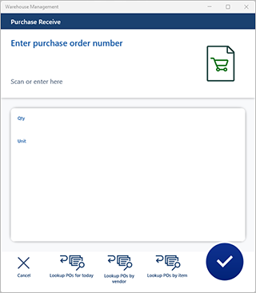
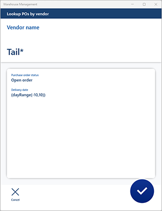
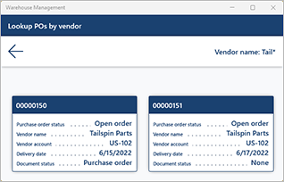

# Query data using Warehouse Management mobile app detours

[!include [banner](../includes/banner.md)]

## Feature introduction

By providing bar code scanning capability, the Warehouse Management mobile app gives you an easy and accurate way to capture data as part of your warehouse processes. However, bar codes are sometimes damaged and become unreadable, or the required data information might not exist as a bar code in your business process flows. In these cases, manual entry of the data can take a long time and can even cause incorrect data to be captured. The results can be reduced effectivity and a lower service level.

When you use a flexible data inquiry process, workers can easily look up the required information as part of the embedded Warehouse Management mobile app flows and apply filtering options so that only the relevant data is shown. Therefore, manual selection is faster and more accurate.

For example, in the purchase order receiving flow, a purchase order number is required to match arriving inventory. As part of this process, you can easily configure menu items to provide a card list view of the relevant purchase order numbers. In this way, you can continue the receiving flow by using a quick point-to-select approach. This article provides example scenarios, but the functionality can also be used within any or all your Warehouse Management mobile app flows.

## Turn on the data inquiry flow feature and its prerequisites

Before you can use the functionality that is described in this article, you must complete the following procedure to turn on the required features.

1. Go to **System administration \> Workspaces \> Feature management**. (For more information about how to use the **Feature management** workspace, see [Feature management overview](../../fin-ops-core/fin-ops/get-started/feature-management/feature-management-overview.md).)
1. If you're running Supply Chain Management version 10.0.28 or earlier, turn on the feature that is listed in the following way:

    - **Module:** *Warehouse management*
    - **Feature name:** *Warehouse app step instructions*

    This feature is a prerequisite for the *Warehouse management app data inquiry flow* feature. As of Supply Chain Management version 10.0.29, it's mandatory and can't be turned off. For more information about the *Warehouse app step instructions* feature, see [Customize step titles and instructions for the Warehouse Management mobile app](mobile-app-titles-instructions.md).

1. Turn on the feature that is listed in the following way:

    - **Module:** *Warehouse management*
    - **Feature name:** *Warehouse management app detours*

    This feature is a prerequisite for the *Warehouse management app data inquiry flow* feature. As of Supply Chain Management version 10.0.29, it's turned on by default. For more information about the *Warehouse management app detours* feature, see [Configure detours for steps in mobile device menu items](warehouse-app-detours.md).

1. If the *Warehouse management app detours* feature wasn't already turned on, update the field names in the Warehouse Management mobile app by going to **Warehouse management \> Setup \> Mobile device \> Warehouse app field names** and selecting **Create default setup**. Repeat this step for each legal entity (company) where you use the Warehouse Management mobile app. For more information, see [Configure fields for the Warehouse Management mobile app](configure-app-field-names-priorities-warehouse.md).
1. Turn on the feature that is listed in the following way:

    - **Module:** *Warehouse management*
    - **Feature name:** *Warehouse management app data inquiry flow*

    This feature is the one that is described in this article. As of Supply Chain Management version 10.0.32, this feature is mandatory and can't be turned off.

## The work user session query range utility tool

[!INCLUDE [preview-banner-section](../../includes/preview-banner-section.md)]

Supply Chain Management version 10.0.37 (and later) includes a *work user session query range utility tool*, which adds the following functionality for setting up queries to help workers find specific records using the Warehouse Management mobile app:

- **Filter records by warehouse** – Lets you set up queries that use the worker's current warehouse as a value. You can use this value as a criterion for range filters (on the **Range** tab of the standard query designer). This is useful, for example, if you want to display a list of purchase orders expected to arrive at the warehouse where the worker is currently working. To set up a mobile device menu item to use this feature, open the query designer and, on the **Range** tab, set up a row that uses a **Criteria** of *(WhsWorkUserSessionSysQueryRangeUtil::whsWorkUserSessionCurrentWarehouse())*. An example of how to use this functionality is provided later in this article.
- **Filter records by app user** – Lets you set up queries that use the current worker's worker ID as a value. You can use this value as a criterion for range filters (on the **Range** tab of the standard query designer). To set up a mobile device menu item to use this feature, open the query designer and, on the **Range** tab, set up a row that uses a **Criteria** of *(WhsWorkUserSessionSysQueryRangeUtil::whsWorkUserSessionCurrentWorkUserId())*.
- **Show or hide filters in the mobile app** – This feature lets you choose whether to show a page with filter values during a data inquiry flow for mobile device menu items. When you're using the **Mobile device menu items** page to set up a mobile device menu item where this feature is relevant, you'll find a **Show filters page** setting, which lets you choose whether to show the filters *Always* or *Only when filters can be changed*.

## Example scenarios

This article uses example scenarios to show how you can use the *Warehouse management app data inquiry flow* feature to improve the purchase receipt flow. The scenarios use the standard sample data, which includes a flow that is named *Purchase receive*.

This flow starts by prompting workers to identify a purchase order number that they will receive against. To help workers more easily identify the purchase order, you will enhance the first page of the flow by adding the following new query options as [detours](warehouse-app-detours.md):

- **Look up POs by vendor** – Open a page that prompts workers to enter a vendor name or part of a vendor name. Wildcard characters can be used. For example, if a worker is expecting an inbound delivery today from a vendor that includes *Tailspin* in its name, they can enter **Tail\*** to view a set of cards for open purchase orders that include this text. Every card has several fields that provide information about each purchase order. In addition to the vendor's name, you can design the cards so that they show the vendor account number, delivery date, and document status.
- **Look up POs for today** – Open a page that doesn't prompt workers to enter data, but shows a set of cards that match the "hardcoded" filter. Workers proceed by selecting a card for the purchase order that they want to register inventory items against. This process is enabled with the option **Show filter page** set to *Only when filters can be changed*, which means the app shows results immediately (without showing the filters page).
- **Look up POs by item** – Open a page that prompts workers to scan the bar code of any item in the arrived inventory. The flow then lists all open purchase orders that contain lines for the scanned item number. To cover situations where a bar code can't be read, you can add another detour lookup to this page that lets workers search for item numbers within a specific purchase order.

In each case, the worker identifies a purchase order by selecting a card and is then returned to the first page, which shows the selected purchase order number. The worker can then continue the inbound inventory item registration flow.

## Enable sample data

To work through the example scenarios that are described in this article, you must be on a system where the standard [demo data](../../fin-ops-core/dev-itpro/deployment/deploy-demo-environment.md) is installed. Additionally, you must select the *USMF* legal entity (company) before you begin.

## Configure the mobile device menu items

To create each of the new query options that you have to add to the first page of the flow, you must set it up as a mobile device menu item. Later, you will make the query options available as detours to the *Purchase receive* flow.

### Create the "Look up POs by vendor" menu item

Create the **Look up POs by vendor** menu item by following these steps.

1. Go to **Warehouse management \> Setup \> Mobile device \> Mobile device menu items**.
1. On the Action Pane, select **New** to add a mobile device menu item.
1. Set the following values for the new menu item:

    - **Menu item name:** *Look up POs by vendor*
    - **Title:** *Look up POs by vendor*
    - **Mode:** *Indirect*

1. On the **General** FastTab, set the following values:

    - **Activity code:** *Data inquiry*
    - **Use process guide:** *Yes* (This value is automatically selected.)
    - **Table name:** *PurchTable* (You want to look up purchase order numbers from this table.)
    - **Show filter page:** *Only when filters can be changed* (Filters will be shown due to the *Vendor name*.)

1. On the Action Pane, select **Edit query** to define a query that is based on the selected base table (in this case, the purchase orders table).
1. In the query editor, on the **Range** tab, add the following lines to the grid.

    | Table | Derived table | Field | Criteria |
    |---|---|---|---|
    | Purchase orders | Purchase orders | Purchase order status | Open order |
    | Purchase orders | Purchase orders | Delivery date | (dayRange(-10,10)) |
    | Purchase orders | Purchase orders | Vendor name | |

    > [!TIP]
    > In this example, the filter doesn't include any warehouse criteria and will therefore return open purchase orders for all warehouses within the current legal entity. To limit the search results to only find purchase orders for the current worker's warehouse, add a query line with **Field** set to *Warehouse* and **Criteria** set to *(WhsWorkUserSessionSysQueryRangeUtil::whsWorkUserSessionCurrentWarehouse())*. You could also use this value for fields from joined tables (such as the *Inventory dimensions* table). See also [The work user session query range utility tool](#session-query).

1. Select **OK**.

    In this example, the new menu item is configured to find open purchase orders that are expected to arrive anytime between 10 days in the past and 10 days in the future.

    In the query, the **Criteria** column for *Vendor name* has been left blank. Therefore, workers will be able specify this value while they use the Warehouse Management mobile app.

    If you want to specify how the list will be sorted, you can set up the sorting on the **Sorting** tab.

1. In addition to defining the query, you must select which fields will be shown on the cards on the inquiry list page. Therefore, on the Action Pane, select **Field list**.
1. On the **Field list** page, set the following values:

    - **Display field 1:** *PurchId* (This field will be shown as the header for each card.)
    - **Display field 2:** *PurchStatus*
    - **Display field 3:** *PurchName*
    - **Display field 4:** *OrderAccount*
    - **Display field 5:** *DeliveryDate*
    - **Display field 6:** *displayDocumentStatus()* (This value is a display method, as the "()" at the end indicates.)

1. On the Action Pane, select **Save**. Then close the page.

### Create the "Look up POs for today" menu item

Create the **Look up POs for today** menu item by following these steps.

1. Go to **Warehouse management \> Setup \> Mobile device \> Mobile device menu items**.
1. On the Action Pane, select **New** to add a mobile device menu item.
1. Set the following values for the new item:

    - **Menu item name:** *Look up POs for today*
    - **Title:** *Look up POs for today*
    - **Mode:** *Indirect*

1. On the **General** FastTab, set the following values:

    - **Activity code:** *Data inquiry*
    - **Use process guide:** *Yes* (This value is automatically selected.)
    - **Table name:** *PurchTable* (You want to look up purchase order numbers from this table.)
    - **Show filter page:** *Only when filters can be changed* (Show results immediately.)

1. On the Action Pane, select **Edit query** to define a query that is based on the selected base table (in this case, the purchase orders table).
1. In the query editor, on the **Range** tab, add the following lines to the grid.

    | Table | Derived table | Field | Criteria |
    |---|---|---|---|
    | Purchase order | Purchase order | Purchase order status  | Open order |
    | Purchase order | Purchase order | Confirmed receipt date | (Day(0))   |
    | Purchase order | Purchase order | Warehouse              | (WhsWorkUserSessionSysQueryRangeUtil::whsWorkUserSessionCurrentWarehouse()) |

    > [!NOTE]
    > In this example, the query filters search results by warehouse because it includes a line with the *Warehouse* field. If you set this line with a blank value for **Criteria**, the system will show a filter page that automatically displays the worker's current warehouse and allows the worker to update the value as needed. If you set this line to have a **Criteria** value of *(WhsWorkUserSessionSysQueryRangeUtil::whsWorkUserSessionCurrentWarehouse())*, the application can automatically use this value without showing it to the worker for confirmation. See also [The work user session query range utility tool](#session-query).

1. Select **OK**.

    In this example, the new menu item is configured to find open purchase orders that are expected to arrive today.

    If you want to specify how the list will be sorted, you can set up the sorting on the **Sorting** tab.

1. In addition to defining the query, you must select which fields will be shown on the cards on the inquiry list page. Therefore, on the Action Pane, select **Field list**.
1. On the **Field list** page, set the following values:

    - **Display field 1:** *PurchName* (This field will be shown as the header for each card.)
    - **Display field 2:** *PurchId*
    - **Display field 3:** *PurchStatus*
    - **Display field 4:** *DlvMode*
    - **Display field 5:** *DlvTerm*
    - **Display field 6:** *OrderAccount*
    - **Display field 7:** *VendorName()* (This value is a display method, as the "()" at the end indicates.)

1. On the Action Pane, select **Save**. Then close the page.

### Create the "Look up POs by item" menu item

Create the **Look up POs by item** menu item by following these steps.

1. Go to **Warehouse management \> Setup \> Mobile device \> Mobile device menu items**.
1. On the Action Pane, select **New** to add a mobile device menu item.
1. Set the following values for the new item:

    - **Menu item name:** *Look up POs by item*
    - **Title:** *Look up POs by item*
    - **Mode:** *Indirect*

1. On the **General** FastTab, set the following values:

    - **Activity code:** *Data inquiry*
    - **Use process guide:** *Yes* (This value is automatically selected.)
    - **Table name:** *PurchLine* (You want to look up purchase order numbers based on item number via the line data.)
    - **Show filter page:** *Only when filters can be changed* (Filters will be shown due to the *Item number*.)

1. On the Action Pane, select **Edit query** to define a query that is based on the selected base table (in this case, the purchase order lines table, but you can use any of the values that are related to the header by joining to the *PurchTable*).
1. In the query editor, on the **Range** tab, add the following lines to the grid.

    | Table | Derived table | Field | Criteria |
    |---|---|---|---|
    | Purchase order lines | Purchase order lines | Line status | Open order |
    | Purchase order lines | Purchase order lines | Delivery date | (dayRange(-10,10)) |
    | Purchase order lines | Purchase order lines | Item number | |

    > [!TIP]
    > In this example, the filter doesn't include any warehouse criteria and will therefore return open purchase orders for all warehouses within the current legal entity. To limit the search results to the current worker's warehouse, you could join to the *Inventory dimensions* table, then include the *Warehouse* field as part of the range query, and enter *(WhsWorkUserSessionSysQueryRangeUtil::whsWorkUserSessionCurrentWarehouse())* as the **Criteria** for the *Warehouse* field. See also [The work user session query range utility tool](#session-query).

1. Select **OK**.

    In this example, the new menu item is configured to find open purchase order lines that are expected to arrive anytime between 10 days in the past and 10 days in the future.

    In the query, the **Criteria** column for *Item number* has been left blank. Therefore, workers will be able to specify this value while they use the Warehouse Management mobile app.

    If you want to specify how the list will be sorted, you can set up the sorting on the **Sorting** tab.

1. In addition to defining the query, you must select which fields will be shown on the cards on the inquiry list page. Therefore, on the Action Pane, select **Field list**.
1. On the **Field list** page, set the following values:

    - **Display field 1:** *PurchId* (This field value will be used as the header for each card.)
    - **Display field 2:** *VendAccount*
    - **Display field 3:** *PurchQty*
    - **Display field 4:** *PurchUnit*
    - **Display field 5:** *PurchStatus*

1. On the Action Pane, select **Save**. Then close the page.

## Add the new mobile device menu items to a menu

Your three new mobile device menu items are now ready to be added to the mobile device menu. This task must be completed before the menu items can be used as part of a detour process. In this example, you will create a new submenu and add the new menu items to it.

1. Go to **Warehouse management \> Setup \> Mobile device \> Mobile device menu**.
1. On the Action Pane, select **New**.
1. Set the following values on the header of the new record:

    - **Name:** *Inquire*
    - **Description:** *Inquire*

1. In the **Available menus and menu items** list, select the first of the mobile device menu items that you just created. Then select the right arrow button to move that item into the **Menu structure** list.
1. Repeat the previous step for the other two new menu items.
1. In the list pane on the left, select the **Main** menu.
1. In the **Available menus and menu items** list, scroll down to the **Menus** section, and select your new **Inquire** menu. Then select the right arrow button to move that item into the **Menu structure** list.

## Configure detours in your mobile device steps

To complete the setup, you must now use the detour configuration on the **Mobile device steps** page to add the three new mobile device menu items to the existing purchase order identification step in the *Purchase receive* flow.

1. Go to **Warehouse management \> Setup > Mobile device \> Mobile device steps**.
1. In the **Filter** field, enter *PONum*. Then select *Step ID: "PONum"* in the drop-down list.
1. While the record that is found is selected in the grid, select **Add step configuration** on the Action Pane. In the drop-down dialog box that appears, set the **Menu item** field to *Purchase Receive*. Then select **OK** to close the dialog box.
1. On the details page for the new step configuration (**Purchase Receive : PONum**), on the **Available detours (menu items)** FastTab, select **Add** on the toolbar.
1. In the **Add detour** dialog box, find and select the **Look up POs by vendor** menu item that you previously created.
1. Select **OK** to close the dialog box and add the selected menu item to the detours list.
1. Select the new detour, and then select **Select fields to send** on the toolbar.
1. In the **Select fields to send** dialog box, don't add anything to the **Send from purchase receive** section, because you don't want to pass any values to the detour menu item. However, in the **Bring back from look up POs by vendor** section, set the following value for the empty row that has already been added there:

    - **Copy from Look up POs by vendor:** *Purchase order*
    - **Paste in Purchase Receive:** *Purchase order*

1. Select **OK** to close the dialog box.
1. Repeat steps 4 through 9 for the other two new menu items (**Look up POs for today** and **Look up POs by item**). As for the **Look up POs by vendor** menu item, you don't want to send any data to these detours, but you do want to return a purchase order number.
1. Close the page.

## Try a purchase receiving flow that has a data inquiry as part of a detour

Follow these steps to test your new mobile app setup.

1. Create several purchase orders that have lines for warehouse 51.
1. Go to a mobile device or emulator that is running the Warehouse Management mobile app, and sign in to warehouse 51 by using *51* as the user ID and *1* as the password.
1. On the mobile app menu, select **Inbound** and then **Purchase receive**.

    You should see the following page, which includes the three new menu items.

    

1. Try out the different capabilities, and notice that you can send back a purchase order number by selecting one of the cards in the list.

    

    

> [!TIP]
> Instead of running the receiving flow by doing a lookup from the **Purchase receive** menu item, you can start from an inquiry flow (**Main \> Inquire \> Look up POs by vendor**) and invoke a detour to run the desired flow by selecting one of the cards in the list. To use this approach, you can define a detour on the **Mobile device steps** page for the step that has a **Step ID** value of *GenericDataInquiryList*. Provided the [*Multi-level detours for the Warehouse Management mobile app*](warehouse-app-detours.md) feature is turned on for your system, you can also add an additional detour if needed (this feature adds support for up to two levels of detours and can be customized to support additional levels).

[!INCLUDE[footer-include](../../includes/footer-banner.md)]
