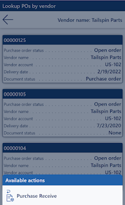

# Inquire data information via Warehouse management mobile app detours

[!include [banner](../includes/banner.md)]

## Feature introduction

By providing bar code scanning capability the warehouse management mobile app offers an easy and accurate way to capture data as part of your warehouse processes. But sometimes bar codes get damaged and unreadable, or the needed data information might not exist as a bar code in your business process flows.

In these cases, it can take a long time to manually key in the data and can even result in wrong data capturing with the outcome of being less effective and having a lower warehouse service level.

By using a flexible data inquiry process the warehouse workers can easily lookup the required data information as part of the imbedded warehouse management mobile app flows with filtering options only listing the relevant data - and thereby making the manual selection faster and more accurate.

One example could be during a purchase order receiving flow, where a purchase order number is required to get recorded for matching up the arrived inventory item quantities. As part of this process, you can easily configure different menu items to obtain a card list view of the relevant purchase order numbers and thereby being able to continue the receiving flow with a quick point-to-select approach; but the functionality can get used within all your warehouse management mobile app flows and not only within the following example.

## Enable the warehouse management app data inquiry capability

Before you can use the functionality, the feature must be turned on in your system. Admins can use the [Feature management](../../fin-ops-core/fin-ops/get-started/feature-management/feature-management-overview.md) workspace to check the status of the feature and turn it on if it's required. There, the feature is listed in the following way:

- **Module:** *Warehouse management*
- **Feature name:** *Warehouse management app data inquiry flow*

The feature has dependencies of having the [Warehouse app step instructions](mobile-app-titles-instructions.md) and [Warehouse management app detours](warehouse-app-detours.md) features enabled.

## Example scenario

In the following the *Warehouse management app data inquiry flow* will get explained as part of the **Purchase Receive** flow within the Contoso demo data set in company *USMF*. In this exiting flow the warehouse management mobile app will prompt for the identification of a purchase order number within the very first step.

To enhance the selection process of the purchase order number we will add three mobile device menu items to this page:

### Example scenario - Lookup POs by vendor

In this example the warehouse management mobile app flow will prompt for a vendor name or part of a vendor name (using wildcards).

Imagine that you are expecting an inbound delivery today from a vendor called *Tailspin* something - in this case you can type *Tail** to keep it short and will see all open purchase orders based on the filter where the vendor’s name starts with *Tail* as part of a cards view.

Each card has a number of fields that convey necessary information about the purchase orders. Besides the complete vendor’s name, you can for example define to see the vendor account number, delivery date, and document status to ease the selecting of the specific purchase order number you would like to get returned to the purchase order number identification step.

### Example scenario - Lookup POs for today

In this example the inquiry menu item option will not require any entering when invoked but will simply show pre-configured filters like today’s date, and you can just proceed with your selection of a card for the specific purchase order you are going to register inventory items against. Again, the purchase order number will get returned to the previous page making it possible to continue the inbound inventory item registration flow.

### Example scenario - Lookup POs by item

This example shows how easy it is to find a purchase order number by scanning one of the item bar codes on the arrived inventory. The logic will simply list all the open purchase orders containing lines for the specific item number making it simple to select the purchase order number for the flowing receiving process.

As additional inspiration you can try to add an inquire detour lookup on the **Scan item** page to search for item numbers within a specific purchase order. This could be relevant in a scenario where an item number bar code cannot get read.

### Configuring the mobile device menu items

First, let's create the three new lookup mobile device menu items we are going to add as part of the **Purchase Receipt** flow.

#### Lookup POs by vendor

1. Go to **Warehouse management \> Setup \> Mobile device \> Mobile device menu items**.
1. Select **New** on the Action Pane to add a new mobile device menu item.
1. Make the following settings:
   - **Menu item name:** *Lookup POs by vendor*
   - **Title:** *Lookup POs by vendor*
   - **Mode:** *Indirect*

1. Under **General** select the following:
   - **Activity code:** *Data inquiry*
   - **Use process guide:** *Automatically selected*
   - **Table name:** *PurchTable (we would like to lookup purchase order numbers from this table)*

    Once a table name is selected the buttons *Edit query* and *Field list* gets available.
    **Edit query** will allow you to define a query based on the selected base table, in this case it's the Purchase orders.

1. Select **Edit query**.
1. In the **Range** section grid add the following three lines:

    | Table | Derived table | Field | Criteria |
    |---|---|---|---|
    | Purchase order | Purchase order | Purchase order status | Open order |
    | Purchase order | Purchase order | Delivery date | (dayRange(-10,10)) |
    | Purchase order | Purchase order | Vendor name |  |
1. Select **OK**.

    In this example it gets configured to query out open purchase orders that are expected to arrive anywhere within a day range of ten days in the past and ten days in the future.

    In the query the *Vendor name* criteria has been left blank, making it possible during the Warehouse app processing to provide the information.

    In case you would like a specific sorting of the list this can as well get defined as part of the **Sorting** tab.

    Apart from the query, you also need to configure the fields that will be displayed on the cards in the inquiry list screen.

1. Select **Field list**.
1. Add the following information:
    - **Display field 1:** *PurchId* (This field value will used as the header for each card)
    - **Display field 2:** *PurchStatus*
    - **Display field 3:** *PurchName*
    - **Display field 4:** *OrderAccount*
    - **Display field 5:** *DeliveryDate*
    - **Display field 6:** *displayDocumentStatus()* (Note this is a display method, indicated by the "()" at the end.)

1. Select **Save** and close the page by selecting **X** (Close) or back in the browser.

#### Lookup POs for today

1. Go to **Warehouse management \> Setup \> Mobile device \> Mobile device menu items**.
1. Select **New** on the Action Pane to add a new mobile device menu item.
1. Make the following settings:
   - **Menu item name:** *Lookup POs for today*
   - **Title:** *Lookup POs for today*
   - **Mode:** *Indirect*

1. Under **General** select the following:
   - **Activity code:** *Data inquiry*
   - **Use process guide:** *Automatically selected*
   - **Table name:** *PurchTable* (We would like to lookup purchase order numbers from this table.)

    Once a table name is selected the buttons **Edit query** and **Field list** gets available. **Edit query** will allow you to define a query based on the selected base table, in this case it's the Purchase orders.

1. Select **Edit query**.
1. In the **Range** section grid add the following two lines:

    | Table | Derived table | Field | Criteria |
    |---|---|---|---|
    | Purchase order | Purchase order | Purchase order status | Open order |
    | Purchase order | Purchase order | Delivery date | (Day(0)) |

1. Select **OK**

    In this example it gets configured to query out open purchase orders that are expected to arrive today.

    In case you would like a specific sorting of the list this can as well get defined as part of the **Sorting** tab.

    Apart from the query, you also need to configure the fields that will be displayed on the cards in the inquiry list screen.

1. Select **Field list**.
1. Add the following information:
    - **Display field 1:** *PurchName (This field value will used as the header for each card)*
    - **Display field 2:** *PurchID*
    - **Display field 3:** *PurchStatus*
    - **Display field 4:** *DlvMode*
    - **Display field 5:** *DlvTerm*
    - **Display field 6:** *OrderAccount*
    - **Display field 7:** *VendorName()* (Note this is a display method, indicated by the "()" at the end.)

1. Select **Save** and close the page by selecting **X** (Close) or back in the browser.

### Lookup POs by item

1. Go to **Warehouse management \> Setup \> Mobile device \> Mobile device menu items**.
1. Select **New** on the Action Pane to add a new mobile device menu item.
1. Make the following settings:
   - **Menu item name:** *Lookup POs by item*
   - **Title:** *Lookup POs by item*
   - **Mode:** *Indirect*

1. Under **General** select the following:
   - **Activity code:** *Data inquiry*
   - **Use process guide:** *Automatically selected*
   - **Table name:** *PurchLine* (We would like to lookup purchase order numbers based on item number via the line data.)

    Once a table name is selected the buttons *Edit query* and *Field list* gets available.
    **Edit query** will allow you to define a query based on the selected base table, in this case it's the Purchase order lines, but you can as well choose to leverage any of the values related to the header by simply joining to the *PurchTable*.

1. Select **Edit query**.
1. In the **Range** section grid add the following three lines.

    | Table | Derived table | Field | Criteria |
    |---|---|---|---|
    | Purchase order lines | Purchase order lines | Line status | Open order |
    | Purchase order lines | Purchase order lines | Delivery date | (dayRange(-10,10)) |
    | Purchase order lines | Purchase order lines | Item number | |
1. Select **OK**.

    In this example it gets configured to query out open purchase order lines that are expected to arrive anywhere within a day range of ten days in the past and ten days in the future.

    In the query the *Item number* criteria has been left blank, making it possible during the Warehouse app processing to provide the information.

    In case you would like a specific sorting of the list this can as well get defined as part of the *Sorting* tab.

    Apart from the query, you also need to configure the fields that will be displayed on the cards in the inquiry list screen.

1. Select **Field list**
1. Add the following information
    - **Display field 1:** *PurchId* (This field value will used as the header for each card.)
    - **Display field 2:** *VendAccount*
    - **Display field 3:** *PurchQty*
    - **Display field 4:** *PurchUnit*
    - **Display field 5:** *PurchStatus*

1. Select **Save** and close the page by selecting **X** (Close) or back in the browser.

## Add the three above mobile device menu items to a menu

With now having the three new *lookup* mobile device menu items, we are ready to get them added to the **Mobile device menu**. This is required to use them as part of a detour process.
In this example we will create a new sub menu and add the just created mobile device menu items into it.

1. Open **Warehouse management > Setup > Mobile device > Mobile device menu**.
1. Select **New**.
1. Add the following information:
    - **Name:** *Inquire*
    - **Description:** *Inquire*
1. Now with the focus on the newly created menu find and select the first of the three mobile device menu items in the **Available menus and menu items** list.
1. Select the arrow-bottom to move this menu item into the **Menu structure** list.
1. Do the same for the two remaining menu items.
1. Now select the **Main** menu for the demo data.
1. Find the just created menu under the *Menus* grouping in the **Available menus and menu items** list and select it.
1. Select the arrow-bottom to move this menu into the **Menu structure** list.

## Configuring the detours in mobile app steps

To get the three additional mobile device menu items added to the existing purchase order identification step in the  **Purchase Receive** flow, we will use the detour configuration in the **Mobile device steps**.

1. Go to **Warehouse management > Setup > Mobile device > Mobile device steps**.
1. Filter in the grid **Step ID** column for *PONum*.
1. With the record selected, select **Add step configuration** and select the **Menu item** *Purchase Receive* and select **OK**.
1. Within the *Mobile device step* for the "Purchase Receive : PONum" Select **Add** in the *Available detours (menu item)*.
1. In the list select the previously created **Lookup POs by vendor** menu item.
1. Select **Select fields to send**.
1. In the **Send from purchase receive** we will not enter data because we do not want to pass any values to the detour menu item. But in the **Bring back from lookup POs by vendor** section, select the following:
   - **Copy from Lookup POs by vendor:** *Purchase order
   - **Paste in Purchase Receive:** *Purchase order
1. Select **OK**.
1. Do the same for the two remaining **Lookup POs for today** and **Lookup POs by item** menu items.

   For each of the detours we don't want to send any data, only to bring back a purchase order number.
1. Close the page.

## Try out a purchase receiving flow with data inquiry as part of a detour

1. Create several purchase orders with lines to try out your setup and then run the warehouse management mobile app process for the **Purchase Receive**.

1. You should now see the following page with the three additional menu items:

    

1. Now try out the different capabilities and note that you will be able to send back a purchase order number by doing a press and hold on one of the cards from the list.

    

    

> [!TIP]
>
> As an alternative way of running the receiving flow, instead of doing a look up from the **Purchase Receive** menu item, you could start from an inquiry flow (**Main > Inquire > Lookup POs by vendor**), and invoke a detour to do the desired flow by long pressing one of the cards in the list. This will be possible by defining a detour in the **Mobile device steps** for the *GenericDataInquiryList*. Because this is a detour flow it is not possible to invoke more detours from here. So when you e.g. get to the item number entry screen it will not have the look up for the items available, as it is only currently supported with one level of detours.
>
> 

<!--Add new picture-->

!INCLUDE[footer-include](../../includes/footer-banner.md)]
