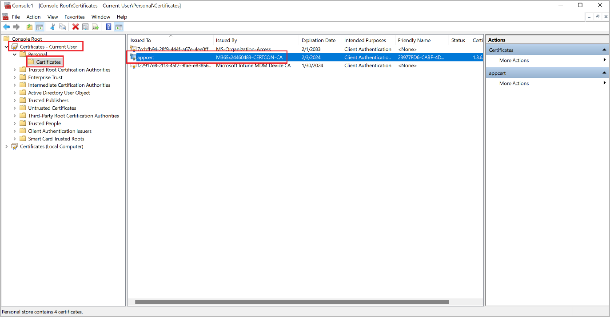

# Mass deploy the Warehouse Management mobile app with service-based authentication

[!include [banner](../includes/banner.md)]
[!INCLUDE [azure-ad-to-microsoft-entra-id](../../includes/azure-ad-to-microsoft-entra-id.md)]

> [!IMPORTANT]
> Service-based authentication methods (such as certificates and client secrets) are now deprecated. We strongly recommend that you authenticate using [user-based authentication](warehouse-app-authenticate-user-based.md). For details about how to mass deploy the Warehouse Management mobile app for user-based authentication, see [Mass deploy the mobile app for user-based authentication](warehouse-app-intune-user-based.md).

## Prerequisites

To use an MDM solution to deploy the Warehouse Management mobile app and the related authentication certificates, you must have the following resources available:

- Follow the [guide to mass deploy the Warehouse Management mobile app and manage connection configurations](warehouse-app-intune.md)
- [Certificate Connector for Microsoft Intune](/mem/intune/protect/certificate-connector-overview) installed on a dedicated Windows PC
- [PowerShell](https://github.com/microsoft/Intune-Resource-Access/tree/develop/src/PFXImportPowershell)
- [Visual Studio 2022](https://visualstudio.microsoft.com/vs/)

You must also have the following resources, which you'll set up by following the instructions in this article:

- [PFX certificate](#create-a-self-signed-pfx-certificate) for certificate-based authentication (CBA)
- [Connection settings JavaScript Object Notation (JSON) file](#create-a-connection-json-file) for the Warehouse Management app
- [PFXImport tool](#download-and-build-the-pfximport-project) for the Microsoft Endpoint Manager admin center

## Set up certificate-based authentication

CBA is widely used for secure and efficient authentication. In mass deployment scenarios, it's advantageous because of the secure access that it provides and the simplicity of deploying certificates to end devices. Therefore, it helps reduce the risk of security breaches, which can be a significant concern in large-scale deployments.

To use the Warehouse Management mobile app, you must have a certificate stored on each device. If you're using Intune to manage your devices, see [Use certificates for authentication in Microsoft Intune](/mem/intune/protect/certificates-configure) for instructions and more information.

The goal is to transfer, to each of your target devices, a personal information exchange (PFX) certificate that has the thumbprint that's specified in the ConnectionsJson file. To achieve this goal, the solution uses an imported public-key cryptography standards (PKCS) certificate configuration profile, which enables the same certificate to be delivered across devices.

### Create and import a certificate

The following subsections guide you through the process of creating the required certificate, setting up the required tools, and importing the certificate into the Certificate Connector for Microsoft Intune.

#### Create a self-signed PFX certificate

Obtain a self-signed PFX certificate (.pfx file) either through the Windows Server Certificate Authority (see [Install the Certification Authority](/windows-server/networking/core-network-guide/cncg/server-certs/install-the-certification-authority)) or by using PowerShell (see [New-SelfSignedCertificate](/powershell/module/pki/new-selfsignedcertificate)). Regardless of the source, when you export the certificate, be sure to include the private key and protect it through a password.

#### Create an app registration for PFXImport PowerShell in Microsoft Entra ID

Follow these steps to create an app registration for PFXImport PowerShell in Microsoft Entra ID.

1. Sign in to Azure.
1. From the **Home** page, go to **Manage Microsoft Entra ID**.
1. In the navigation pane, select **App registrations**.
1. On the toolbar, select **New registration**.
1. On the **Register an application** page, set the following fields:
    - **Name** – Enter a name.
    - **Supported account types** – Specify who can use the new application.
    - **Redirect URI** – Leave this field blank for now.
1. Select **Register**.
1. The new app registration is opened. On the **Certificates & secrets** tab, on the **Client secrets** tab, select **New client secret**.
1. In the **Add a client secret** dialog box, select an expiration date that meets your needs, and then select **Add**.
1. The **Certificates & secrets** tab now shows details about the new client secret. These details will be shown only once and will be hidden when the is page reloaded. Therefore, you must copy them now. Copy the **Value** value, and paste it into a text file. You'll need this value later, when you [set up your Certificate Connector machine](#set-up-a-dedicated-machine-for-the-certificate-connector).
1. On the **Authentication** tab, select **Add a platform**.
1. In the **Configure platforms** dialog box, select the **Mobile and desktop applications** tile.
1. In the **Configure Desktop + devices** dialog box, select the checkbox for each redirect URL that you want to use. (You can probably select all of them.) Then select **Configure**.
1. On the **Overview** tab, copy the **Application (client) ID** and **Directory (tenant) ID** values, and paste them into the text file where you previously pasted the client secret value. You'll need all three of these values later, when you [set up your Certificate Connector machine](#set-up-a-dedicated-machine-for-the-certificate-connector).

#### Download and build the PFXImport project

The PFXImport project consists of PowerShell cmdlets that will help you import PFX certificates into Intune. You can modify and adapt these cmdlets to fit your workflow. For more information, see [S/MIME overview to sign and encrypt email in Intune](/mem/intune/protect/certificates-s-mime-encryption-sign).

Follow these steps to download and build the PFXImport project.

1. Go to the [PFXImport PowerShell Project on GitHub](https://github.com/microsoft/Intune-Resource-Access/tree/develop/src/PFXImportPowershell), and download the project.
1. Open Visual Studio 2022, and open the *PFXImportPS.sln* file that you downloaded from GitHub. Switch to *Release* mode, and build (or rebuild) the project. For more information, see [Configure and use imported PKCS certificates with Intune](/mem/intune/protect/certificates-imported-pfx-configure).

    

#### Set up a dedicated machine for the Certificate Connector

Follow these steps to set up your dedicated Certificate Connector machine.

1. Sign in to the machine that you've designated to run the Certificate Connector for Microsoft Intune.
1. Copy the self-signed PFX certificate that you created in the [Create a self-signed PFX certificate](#create-a-self-signed-pfx-certificate) section to the Certificate Connector machine.
1. Copy the PFXImport project binaries that you built in the [Download and build the PFXImport project](#download-and-build-the-pfximport-project) section to the Certificate Connector machine, and save them in the following folder:

    *~\\Intune-Resource-Access-develop\\src\\PFXImportPowershell\\PFXImportPS\\bin\\Release*

1. In the *Release* folder, open the *IntunePfxImport.psd1* file, and edit the values of the following variables:

    - **ClientId** – Set the value to the client ID from the Azure app registration.
    - **ClientSecret** – Set the value to the client secret from the Azure app registration.
    - **TenantId** – Set the value to the tenant ID from the Azure app registration. This variable is required if you use a client secret.

    

1. Sign in to the Microsoft Endpoint Manager admin center.
1. Go to **Tenant administration \> Connectors and tokens**.
1. On the **Certificate connectors** tab, on the toolbar, select **Add**.
1. In the **Install the certificate connector** dialog box, select the certificate connector link to download the *IntuneCertificateConnector.exe* file. This file is an installer for the Certificate Connector.
1. Transfer the *IntuneCertificateConnector.exe* file to the designated Certificate Connector machine. Then run the file, and follow the on-screen instructions. During the installation process, be sure to select the **PKCS imported certificates** checkbox.
1. Sign in to your Microsoft Entra ID account as an admin user. If the Certificate Connector was successfully installed, there will be a green check mark on the **Endpoint Manager** page. For more information, see [Install the Certificate Connector for Microsoft Intune](/mem/intune/protect/certificate-connector-install).

#### Import your PFX certificate into the Certificate Connector

Follow these steps to import your PFX certificate on the Certificate Connector machine, so that the certificates can be distributed to users.

1. Sign in to the machine that you've designated to run the Certificate Connector for Microsoft Intune.
1. Run PowerShell Terminal as an administrator.
1. In the terminal, navigate to the *PFXImportPowershell* release folder, which should be at the following path:

    *~\\Intune-Resource-Access-develop\\src\\PFXImportPowershell\\PFXImportPS\\bin\\Release*

1. Run the following commands, in this order.

    1. `Import-Module .\\IntunePfxImport.psd1`
    1. `Set-IntuneAuthenticationToken -AdminUserName "<AdminUserName>"`
    1. `Add-IntuneKspKey -ProviderName "Microsoft Software Key Storage Provider" -KeyName "PFXEncryptionKey"`
    1. `$SecureFilePassword = ConvertTo-SecureString -String "<PFXCertificatePassword>" -AsPlainText -Force`
    1. `$UserPFXObject = New-IntuneUserPfxCertificate -PathToPfxFile "<PFXCertificatePathAndFile>" $SecureFilePassword "<EndUserName>" "Microsoft Software Key Storage Provider" "PFXEncryptionKey" "smimeEncryption"`
    1. `Import-IntuneUserPfxCertificate -CertificateList $UserPFXObject`

    Here is an explanation of the placeholders in the commands:

    - *&lt;AdminUserName&gt;* – The user name of the administrator user (typically, an email address).
    - *&lt;PFXCertificatePassword&gt;* – The password of the PFX file.
    - *&lt;PFXCertificatePathAndFile&gt;* – The full folder path (including the drive letter) and file name of the PFX file.
    - *&lt;EndUserName&gt;* – The user name of the user that the system will deliver the certificate to (typically, an email address).

    To deliver the certificate to more users, repeat the fifth and sixth commands for each additional user, and include the user's sign-in information.

1. Run the following command to validate the result.

    `Get-IntuneUserPfxCertificate -UserList "<EndUserName>"`

For more information, go to the [PFXImport PowerShell Project on GitHub](https://github.com/microsoft/Intune-Resource-Access/tree/develop/src/PFXImportPowershell).

To troubleshoot this setup, follow these steps to use the Windows Event Viewer to review the CertificateConnectors logs.

1. Open the Windows **Start** menu, enter *Event Viewer* in the search form, and select the **Event Viewer** app in the result list.
1. Select the following item in the Event Viewer navigation panel: **Applications and Services Logs \> Microsoft \> Intune \> CertificateConnectors \> Operational**.
1. Review the events shown. Select an event to see more information about it.

### Create configuration profiles to push certificates to end devices

Configuration profiles enable Microsoft Endpoint Manager to push certificates and other settings to devices in your organization. (For more information, see [Create a device profile in Microsoft Intune](/mem/intune/configuration/device-profile-create).)

> [!IMPORTANT]
> Unfortunately, the Warehouse Management mobile app for iOS can't currently accept certificates that are delivered through Intune. Therefore, you must manually transfer certificates to iOS devices (for example, through [iCloud](https://www.icloud.com/iclouddrive/)) and then [import them by using the Warehouse Management app](/dynamics365/supply-chain/warehousing/install-configure-warehouse-management-app#import-the-connection-settings). If you support only iOS devices, you can skip the following procedure.

Follow these steps to create a configuration profile for each mobile platform that you'll support. (The process is nearly the same across all platforms.)

1. Sign in to the Microsoft Endpoint Manager admin center.
1. In the navigation, select **Devices**, and then select the platform to set up (**Windows**, **iOS/iPadOS**, or **Android**).
1. On the **Configuration profiles** tab, on the toolbar, select **Create profile**.
1. In the **Create a profile** dialog box, the required settings depend on the platform that you selected.
    - **Windows** – Set the **Platform** field to *Windows 10 and later*, set the **Profile type** field to *Templates*, and then select the template that's named *PKCS imported certificate*.
    - **iOS/iPadOS** – Set the **Profile type** field to *Templates*, and then select the template that's named *PKCS imported certificate*.
    - **Android** – Set the **Platform** field to *Android Enterprise*, and set the **Profile type** field to *PKCS imported certificate*.
1. Select **Create** to create the profile and close the dialog box.
1. On the **PKCS import certificate** page, on the **Basics** tab, enter a name and description for the certificate.
1. Select **Next** to continue.
1. On the **Configuration settings** tab, set the following fields:
    - **Intended purpose** – Select *S/MIME Encryption*.
    - **Key storage provider (KSP)** – If you're creating a profile for the Windows platform, select *Enroll to Software KSP*. This setting isn't available for other platforms.
1. Select **Next** to continue.
1. On the **Assignments** tab, select the user groups and/or devices that the current profile should apply to.
1. When you've finished, select **Next** to continue.
1. On the **Review + save** tab, review your settings. If they look correct, select **Create** to create the certificate.

### Verify that certificates have been distributed

After your certificate system is fully configured, and you've created the required configuration profiles, you can review how your profiles are performing and verify that the certificates are being distributed as expected. Follow these steps to monitor the performance of your configuration profiles in the Microsoft Endpoint Manager admin center.

1. Sign in to the Microsoft Endpoint Manager admin center.
1. Go to **Devices \> Configuration profiles**.
1. On the **Configuration profiles** page, select the profile to verify.
1. Details for your selected profile are opened. From here, you can get an overview of how many devices have already received certificates, whether any errors have occurred, and other details.

Another way to verify that your certificates are being correctly distributed is to inspect the end devices. You can check the certificates by following one of these steps, depending on the type of device:

- **For Android devices:** You can install an app such as *My certificates* to view installed certificates. To access certificates that are distributed from Intune, the *My certificates* app itself must also be installed by Intune and must use the same work profile.
- **For Windows devices:** Open the Windows **Start** menu, enter *Manage user certificates* in the search form and select **Manage user certificates** in the result list to open the certificate manager. In the certificate manager, expand **Certificates - Current User \> Personal \> Certificates** in the navigation pane to view your certificates and confirm whether the expected certificate has arrived.

## Additional resources

- [Mass deploy the Warehouse Management mobile app and manage connection configurations](warehouse-app-intune.md)
- [Mass deploy the Warehouse Management mobile app with user-based authentications](warehouse-app-intune-user-based.md)
- [User-based authentication for the Warehouse Management mobile app](warehouse-app-authenticate-user-based.md)
- [Service-based authentication for the Warehouse Management mobile app](warehouse-app-authenticate-service-based.md)

[!INCLUDE[footer-include](../../includes/footer-banner.md)]