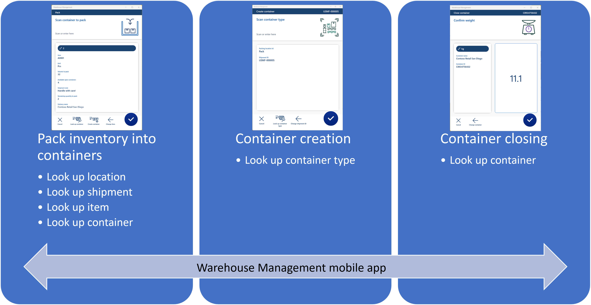

# Example scenario – Pack containers with the Warehouse Management mobile app

[!include [banner](../includes/banner.md)]

This article provides an example scenario that shows how to set up a Warehouse Management mobile app packing flow, and how to use the flow in the Warehouse Management mobile app to process a simple outbound sales order by packing a container and closing it. The scenario takes advantage of the [detour](warehouse-app-detours.md) and [data inquiry](warehouse-app-data-inquiry.md) capabilities of the mobile app. For more information about the feature that enables this functionality, see [Pack containers using the Warehouse Management mobile app](warehouse-app-packing-containers.md).

The following illustration shows the packing functionality that this scenario adds to the mobile app.

You can establish a packing flow by creating mobile device menu items and detour handling. The example scenario that's provided in this article explains the menu items that aren't enclosed in parentheses in the following table.

| Pack inventory into containers | Container creation | Container closing | (Print container label) | (Container deletion) |
|---|---|---|---|---|
| Look up location | Look up container type | Look up container | (Look up container) | (Look up container) |
| Look up shipment | | | | |
| Look up item | | | | |
| Look up container | | | | |

## Prerequisites

### Turn on the Pack containers using the Warehouse Management mobile app feature and its prerequisites

Before you can pack containers by using the Warehouse Management mobile app, you must complete the following procedure to turn on the required features.

1. Go to **System administration \> Workspaces \> Feature management**, and turn on the following features in the order that they're listed in here. (All four features are listed as part of the *Warehouse management* module.) For more information about how to use the **Feature management** workspace, see [Feature management overview](../../fin-ops-core/fin-ops/get-started/feature-management/feature-management-overview.md).

    1. *Multi-level detours for the Warehouse Management mobile app* (For more information about this feature, see [Multi-level detours for the Warehouse Management mobile app](warehouse-app-detours.md).)
    1. *Auto-submit detour steps for the Warehouse Management mobile app* (For more information about this feature, see [Auto-submit detour steps for the Warehouse Management mobile app](warehouse-app-detours.md).)
    1. *Warehouse management app data inquiry flow* (For more information about this feature, see [Query data using Warehouse Management mobile app detours](warehouse-app-data-inquiry.md).)
    1. *Pack containers using the Warehouse Management mobile app* (This feature is the one that is described in this article.)

1. Go to **Warehouse management \> Setup \> Mobile device \> Warehouse app field names**, and then, on the Action Pane, select **Create default setup** to update the field names in the Warehouse Management mobile app. Repeat this step for each legal entity (company) where you use the Warehouse Management mobile app. For more information, see [Configure fields for the Warehouse Management mobile app](configure-app-field-names-priorities-warehouse.md).
1. Go to **Warehouse management \> Setup \> Mobile device \> Mobile device steps**, and then, on the Action Pane, select **Create default setup**. Repeat this step for each legal entity (company) where you use the Warehouse Management mobile app.

### Use the Warehouse Management mobile app version 2.0.37.0 or later

To see the newest icons and user experience (UX) enhancements that are related to the mobile app packing process, you must use Warehouse Management mobile app version 2.0.37.0 or later.

### Make sample data available

To work through this scenario by using the sample records and values that are specified here, you must be on a system where the standard [demo data](../../fin-ops-core/fin-ops/get-started/demo-data.md) is installed. Additionally, you must select the *USMF* legal entity before you begin. You can also use this scenario as guidance for using the feature on a production system. However, in that case, you must substitute your own values for each setting that is described here.

The example scenario uses the demo data that is associated with the worker/person *Julia Funderburk*.

## Set up a worker to pack containers

For each worker that will use the Warehouse Management mobile app to pack containers, you must set up a container packing policy and a packing profile ID as described in the following procedure.

1. Go to **Warehouse management \> Setup \> Worker**.
1. On the Action Pane, select **Edit**.
1. In the list pane, select *Julia Funderburk*.
1. On the **Profile** FastTab, set the following values:

    - **Container packing policy:** Select *WH62Close*. This policy will move containers to the *Baydoor* location when they're closed.
    - **Packing profile ID:** Select *WH62*. This profile won't create warehouse work after a container is closed. It also won't post a sales packing slip when the last container for a shipment is closed. For more information about how to set up this process, see [Set up container packing policies](packing-containers.md#packing-policy).

1. On the **Default packing station** FastTab, set the following values:

    - **Site:** Select *6*. This site is the site for the warehouse that will be used in this scenario.
    - **Warehouse:** Select *62*. This warehouse is already enabled for the packing process in the demo data.
    - **Location:** Select *Pack*. The Warehouse Management mobile app will always prompt workers to confirm this value. Workers can edit it as required. If you don't provide a default packing location, workers will always have to scan or look up the packing location. You can enable that functionality by using the [data inquiry](warehouse-app-data-inquiry.md) capability.

1. On the Action Pane, select **Save**.

> [!NOTE]
> You can set up the system to automatically print container labels when a new container record is created. For more information, see [Container label layouts and printing](print-container-labels.md).

## Create a mobile device menu item for packing inventory into containers

Follow these steps to create a mobile device menu item that workers can use to pack inventory into containers.

1. Go to **Warehouse management \> Setup \> Mobile device \> Mobile device menu items**.
1. On the Action Pane, select **New** to add a mobile device menu item.
1. Set the following values for the new menu item:

    - **Menu item name** – Enter *Packing*. This value will be used as the internal name for the menu item.
    - **Title** – Enter *Packing*. This value will be used as the display name of the menu item in the mobile app.
    - **Mode** – Select *Indirect*.
    - **Activity code** – Select *Pack inventory into containers*.
    - **Packing policy ID** – Leave this field blank. The default process will be used.

1. On the Action Pane, select **Save**.

> [!TIP]
> You can control several other aspects of the packing process by creating a packing policy and using the **Packing policy ID** field to assign it to your menu device menu item. For more information, see [Mobile device container packing policies](warehouse-app-pack-containers-policies.md).

## Create a mobile device menu item for creating containers

Follow these steps to create a mobile device menu item that workers can use to create containers.

1. Go to **Warehouse management \> Setup \> Mobile device \> Mobile device menu items**.
1. On the Action Pane, select **New** to add a mobile device menu item.
1. Set the following values for the new menu item:

    - **Menu item name:** Enter *Create container*.
    - **Title:** Enter *Create container*.
    - **Mode:** Select *Indirect*.
    - **Activity code:** Select *Container creation*.

1. On the Action Pane, select **Save**.

## Create a mobile device menu item for closing containers

Follow these steps to create a mobile device menu item that workers can use to close containers.

1. Go to **Warehouse management \> Setup \> Mobile device \> Mobile device menu items**.
1. On the Action Pane, select **New** to add a mobile device menu item.
1. Set the following values for the new menu item:

    - **Menu item name:** Enter *Close container*.
    - **Title:** Enter *Close container*.
    - **Mode:** Select *Indirect*.
    - **Activity code:** Select *Container closing*.

1. On the Action Pane, select **Save**.

## Add the three new mobile device menu items to the menu

Now that you've created the required mobile device menu items, you must add them to the mobile device menu, so that they're available to workers.

1. Go to **Warehouse management \> Setup \> Mobile device \> Mobile device menu**.
1. On the Action Pane, select **Edit**.
1. In the list pane, select *Outbound*.
1. In the **Available menus and menu items** column, select the new *Packing* mobile device menu item, and then select the **Add** button (right arrow) to move it into the **Menu structure** column.
1. Repeat the previous step for the other two new menu items: *Create container* and *Close container*.
1. On the Action Pane, select **Save**.

## Add a detour for creating a container

The setup that you've completed so far now enables workers to use the mobile app to pack items into containers. However, because workers must be able to access the *Create container* and *Close container* processes directly from the menu, you can streamline the process further. You'll now add a [detour](warehouse-app-detours.md) so that workers can create containers from within the packing flow.

Follow these steps to enable new containers to be created on the packing flow page that prompts workers to scan the container that they want to pack.

1. Go to **Warehouse management \> Setup > Mobile device \> Mobile device steps**.
1. In the **Filter** field, enter *ContainerIdToPack* to open a drop-down list that shows possible searches. Select *Step ID: "ContainerIdToPack"* in the list.
1. In the grid, select the record that is found. Then, on the Action Pane, select **Add step configuration**.
1. In the drop-down dialog box that appears, set the **Menu item** field to *Packing*, and then select **OK**.
1. The details page for the new step configuration appears. (The name of the page is **Packing : ContainerIdToPack**.) On the **Available detours (menu items)** FastTab, select **Add** on the toolbar.
1. In the **Add detour** dialog box, in the **Available detours** list, find and select *Create container* (one of the menu items that you created for this scenario).
1. Select **OK** to close the dialog box and add the selected menu item to the list of available detours.
1. Select the new detour, and then select **Select fields to send** on the FastTab toolbar.
1. In the **Select fields to send** dialog box, in the **Send from packing** section, set the following values for the blank row that has been added:

    - **Copy from Packing:** *Location*
    - **Paste in Create container:** *Location*
    - **Auto submit:** *Selected* (Use this setting so that the worker doesn't have to confirm the value.)

1. Select **Add** on the toolbar to add another row. Then set the following values for it:

    - **Copy from Packing:** *Shipment*
    - **Paste in Create container:** *Shipment*
    - **Auto submit:** *Selected*

1. In the **Bring back from create container** section, set the following values for the blank row that has been added:

    - **Copy from Create container:** *Container ID*
    - **Paste in Packing:** *Container ID*
    - **Auto submit:** *Cleared* (Use this setting so that the worker can confirm the value.)

1. Select **Add** on the toolbar to add another row. Then set the following values for it:

    - **Copy from Create container:** *Refresh* (This setting automatically updates the page after a return from the detour.)
    - **Paste in Packing:** *Refresh* (This setting triggers the update logic.)
    - **Auto submit:** *Selected* (This setting automatically updates the page so that, for example, the **Available open containers** field is updated.)

1. Select **OK** to close the dialog box.
1. Close the page.

> [!NOTE]
> Only Warehouse Management mobile app pages that contain the **Refresh** option can be used to trigger an automatic page refresh as part of a detour process. Therefore, you must include a row where both the **Copy from Create container** field and the **Paste in Packing** field are set to *Refresh*, and the **Auto submit** option is selected.

## Add a detour for closing a container

You'll now add another [detour](warehouse-app-detours.md) so that workers can close a container from within the packing flow. 

Follow these steps to enable containers to be closed on the packing flow page that prompts workers to scan an item.

1. Go to **Warehouse management \> Setup > Mobile device \> Mobile device steps**.
1. In the **Filter** field, enter *ItemId* to open a drop-down list that shows possible searches. Select *Step ID: "ItemId"* in the list.
1. In the grid, select the record that is found. Then, on the Action Pane, select **Add step configuration**.
1. In the drop-down dialog box that appears, set the **Menu item** field to *Packing*, and then select **OK**.
1. The details page for the new step configuration appears. (The name of the page is **Packing : ItemId**.) On the **Available detours (menu items)** FastTab, select **Add** on the toolbar.
1. In the **Add detour** dialog box, in the **Available detours** list, find and select *Close container* (one of the menu items that you created for this scenario).
1. Select **OK** to close the dialog box and add the selected menu item to the list of available detours.
1. Select the new detour, and then select **Select fields to send** on the FastTab toolbar.
1. In the **Select fields to send** dialog box, in the **Send from packing** section, set the following values for the blank row that has been added:

    - **Copy from Packing:** *Location*
    - **Paste in Close container:** *Location*
    - **Auto submit:** *Cleared* (Use this setting so that the worker will have an opportunity to inspect the location and choose whether to look up a container ID.)

1. Select **Add** on the toolbar to add another row. Then set the following values for it:

    - **Copy from Packing:** *Shipment*
    - **Paste in Close container:** *Shipment*
    - **Auto submit:** *Cleared* (Use this setting so that the worker will have an opportunity to inspect the shipment and choose whether to look up a container ID.)

1. In the **Bring back from create container** section, don't add anything, because you don't want to pass any values back from this detour.
1. Select **OK** to close the dialog box.
1. Close the page.

## Create the five lookup menu items

The setup that you've completed so far enables workers to use the mobile app to pack inventory into containers. However, you can still add more lookup logic by using the [data inquiry](warehouse-app-data-inquiry.md) capability as part of the process. You'll now add the following lookup mobile device menu items:

- **Look up location** – This menu item is used to inquire about packing locations that inventory should be packed from.
- **Look up shipment** – This menu item is used to inquire about shipments that must be packed.
- **Look up item** – This menu item is used to inquire about item numbers that must be packed.
- **Look up container type** – This menu item is used to inquire about container types for the container creation process.
- **Look up container** – This menu item is used to inquire about containers that must be closed.

The following subsections explain how to set up these menu items.

### Create a mobile device menu item to look up a location

Many different lookup capabilities enable lookups for packing locations. This section provides an example that shows how to set up a simple lookup to find locations that are related to a specific location profile. This lookup will be used to filter locations that are used for packing operations.

1. Go to **Warehouse management \> Setup \> Mobile device \> Mobile device menu items**.
1. On the Action Pane, select **New** to add a mobile device menu item.
1. Set the following values for the new menu item:

    - **Menu item name:** *Look up location*
    - **Title:** *Look up location*
    - **Mode:** *Indirect*

1. On the **General** FastTab, set the following values:

    - **Activity code:** *Data inquiry*
    - **Use process guide:** *Yes* (This value is automatically selected.)
    - **Table name:** *WMSLocation* (You want to look up warehouse locations based on, for example, a location profile ID.)

1. On the Action Pane, select **Edit query** to define a query that is based on the selected base table. In this case, you'll use the locations table. You can join to related tables as required.
1. In the query editor dialog box, on the **Range** tab, add the following lines to the grid.

    | Table | Derived table | Field | Criteria |
    |---|---|---|---|
    | Locations | Locations | Warehouse | |
    | Locations | Locations | Location profile ID | PACK |

    In this query, the **Warehouse** field will automatically be assigned based on the worker's current warehouse.

1. If you want to specify how the list should be sorted, you can set up the sorting on the **Sorting** tab.
1. Select **OK**.
1. In addition to defining the query, you must select which fields will be shown on the cards on the inquiry list page. Therefore, on the Action Pane, select **Field list**.
1. On the **Field list** page, set the following values:

    - **Display field 1:** *wMSLocationId* (This field value will be used as the header for each card.)
    - **Display field 2:** *inventLocationId*
    - **Display field 3:** *LocProfileId*
    - **Display field 4:** *whsDisplayQty()*
    - **Display field 5:** *whsDisplayItemId()*

1. On the Action Pane, select **Save**. Then close the page.

### Create a mobile device menu item to look up a shipment

Many different lookup capabilities enable lookups for shipments. This section provides an example that shows how to set up a simple lookup to find active shipments.

1. Go to **Warehouse management \> Setup \> Mobile device \> Mobile device menu items**.
1. On the Action Pane, select **New** to add a mobile device menu item.
1. Set the following values for the new menu item:

    - **Menu item name:** *Look up shipment*
    - **Title:** *Look up shipment*
    - **Mode:** *Indirect*

1. On the **General** FastTab, set the following values:

    - **Activity code:** *Data inquiry*
    - **Use process guide:** *Yes* (This value is automatically selected.)
    - **Table name:** *WHSShipmentTable*

1. On the Action Pane, select **Edit query** to define a query that is based on the selected base table. In this case, you'll use the locations table. You can join to related tables as required.
1. In the query editor, on the **Range** tab, add the following lines to the grid.

    | Table | Derived table | Field | Criteria |
    |---|---|---|---|
    | Shipments | Shipments | Warehouse | |
    | Shipments | Shipments | Shipment status | Open, Waved, "In process" |

    In this query, the **Warehouse** field will automatically be assigned based on the worker's current warehouse.

1. If you want to specify how the list should be sorted, you can set up the sorting on the **Sorting** tab.
1. Select **OK**.
1. In addition to defining the query, you must select which fields will be shown on the cards on the inquiry list page. Therefore, on the Action Pane, select **Field list**.
1. On the **Field list** page, set the following values:

    - **Display field 1:** *ShipmentId* (This field value will be used as the header for each card.)
    - **Display field 2:** *ShipmentStatus*
    - **Display field 3:** *displayDeliveryName()*
    - **Display field 4:** *displayNumberOfContainers()*
    - **Display field 5:** *displayNumberOfLoadLines()*
    - **Display field 6:** *displayTotalVolume()*
    - **Display field 7:** *displayTotalWeight()*
    - **Display field 8:** *displayShipmentDateTime()*

1. On the Action Pane, select **Save**. Then close the page.

### Create a mobile device menu item to look up an item

Many different lookup capabilities enable lookups for item information. This section provides an example that shows how to look up item information based on load lines. However, you can filter based on a wildcard search instead. You can also use the [packing work](packing-work.md) feature to look up or join to closed put work lines for work that brings inventory to a packing area.

In this example, a simple lookup will be filtered based on the shipment ID that was previously captured as part of the packing process.

1. Go to **Warehouse management \> Setup \> Mobile device \> Mobile device menu items**.
1. On the Action Pane, select **New** to add a mobile device menu item.
1. Set the following values for the new menu item:

    - **Menu item name:** *Look up item*
    - **Title:** *Look up item*
    - **Mode:** *Indirect*

1. On the **General** FastTab, set the following values:

    - **Activity code:** *Data inquiry*
    - **Use process guide:** *Yes* (This value is automatically selected.)
    - **Table name:** *WHSLoadLine*

1. On the Action Pane, select **Edit query** to define a query that is based on the selected base table. In this case, you'll use the locations table. You can join to related tables as required.
1. In the query editor, on the **Range** tab, make sure that only the following line appears in the grid.

    | Table | Derived table | Field | Criteria |
    |---|---|---|---|
    | Load details | Load details | Shipment ID | |

1. Select **OK**.
1. In addition to defining the query, you must select which fields will be shown on the cards on the inquiry list page. Therefore, on the Action Pane, select **Field list**.
1. On the **Field list** page, set the following values:

    - **Display field 1:** *ItemId* (This field value will be used as the header for each card.)
    - **Display field 2:** *displayItemName()*
    - **Display field 3:** *displayCustName()*
    - **Display field 4:** *displayInventQty()*
    - **Display field 5:** *displayInventUOM()*

1. On the Action Pane, select **Save**. Then close the page.

### Create a mobile device menu item to look up a container type

Many different lookup capabilities enable lookups for container types. This section provides an example that shows how to set up a lookup to find all container types.

1. Go to **Warehouse management \> Setup \> Mobile device \> Mobile device menu items**.
1. On the Action Pane, select **New** to add a mobile device menu item.
1. Set the following values for the new menu item:

    - **Menu item name:** *Look up container type*
    - **Title:** *Look up container type*
    - **Mode:** *Indirect*

1. On the **General** FastTab, set the following values:

    - **Activity code:** *Data inquiry*
    - **Use process guide:** *Yes* (This value is automatically selected.)
    - **Table name:** *WHSContainerType*

1. On the Action Pane, select **Edit query** to define a query that is based on the selected base table. In this case, you'll use the container type table. You can join to related tables as required.
1. In the query editor, on the **Range** tab, add the following line to the grid.

    | Table | Derived table | Field | Criteria |
    |---|---|---|---|
    | Container types | Container types | Container type code | \* |

    The wildcard character (\*) in the **Criteria** field will cause all container types to be shown.

1. If you want to specify how the list should be sorted, you can set up the sorting on the **Sorting** tab. In this example, you might want to sort on the **Maximum volume** field.
1. Select **OK**.
1. In addition to defining the query, you must select which fields will be shown on the cards on the inquiry list page. Therefore, on the Action Pane, select **Field list**.
1. On the **Field list** page, set the following values:

    - **Display field 1:** *ContainerTypeCode* (This field value will be used as the header for each card.)
    - **Display field 2:** *Description*
    - **Display field 3:** *MaxVolume*
    - **Display field 4:** *MaxWeight*
    - **Display field 5:** *Height*
    - **Display field 6:** *Length*
    - **Display field 7:** *Width*
    - **Display field 8:** *FlexibleVolumeDimensions*

1. On the Action Pane, select **Save**. Then close the page.

### Create a mobile device menu item to look up a container

Many different lookup capabilities enable lookups for containers. In this example, a new menu item is configured to find active containers in the current packing location that is related to the shipment that is currently being packed.

1. Go to **Warehouse management \> Setup \> Mobile device \> Mobile device menu items**.
1. On the Action Pane, select **New** to add a mobile device menu item.
1. Set the following values for the new menu item:

    - **Menu item name:** *Look up container*
    - **Title:** *Look up container*
    - **Mode:** *Indirect*

1. On the **General** FastTab, set the following values:

    - **Activity code:** *Data inquiry*
    - **Use process guide:** *Yes* (This value is automatically selected.)
    - **Table name:** *WHSContainerWarehouseLocationView* (By using this view, you enable the lookup to be limited so that it shows only containers for a specific packing location that is related to a specific shipment.)

1. On the Action Pane, select **Edit query** to define a query that is based on the selected base table (in this case, the location table). You can join to related tables as required.
1. In the query editor, on the **Range** tab, add the following lines to the grid.

    | Table | Derived table | Field | Criteria |
    |---|---|---|---|
    | WHSContainerWarehouseLocationView | WHSContainerWarehouseLocationView | Warehouse | |
    | WHSContainerWarehouseLocationView | WHSContainerWarehouseLocationView | Location | |
    | WHSContainerWarehouseLocationView | WHSContainerWarehouseLocationView | Shipment ID | |
    | WHSContainerWarehouseLocationView | WHSContainerWarehouseLocationView | Container status | !Closed |

    In this query, the **Warehouse**, **Location**, and **Shipment ID** fields are automatically set based on the detour setup.

1. If you want to specify how the list should be sorted, you can set up the sorting on the **Sorting** tab.
1. Select **OK**.
1. In addition to defining the query, you must select which fields will be shown on the cards on the inquiry list page. Therefore, on the Action Pane, select **Field list**.
1. On the **Field list** page, set the following values:

    - **Display field 1:** *ContainerId* (This field value will be used as the header for each card.)
    - **Display field 2:** *ContainerStatus*
    - **Display field 3:** *Weight*
    - **Display field 4:** *WeightUOM*
    - **Display field 5:** *ContainerNum*
    - **Display field 6:** *ContainerReleased*
    - **Display field 7:** *ContainerTypeCode*

1. On the Action Pane, select **Save**. Then close the page.

## Add the new mobile device menu items to a menu

Your new mobile device menu items are now ready to be added to the mobile device menu. This task must be completed before the menu items can be used as part of a detour process. In this example, you'll create a new submenu and add the new menu items to it.

1. Go to **Warehouse management \> Setup \> Mobile device \> Mobile device menu**.
1. On the Action Pane, select **New**.
1. On the header of the new record, set the following values:

    - **Name:** *Inquire*
    - **Description:** *Inquire*

1. In the **Available menus and menu items** column, select the new *Look up container* mobile device menu item, and then select the **Add** button (right arrow) to move it into the **Menu structure** column.
1. Repeat the previous step for the other four new lookup menu items: *Look up container type*, *Look up item*, *Look up location*, and *Look up shipment*.
1. On the Action Pane, select **Save**.
1. In the list pane on the left, select the *Main* menu.
1. In the **Available menus and menu items** list, in the **Menus** section, select your new *Inquire* menu. Then select the **Add** button (right arrow) to move that item into the **Menu structure** list.

## Configure detours in your mobile device steps

To complete the setup, you must now use the detour configuration on the **Mobile device steps** page to add the five new mobile device menu items to existing menu item flows.

In this example, you'll complete these tasks:

- Add *Look up location* to the *Packing - Scan packing location* step.
- Add *Look up shipment* to the *Packing - Scan shipment* step.
- Add *Look up item* to the *Packing - Scan item* step.
- Add *Look up container* to the *Packing - Scan container to pack* step.
- Add *Look up container type* to the *Create container - Scan container type* step.
- Add *Look up container* to the *Close container - Scan container* step.

### Add the Look up location menu item as a detour for packing

Follow these steps to add the **Look up location** menu item as a detour.

1. Go to **Warehouse management \> Setup > Mobile device \> Mobile device steps**.
1. In the **Filter** field, enter *PackingLocationId* to open a drop-down list that shows possible searches. Then select *Step ID: "PackingLocationId"* in the list.
1. In the grid, select the record that is found. Then, on the Action Pane, select **Add step configuration**.
1. In the drop-down dialog box that appears, set the **Menu item** field to *Packing*, and then select **OK**.
1. The details page for the new step configuration appears. (The name of the page is **Packing : PackingLocationId**.) On the **Available detours (menu items)** FastTab, select **Add** on the toolbar.
1. In the **Add detour** dialog box, in the **Available detours** list, find and select *Look up location* (one of the lookup menu items that you created for this scenario).
1. Select **OK** to close the dialog box and add the selected menu item to the list of available detours.
1. Select the new detour, and then select **Select fields to send** on the FastTab toolbar.
1. In the **Select fields to send** dialog box, in the **Send from packing** section, don't add anything, because you don't want to pass any values to this detour menu item.
1. In the **Bring back from create container** section, set the following values for the blank row that has been added:

    - **Copy from Look up location:** *Location*
    - **Paste in Packing:** *Location*
    - **Auto submit:** *Cleared* (Use this setting so that the worker can confirm the value.)

1. Select **OK** to close the dialog box.
1. Close the page.

### Add the Look up shipment menu item as a detour for packing

Follow these steps to add the **Look up shipment** menu item as a detour.

1. Go to **Warehouse management \> Setup > Mobile device \> Mobile device steps**.
1. In the **Filter** field, enter *ShipmentId* to open a drop-down list that shows possible searches. Then select *Step ID: "ShipmentId"* in the list.
1. In the grid, select the record that is found. Then, on the Action Pane, select **Add step configuration**.
1. In the drop-down dialog box that appears, set the **Menu item** field to *Packing*, and then select **OK**.
1. The details page for the new step configuration appears. (The name of the page is **Packing : ShipmentId**.) On the **Available detours (menu items)** FastTab, select **Add** on the toolbar.
1. In the **Add detour** dialog box, in the **Available detours** list, find and select *Look up shipment* (one of the lookup menu items that you created for this scenario).
1. Select **OK** to close the dialog box and add the selected menu item to the list of available detours.
1. Select the new detour, and then select **Select fields to send** on the FastTab toolbar.
1. In the **Select fields to send** dialog box, in the **Send from packing** section, don't add anything, because don't want to pass any values to this detour menu item.
1. In the **Bring back from create container** section, set the following values for the blank row that has been added:

    - **Copy from Look up location:** *Shipment ID*
    - **Paste in Packing:** *Shipment*
    - **Auto submit:** *Cleared* (Use this setting so that the worker can confirm the value.)

1. Select **OK** to close the dialog box.
1. Close the page.

### Add the Look up item menu item as a detour for packing

Follow these steps to add the **Look up item** menu item as a detour.

1. Go to **Warehouse management \> Setup > Mobile device \> Mobile device steps**.
1. In the **Filter** field, enter *ItemId* to open a drop-down list that shows possible searches. Then select *Step ID: "ItemId"* in the list.
1. In the grid, find the record that has a value of *Packing* in the **Menu item name** column, and select the link in the **Menu item name** column. This record is present because you already added a detour for this step of the packing process. You'll now add another detour for it.
1. The details page for the new step configuration appears. (The name of the page is **Packing : ItemId**.) On the **Available detours (menu items)** FastTab, select **Add** on the toolbar.
1. In the **Add detour** dialog box, in the **Available detours** list, find and select *Look up item* (one of the lookup menu items that you created for this scenario).
1. Select **OK** to close the dialog box and add the selected menu item to the list of available detours.
1. Select the new detour, and then select **Select fields to send** on the FastTab toolbar.
1. In the **Select fields to send** dialog box, in the **Send from packing** section, set the following values for the blank row that has been added:

    - **Copy from Packing:** *Shipment*
    - **Paste in Look up item:** *Shipment ID*
    - **Auto submit:** *Selected* (Use this setting so that the worker doesn't have to confirm the value.)

1. In the **Bring back from look up item** section, set the following values for the blank row that has been added:

    - **Copy from Look up item:** *Item number*
    - **Paste in Packing:** *Item*
    - **Auto submit:** *Cleared* (Use this setting so that the worker can confirm the value.)

1. Select **OK** to close the dialog box.
1. Close the page.

### Add the Look up container menu item as a detour for packing

Follow these steps to add the **Look up container** menu item as a detour.

1. Go to **Warehouse management \> Setup > Mobile device \> Mobile device steps**.
1. In the **Filter** field, enter *ContainerIdToPack* to open a drop-down list that shows possible searches. Then select *Step ID: "ContainerIdToPack"* in the list.
1. In the grid, find the record that has a value of *Packing* in the **Menu item name** column, and select the link in the **Menu item name** column. This record is present because you already added a detour for this step of the packing process. You'll now add another detour for it.
1. The details page for the new step configuration appears. (The name of the page is **Packing : ContainerIdToPack**.) On the **Available detours (menu items)** FastTab, select **Add** on the toolbar.
1. In the **Add detour** dialog box, in the **Available detours** list, find and select *Look up container* (one of the lookup menu items that you created for this scenario).
1. Select **OK** to close the dialog box and add the selected menu item to the list of available detours.
1. Select the new detour, and then select **Select fields to send** on the FastTab toolbar.
1. In the **Select fields to send** dialog box, in the **Send from packing** section, set the following values for the blank row that has been added:

    - **Copy from Packing:** *Location*
    - **Paste in Look up container:** *Location*
    - **Auto submit:** *Selected* (Use this setting so that the worker doesn't have to confirm the value.)

1. Select **Add** on the toolbar to add another row. Then set the following values for it:

    - **Copy from Packing:** *Shipment*
    - **Paste in Look up container:** *Shipment ID*
    - **Auto submit:** *Cleared* (Use this setting so that the worker can confirm the value.)

1. In the **Bring back from look up container** section, set the following values for the blank row that has been added:

    - **Copy from Look up container:** *Container ID*
    - **Paste in Packing:** *Container ID*
    - **Auto submit:** *Cleared* (Use this setting so that the worker can confirm the value.)

1. Select **OK** to close the dialog box.
1. Close the page.

### Add the Look up container type menu item as a detour for creating containers

Follow these steps to add the *Look up container type* menu item as a detour:

1. Go to **Warehouse management \> Setup > Mobile device \> Mobile device steps**.
1. In the **Filter** field, enter *ContainerTypeToCreateContainer* to open a drop-down list that shows possible searches. Then select *Step ID: "ContainerTypeToCreateContainer"* in the list.
1. In the grid, select the record that is found. Then, on the Action Pane, select **Add step configuration**.
1. In the drop-down dialog box that appears, set the **Menu item** field to *Create container*, and then select **OK**.
1. The details page for the new step configuration appears. (The name of the page is **Create container : ContainerTypeToCreateContainer**.) On the **Available detours (menu items)** FastTab, select **Add** on the toolbar.
1. In the **Add detour** dialog box, in the **Available detours** list, find and select *Look up container type* (one of the lookup menu items that you created for this scenario).
1. Select **OK** to close the dialog box and add the selected menu item to the list of available detours.
1. Select the new detour, and then select **Select fields to send** on the FastTab toolbar.
1. In the **Select fields to send** dialog box, in the **Send from packing** section, don't add anything, because you don't want to pass any values to this detour menu item.
1. In the **Bring back from look up container type** section, set the following values for the blank row that has been added:

    - **Copy from Look up location:** *Container type code*
    - **Paste in Packing:** *Container type code*
    - **Auto submit:** *Cleared* (Use this setting so that the worker can confirm the value.)

1. Select **OK** to close the dialog box.
1. Close the page.

### Add the Look up container menu item as a detour for closing containers

Follow these steps to add the *Look up container* menu item as a detour:

1. Go to **Warehouse management \> Setup > Mobile device \> Mobile device steps**.
1. In the **Filter** field, enter *ContainerId* to open a drop-down list that shows possible searches. Then select *Step ID: "ContainerId"* in the list.
1. In the grid, select the record that has a value of *ContainerId* in the **Step ID** column. Then, on the Action Pane, select **Add step configuration**.
1. In the drop-down dialog box that appears, set the **Menu item** field to *Close container*, and then select **OK**.
1. The details page for the new step configuration appears. (The name of the page is **Close container : ContainerId**.) On the **Available detours (menu items)** FastTab, select **Add** on the toolbar.
1. In the **Add detour** dialog box, in the **Available detours** list, find and select *Look up container* (one of the lookup menu items that you created for this scenario).
1. Select **OK** to close the dialog box and add the selected menu item to the list of available detours.
1. Select the new detour, and then select **Select fields to send** on the FastTab toolbar.
1. In the **Select fields to send** dialog box, in the **Send from close container** section, set the following values for the blank row that has been added:

    - **Copy from Packing:** *Location*
    - **Paste in Look up container:** *Location*
    - **Auto submit:** *Selected* (Use this setting so that the worker doesn't have to confirm the value.)

1. Select **Add** on the toolbar to add another row. Then set the following values for it:

    - **Copy from Packing:** *Shipment*
    - **Paste in Look up container:** *Shipment ID*
    - **Auto submit:** *Selected* (Use this setting so that the worker doesn't have to confirm the value.)

1. In the **Bring back from look up container** section, set the following values for the blank row that has been added:

    - **Copy from Look up container:** *Container ID*
    - **Paste in Packing:** *Container ID*
    - **Auto submit:** *Cleared* (Use this setting so that the worker can confirm the value.)

1. Select **OK** to close the dialog box.
1. Close the page.

## Create a sales order and complete the work

Follow these steps to create a sales order and complete the work of moving the ordered items to the packing area.

1. Go to **Sales and marketing \> Sales orders \> All sales orders**.
1. On the Action Pane, select **New**.
1. In the **Create sales order** dialog box, in the **Customer account** field, select *US-005*.
1. Select **OK** to close the dialog box.
1. The new sales order is opened and includes a single, blank line on the **Sales order lines** FastTab. Set the following values for the new order line:

    - **Item number:** *A0001*
    - **Quantity:** *2*
    - **Site:** *6*
    - **Warehouse:** *62*

1. While the order line is still selected on the **Sales order lines** FastTab, select **Inventory \> Reservation** on the toolbar.
1. On the **Reservation** page, on the Action Pane, select **Reserve lot** to reserve the full quantity of the selected line in the warehouse.
1. Close the **Reservation** page to return to the sales order.
1. On the Action Pane, on the **Warehouse** tab, select **Release to warehouse**. A message shows the shipment and wave IDs for the order.
1. While the order line is still selected on the **Sales order lines** FastTab, select **Warehouse** \> **Work details** on the toolbar. If you use batch processing to run your waves, you might have to wait a short time for the work to be created.
1. On the **Work** page, on the Action Pane, on the **Work** tab, select **Complete work**.
1. On the **Work completion** page, set the **User ID** field to *62*.
1. On the Action Pane, select **Validate work**.
1. When you receive a message that indicates that your work is valid, select **Complete work** on the Action Pane to complete the process of picking the inventory items and putting them in the *Pack* location.
1. Make a note of the **Shipment ID** value that is shown for the work in the upper grid.

## Pack the ordered items into a container

The inventory items have now been brought to the packing area and are ready to be packed into containers. Follow these steps to create a new container in the system, and to pack and close the container.

1. Open the Warehouse Management mobile app, and sign in by using *62* as the user ID.
1. Open the **Packing** menu item.
1. Confirm that the **Packing location** field is set to *Pack*.
1. Enter or scan the **Shipment ID** value that was shown when you completed the work.
1. Enter or scan *A0001* as the item.
1. Use the **Create container** detour button to jump to the *Container creation* process.
1. Enter or scan *Box-Large* as the container type.
1. Confirm the number sequence container ID, based on the *Container ID mode* setup. This step will create a new container for the shipment and return to the main packing flow.
1. Enter or scan the new **Container ID** value to pack the 2 pcs of item *A0001* into the container. If you must update the case quantity, select the **Quantity** field, and edit the value before you confirm the **Container ID** value.
1. Use the **Close container** detour button to jump to the *Container closing* process.
1. Enter or scan the **Container ID** value to select the container to close.
1. Confirm the system weight for the two items that were packed into the box. To update the weight manually, select the weight value, and modify it before you confirm.
1. On the Action Pane, select **Close container**.
1. In the **Close container** dialog box, select **Get system weight** to fill in the default **Gross weight** value.
1. Select **OK** to close the container.

> [!NOTE]
> The different field values that are shown on Warehouse Management mobile app pages can be sorted and highlighted by using the [Promoted fields](warehouse-app-promoted-fields.md) capability.

> [!TIP]
> As part of the process, consider using [packing work to pack outbound containers and process shipments](packing-work.md), including adding different type of [data inquiry](warehouse-app-data-inquiry.md) menu items for this data.
