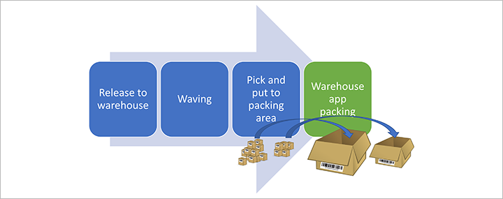
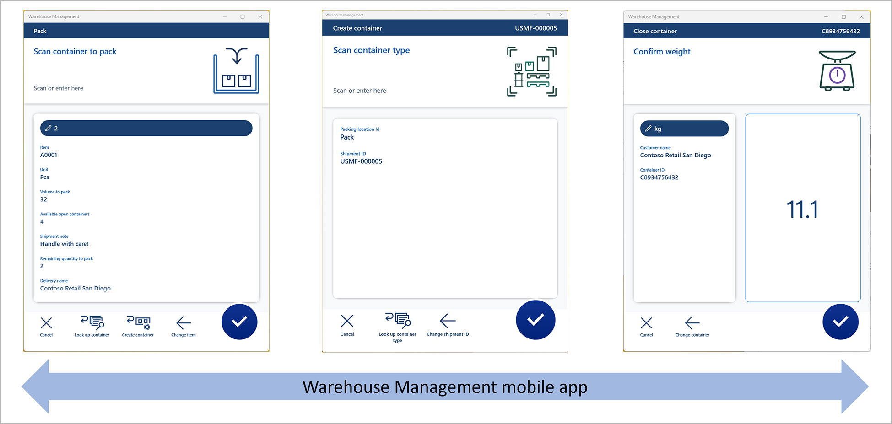

# Pack containers using the Warehouse Management mobile app

[!include [banner](../includes/banner.md)]

## Feature introduction

Businesses that ship large items or have large packing areas will benefit from this mobile packing experience. The Dynamics 365 Warehouse Management mobile app provides warehouse workers with the freedom to move around while performing their packing activities.
Traditionally, warehouse workers have performed packing activities at a specific packing station configured in Dynamics 365 Supply Chain Management, using a process optimized for shipments of small to medium sized parcels. To improve efficiency when working in larger packing areas, and to better support the packing and shipment of larger items, the Dynamics 365 Warehouse Management mobile app provides a mobile packing experience that gives workers the freedom to move around while performing packing activities.
This section will describe how to use the shipment container packing process on the Warehouse Management mobile app which can be used in combination with the rich client **Pack** page process. You can read more about how to enable the general warehouse management packing process [here]( packing-containers.md).

## Turn on the Pack containers using the Warehouse Management mobile app feature and its prerequisites

Before you can use the functionality that is described in this article, you must complete the following procedure to turn on the required features.

1. Go to **System administration \> Workspaces \> Feature management**. (For more information about how to use the **Feature management** workspace, see [Feature management overview](../../fin-ops-core/fin-ops/get-started/feature-management/feature-management-overview.md).)

1. If not already on, turn on the feature that is listed in the following way:
    - **Module:** *Warehouse management*
    - **Feature name:** *Multi-level detours for the Warehouse Management mobile app*
   See [Multi-level detours for the Warehouse Management mobile app](warehouse-app-detours.md).

1. If not already on, turn on the feature that is listed in the following way:
    - **Module:** *Warehouse management*
    - **Feature name:** *Auto-submit detour steps for the Warehouse Management mobile app*
    See [Auto-submit detour steps for the Warehouse Management mobile app](warehouse-app-detours.md).

1. If not already on, turn on the feature that is listed in the following way:
    - **Module:** *Warehouse management*
    - **Feature name:** *Warehouse management app data inquiry flow*
   See [Query data using Warehouse Management mobile app detours](warehouse-app-data-inquiry.md).

1. If not already on, turn on the feature that is listed in the following way:
    - **Module:** *Warehouse management*
    - **Feature name:** *Pack containers using the Warehouse Management mobile app*
      This feature is the one that is described in this article.

1. Make sure to update the field names in the Warehouse Management mobile app by going to **Warehouse management \> Setup \> Mobile device \> Warehouse app field names** and selecting **Create default setup**. Repeat this step for each legal entity (company) where you use the Warehouse Management mobile app. For more information, see [Configure fields for the Warehouse Management mobile app](configure-app-field-names-priorities-warehouse.md).

1. Make sure to run **Create default setup** for the [*Mobile device steps*](warehouse-app-detours.md) in the **Warehouse management \> Setup \> Mobile device \> Mobile device steps**. Repeat this step for each legal entity (company) where you use the Warehouse Management mobile app.
 
> [!NOTE]
> To be able to see new icons and have all the user experience enhancements related to the Warehouse Management mobile app packing process, please make to to use the Warehouse Management mobile app version 2.0.31.0 or newer.

## Warehouse Management mobile app packing process
As soon as the shipment inventory items have been brought forward to the packing area you can start processing the **Pack inventory into containers** on the Warehouse Management mobile app.

To leverage all the supported packing processes on the Warehouse Management mobile app you must enable three mobile device menu items:
-	**Pack inventory into containers** - Used for the main process to pack items into containers
-	**Container creation** - Used to create containers going to be used to pack shipment items into
-	**Container closing** -  Used to close the shipment containers

It is recommended to use the [Detour]( warehouse-app-detours.md) functionality to ease the Warehouse Management mobile app operations by having the **Container creation** and **Container closing** embedded into the **Pack inventory into containers** menu item by using the [Detour](warehouse-app-detours.md) option. It is as well recommended to add several look up options as part of the Warehouse Management mobile app to easy and fasten the packing operation by using the [Data inquiry](warehouse-app-data-inquiry.md) in combination with the [Detour]( warehouse-app-detours.md) functionalities. This is especially effective in cases of having unreadable or missing barcodes.

### Pack inventory into containers
During the **Pack inventory into containers** process the workers must identify and confirm the following information:
-	**Packing location** - Where the container packing occurs (can get defaulted from the warehouse **Worker** page)
-	**Shipment Id** - To validate which inventory items to pack
-	**Item number** and **Quantity** - To identify what is going to get packed
-	**Container Id** - In where the shipping items are going to get packed into

Please note that the **Container packing policy** must be defaulted from the **Worker** setup.

### Container creation
To create a container on the *Warehouse Management mobile app* the following data are needed:
-	**Packing location** - Where the container creation happens (can get defaulted from the warehouse **Worker** page - and/or via a [Detour](warehouse-app-detours.md))
-	**Shipment Id** - to validate which inventory items are planned to get packed into the container (Can get defaulted via [Detour](warehouse-app-detours.md))
-	**Container type Id** - to identify the maximum values for the physical volume and weight capacity constraints for the container
-	**Container ID** - to get a unique number to identify the shipping container

Please note that the **Container packing policy** must be defaulted from the **Worker** setup.
### Container closing
For the **Container closing** process which can get triggered directly from the Warehouse Management mobile app menu and/or embedded into the **Pack inventory into containers** menu item by using the [Detour](warehouse-app-detours.md) option, the following information must get defined:
-	**Container ID** to get closed
-	**Weight** of the container which will get defaulted based on the item master weight definition

# Example scenario
This section provides an example scenario that shows how to setup a *Warehouse Management mobile app packing flow* and process an simple outbound sales order by packing a container and closing it via the *Warehouse Management mobile app*.
The setup will leverage the [Detour](warehouse-app-detours.md) including [Data inquiry](warehouse-app-data-inquiry.md) capabilities and running with eight mobile device menu items. But of cause this will not be a mandatory setup process.

<!-- PICTURE FOR DEMO TO GET UPDATED WITH APP SCREENS -->
 
 
## Make sample data available
To work through this scenario by using the sample records and values that are specified here, you must be on a system where the standard [demo data](../../fin-ops-core/fin-ops/get-started/demo-data.md) is installed. Additionally, you must select the **USMF** legal entity before you begin.
The example will be running with the demo data associated with the *Worker*/*Person* 'Julia Funderburk'.

You can also use this scenario as guidance for using the feature on a production system. However, in that case, you must substitute your own values for each setting that is described here.

### Define Worker set up for container packing
You must set up the **Container packing policy** and **Packing profile ID** for the workers using the Warehouse Management mobile app container packing process.

1.	Go to **Warehouse management > Setup > Worker**
2.	Select **Edit**
3.	Select worker *Julia Funderburk* in the list.
4.	Make the following settings for the worker in the **Profile** section:
    - **Container packing policy** - Select *WH62Close* which will move containers to the *Baydoor* location when closing a container.
    - **Packing profile ID** - Select *WH62* which will not create warehouse work after the closing of a container.
5.	Make the following settings for the worker in the **Default packing station** section:
    -	**Site** - Select *6*, released to the warehouse we are going to use
    -	**Warehouse** - Select *62*, a warehouse already enabled for the packing process in the demo data.
    -	**Location** - Select *Pack*. Note that the Warehouse Management mobile app will always prompt for confirmation for the assigned value, which can get overwritten. In case you do not provide a default packing location value the warehouse worker must always scan or look up the packing location in the app, which can get achieved by using the [Data inquiry](warehouse-app-data-inquiry.md) capability.
> [!NOTE]
> You can automatically print container labels when creating a new container record, go to: [**Container label printing**](configure-container-label-printing.md) to read more.

### Create a new *Pack inventory into containers* mobile device menu item
You must create a new mobile device menu item to pack inventory into containers via the Warehouse Management mobile app.
1.	Go to **Warehouse management > Setup > Mobile device > Mobile device menu items**
2.	Select **New** on the Action Pane to add a new mobile device menu item
3.	Make the following settings for the new menu item:
    - **Menu item name** - Enter *Packing* as the name for the new menu item
    - **Title** - Enter *Packing*, this will get displayed on the Warehouse app
    - **Mode** - Select *Indirect*
    - **Activity code** - Select *Pack inventory into containers*
4. Close the page

### Create a new *Container creation* mobile device menu item
You must create a new mobile device menu item to pack inventory into containers via the Warehouse Management mobile app.
1.	Go to **Warehouse management > Setup > Mobile device > Mobile device menu items**
2.	Select **New** on the Action Pane to add a new mobile device menu item
3.	Make the following settings for the new menu item:
    - **Menu item name** - Enter *Create container* as the name for the new menu item
    - **Title** - Enter *Create container*, this will get displayed on the Warehouse app
    - **Mode** - Select *Indirect*
    - **Activity code** - Select *Container creation*
4. Close the page

### Create a new *Container closing* mobile device menu item
You must create a new mobile device menu item to pack inventory into containers via the Warehouse Management mobile app.
1.	Go to **Warehouse management > Setup > Mobile device > Mobile device menu items**
2.	Select **New** on the Action Pane to add a new mobile device menu item
3.	Make the following settings for the new menu item:
    - **Menu item name** - Enter *Close container* as the name for the new menu item
    - **Title** - Enter *Close container*, this will get displayed on the Warehouse app
    - **Mode** - Select *Indirect*
    - **Activity code** - Select *Container closing*
4. Close the page

### Add the three new mobile device menu items to the menu
With now having the mobile device menu items, we are ready to get it added to the **Mobile device menu**. This is required to use it for the container packing process.
In this example we will add it to the existing *Outbound** mobile device menu.
1. Open **Warehouse management > Setup > Mobile device > Mobile device menu**.
1. Select **Edit**.
1. Select **Outbound** menu in the list
1. Select the new **Packing** mobile device menu items in the **Available menus and menu items** list.
1. Select the arrow-bottom to move this menu item into the **Menu structure** list in the select **Outbound** menu.
1. Do the same for *Create container* and *Close container*
1. Close the page

With this current setup you can process the packing of shipment items into containers via the Warehouse Management mobile app, but you will need to use the *Create container* and *Close container* processes directly from the menu. To ease the use of the supported packing processes follow the enablement of [Detour](warehouse-app-detours.md).

### Add a *detour* for the *Container creation*
To easy the container creation process while being in a container packing flow you can add a [Detour](warehouse-app-detours.md) process.
In this example added as part of the page where the Warehouse Management mobile app page prompts for *Scan container to pack*.

1. Go to **Warehouse management \> Setup > Mobile device \> Mobile device steps**.
1. In the **Filter** field, enter *ContainerIdToPack*. Then select *Step ID: "ContainerIdToPack"* in the drop-down list with no *Menu item name*.
1. While the record that is found is selected in the grid, select **Add step configuration** on the Action Pane. In the drop-down dialog box that appears, set the **Menu item** field to *Packing*. Then select **OK** to close the dialog box.
1. On the details page for the new step configuration (**Packing : ContainerIdToPack**), on the **Available detours (menu items)** FastTab, select **Add** on the toolbar.
1. In the **Add detour** dialog box, find and select the **Create container** menu item that you previously created.
1. Select **OK** to close the dialog box and add the selected menu item to the detours list.
1. Select the new detour, and then select **Select fields to send** on the toolbar.
1. In the **Select fields to send** section, set the following values for the empty row that has already been added there:
    - **Copy from Packing:** *Location*
    - **Paste in Create container:** *Location*
    - **Auto submit** *Selected* - You don't want to confirm the value
1. Select **Add** to add one more row and set the following values:
    - **Copy from Packing:** *Shipment*
    - **Paste in Create container:** *Shipment*
    - **Auto submit** *Selected* - You don't want to confirm the value in the Warehouse management mobile app
1. In the **Bring back from create container** section, set the following values for the empty row that has already been added there:
    - **Copy from Create container:** *Container ID*
    - **Paste in Packing:** *Container ID* 
    - **Auto submit** *Cleared* - You want to confirm the value
1. Select **Add** to add one more row and set the following values:
    - **Copy from Create container:** *Refresh* - This is used to automatically update the page when returning from detour
    - **Paste in Packing:** *Refresh* - You must specify *Refresh* to trigger the update logic
    - **Auto submit** *Selected* - Will automatically update the page e.g. the *Available open containers* field.
   1. Select **OK** to close the dialog box.
1. Close the page.
> [!NOTE]
> Only Warehouse Management mobile app pages containing the *Refresh* option can be used to trigger an automatic page refresh as part of a detour process. Make sure to select **Refresh** in both the *Copy from* and *Paste in* fields and select the *Auto submit* option.

### Add *detour* for *Container closing*
To easy the container closing process while being in a container packing flow you can add a [Detour](warehouse-app-detours.md) process.
In this example added as part of the page where the Warehouse Management mobile app page prompts for *Scan item*.

1. Go to **Warehouse management \> Setup > Mobile device \> Mobile device steps**.
1. In the **Filter** field, enter *ItemId*. Then select *Step ID: "ItemId"* in the drop-down list with no *Menu item name*.
1. While the record that is found is selected in the grid, select **Add step configuration** on the Action Pane. In the drop-down dialog box that appears, set the **Menu item** field to *Packing*. Then select **OK** to close the dialog box.
1. On the details page for the new step configuration (**Packing : ItemId**), on the **Available detours (menu items)** FastTab, select **Add** on the toolbar.
1. In the **Add detour** dialog box, find and select the **Close container** menu item that you previously created.
1. Select **OK** to close the dialog box and add the selected menu item to the detours list.
1. Select the new detour, and then select **Select fields to send** on the toolbar.
1. In the **Select fields to send** section, you can add data to send which can be used for further look up filtering capabilities:
    - **Copy from Packing:** *Location*
    - **Paste in Close container:** *Location*
    - **Auto submit** *Cleared* - Location is only pasted in case of needing to look up a container ID
1. Select **Add** to add one more row and set the following values:
    - **Copy from Packing:** *Shipment*
    - **Paste in Close container:** *Shipment*
    - **Auto submit** *Cleared* - Shipment is only pasted in case of needing to look up a container ID
1. In the **Bring back from create container** section don't add anything because you don't want to pass any values back from the detour menu item.
1. Select **OK** to close the dialog box.
1. Close the page.

Now you will be able to use the Warehouse Management mobile app **Pack inventory into containers**, but you can as well add more look up logic by using the [Data inquiry](warehouse-app-data-inquiry.md) capabilities as part of the process. In the following example it will be shown how to add the following look up mobile device menu items:
for: 
- **Look up location** - Used to inquire for packing locations from where inventory should get packed
- **Look up shipment** - Used to inquire for shipments going to get packed
- **Look up item** - Used to inquire for item numbers going to get packed
- **Look up container type** -  Used to inquire for container types for the container creation process
- **Look up container** - Used to inquire for containers to close

### Create the five "look up" menu items
To create the different "Look up" menu items follow these steps.

#### Create mobile device menu item **Look up location**
Many different look up capabilities exists to look up packing locations. In this example a simple look up for locations related to a specific *Location profile* will be used to filter locations used for packing operations.

1. Go to **Warehouse management \> Setup \> Mobile device \> Mobile device menu items**.
1. On the Action Pane, select **New** to add a mobile device menu item.
1. Set the following values for the new item:

    - **Menu item name:** *Look up location*
    - **Title:** *Look up location*
    - **Mode:** *Indirect*

1. On the **General** FastTab, set the following values:

    - **Activity code:** *Data inquiry*
    - **Use process guide:** *Yes* (This value is automatically selected.)
    - **Table name:** *WMSLocation* (You want to look up warehouse locations based on eg. location profile ID.)

1. On the Action Pane, select **Edit query** to define a query that is based on the selected base table (in this case, the location table. Note that you can join to related tables when needed).
1. In the query editor, on the **Range** tab, add the following lines to the grid.

    | Table | Derived table | Field | Criteria |
    |---|---|---|---|
    | Locations | Locations | Warehouse |  |
    | Locations | Locations | Location profile ID | PACK |
    
1. Select **OK**.

   In the query, the **Warehouse** field will automatically get assigned based on the workers current warehouse.
   If you want to specify how the list will be sorted, you can set up the sorting on the **Sorting** tab.

 
1. In addition to defining the query, you must select which fields will be shown on the cards on the inquiry list page. Therefore, on the Action Pane, select **Field list**.
1. On the **Field list** page, set the following values:
    - **Display field 1:** *wMSLocationId* (This field value will be used as the header for each card.)
    - **Display field 2:** *inventLocationId*
    - **Display field 3:** *LocProfileId*
    - **Display field 4:** *whsDisplayQty()*
    - **Display field 5:** *whsDisplayItemId()*

1. On the Action Pane, select **Save**. Then close the page.

#### Create mobile device menu item Look up shipment
Many different look up capabilities exists to look up shipments. In this example a simple look up for active shipments will be used.

1. Go to **Warehouse management \> Setup \> Mobile device \> Mobile device menu items**.
1. On the Action Pane, select **New** to add a mobile device menu item.
1. Set the following values for the new item:

    - **Menu item name:** *Look up shipment*
    - **Title:** *Look up shipment*
    - **Mode:** *Indirect*

1. On the **General** FastTab, set the following values:

    - **Activity code:** *Data inquiry*
    - **Use process guide:** *Yes* (This value is automatically selected.)
    - **Table name:** *WHSShipmentTable*

1. On the Action Pane, select **Edit query** to define a query that is based on the selected base table (in this case, the location table. Note that you can join to related tables when needed).
1. In the query editor, on the **Range** tab, add the following lines to the grid.

    | Table | Derived table | Field | Criteria |
    |---|---|---|---|
    | Shipments | Shipments | Warehouse |  |
    | Shipments | Shipments | Shipment status | Open, Waved, "In process" |
    
1. Select **OK**.

    In the query, the **Warehouse** field will automatically get assigned based on the workers current warehouse.
    If you want to specify how the list will be sorted, you can set up the sorting on the **Sorting** tab.

1. In addition to defining the query, you must select which fields will be shown on the cards on the inquiry list page. Therefore, on the Action Pane, select **Field list**.
1. On the **Field list** page, set the following values:
    - **Display field 1:** *shipmentID* (This field value will be used as the header for each card.)
    - **Display field 2:** *ShipmentStatus*
    - **Display field 3:** *displayDeliveryName()*
    - **Display field 4:** *displayNumberOfContainers()*
    - **Display field 5:** *displayNumberOfLoadLines()*
    - **Display field 6:** *displayTotalVolume()*
    - **Display field 7:** *displayTotalWeight()*
    - **Display field 8:** *displayShipmentDateTime()*

1. On the Action Pane, select **Save**. Then close the page.

#### Create mobile device menu item Look up item
Many different look up capabilities exists to inquire item information. You might find it relevant to be able to filter based on wildcard search rather than this example using load lines.
It might be beneficial uto use the [**Packing work**](packing-work.md) feature for look up- or joining to the closed put work lines for the work bringing the inventory to packing areas.

In this example a simple look up will be filtered based on the already captured *Shipment ID* as part of the packing process.
1. Go to **Warehouse management \> Setup \> Mobile device \> Mobile device menu items**.
1. On the Action Pane, select **New** to add a mobile device menu item.
1. Set the following values for the new item:

    - **Menu item name:** *Look up item*
    - **Title:** *Look up item*
    - **Mode:** *Indirect*

1. On the **General** FastTab, set the following values:

    - **Activity code:** *Data inquiry*
    - **Use process guide:** *Yes* (This value is automatically selected.)
    - **Table name:** *WHSLoadLine*

1. On the Action Pane, select **Edit query** to define a query that is based on the selected base table (in this case, the location table. Note that you can join to related tables when needed).
1. In the query editor, on the **Range** tab, make sure only having the following line in the grid.

    | Table | Derived table | Field | Criteria |
    |---|---|---|---|
    | Load details | Load details | Shipment ID |  |
    
1. Select **OK**.

    In the query, the **Warehouse** field will automatically get assigned based on the workers current warehouse.
    If you want to specify how the list will be sorted, you can set up the sorting on the **Sorting** tab.

1. In addition to defining the query, you must select which fields will be shown on the cards on the inquiry list page. Therefore, on the Action Pane, select **Field list**.
1. On the **Field list** page, set the following values:
    - **Display field 1:** *ItemId* (This field value will be used as the header for each card.)
    - **Display field 2:** *displayItemName()*
    - **Display field 3:** *displayCustName()*
    - **Display field 4:** *displayInventQty()* 
    - **Display field 5:** *displayInventUOM()*
   
1. On the Action Pane, select **Save**. Then close the page.

#### Create mobile device menu item Look up container type
Many different look up capabilities exists to look up container types. In this example all container types will get included, but it might make sense to filter based on *Container group ID* by joining to *Container group details*. <!--check--> or other entities.

1. Go to **Warehouse management \> Setup \> Mobile device \> Mobile device menu items**.
1. On the Action Pane, select **New** to add a mobile device menu item.
1. Set the following values for the new item:

    - **Menu item name:** *Look up container type*
    - **Title:** *Look up container type*
    - **Mode:** *Indirect*

1. On the **General** FastTab, set the following values:

    - **Activity code:** *Data inquiry*
    - **Use process guide:** *Yes* (This value is automatically selected.)
    - **Table name:** *WHSContainerType*

1. On the Action Pane, select **Edit query** to define a query that is based on the selected base table (in this case, the container type table. Note that you can join to related tables when needed).
1. In the query editor, on the **Range** tab, add the following lines to the grid.

    | Table | Derived table | Field | Criteria |
    |---|---|---|---|
    | Container type | Container type | Container type code | * |
The "*" indicates that all container types will get displayed.
   
1. You must select which fields will be shown on the cards on the inquiry list page. Therefore, on the Action Pane, select **Field list**.
1. On the **Field list** page, set the following values:
    - **Display field 1:** *ContainerTypeCode* (This field value will be used as the header for each card.)
    - **Display field 2:** *Description*
    - **Display field 3:** *MaxVolume*
    - **Display field 4:** *MaxWeight*
    - **Display field 5:** *Height*
    - **Display field 6:** *Length*
    - **Display field 7:** *Width*
    - **Display field 8:** *FlexibleVolumeDimensions*

1. On the Action Pane, select **Save**. Then close the page.

If you want to specify how the list will be sorted, you can set up the sorting on the **Sorting** tab. In this example the *Maximum volume* field could be a candidate.

#### Create mobile device menu item Look up container
Many different look up capabilities exists to look up containers. In this example, the new menu item is configured to find active containers on the current packing location related to the current shipment getting packed.

1. Go to **Warehouse management \> Setup \> Mobile device \> Mobile device menu items**.
1. On the Action Pane, select **New** to add a mobile device menu item.
1. Set the following values for the new item:

    - **Menu item name:** *Look up container*
    - **Title:** *Look up container*
    - **Mode:** *Indirect*

1. On the **General** FastTab, set the following values:

    - **Activity code:** *Data inquiry*
    - **Use process guide:** *Yes* (This value is automatically selected.)
    - **Table name:** *WHSContainerWarehouseLocationView* - By using this view it will be possible to limit the look up to only show containers for a specific packing location related to a specific shipment.

1. On the Action Pane, select **Edit query** to define a query that is based on the selected base table (in this case, the location table. Note that you can join to related tables when needed).
1. In the query editor, on the **Range** tab, add the following lines to the grid.

    | Table | Derived table | Field | Criteria |
    |---|---|---|---|
    | WHSContainerWarehouseLocationView | WHSContainerWarehouseLocationView | Warehouse |  |
    | WHSContainerWarehouseLocationView | WHSContainerWarehouseLocationView | Location |  |    
    | WHSContainerWarehouseLocationView | WHSContainerWarehouseLocationView | Shipment ID |  |
    | WHSContainerWarehouseLocationView | WHSContainerWarehouseLocationView | Container status |!Closed |
    
1. Select **OK**.

In the query, the **Warehouse**, **Location**, and **Shipment ID** fields will automatically get assigned based on following detour setup.
If you want to specify how the list will be sorted, you can set up the sorting on the **Sorting** tab.

1. In addition to defining the query, you must select which fields will be shown on the cards on the inquiry list page. Therefore, on the Action Pane, select **Field list**.
1. On the **Field list** page, set the following values:

    - **Display field 1:** *ContainerId* (This field value will be used as the header for each card.)
    - **Display field 2:** *ContainerStatus*
    - **Display field 3:** *Weight*
    - **Display field 4:** *WeightUOM*
    - **Display field 5:** *ContainerNum*
    - **Display field 6:** *ContainerReleased*
    - **Display field 7:** *ContainerTypeCode*

1. On the Action Pane, select **Save**. Then close the page.

### Add the new mobile device menu items to a menu
Your new mobile device menu items are now ready to be added to the mobile device menu. This task must be completed before the menu items can be used as part of a detour process. In this example, you will create a new submenu and add the new menu items to it.

1. Go to **Warehouse management \> Setup \> Mobile device \> Mobile device menu**.
1. On the Action Pane, select **New**.
1. Set the following values on the header of the new record:

    - **Name:** *Inquire*
    - **Description:** *Inquire*

1. In the **Available menus and menu items** list, select the first of the five "look up" mobile device menu items that you just created. Then select the right arrow button to move that item into the **Menu structure** list.
1. Repeat the previous step for the other four new menu items.
1. In the list pane on the left, select the **Main** menu.
1. In the **Available menus and menu items** list, scroll down to the **Menus** section, and select your new **Inquire** menu. Then select the right arrow button to move that item into the **Menu structure** list.

### Configure detours in your mobile device steps
To complete the setup, you must now use the detour configuration on the **Mobile device steps** page to add the five new mobile device menu items to existing menu item flows.
In this example you perform the following setup:

- Add **Look up location** into the **Packing - Scan packing location** step
- Add **Look up shipment** into the **Packing - Scan shipment** step
- Add **Look up item** into the **Packing - Scan item** step
- Add **Look up container** into the **Packing - Scan container to pack** step
- Add **Look up container type** into the **Create container - Scan container type** step
- Add **Look up container** into the **Close container - Scan container** step

#### Add **Look up location** as detour
1. Go to **Warehouse management \> Setup > Mobile device \> Mobile device steps**.
1. In the **Filter** field, enter *PackingLocationId*. Then select *Step ID: "PackingLocationId"* in the drop-down list.
1. While the record that is found is selected in the grid, select **Add step configuration** on the Action Pane. In the drop-down dialog box that appears, set the **Menu item** field to *Packing*. Then select **OK** to close the dialog box.
1. On the details page for the new step configuration (**Packing : PackingLocationId**), on the **Available detours (menu items)** FastTab, select **Add** on the toolbar.
1. In the **Add detour** dialog box, find and select the **Look up location** menu item that you previously created.
1. Select **OK** to close the dialog box and add the selected menu item to the detours list.
1. Select the new detour, and then select **Select fields to send** on the toolbar.
1. In the **Select fields to send** dialog box, don't add anything to the **Send from Packing** section, because you don't want to pass any values to the detour menu item. However, in the **Bring back from look up location** section, set the following value for the empty row that has already been added there:
    - **Copy from Look up location** *Location*
    - **Paste in Packing** *Location*
    - **Auto submit** *Cleared* - You want to confirm the value
1. Select **OK** to close the dialog box.
1. Close the page.

#### Add **Look up shipment** as detour
1. Go to **Warehouse management \> Setup > Mobile device \> Mobile device steps**.
1. In the **Filter** field, enter *ShipmentId*. Then select *Step ID: "ShipmentId"* in the drop-down list.
1. While the record that is found is selected in the grid, select **Add step configuration** on the Action Pane. In the drop-down dialog box that appears, set the **Menu item** field to *Packing*. Then select **OK** to close the dialog box.
1. On the details page for the new step configuration (**Packing : ShipmentId**), on the **Available detours (menu items)** FastTab, select **Add** on the toolbar.
1. In the **Add detour** dialog box, find and select the **Look up shipment** menu item that you previously created.
1. Select **OK** to close the dialog box and add the selected menu item to the detours list.
1. Select the new detour, and then select **Select fields to send** on the toolbar.
1. In the **Select fields to send** dialog box, don't add anything to the **Send from Packing** section, because you don't want to pass any values to the detour menu item. However, 1. In the **Bring back from Look up shipment** section, set the following value for the empty row that has already been added there:
    - **Copy from Look up shipment** *Shipment ID*
    - **Paste in Packing** *Shipment*
    - **Auto submit** *Cleared* - You want to confirm the value
1. Select **OK** to close the dialog box.
1. Close the page.

#### Add **Look up item** as detour
1. Go to **Warehouse management \> Setup > Mobile device \> Mobile device steps**.
1. In the **Filter** field, enter *ItemId*. Then select *Step ID: "ItemID"* for the record that is found for the previously created for Menu item name **Packing**
1. On the details page for the new step configuration (**Packing : ItemId**), on the **Available detours (menu items)** FastTab, select **Add** on the toolbar.
1. In the **Add detour** dialog box, find and select the **Look up item** menu item that you previously created.
1. Select **OK** to close the dialog box and add the selected menu item to the detours list.
1. Select the new detour, and then select **Select fields to send** on the toolbar.
1. In the **Select fields to send** dialog box, in the **Send from Packing** section,  set the following value for the empty row that has already been added there:
    - **Copy from Packing** *Shipment*
    - **Paste in Look up item** *Shipment ID*
    - **Auto submit** *Selected* - You don't want to confirm the value in the Warehouse management mobile app
1. In the **Bring back from Look up item** section, set the following value for the empty row that has already been added there:
    - **Copy from Look up item** *Item number*
    - **Paste in Packing** *Item*
    - **Auto submit** *Cleared* - You want to confirm the value
1. Select **OK** to close the dialog box.
1. Close the page.

#### Add **Look up container** as detour for packing
1. Go to **Warehouse management \> Setup > Mobile device \> Mobile device steps**.
1. In the **Filter** field, enter *ContainerIdToPack*. Then select *Step ID: "ContainerIdToPack"* in the drop-down list.
1. While the record that is found is selected in the grid, select **Add step configuration** on the Action Pane. In the drop-down dialog box that appears, set the **Menu item** field to *Packing*. Then select **OK** to close the dialog box.
1. On the details page for the new step configuration (**Packing : ContainerIdToPack**), on the **Available detours (menu items)** FastTab, select **Add** on the toolbar.
1. In the **Add detour** dialog box, find and select the **Look up container** menu item that you previously created.
1. Select **OK** to close the dialog box and add the selected menu item to the detours list.
1. Select the new detour, and then select **Select fields to send** on the toolbar.
1. In the **Select fields to send** dialog box, in the **Send from Create container** section,  set the following value for the empty row that has already been added there:
    - **Copy from Packing** *Location*
    - **Paste in Look up container** *Location*
    - **Auto submit** *Selected* - You don't want to confirm the value
1.  Add a new record with:
     - **Copy from Packing** *Shipment*
    - **Paste in Look up container** *Shipment ID*
    - **Auto submit** *Cleared* - You want to confirm the value
1. In the **Bring back from Look up container** section, set the following value for the empty row that has already been added there:
    - **Copy from Look up container** *Container ID*
    - **Paste in Packing** *Container ID*
    - **Auto submit** *Cleared* - You want to confirm the value
1. Select **OK** to close the dialog box.
1. Close the page.

#### Add **Look up container type** as detour
1. Go to **Warehouse management \> Setup > Mobile device \> Mobile device steps**.
1. In the **Filter** field, enter *ContainerTypeToCreateContainer*. Then select *Step ID: "ContainerTypeToCreateContainer"* in the drop-down list.
1. While the record that is found is selected in the grid, select **Add step configuration** on the Action Pane. In the drop-down dialog box that appears, set the **Menu item** field to *Create container*. Then select **OK** to close the dialog box.
1. On the details page for the new step configuration (**Create container : ContainerTypeToCreateContainer**), on the **Available detours (menu items)** FastTab, select **Add** on the toolbar.
1. In the **Add detour** dialog box, find and select the **Look up container type** menu item that you previously created.
1. Select **OK** to close the dialog box and add the selected menu item to the detours list.
1. Select the new detour, and then select **Select fields to send** on the toolbar.
1. In the **Select fields to send** dialog box, don't add anything to the **Send from Create container** section, because you don't want to pass any values to the detour menu item. However, in the **Bring back from Look up container type** section, set the following value for the empty row that has already been added there:
    - **Copy from Look up container type** *Container type code*
    - **Paste in Create container** *Container type code*
    - **Auto submit** *Cleared* - You want to confirm the value
1. Select **OK** to close the dialog box.
1. Close the page.

#### Add **Look up container** as detour for container creation
1. Go to **Warehouse management \> Setup > Mobile device \> Mobile device steps**.
1. In the **Filter** field, enter *ContainerId*. Then select *Step ID: "ContainerId"* in the drop-down list.
1. While the record that is found is selected in the grid, select **Add step configuration** on the Action Pane. In the drop-down dialog box that appears, set the **Menu item** field to *Close container*. Then select **OK** to close the dialog box.
1. On the details page for the new step configuration (**Close container : ContainerId**), on the **Available detours (menu items)** FastTab, select **Add** on the toolbar.
1. In the **Add detour** dialog box, find and select the **Look up container** menu item that you previously created.
1. Select **OK** to close the dialog box and add the selected menu item to the detours list.
1. Select the new detour, and then select **Select fields to send** on the toolbar.
1. In the **Select fields to send** dialog box, in the **Send from Create container** section,  set the following value for the empty row that has already been added there:
    - **Copy from Close container** *Location*
    - **Paste in Look up container** *Location*
    - **Auto submit** *Selected* - You don't want to confirm the value
1.  Add a new record with:
     - **Copy from Close container** *Shipment*
    - **Paste in Look up container** *Shipment ID*
    - **Auto submit** *Selected* - You don't want to confirm the value
1. In the **Bring back from Look up container** section, set the following value for the empty row that has already been added there:
    - **Copy from Look up container** *Container ID*
    - **Paste in Close container** *Container ID*
    - **Auto submit** *Cleared* - You want to confirm the value
1. Select **OK** to close the dialog box.
1. Close the page.

## Create a sales order and complete the work
Follow these steps to create a sales order and complete the work of moving the ordered items to the packing area.

1. Go to **Sales and marketing \> Sales orders \> All sales orders**.
1. On the Action Pane, select **New**.
1. In the **Create sales order** dialog box, in the **Customer account** field, select *US-005*.
1. Select **OK** to close the dialog box.
1. The new sales order is opened and includes a single, empty line on the **Sales order lines** FastTab. Set the following values for the new order line:

    - **Item number:** *A0001*
    - **Quantity:** *2*
    - **Site:** *6*
    - **Warehouse:** *62*

1. While the order line is still selected, select **Inventory \> Reservation** on the toolbar of the **Sales order lines** FastTab.
1. On the **Reservation** page, on the Action Pane, select **Reserve lot** to reserve the full quantity of the selected line in the warehouse.
1. Close the **Reservation** page to return to the sales order.
1. On the Action Pane, on the **Warehouse** tab, select **Release to warehouse**.

    A message shows the shipment and wave IDs for the order.

1. While the order line is still selected, select **Warehouse** \> **Work details** on the toolbar of the **Sales order lines** FastTab. If you use batch processing to run your waves, you might have to wait a short time for the work to be created.
1. On the **Work** page, on the Action Pane, on the **Work** tab, select **Complete work**.
1. On the **Work completion** page, set the **User ID** field to *62*.
1. On the Action Pane, select **Validate work**.
1. When you receive a message that indicates that your work is valid, select **Complete work** to complete the process of picking the inventory items and putting them in the *Pack* location.
1. Make a note of the **Shipment ID** value that is shown for the work in the upper grid.

### Pack the ordered items into a container

The inventory items have now been brought to the packing area and are ready to be packed into containers. Follow these steps to create a new container in the system and pack and close the container.

1. Open the *Warehouse Management mobile app* and login as User ID **62**.
1. Open the previously created *Packing* menu item.
1. Confirm the *Packing location* **Pack**.
1. Enter/scan the *Shipment ID** from previously.
1. Enter/scan *Item* **A0001**.
1. Use the **Create container** detour button to jump to the *Container creation* process.
1. Enter/scan *Container type* **Box-Large**.
1. Confirm the number sequence container ID based on the *Container ID mode* setup. This will create a new container for the shipment and return to the main packing flow.
1. Enter/scan the new *Container ID* to pack the 2 pcs of item A0001 into the container. In case quantity needs to get updated you can click on the *Quantity* and edit the value before.confirming the *Container ID*.
1. Use the **Close container** detour button to jump to the *Container closing** process.
1. Enter/scan the *Container ID* to select the container to close.
1. Confirm the system weight for the two items packed into the box. To update the weight manually you can click on the weight value and modify it before confirming.

1. On the Action Pane, select **Close container**.
1. In the **Close container** dialog box, select **Get system weight** to fill in the default **Gross weight** value.
1. Select **OK** to close the container.

> [!NOTE]
> The different field values getting displayed on the Warehouse Management mobile app pages can get sorted and highlighted by using the [Promoted fields](warehouse-app-promoted-fields.md) capability.

> [!INFORMATION]
> Consider using the [Packing work for packing outbound containers and processing shipments](packing-work.md) as part of the process including adding different kind of [Data inquiry](warehouse-app-data-inquiry.md) menu items for this data.

# Supported/Unsupported processes
In the following table you can see which processes are supported when using the Warehouse Management mobile app container packing process compared with the rich client **Pack** page.

|Logic                                                        | Supported | Comment                                                                                                                               |
|-------------------------------------------------------------|-----------|---------------------------------------------------------------------------------------------------------------------------------------| 
|Items enabled for **Catch weight**                           | No        |                                                                                                                                       |
|Identification of License plate                              | (No)      | Only **Shipment id** identification is supported (the from license plate will automatically get selected)                             |
|Identification of Tracking dimensions                        | (No)      | Tracking dimensions related to the shipment will automatically get selected                                                           |
|Identification of Product variant dimensions                 | Yes       |                                                                                                                                       |
|Identification via GS1 barcode scanning                      | No        |                                                                                                                                       |
|Identification item via barcode setup                        | (Yes)     | But quantity and unit (piece-by-piece) scanning is not supported                                                                      |
|New container                                                | Yes       | Both via **Container creation** mobile device menu item incl. container type capturing and number sequence defaulting when having *Container ID mode* as **Auto**. But as well container ID creation when using the *Autocreate container at container close* process |
|Print container label                                        | Yes       | Both automatically at **Container creation** process and as manual print via **Print container label** mobile device menu item. You can read more about the required setup [here](configure-container-label-printing.md).                                  |
|Close container                                              | Yes       | Via **Container closing** mobile device menu item incl. capturing of weight                                                           |
|Release container                                            | No        | Only via container closing policy (Not as menu option) - User cannot reply yes or no as optional                                      |
|Reopen container                                             | No        |                                                                                                                                       |
|Change container packing policy                              | No        | It is only possible to use the Container packing policy defined on Worker                                                             |
|Release shipment                                             | No        |                                                                                                                                       |
|Work details                                                 | (Yes)     | You can use view via [Data inquiry detour](warehouse-app-data-inquiry.md)                                                             |
|Containers for shipment (Open/Closed)                        | (Yes)     | View via [Data inquiry detour](warehouse-app-data-inquiry.md)                                                                         |
|Shipment details                                             | (Yes)     | View via [Data inquiry detour](warehouse-app-data-inquiry.md)                                                                         |
|Display dimensions                                           | (no)      | But view via [Data inquiry detour](warehouse-app-data-inquiry.md) - capturing of dimensions are not supported                         |
|Manifest containers                                          | No        | Only automatic manifesting setup is supported                                                                                         |
|Unmanifest containers                                        | No        |                                                                                                                                       |
|Manifest container group                                     | No        | No weight capturing process supported                                                                                                 |
|Unmanifest container group                                   | No        |                                                                                                                                       |
|Manifest shipment                                            | No        | No weight capturing process supported                                                                                                 |
|Unmanifest shipment                                          | No        |                                                                                                                                       |
|Transport route rate details                                 | (No)      | Only view via [Data inquiry detour](warehouse-app-data-inquiry.md)                                                                    |
|Transport shipment accessorial charges                       | (No)      | Only view via [Data inquiry detour](warehouse-app-data-inquiry.md)                                                                    |
|Transport status                                             | (No)      | Only View via [Data inquiry detour](warehouse-app-data-inquiry.md)                                                                    |
|Print packing slip                                           | No        | The setting to process sales packing slip processing as part of closing the last container for a shipment will not apply when using the Warehouse Management mobile app  |
|Print container content                                      | (No)      | Only automatic printing setup is supported as part of closing container                                                               |
|Print shipping label                                         | (No)      | Only automatic printing setup is supported as part of closing container                                                               |
|Pack (all shipment items)                                    | No        | Each item number must be identified and packed individually                                                                           |
|Pack items (based on defined quantity)                       | (Yes)     | But only AFTER the item number has been identified by updating the quantity as part of the **Pack inventory into containers** process |
|Container group license plate ID with delayed work creation  | No        | It is not possible to specify a grouping license plate ID                                                                             |
|Container type creation                                      | No        |                                                                                                                                       |

[!INCLUDE[footer-include](../../includes/footer-banner.md)]
