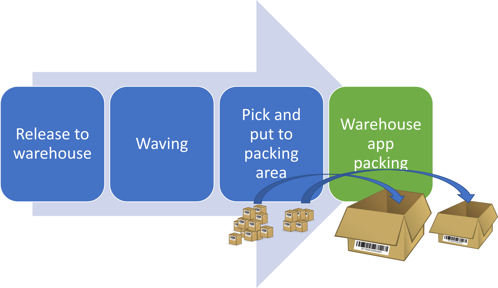

# Packing containers with the Warehouse Management mobile app

[!include [banner](../includes/banner.md)]

Traditionally, warehouse workers have performed packing activities at a specific packing station that is configured in Microsoft Dynamics 365 Supply Chain Management, and they've used a process that is optimized for shipments of small to medium-sized parcels. To help improve efficiency in larger packing areas, and to better support the packing and shipment of larger items, the Dynamics 365 Warehouse Management mobile app provides a mobile packing experience that gives workers the freedom to move around while they perform their packing activities.

This article describes how to use the shipment container packing process in the Warehouse Management mobile app. This process can be used in combination with the process on the **Pack** page in the Supply Chain Management web client. For more information about the warehouse management packing process, see [Pack containers for shipment](packing-containers.md).

## The Warehouse Management mobile app packing process

As soon as the shipment inventory items have been brought forward to the packing area, workers can start the *Pack inventory into containers* process in the Warehouse Management mobile app.

To take advantage of all the supported packing processes in the Warehouse Management mobile app, you must set up the following mobile device menu items:

- **Pack inventory into containers** – This menu item is used for the main process of packing items into containers.
- **Container creation** – This menu item is used to create containers that shipment items will be packed into.
- **Container closing** – This menu item is used to close the shipment containers.
- **Container deletion** - This menu item is used to delete a container.
- **Print container label** - This menu item is used to manually print a container label.

We recommend that you use the [detour]( warehouse-app-detours.md) functionality. This functionality makes Warehouse Management mobile app operations easier by embedding the *Container creation* and *Container closing* processes into the **Pack inventory into containers** menu item, especially when manual container creation and closing operations are used. We also recommend that you add several lookup options to the Warehouse Management mobile app by using [data inquiries](warehouse-app-data-inquiry.md) in combination with the [detour]( warehouse-app-detours.md) functionality. This approach is especially effective in situations where bar codes are unreadable or missing.

### Pack inventory into containers

The *Pack inventory into containers* process is controlled by the [mobile device container packing policies](warehouse-app-pack-containers-scenario.md) that are associated with the relevant mobile device menu items. You can set up the system to require that workers manually specify and confirm the required information during the packing process. Alternatively, you can set up the system so that it automatically finds and applies the required data.

The process requires the following information (at a minimum):

- **Packing location** – This value identifies the location where the container is created. You can assign a default value for each worker by going to **Warehouse management \> Setup \> Worker** and/or by setting up a [detour](warehouse-app-detours.md) to look up the value.
- **Shipment ID** or **License plate ID** – These values are used to validate which inventory items should be packed. The process depends on the mobile device menu item's **[Packing policy ID](warehouse-app-pack-containers-policies.md)** setting.

> [!NOTE]
> A default container packing policy must be assigned to each relevant worker on the **Worker** page (**Warehouse management \> Setup \> Worker**).

### Create containers

To create containers by using the Warehouse Management mobile app, workers must have the following information:

- **Packing location** – This value identifies the location where the container is created. You can assign a default value for each worker by going to **Warehouse management \> Setup \> Worker** and/or by setting up a [detour](warehouse-app-detours.md) to look up the value. When the *Create container* function is called from a detour that has a location, you can pass the value.
- **Shipment ID** – This value is used to validate which inventory items should be packed into the container. (You can assign a default value by setting up a [detour](warehouse-app-detours.md).)
- **Container type ID** – This value is used to identify the maximum physical volume and maximum weight capacity of the container.
- **Container ID** – This value is a unique number that identifies the shipping container.

> [!NOTE]
> A default container packing policy must be assigned to each relevant worker on the **Worker** page (**Warehouse management \> Setup \> Worker**).

### Close containers

Workers can trigger the *Container closing* process directly, by using a Warehouse Management mobile app menu. Alternatively, you can set up a [detour](warehouse-app-detours.md) to embed the process into the **Pack inventory into containers** menu item. During the *Container closing* process, the following values must be specified:

- **Container ID** – The container that is being closed.
- **Weight** – The weight of the container. The system assigns a default value, based on the item master weight definition.

## Supported and unsupported processes

The following table shows which processes are and aren't supported when the container packing process in the Warehouse Management mobile app is used instead of the **Pack** page in the Supply Chain management web client. Some rows use parentheses in the *Supported in the mobile app* column. These parentheses indicate either a partial-yes or partial-no status, which is clarified in the *Notes* column.

| Logic | Supported in the mobile app | Notes |
|---|---|---|
| Items enabled for **Catch weight** | No | |
| Identification of license plate/shipment | Yes | When you use a mobile device menu item without a **Packing policy ID** value (or when you use a packing policy where the **Starting step** field is set to *Scan shipment ID first*), the system will let workers pack physical on-hand inventory from multiple license plates by automatically selecting the "from" license plate. However, if you use a packing policy where the **Starting step** field is set to *Scan license plate ID first*, only physical on-hand inventory that's related to the selected license plate can be packed.  |
| Identification of tracking dimensions | Yes | When you use a mobile device menu item without a **Packing policy ID** value (or when you use a packing policy where the **Capture tracking dimensions** field is set to *Skip capturing*), workers won't be asked to specify the tracking dimensions while they pack. However, if serial numbers are used, and the tracking dimensions group is set to capture serial at packing, workers will always have to specify the serial number. If you use a packing policy where the **Capture tracking dimensions** field is set to *Capture one by one*, the system won't enter default tracking dimensions. Therefore, workers will always have to specify  the tracking dimensions. |
| Identification of product variant dimensions | Yes | |
| Identification via GS1 bar code scanning | Yes | You don't have to provide the quantity to pack (`QtyToPack`) as part of a primary input field. Instead, the system will automatically set the quantity to pack to a default value as part of the packing flow. Therefore, if you're using bar codes that include quantities, the GS1 bar code setup must have the **Allow overwriting** checkbox selected for the *QtyToPack* application identifier in the relevant [GS1 policy](gs1-barcodes.md#policies-for-menus). |
| Identification item via bar code setup | (Yes) | However, quantity and unit (piece-by-piece) scanning isn't supported. |
| New container | Yes | Containers can be created either automatically by using the *Autocreate container at container close* process or manually by using the **Container creation** mobile device menu item. The menu item also captures the container type and enters a default number sequence if the **Container ID mode** field is set to *Auto*. |
| Print container label | Yes | Labels can be printed either automatically during the *Container creation* process or manually by using either the **Print container label** mobile device menu or the **Containers** page in the web client. For more information about how to set up label printing, see [Container label layouts and printing](print-container-labels.md). |
| Close container | Yes | Containers can be closed by using the **Container closing** mobile device menu item, which also captures the weight. |
| Release container | No | The release of containers depends on the container closing policy. It isn't available as a mobile device menu option. Workers can't trigger or confirm a release by using the mobile app. |
| Reopen container | No | |
| Delete container lines | No |  |
| Delete container | Yes | Containers can be deleted by using the **Container deletion** mobile device menu item. The container must be in the *Open* state, but it can have packed container lines. Those lines will also be deleted.  |
| Change container packing policy | No | The default policy that is assigned to each worker on the **Worker** page (**Warehouse management \> Setup \> Worker**) is always used. |
| Release shipment | No | |
| Work details | (Yes) | You can make this information visible (read-only) by setting up a [data inquiry detour](warehouse-app-data-inquiry.md). |
| Containers for shipment (Open/Closed) | (Yes) | You can make this information visible (read-only) by setting up a [data inquiry detour](warehouse-app-data-inquiry.md). |
| Shipment details | (Yes) | You can make this information visible (read-only) by setting up a [data inquiry detour](warehouse-app-data-inquiry.md). |
| Display dimensions | (No) | You can make this information visible (read-only) by setting up a [data inquiry detour](warehouse-app-data-inquiry.md). However, capture of dimensions isn't supported. |
| Manifest containers | No | Only automatic manifesting setup is supported |
| Unmanifest containers | No | |
| Manifest container group | No | No weight capturing process is supported. |
| Unmanifest container group | No | |
| Manifest shipment | No | No weight capturing process is supported. |
| Unmanifest shipment | No | |
| Transport route rate details | (No) | You can make this information visible (read-only) by setting up a [data inquiry detour](warehouse-app-data-inquiry.md). |
| Transport shipment accessorial charges | (No) | You can make this information visible (read-only) by setting up a [data inquiry detour](warehouse-app-data-inquiry.md). |
| Transport status | (No) | You can make this information visible (read-only) by setting up a [data inquiry detour](warehouse-app-data-inquiry.md). |
| Print packing slip | (Yes) | The setting for automatically processing sales packing slips as part of closing the last container for a shipment is supported by using the *Print packing slip asynchronously* process on the [container packing policy](packing-containers.md#packing-policy). |
| Print container content | (No) | Only automatic printing (as part of the *Container closing* process) can be set up. |
| Print shipping label | (No) | Only automatic printing (as part of the *Container closing* process) can be set up. |
| Pack (all shipment items) | No | Each item number must be identified and packed individually. |
| Pack items (based on defined quantity) | (Yes) | However, items can be packed only *after* the item number has been identified by updating the quantity as part of the *Pack inventory into containers* process. |
| Container group license plate ID with delayed work creation | No | No group license plate ID can be specified. It isn't possible to close a container that has a **Container group license plate ID** value assigned. |
| Container type creation | No | |

## Next steps

- Learn how to set up mobile device container packing policies, which let you control the packing process that's supported by the Warehouse Management mobile app. See [Mobile device container packing policies](warehouse-app-pack-containers-policies.md).
- Work through an example that shows how to set up and use this feature. See [Example scenario – Pack containers with the Warehouse Management mobile app](warehouse-app-pack-containers-scenario.md).
- Learn how to set up container labels and print them from the mobile app. See [Container label layouts and printing](print-container-labels.md).

[!INCLUDE[footer-include](../../includes/footer-banner.md)]
