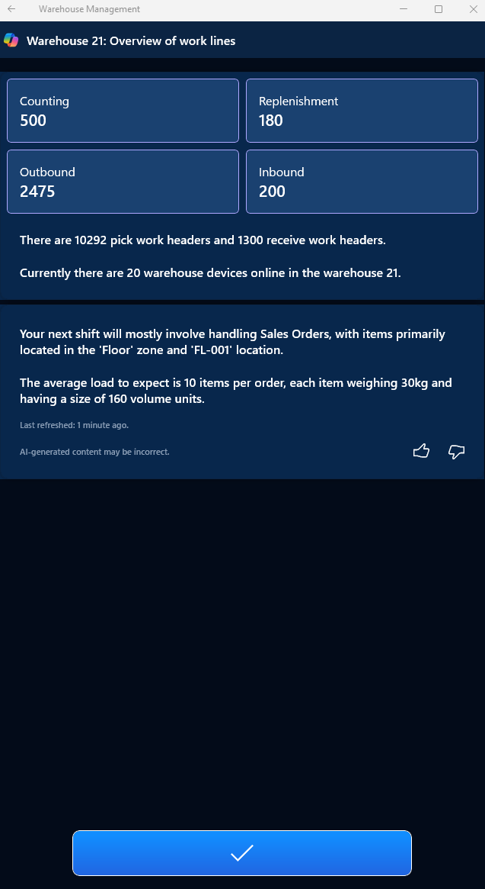
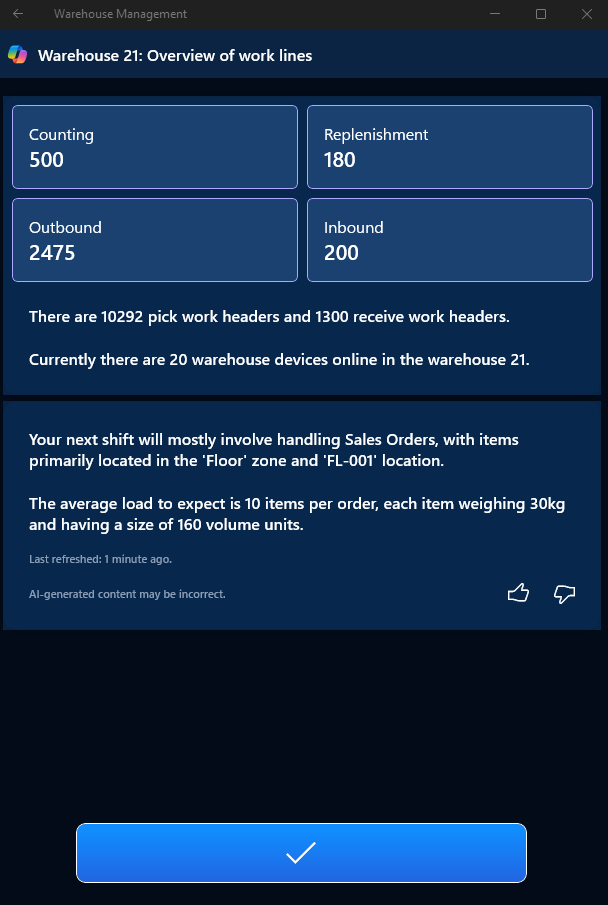
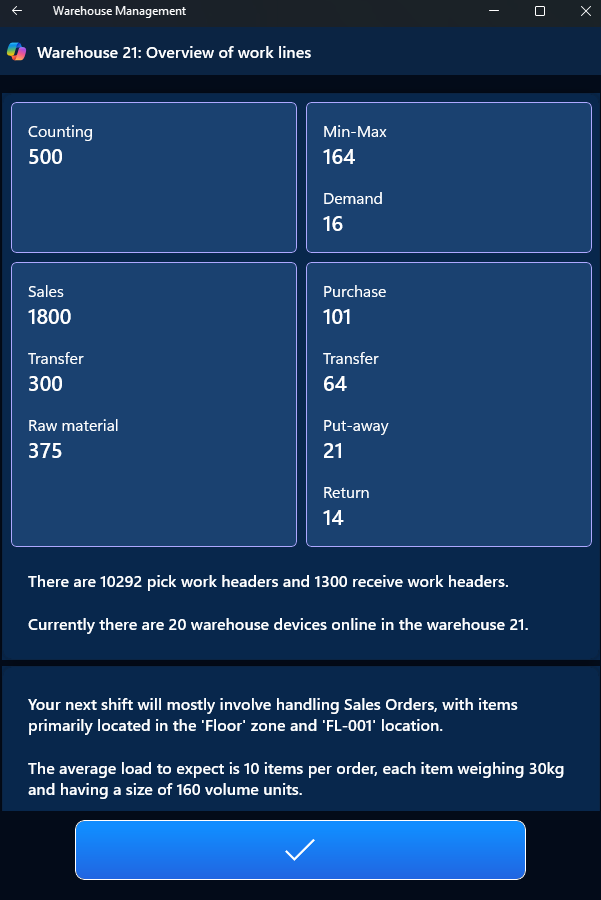
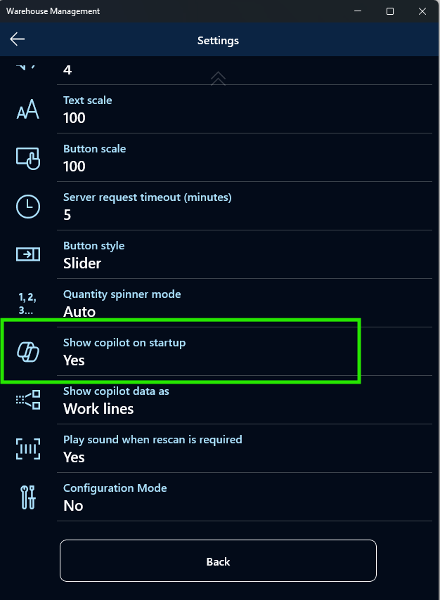
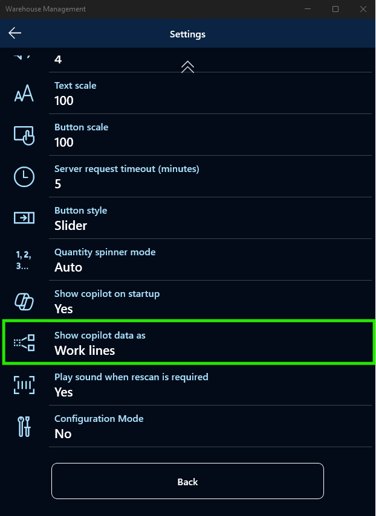
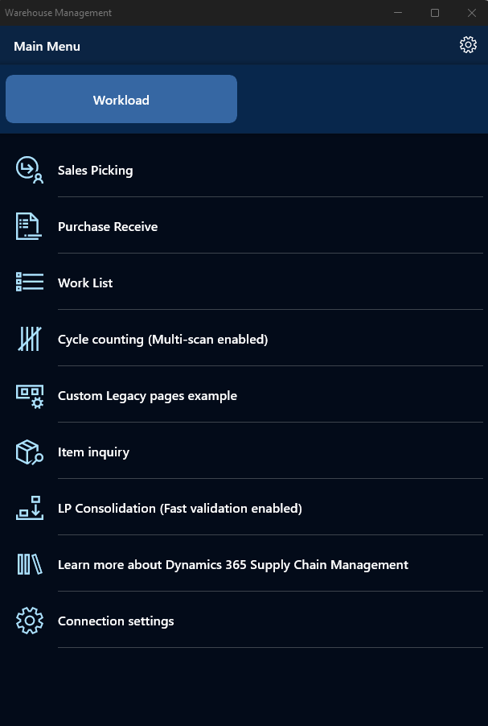

# Warehouse Management mobile app insights

Insights for the Warehouse Management mobile app are provided to warehouse worker when they login, depending on configuration, and on-demand using summary page. The information that is shown can include the following details:

-   The number of pick and receive work headers or work lines.

-   The number of active warehouse mobile app sessions in the warehouse.

-   Insights into the available work type that can be conducted. In this case warehouse workers can see the workload and can better plan their shift.

-   Workload is displayed either in headers or lines.

-   Warehouse worker can at any point of time see details of available work per work type.

-   Page includes AI generated insights that are providing additional information about available work.

## Business value

Optimize the way warehouse workers engage with their daily tasks by providing overview of their workday, assisted by AI, directly on their mobile app's workload screen. Generative AI ensures that workers are aware of shift status. This detailed information about available tasks enhances operational efficiency, reduces time spent on information retrieval, and optimizes resource allocation across the warehouse floor.

## Feature details

The Warehouse Management mobile app in Dynamics 365 Supply Chain Management includes a Workload screen that leverages advanced generative AI technology to provide warehouse workers with an overview of their workday. The workload screen displays crucial information, including the number of remaining, not started, work tasks as number of headers or work lines. When you click on main screen, It offers a detailed information about open work by type, enabling workers to quickly grasp their day's objectives.

The workload screen offers insights into relevant warehouse operations, such as the number of active warehouse mobile sessions working in the same warehouse. This fosters a more connected and efficient workplace by promoting awareness and coordination among workers.

Workload page includes AI generated insights that are providing additional information about available work.

## Prerequisites

The Warehouse Management mobile app is available for Microsoft Windows, Google Android, and Apple iOS operating systems. To use workload screen user needs to have Warehouse mobile app Version 2.3.2.0 or later and Dynamics 365 should be version 10.0.39 or higher.

## Setup 

Workload page will be displayed to every worker upon login as soon as prerequisites are met.

However, user can disable automatic display of the Workload page on every login in mobile app user settings Show copilot on startup &gt; Yes/No

Furthermore, users can on the same user settings decide if workload data will be displayed in work headers or lines using Show copilot data as &gt; Work Lines / Work Headers.

## How to use it 

If enabled in user settings warehouse worker will be provided with insights every time, they login.

At any point of time each warehouse worker can get insights on-demand by going to warehouse mobile app root menu and selecting Workload on the top of the screen.

