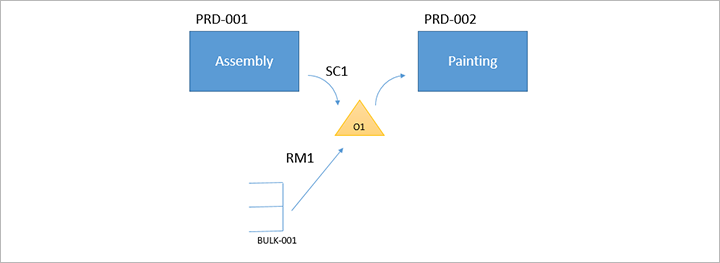

---
# required metadata

title: Work policies
description: This article explains how to set up work policies.
author: perlynne
ms.date: 07/31/2020
ms.topic: article
ms.prod: 
ms.technology: 

# optional metadata

ms.search.form: WHSWorkPolicy
audience: Application User
# ms.devlang: 
ms.reviewer: kamaybac
# ms.tgt_pltfrm: 
# ms.custom: [used by loc for articles migrated from the wiki]
ms.search.region: Global
# ms.search.industry: [leave blank for most, retail, public sector]
ms.author: perlynne
ms.search.validFrom: 2020-07-31
ms.dyn365.ops.version: 10.0.13
---

# Work policies

[!include [banner](../includes/banner.md)]

This article explains how to set up the system and the Warehouse Management mobile app so that they support work policies. You can use this functionality to quickly register inventory without creating putaway work when you receive purchase or transfer orders, or when you complete manufacturing processes. This article provides general information. For detailed information that is related to license plate receiving, see [License plate receiving via the Warehouse Management mobile app](warehousing-mobile-device-app-license-plate-receiving.md).

A work policy controls whether warehouse work is created when a manufactured item is reported as finished, or when goods are received by using the Warehouse Management mobile app. You set up each work policy by defining the conditions where it applies: the work order types and processes, the inventory location, and (optionally) the products. For example, a purchase order for product *A0001* must be received in location *RECV* in warehouse *24*. Later, the product is consumed in another process at location *RECV*. In this case, you can set up a work policy to prevent putaway work from being created when a worker reports product *A0001* as received in location *RECV*.

> [!NOTE]
> - For a work policy to be active, you must define at least one location for it on the **Inventory locations** FastTab of the **Work policies** page. 
> - You can't specify the same location for multiple work policies.
> - The **Print label** option for mobile device menu items won't print a license plate label unless work was created.

## Activate the features in your system

To make all the functionality that is described in this article available in your system, turn on the following two features in [Feature management](../../fin-ops-core/fin-ops/get-started/feature-management/feature-management-overview.md):

- *License plate receiving enhancements*
- *Work policy enhancements for inbound work*

As of Supply Chain Management version 10.0.32, both of these features are on by default.

## The Work policies page

To set up work policies, go to **Warehouse management \> Setup \> Work \> Work policies**. Then, on each FastTab, set the fields as described in the following subsections.

### The Work order types FastTab

On the **Work order types** FastTab, add all the work order types, and the related work processes, that the work policy applies to. The following work order types and related work processes are supported for work policies.

| Work order type | Work process |
|---|---|
| Raw material picking| All related processes |
| Co-product and by-product put away | All related processes |
| Finished goods putaway | All related processes |
| Transfer receipt | License plate receiving (and putaway) |
| Purchase orders | <ul><li>License plate receiving (and putaway)</li><li>Load item receiving (and putaway)</li><li>Purchase order line receiving (and putaway)</li><li>Purchase order item receiving (and putaway)</li></ul> |

To set up a work policy so that it applies to several work processes of the same work order type, add a separate line for each work process to the grid.

For each line in the grid, set the **Work creation method** field to one of the following values:

- **Never** – The work policy will prevent warehouse work from being created for the selected work order type and related work process.
- **Cross docking** – The work policy will create cross-docking work by using the policy that you select in the **Cross docking policy name** field.

### The Inventory locations FastTab

On the **Inventory locations** FastTab, add all the locations where this work policy should be applied. If no location is associated with a work policy, the work policy won't be applied to any process.

You can't specify the same location for multiple work policies.

You can use a warehouse location that is assigned to a location profile where the **Use license plate tracking** option is turned off. In this case, workers will directly register the on-hand inventory.

### The Products FastTab

On the **Products** tab, set the **Product selection** field to control which products the policy should apply to:

- **All** – The policy should apply to all products.
- **Selected** – The policy should apply only to products that are listed in the grid. Use the toolbar on the **Products** FastTab to add products to the grid or remove them from the grid.

## Default and custom "to" locations

> [!NOTE]
> To make the functionality that is described in this section available in your system, you must turn on the *License plate receiving enhancements* and *Work policy enhancements for inbound work* features in [Feature management](../../fin-ops-core/fin-ops/get-started/feature-management/feature-management-overview.md). As of Supply Chain Management version 10.0.32, both of these features are on by default.

Previously, the system supported receiving only at the default location that is defined for each warehouse. However, mobile device menu items that use the following work creation processes now provide the **Use default data** option. This option lets you assign a custom "to" location to one or more menu items. (This option was already available for some other types of menu items.)

- License plate receiving (and putaway)
- Load item receiving (and putaway)
- Purchase order line receiving (and putaway)
- Purchase order item receiving (and putaway)

The **To location** setting for a menu item overrides the default receiving location for the warehouse, for all orders that are processed by using that menu item.

To set up a mobile device menu item to support receiving at a custom location, follow these steps.

1. Go to **Warehouse management \> Setup \> Mobile device \> Mobile device menu items**.
1. Select or create a menu item that uses one of the work creation processes that are listed earlier in this section.
1. On the **General** FastTab, set the **Use default data** option to **Yes**.
1. On the Action Pane, select **Default data**.
1. On the **Default data** page, set the following values:

    - **Default data field:** Set this field to *To location*.
    - **Warehouse:** Select the destination warehouse to use with this menu item.
    - **Location:** This field lists all the location IDs that are available for the selected warehouse. However, the setting of this field doesn't actually have any effect. Therefore, you can leave it blank. Nevertheless, you can use the list to confirm the ID that you must enter in the **Hardcoded value** field.
    - **Hardcoded value:** Enter the location ID for the receiving location that applies to this menu item.

> [!TIP]
> A work policy can be applied only if all the receiving locations are listed in the relevant work policy setup. This requirement applies regardless of whether you're using the default warehouse receiving location or a custom "to" location.

## Example scenario: Warehouse receiving

All products that are received by the *Purchase order item receiving (and putaway)* process must be registered in location *FL-001*, and they must be available in warehouse *24*. However, work should not be created. Products that are received by any other process (that is, by using other mobile device menu items) should be registered at the default warehouse receiving location (*RECV*), and work should be created as usual. (This scenario doesn't show the default receiving setup.)

This scenario requires the following elements:

- A work policy for the *Purchase order item receiving (and putaway)* process in location *FL-001*, for all products
- A mobile device menu item that has default data, and that sets the **To location** field to *FL-001*

### Prerequisites

To make the functionality that is described in this scenario available in your system, you must turn on the *License plate receiving enhancements* and *Work policy enhancements for inbound work* features in [Feature management](../../fin-ops-core/fin-ops/get-started/feature-management/feature-management-overview.md). As of Supply Chain Management version 10.0.32, both of these features are on by default.

This scenario uses the standard demo data. Therefore, if you want to work through it by using the values that are provided here, you must work on a system where demo data is installed. Additionally, you must select the **USMF** legal entity.

### Set up a work policy

1. Go to **Warehouse management \> Setup \> Work \> Work policies**.
1. Select **New**.
1. In the **Work policy name** field, enter *No purchase item putaway work*.
1. Select **Save**.
1. On the **Work order types** FastTab, select **Add** to add a row to the grid, and then set the following values for the new row:

    - **Work order type:** *Purchase orders*
    - **Work process:** *Purchase order item receiving (and putaway)*
    - **Work creation method:** *Never*
    - **Cross docking policy name:** Leave this field blank.

1. On the **Inventory locations** FastTab, select **Add** to add a row to the grid, and then set the following values for the new row:

    - **Warehouse:** *24*
    - **Location:** *FL-001*

1. On the **Products** FastTab, set the **Product selection** field to *All*.
1. Select **Save**.

### Set up a mobile device menu item to change the receiving location

1. Go to **Warehouse management \> Setup \> Mobile device \> Mobile device menu items**.
1. In the left pane, select the existing **Purchase receive** menu item.
1. On the **General** FastTab, set the **Use default data** option to *Yes*.
1. Select **Save**.
1. On the Action Pane, select **Default data**.
1. On the **Default data** page, on the Action Pane, select **New** to add a row to the grid, and then set the following values for the new row:

    - **Default data field:** *To location*
    - **Warehouse:** *24*
    - **Location:** Leave this field blank.
    - **Hardcoded value:** *FL-001*

1. Select **Save**.

### Receive a purchase order without creating work

The example in this section shows how to receive a purchase order item, but without creating work, at a location that differs from the default receiving location that is set up for the warehouse. This example uses the work policy and mobile device item that you created earlier in this scenario.

#### Create a purchase order

1. Go to **Procurement and sourcing \> Purchase orders \> All purchase orders**.
1. Select **New**.
1. In the **Create purchase order** dialog box, set the following values:

    - **Vendor account:** *US-101*
    - **Site:** *2*
    - **Warehouse:** *24*

1. Select **OK** to close the dialog box and open the new purchase order.
1. On the **Purchase order lines** FastTab, set the following values for the empty row:

    - **Item number:** *A0001*
    - **Quantity:** *1*

1. Select **Save**.
1. Make a note of the purchase order number.

#### Receive a purchase order

1. On the mobile device, sign in to warehouse *24* by using *24* as the user ID and *1* as the password.
1. Select **Inbound**.
1. Select **Purchase receive**. The **Location** field should be set to *FL-001*.
1. Enter the purchase order number for the purchase order that you created in the previous procedure.
1. In the **Item number** field, enter *A0001*.
1. Select **OK**.
1. In the **Quantity** field, enter *1*.
1. Select **OK**.

The purchase order is now received, but no work is associated with it. The on-hand inventory has been updated, and a quantity of *1* of item *A0001* is now available at location *FL-001*.

## Example scenario: Manufacturing

In the following example, there are two production orders, *PRD-001* and *PRD-002*. Production order *PRD-001* has an operation that is named *Assembly*, where product *SC1* is being reported as finished to location *001*. Production order *PRD-002* has an operation that is named *Painting* and consumes product *SC1* from location *001*. Production order *PRD-002* also consumes raw material *RM1* from location *001*. Raw material *RM1* is stored in warehouse location *BULK-001* and will be picked to location *001* by warehouse work for raw material picking. The picking work is generated when production *PRD-002* is released.

When you're planning to configure a warehouse work policy for this scenario, you should consider the following points:

- Warehouse work for putaway of finished goods isn't required when you report product *SC1* as finished from production order *PRD-001* to location *001*. The reason is that the *Painting* operation for production order *PRD-002* consumes product *SC1* at the same location.
- Warehouse work for raw material picking is required to move raw material *RM1* from warehouse location *BULK-001* to location *001*.

Here is an example of a work policy that you can set up, based on these considerations:

- **Work policy name:** *No putaway work*
- **Work order types:** *Finished goods put away* and *Co-product and by-product put away*
- **Inventory locations:** Warehouse *51* and location *001*
- **Products:** *SC1*

The following example scenario provides step-by-step instructions for setting up the warehouse work policy for this scenario.

## Example scenario: Report as finished to a location that isn't license plate–controlled

This scenario shows an example where a production order is reported as finished to a location that isn't license plate–controlled.

This scenario uses the standard demo data. Therefore, if you want to work through it by using the values that are provided here, you must work on a system where demo data is installed. Additionally, you must select the **USMF** legal entity.

### Set up a warehouse work policy

Warehouse processes don't always include warehouse work. By defining a work policy, you can prevent the creation of work for raw material picking and putaway of finished goods for a set of products at specific locations.

1. Go to **Warehouse management \> Setup \> Work \> Work policies**.
1. Select **New**.
1. In the **Work policy name** field, enter *No putaway work*.
1. On the Action Pane, select **Save**.
1. On the **Work order types** FastTab, select **Add** to add a row to the grid, and then set the following values for the new row:

    - **Work order type:** *Finished goods put away*
    - **Work process:** *All related work processes*
    - **Work creation method:** *Never*
    - **Cross docking policy name:** Leave this field blank.

1. Select **Add** again to add a second row to the grid, and then set the following values for the new row:

    - **Work order type:** *Co-product and by-product put away*
    - **Work process:** *All related work processes*
    - **Work creation method:** *Never*
    - **Cross docking policy name:** Leave this field blank.

1. On the **Inventory locations** FastTab, select **Add** to add a row to the grid, and then set the following values for the new row:

    - **Warehouse:** *51*
    - **Location:** *001*

1. On the **Products** FastTab, set the **Product selection** field to *Selected*.
1. On the **Products** FastTab, select **Add** to add a row to the grid.
1. In the new row, set the **Item number** field to *L0101*.
1. On the Action Pane, select **Save**.

### Set up an output location

1. Go to **Organization administration \> Resources \> Resource groups**.
1. In the left pane, select resource group **5102**.
1. On the **General** FastTab, set the following values:

    - **Output warehouse:** *51*
    - **Output location:** *001*

1. On the Action Pane, select **Save**.

> [!NOTE]
> Location *001* isn't a license plate–controlled location. You can set up an output location that isn't license plate–controlled only if an applicable work policy exists for the location.

### Create a production order and report it as finished

1. Go to **Production control \> Production orders \> All production orders**.
1. On the Action Pane, select **New production order**.
1. In the **Create production order** dialog box, set the **Item number** field to *L0101*.
1. Select **Create** to create the order and close the dialog box.

    A new production order is added to the grid on the **All production orders** page.

    Keep the new production order selected.

1. On the Action Pane, on the **Production order** tab, in the **Process** group, select **Estimate**.
1. In the **Estimate** dialog box, read the estimate, and then select **OK** to close the dialog box.
1. On the Action Pane, on the **Production order** tab, in the **Process** group, select **Start**.
1. In the **Start** dialog box, on the **General** tab, set the **Automatic BOM consumption** field to *Never*.
1. Select **OK** to save your setting and close the dialog box.
1. On the Action Pane, on the **Production order** tab, in the **Process** group, select **Report as finished**.
1. In the **Report as finished** dialog box, on the **General** tab, set the **Accept error** option to *Yes*.
1. Select **OK** to save your setting and close the dialog box.
1. On the Action Pane, on the **Warehouse** tab, in the **General** group, select **Work details**.

When the production order is reported as finished, no work is generated for putaway. This behavior occurs because a work policy is defined that prevents work from being generated when product *L0101* is reported as finished to location *001*.

## More information

For more information about mobile device menu items, see [Set up mobile devices for warehouse work](configure-mobile-devices-warehouse.md).

For more information about license plate receiving and work policies, see [License plate receiving via the Warehouse Management mobile app](warehousing-mobile-device-app-license-plate-receiving.md).

For more information about inbound load management, see [Warehouse handling of inbound loads for purchase orders](inbound-load-handling.md).

[!INCLUDE[footer-include](../../includes/footer-banner.md)]