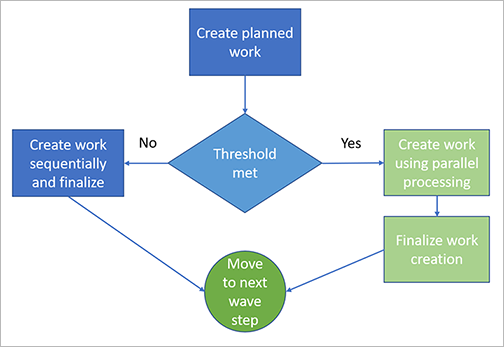

---
# required metadata

title: Wave creation and processing
description: This article describes how to create, process, and release a wave to create picking work for a load, shipment, production order, or kanban order.
author: Mirzaab
ms.date: 08/09/2022
ms.topic: article
ms.prod: 
ms.technology: 

# optional metadata

ms.search.form:  WHSWaveTemplateTable, WHSParameters, whswavetablecreatenew, WHSWaveTable, WHSWaveAttributes, WHSKanbanWaveTable, WHSWaveTableListPage, WHSKanbanWaveTableListPage, WHSProdWaveTable
audience: Application User
# ms.devlang: 
ms.reviewer: kamaybac

# ms.tgt_pltfrm: 
# ms.custom: [used by loc for articles migrated from the wiki]
ms.search.region: Global
# ms.search.industry: [leave blank for most, retail, public sector]
ms.author: mirzaab
ms.search.validFrom: 2021-03-08
ms.dyn365.ops.version: 10.0.18
---

# Wave creation and processing

[!include [banner](../includes/banner.md)]

This article describes how to create, process, and release a wave to create picking work for a load, shipment, production order, or kanban order. You can create waves for the following types of orders:

- **Sales orders** – Use shipping waves to include lines from sales orders. When a sales order is released to the warehouse, the sales order lines can be included in the wave.
- **Production orders** – Use production waves to include lines from the bill of materials (BOM) for a product.
- **Kanban orders** – Kanban waves include picking list lines from kanban orders.

For sales orders and kanban orders, inventory must be reserved before the order is released to the warehouse. Otherwise, the items or allocation lines can't be processed in a wave. However, production orders are slightly more flexible. For production orders, you can choose either of the following options:

- Require that all materials are reserved before an order can be released to the warehouse.
- Allow production orders to be released to the warehouse even though all materials can't be reserved. If you select this option, you must manually repeat the release to warehouse process when the additional materials become available. For example, this is useful if you have the materials that you need to start a production, and can wait until the additional materials become available.

You can specify which of these production order options to use by default using the **Requirement for material reservation** field on the **Production control parameters** page. However, you can change the setting for each specific production order as needed. For more information, see [Warehouse parameters for wave processing](wave-warehouse-parameters.md).

## Create and process a wave

The following diagram shows the flow for how shipping waves are created, processed, and released. The numbers correspond to the sections later in this section.

### Prerequisites

Before you start, a wave template must be available for the type of wave you want to create (shipping, production, or kanban). The wave template establishes many settings for how the wave will be generated and processed, including which steps must be done manually and which are done automatically. For more information, see [Wave templates](wave-templates.md).

### Create a wave

#### Automatically create waves based on warehouse and order type

To create waves automatically, set up [Wave templates](wave-templates.md) that apply for each relevant order type and warehouse. Make sure each template has the **Automate wave creation** option set to *Yes*.

#### Manually create waves

To manually create a wave, follow these steps:

1. Make sure that the relevant [Wave templates](wave-templates.md) aren't set to automatically create a wave for the warehouse and order types where you want to do so manually.
1. Depending on the type of wave you want to create, do one of the following:

    - Go to **Warehouse management** \> **Outbound waves** \> **Shipment waves** \> **All waves**. On the Action Pane, select **Wave**.
    - Go to **Warehouse management** \> **Outbound waves** \> **Production waves** \> **All production waves**. On the Action Pane, select **Production wave**.
    - Go to **Warehouse management** \> **Outbound waves** \> **Kanban waves** \> **All kanban waves**. On the Action Pane, select **Create wave**.

1. In the **Description** field, enter a short description of the wave. This should indicate what you are processing in the wave.

1. In the **Wave template name** field, select the wave template for the type of wave to create. The wave template contains the wave methods that will perform actions such as creating work for the wave. For example, the wave template for shipping waves can contain methods for creating loads, allocating lines to waves, replenishment, and creating picking work for the wave.

1. If you want to use wave attributes as additional query criteria for the wave, select the attributes in the **Wave attributes** fields.

### Specify what to include in a wave

After a wave has been created, you are ready to start adding content to it.

> [!NOTE]
> If needed, you can add lines to a wave even after it has been processed as long as it has not been released.

#### Automatically specify what to include in a wave

To create waves automatically, set up [Wave templates](wave-templates.md) that apply for each relevant order type and warehouse. Make sure each template has the **Automate wave creation** option set to *Yes*. Alternatively, your template could automatically assign lines to any qualifying open wave if the **Assign to open waves** option is set to *Yes*.

#### Manually specify what to include in a wave

When a wave has been created but not yet released, you can manually specify what to include in it. To add lines to a wave manually:

1. Depending on the type of wave to add lines to, do one of the following:

    - Go to **Warehouse management** \> **Outbound waves** \> **Shipment waves** \> **All waves**. On the Action Pane, select **Wave**.
    - Go to **Warehouse management** \> **Outbound waves** \> **Production waves** \> **All production waves**. On the Action Pane, select **Production wave**.
    - Go to **Warehouse management** \> **Outbound waves** \> **Kanban waves** \> **All kanban waves**. On the Action Pane, select **Create wave**.

1. Select the wave. On the Action Pane, select one of the following:

      - **Maintain shipments**
      - **Maintain productions**
      - **Maintain kanban job picking lists**

1. In the upper part of the window, select the line to add to the wave, and then select **Add to wave**. The line is moved to the **Wave lines** FastTab.

    Repeat this step for each line to add. To add all lines, select **Add all**.

    > [!TIP]
    > For shipment waves, you can quickly find a specific order by selecting a custom filter in the **Wave filter code** field. Wave filter codes contain query criteria for shipments, which are created in the **Wave filters** form. This field is not available for production waves or kanban waves.
    > A green check mark in the **On wave** column indicates that the shipment has been added to the wave.

### Process the wave to create the picking work

After a wave has been created and contains all of its required lines, you are ready to process it to create the corresponding picking work.

#### Automatically process a wave

To automatically process a wave, set up the relevant [Wave templates](wave-templates.md) with the automatic processing options required.

#### Manually process a wave

You can process a wave only when the **Wave status** is *Created*. After you process a wave, the **Wave status** will be changed to *Held*.

To manually process a wave that has all of its required content, follow these steps:

1. Depending on the type of wave to process, do one of the following:

    - Select **Warehouse management** \> **Outbound waves** \> **Shipment waves** \> **All waves**. On the Action Pane, select **Wave**.
    - Select **Warehouse management** \> **Outbound waves** \> **Production waves** \> **All production waves**. On the Action Pane, select **Production wave**.
    - Select **Warehouse management** \> **Outbound waves** \> **Kanban waves** \> **All kanban waves**. On the Action Pane, select **Create wave**.

1. Select the wave to process. On the Action Pane, select **Process**.

### Release the wave to the warehouse to start picking and packing

You must process a wave before you can release it. When you release the wave, the picking work is available in the warehouse. You can cancel a wave after it is released, and add more lines, but you can't change the lines.

#### Automatically release a wave

To automatically process a wave, set up the relevant [Wave templates](wave-templates.md) with the automatic processing options required.

#### Manually release a wave

To release a wave manually, follow these steps:

1. Depending on the type of wave to release, do one of the following:

      - Select **Warehouse management** \> **Outbound waves** \> **Shipment waves** \> **All waves**. On the Action Pane, select **Wave**.
      - Select **Warehouse management** \> **Outbound waves** \> **Production waves** \> **All production waves**. On the Action Pane, select **Production wave**.
      - Select **Warehouse management** \> **Outbound waves** \> **Kanban waves** \> **All kanban waves**. On the Action Pane, select **Create wave**.

1. Select the wave to release. On the Action Pane, select **Release wave**.

## Containerize a wave

Automated containerization creates containers and the picking work for shipments when a wave is processed. For details about how to set it up, see [Containerization](wave-containerization.md).

## Work with the scheduled work creation

When the *Schedule work creation* feature is enabled, wave processing will create planned work, which will eventually be used by the new work creation process. During work creation, the work will be blocked using the *Organization-wide work blocking* feature. For more information, see [Schedule work creation during wave](configure-wave-schedule-work-creation.md).

The following flowchart shows how planned work is created during wave processing.

### Planned work

The **Planned work details** page (**Warehouse management \> Work \> Planned work details**) shows information about the planned work, which is initially created during wave processing. The following **Process status** values are available:

- **Queued** - The planned work is waiting to be used to create work.
- **Completed** - The planned work has been used to create work.
- **Failed** – The wave processing has failed. Note that the planned work can be in a **Failed** state with or without related actual work. When the actual work creation process fails, the actual work remains in status *Cancelled*.

### Batch job for the work creation process

To view the batch jobs for processing waves, select **Batch jobs** on the Action Pane on the **All waves** page.

From here, you can view all the batch task details for each of the batch job IDs.

## Cancel a wave

If needed, you can cancel a wave that has been processed. To cancel a wave, and the picking work that was created, follow these steps:

1. Depending on the type of wave to cancel, do one of the following:

      - Go to **Warehouse management** \> **Outbound waves** \> **Shipment waves** \> **All waves**.
      - Go to **Warehouse management** \> **Outbound waves** \> **Production waves** \> **All production waves**.
      - Go to **Warehouse management** \> **Outbound waves** \> **Kanban waves** \> **All kanban waves**.

1. Select the wave to cancel. On the Action Pane, on the **Work** tab, select **Cancel**.

## Review wave batch job details

Use the **Wave batch job details** page to inspect the batch jobs and related tasks associated with any wave. This is especially useful for troubleshooting a wave that has failed. Without this feature, only administrators will typically have access to batch job details. The **Wave batch job details** page can be made available to non-admin users and provides a read-only view of batch jobs and related tasks.

### Turn the Wave batch job details page on or off

To use this feature, it must be turned on for your system. As of Supply Chain Management version 10.0.25, the feature is turned on by default. As of Supply Chain Management version 10.0.29, the feature is mandatory and can't be turned off. If you're running a version older than 10.0.29, then admins can turn this functionality on or off by searching for the *Wave batch job details* feature in the [Feature management](../../fin-ops-core/fin-ops/get-started/feature-management/feature-management-overview.md) workspace.

### Use the Wave batch job details page

The **Wave batch job details** page combines batch jobs and batch job tasks, which lets you investigate all the wave steps without needing to navigate back and forth between a single batch job and the batch tasks list. The page also provides access to the batch log and, if you have the required permissions, provides a link to the **Batch jobs** page.

To open this page, select a wave on any of several different wave pages and then select **Wave batch job details** from the Action Pane.

## Review load validation and error messages

During wave processing, the system validates and displays the status for each load line in the wave. If no warnings occur, it continues to the next wave step. If warnings do occur, it instead shows the following error after it has finished validating the entire wave:

> Found invalid load lines in wave. Please remove the invalid load lines.

You are then able to review the final status of each load line in the wave and correct all warnings before trying again. This lets you address all the warnings at once before reprocessing the wave. (In previous releases, the system stopped processing the wave after the first warning, so you could only fix warnings one at a time.)

The way the system displays your wave processing status messages depends on how you have set the **Create wave processing history log** option on the **Warehouse management parameters** page.

- When **Create wave processing history log** is set to *No*, the load line status messages are shown in the Action center.
- When **Create wave processing history log** is set to *Yes*, the load line status messages are shown on the **Wave processing history log** page. To view the log, go to **Warehouse management \> Outbound waves \> Wave processing history log**.

## Additional resources

- [Configure wave processing example](tasks/configure-wave-processing.md)
- [Wave templates](wave-templates.md)
- [Containerization](wave-containerization.md)