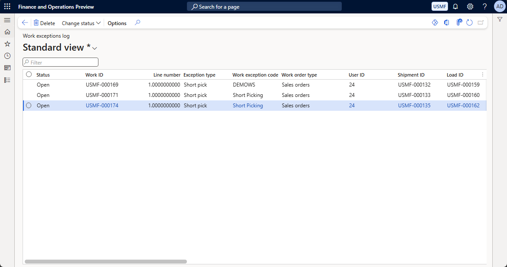
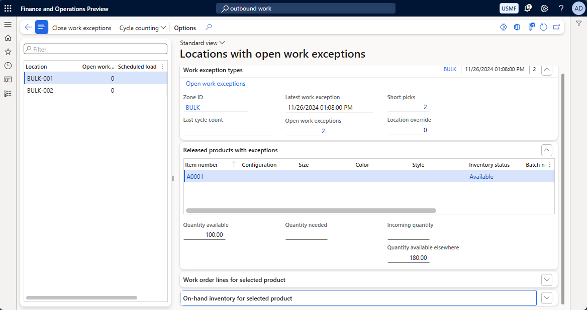
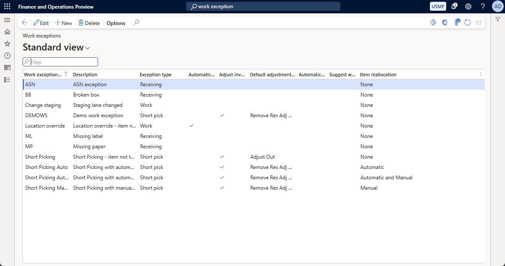

# Work exceptions log

[!include [banner](../includes/banner.md)]

Work exceptions let you register work related errors that occur in your warehouse operations, for example: discrepancies in inventory, missing goods on given locations, etc. Registering these exceptions in the work exceptions log can be used to help track and diagnose issues related to warehouse work workflows such as pick or pack procedures.

To view the work exceptions log, navigate to **Warehouse management \> Work \> Work exceptions log**), where it can be further filtered based **Status** or other characteristics inherited from the Work.

Work exceptions can also be visualized from other forms, such as **Outbound work monitoring** (found in **Warehouse management \> Workspaces \> Outbound work monitoring**), where **Locations** with open exceptions can be further explored.

Take note that even once resolved, logs are kept in the system until explicitly removed either manually or using a clean-up job.

## Example: Creating a work exception based on short pick

Work exceptions are automatically created in some workflows based on given events. One of the possible ways to create a work exception is by performing a short pick. Assuming an already existing **Work**, in the mobile app:

- Navigate to: **Outbound \> Sales Picking**;
- Input the **Work Id** and select Ok;
- Input the **Location** and select Ok;
- Select **Short Pick**;
- Input:
    - The target **License Plate**;
    - The quantity picked;
    - The reason for the short pick (for example: item wasn't in the expected location);
- Select Ok and complete the **Work**.

The short pick event generates a work exception in **Location**, which can be visualized in one of the above mentioned forms.

Different behaviors based on type of work exception can be configured in **Warehouse management \> Setup \> Work \> Work exceptions**, for example, to adjust inventory at the **License Plate** or to allow automatic item reallocation.

[!INCLUDE[footer-include](../../includes/footer-banner.md)]
