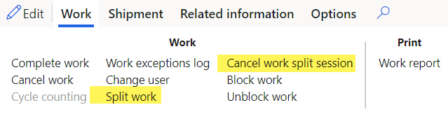
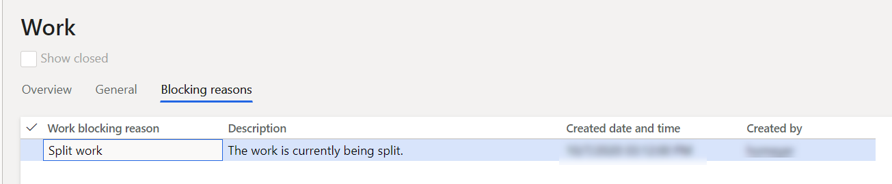

---
# required metadata

title: Work split
description: This article provides information about work split functionality. This functionality lets you split large work orders into several smaller work orders that you can then assign to multiple warehouse workers. In this way, the same work can be picked simultaneously by several warehouse workers.
author: Mirzaab
ms.date: 10/15/2020
ms.topic: article
ms.prod: 
ms.technology: 

# optional metadata

# ms.search.form:  [Operations AOT form name to tie this article to]
audience: Application User
# ms.devlang: 
ms.reviewer: kamaybac
# ms.tgt_pltfrm: 
# ms.custom: [used by loc for articles migrated from the wiki]
ms.search.region: Global
ms.search.industry: WHSWorkTableListPage
ms.author: mirzaab
ms.search.validFrom: 2020-10-15
ms.dyn365.ops.version: 10.0.8
---

# Work split

[!include [banner](../includes/banner.md)]

Work split functionality lets you split large work IDs (that is, work orders that have several lines) into several smaller work IDs that you can then assign to multiple warehouse workers. In this way, the same work creation number can be picked simultaneously by several warehouse workers.

> [!IMPORTANT]
> You can split only work orders that have a status of *Open* or *In-progress*.

## Turn on the work split functionality

Before you can use the work split functionality, you must turn on the feature and its prerequisite feature in your system. Administrators can use the [feature management](../../fin-ops-core/fin-ops/get-started/feature-management/feature-management-overview.md) settings to check the status of the features and turn them on as required. Turn on the following features in the following order:

1. *Organization-wide work blocking* (As of Supply Chain Management version 10.0.21, this feature is mandatory and can't be turned off.)
1. *Work split* (As of Supply Chain Management version 10.0.32, this feature is mandatory and can't be turned off.)

> [!NOTE]
> The first time you turn on the *Organization-wide work blocking* feature, a data upgrade is automatically applied across all legal entities.

## Enhancements to the Work details and All work pages

The *Work split* feature adds the following two buttons to the **Work** tab on the Action Pane of the **Work details** and **All work** pages:

- **Split work** – Split the current work ID into multiple smaller work IDs that can be processed by separate workers.
- **Cancel work split session** – Cancel the work split session, and make the work available for processing.

> [!IMPORTANT]
> The **Split work** button won't be available if any of the following conditions are met:
>
> - The work status is something other than *Open* or *In progress*.
> - A container ID is associated with the work ID. (A container can't be systematically split, because it requires physical actions.)
> - The work is associated with a cluster.
> - The work order type is something other than one of the following types:
>
>    - Sales orders
>    - Raw material picking
>    - Transfer issue
>
> - The work is currently being split by another user. If you try to open the splitting page for work that is already being split by another user, you receive the following error message: "The work with ID \#\#\#\# is currently being split. Retry in a few minutes. If you continue to receive this message, contact a supervisor."

A new work blocking reason, *Split work*, indicates when the work ID is in the process of being split. It's shown both on the **Split work** page and in the Warehouse Management mobile app if a user tries to run the work. When blocking reasons are used, the name of the **Blocked wave** field from the work ID is changed to **Blocked**.

## Initiate a work split

The feature adds a new **Split work** page that lets users split work lines from the work ID. When the page is first opened, it shows lines that have a work status of *Open* and that are available to be split. On the Action Pane, select **Split work** to process the selected work.

To split work, follow these steps.

1. Open one of the following work pages:

    - **Work details** (**Warehouse management \> Work \> Work details**)
    - **All work** (**Warehouse management \> Work \> All work**)

1. In the grid, select a work ID to split. The **Work order type** field must be set to one of the following values:

    - Sales orders
    - Raw material picking
    - Transfer issue

1. On the Action Pane, on the **Work** tab, in the **Work** group, select **Split work**.

    The **Split work** page appears and shows the work lines that are open and available to be split. By default, only available work lines are shown. To view all lines for the work ID (for example, lines that have a work type of *Put*), select the **Show all lines** check box above the grid.

    The following message is shown: "Users can't process lines of the work until you finish splitting and close this page."

    The **Work blocking reason** field for the current work will be set to *Split work*, and the work will be blocked.

    

1. Select the lines to remove from the current work ID and add to a new work ID. The following events occur:

    - When you split the work, the selected line or lines from the original work ID are canceled and then copied to a new work ID.
    - The existing work template structure and the location of the put (and also future pick/put pairs) are preserved. Values for the following work ID fields are copied from the original work to the new work:

        - Load ID
        - Shipment ID
        - Work order type
        - Order number
        - Site
        - Warehouse
        - Work priority
        - Work pool ID
        - Wave ID
        - Work creation number

    - The following fields aren't copied to the new work ID:

        - **Work ID** – A new work ID is generated from the appropriate number sequence.
        - **Work status** – This field is set to *Open*.
        - **Locked by** – This field is initially set to blank.
        - **Target license plate ID** – This field is left blank.
        - **Created date and time** – This field is set to the current date and time.
        - **Blocked wave/frozen** – This field is recomputed for the original work ID and the new work ID.

1. On the Action Pane, select **Split work**.

While the work is being split, the following message is shown: "Processing operation - Split work". While this message is visible, you can cancel the operation by selecting **Cancel** in the message box.

If the **Show all lines** check box is cleared, the line that was split off and canceled will no longer appear in the grid. If the check box is selected, you should see that the value of the **Work status** field for that line has changed to *Canceled*.

The following notification is shown to indicate that the new work ID has been created: "Work \#\#\#\# has been created by splitting off from original work \#\#\#\#."

Other work lines from the original work ID (such as *Put* lines) will be adjusted as required to reflect the lines of work that have been canceled. For example, if the original work ID had a *Put* line for a quantity of 15, and *Pick* lines that have a total quantity of 10 were canceled, the new *Put* quantity on the original work ID will now be 5.

The new work won't immediately be assigned to any user. However, you can assign it to a user now, as required, by using the standard functionality of the **Work details** page.

> [!IMPORTANT]
> You can split only work IDs that contain two or more available work lines. If you select **Split work** when there is only one work line, you will receive the following error message: "At least one work line must remain on initial work." In this case, no splitting will occur.

## Finish a work split

To finish splitting work, the *Split work* blocking reason must be removed. There are two ways to complete this step:

- The user who is splitting the work closes the **Split work** page by selecting the **Close** button (**X**) in the upper-right corner. When the page is closed, the *Split Work* blocking reason will be removed. The *Blocked* state of this work will be recomputed and, if there are no remaining blocking reasons for this work, the work will be unblocked.
- Any user opens the work ID and selects the **Cancel work split session** button on the Action Pane. The *Split work* blocking reason will be removed, and the *Blocked* state of this work will be recomputed, just as when the **Split work** page is closed.

After the *Split work* blocking reason is removed, the work can be run on the mobile device, provided that the **Blocked** state is set to *No* on the work ID.

## User blocking on the Warehouse Management mobile app

If you try to use the Warehouse Management mobile app to run picking work against a work ID that is being split, you will receive the following error message: "The work with ID \#\#\#\# is currently being split." If you receive this message, select **Cancel**. You can then continue to process other work.

## Other blocked operations

Any operations that modify work lines, work inventory transactions, or replenishment links that are related to work that is being split will fail, and the following error message will be shown: "The work with ID \#\#\#\# is currently being split."

[!INCLUDE[footer-include](../../includes/footer-banner.md)]