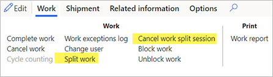

---
# required metadata

title: Work split
description: Work split functionality lets you split large work orders into several smaller work orders to be assigned to multiple warehouse workers. This enables the same work to be picked by several warehouse workers simultaneously.
author: mirzaab
manager: tfehr
ms.date: 10/15/2020
ms.topic: article
ms.prod: 
ms.service: dynamics-ax-applications
ms.technology: 

# optional metadata

# ms.search.form:  [Operations AOT form name to tie this topic to]
audience: Application User
# ms.devlang: 
ms.reviewer: kamaybac
ms.search.scope:  Retail, Core, Operations
# ms.tgt_pltfrm: 
# ms.custom: [used by loc for topics migrated from the wiki]
ms.search.region: Global
ms.search.industry: WHSWorkTableListPage
ms.author: mirzaab
ms.search.validFrom: 2020-10-15
ms.dyn365.ops.version: Release 10.0.8
---

# Work split

Work split functionality lets you split large work IDs (with several lines) into several smaller work IDs, which you can then assign to multiple warehouse workers. This enables the same **Work creation number** to be picked by several warehouse workers simultaneously.

> [!IMPORTANT]
> You can only split work orders that have a status of *Open* or *In-progress*.

## Enable the work split functionality

Before you can use this feature, you must enable it and its prerequisite on your system. Administrators can use the [feature management](../../fin-ops-core/fin-ops/get-started/feature-management/feature-management-overview.md) settings to check the features' status and enable them if needed.

First enable the prerequisite Organization-wide work blocking feature (if it isn't already). It's listed as:

- **Module** - *Warehouse management*
- **Feature name** - *Organization-wide work blocking*

> [!NOTE]
> When activating this feature, a data upgrade is automatically applied once the feature is enabled across all legal entities.

Then enable the work-split feature, which is listed as:

- **Module** - *Warehouse management*
- **Feature name** - *Work split*

## Enhancements to the "All work" and "Work details" pages

The work split feature  adds the following two options are added the **Work** tab of the Action Pane on the **Work details** and **All work** pages:

- **Split work** - Splits the current work ID into multiple smaller work IDs that can be processed by separate workers.
- **Cancel work split session** - Cancels the work split session and makes the work available for processing.

> [!IMPORTANT]
> The **Split work** option on the Action Pane won't be enabled if:
>
> - The work status is not *Open* or *In progress*.
> - There is a **Container ID** associated on the work ID. (Systematically splitting a container is not possible because it requires physical actions.)
> - The work is associated with a **Cluster**.
> - The **Work order type** is not one of the following types:
>   - Sales orders
>   - Raw material picking
>   - Transfer issue
> - The work is currently being split by another user. The system shows the following error if you try to open the splitting screen for work that is already being split by another user: "The work with ID #### is currently being split. Retry in a few minutes. If you continue to receive this message, contact a supervisor."

A new **Work blocking reason** (*Split work*) indicates when the work ID is in the process of being split and is shown on both the **Split work** page and the warehouse app if a user attempts to execute the work. The name of the **Blocked wave** field from the work ID is changed to **Blocked** when using  blocking reasons.

## Initiate a work split

This feature adds a new **Split work** page, which enables users to split work lines from the **Work ID**. On opening the page, it displays the lines (with a **Work status** of *Open*) that are available for splitting. On the Action Pane, select  **Split work** to process the selected work.

To split work:

1. Go to one of the following work pages:

    - Work details - **Warehouse management \> Work \> Work details**
    - All work - **Warehouse management \> Work \> All work**

1. In the grid, select a **Work ID** to split. The **Work order type** must be one of the following:
    - *Sales orders*
    - *Raw material picking*
    - *Transfer issue*

1. On the Action Pane, open the **Work** tab and then, from the **Work** group, select **Split work**.

1. The **Split work** page opens and displays the work lines that are open and available to be split.
    - The following message is shown: "Users can't process lines of the work until you finish splitting and close this page."
    - By default, only available work lines are displayed. To see all lines for the work ID (such as those with a **Work type** of *Put*) select the **Show all lines** check box above the grid.
    - The **Work blocking reason** will be set to *Split work* for the current work and the work will be blocked.

    

1. Select the lines to be removed from the current work ID and added to a new work ID. The following occur:
    - When you split the work, the selected line, or lines, on the original work ID are canceled and then copied to a new work ID.
    - The existing work template structure, and location of the put (as well as future pick/put pairs) are preserved. Values for the following work ID fields are copied from the original work to the new work:
        - **Load ID**
        - **Shipment ID**
        - **Work order type**
        - **Order number**
        - **Site**
        - **Warehouse**
        - **Work priority**
        - **Work pool ID**
        - **Wave ID**
        - **Work creation number**

    - The following fields won't be copied to the new work ID:
        - **Work ID** (a new work ID is generated from the appropriate number sequence)
        - **Work status** (set to *Open*)
        - **Locked by** (initially set to blank)
        - **Target license plate ID** (set to blank)
        - **Created date and time** (set to the current date and time)
        - **Blocked wave/frozen** (recomputed for the original and new work IDs)

1. On the Action Pane, select **Split work**.
1. While the work is being split, the following message is shown: "Processing operation - Split work". If needed, you can cancel the operation by selecting **Cancel** in the message window while it is displayed.

1. If the **Show all lines** check box isn't selected, the line that was split off and canceled will no longer be displayed in the grid. If the check box is selected, you will see the **Work status** for that line has change to *Canceled*.
1. The following notification is shown to indicate that the new work ID has been created: "Work #### has been created by splitting off from original work ####."
1. Other work lines from the original work ID (such as *Put* lines) will be adjusted as needed to reflect the lines of work that have been canceled. For example, if the original work ID had a  *Put* line for a quantity of 15, and *Pick* lines totaling a quantity of 10 were canceled, the new *Put* quantity on the original work ID will now be 5.

1. The new work won't be assigned to any user immediately, but you can assign one now, as needed, using the standard functionality of the **Work details** page.

> [!IMPORTANT]
> You can only split work IDs that contain two or more available work lines. If there is only one work line, then when you select **Split work**, you will receive an error message ("At least one work line must remain on initial work") and no splitting will occur.

## Finish a work split

To finish splitting work, the *Split work* blocking reason must be removed by doing one of the following:

- The user splitting the work closes the **Split Work** page by selecting the **X** button in the top-right corner. On closing the page, the *Split Work* blocking reason will be removed. The *Blocked* state of this work will be recomputed and, if there no blocking reasons left for this work, the work will be unblocked.
- Any user opens the work ID and selects the **Cancel work split session** button in the Action Pane. The *Split work* blocking reason will be removed and the *Blocked* state of this work will be recomputed, just as when closing the **Split work** page.

After the *Split Work* blocking reason is removed (and if the **Blocked** state is set to *No* on the work ID), the work can be executed on the mobile device.

## User blocking on the warehouse app

If you try to use the warehouse app to execute picking work against a work ID that is being split, the following error will be displayed: "The work with ID #### is currently being split."

On seeing this message, select the **Cancel** button to exit. Then you can continue processing other work.

## Other blocked operations

Any operations that modify work lines, work inventory transactions, or replenishment links related to a work that is being split will fail with the following error: "The work with ID #### is currently being split."
