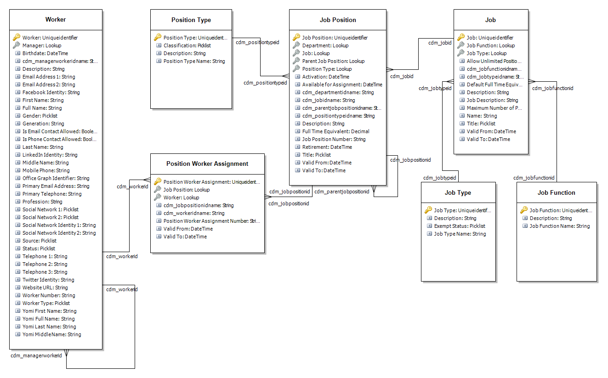

---
# required metatadata

title: Core HR entities in Common Data Service
description: Core HR uses the Common Data Service to enable extensibility and integration scenarios.
author: andreabichsel
manager: AnnBe
ms.date: 11/04/2019
ms.topic: article
ms.prod: 
ms.service: dynamics-365-talent
ms.technology: 

# optional metadata

# ms.search.form: 
audience: IT Pro
# ms.devlang: 
ms.reviewer: anbichse
ms.search.scope: Talent
# ms.tgt_pltfrm: 
# ms.custom: 
ms.search.region: Global
ms.search.industry:
ms.author: anbichse
ms.search.validFrom: 2018-08-11
ms.dyn365.ops.version: 

---

# Core HR entities in Common Data Service

Core HR uses Common Data Service to enable extensibility and integration scenarios.

For more information about Common Data Service, see [What is Common Data Service](https://docs.microsoft.com/powerapps/maker/common-data-service/data-platform-intro).

> [!IMPORTANT]
> The previous release of the Common Data Service (1.0) is being discontinued. On April 15th, 2019 the integration between Core HR and the Common Data Service (1.0) will be turned off. For more information about upgrading, see [Upgrade to Common Data Service](https://docs.microsoft.com/common-data-service/upgradecds/introduction-upgrade-cds).

The following Core HR entities are available in Common Data Service.

## Benefit entities

| Benefit Calculation Frequency | cdm_benefitcalculationfrequency |
| Benefit Calculation Frequency Pay Period | cdm_benefitcalculationfrequencypayperiod |
| Benefit Calculation Rate | cdm_benefitcalculationrate |
| Benefit Calculation Rate Detail | cdm_benefitcalculationratedetail |
| Benefit Option | cdm_benefitoption |
| Benefit Plan | cdm_benefitplan (Not enabled for custom field support) |
| Benefit Type | cdm_benefittype |

## Business Process Tasks entities

| Business Process Calendar | cdm_businessprocesscalendar |
| Business Process Group Assignment | cdm_businessprocessgroupassignment |
| Business Process Library Task Group | cdm_businessprocesslibrarytaskgroup |
| Business Process Stage | cdm_businessprocessstage |
| Checklist Template Header | cdm_businessprocesstemplateheader |
| Checklist Template Task | cdm_businessprocesstemplatetask |

## Compensation entities

| Compensation Fixed Plan | cdm_compensationfixedplan |
| Compensation Grid | cdm_compensationgrid |
| Compensation Level | cdm_compensationlevel |
| Compensation Pay Frequency | cdm_compensationpayfrequency |
| Compensation Reference Point Setup | cdm_compensationreferencepointsetup |
| Compensation Reference Point Setup Line | cdm_compensationreferencepointsetupline |
| Compensation Region | cdm_compensationregion |
| Compensation Structure | cdm_compensationstructure |
| Compensation Variable Plan | cdm_compensationvariableplan |
| Compensation Variable Plan Level | cdm_compensationvariableplanlevel |
| Compensation Variable Plan Type | cdm_compensationvariableplantype |
| Fixed Compensation Event | cdm_fixedcompensationevent |
| Vesting Rule | cdm_vestingrule |
| Worker Fixed Compensation | cdm_workerfixedcompensation |

## Organization entities

| Department | cdm_department |
| Employment | cdm_employment |
| Company | cdm_company |
| Job | cdm_job |
| Job Function | cdm_jobfunction |
| Job Position | cdm_jobposition |
| Position Type | cdm_positiontype |
| Position Worker Assignment | cdm_positionworkerassignmentmap |
| Job Type | cdm_jobtype |
| Language | cdm_language |

## Leave and Absence entities

| Leave Bank Transaction | cdm_leavebanktransaction |
| Leave Enrollment | cdm_leaveenrollment |
| Leave Plan | cdm_leaveplan |
| Leave Request | cdm_leaverequest |
| Leave Request Detail | cdm_leaverequestdetail |
| Leave Type | cdm_leavetype |
| Leave Type Reason Code | cdm_leavetypereasoncode |

## Payroll entities

| Pay Cycle | cdm_paycycle |
| Pay Period | cdm_payperiod |
| Payroll Earning Code | cdm_payrollearningcode |
| Bank Account Disbursement | cdm_bankaccountdisbursement |
| Tax Region | cdm_taxregion |

## Worker entities

| Worker | cdm_worker |
| Worker Address | cdm_workeraddress |
| Worker Personal Detail | cdm_workerpersonaldetail |
| Worker Person Identification Number | cdm_workerpersonidentificationnumber |
| Worker Person Identification Type | cdm_workerpersonidentificationtype |
| Work Calendar | cdm_workcalendar |
| Work Calendar Day | cdm_workcalendarday |
| Work Calendar Holiday |cdm_workcalendarholiday |
| Work Calendar Holiday Line | cdm_workcalendarholidayline |
| Work Calendar Time Interval | cdm_workcalendartimeinterval (Not enabled for custom field support) |
| Worker Bank Account | cdm_workerbankaccount |

## Worker Setup entities

| Veteran Status | cdm_veteranstatus |
| Ethnic Origin | cdm_ethnicorigin |
| Reason Code | cdm_reasoncode |
| Person Identification Issuing Agency | cdm_personidentificationissuingagency |

## Competency entities
| Skill Type | cdm_skilltype |

## Entity relationship models

### Worker

### Job and Job Position

### Benefits

### Compensation

### Leave

### Work Calendar

