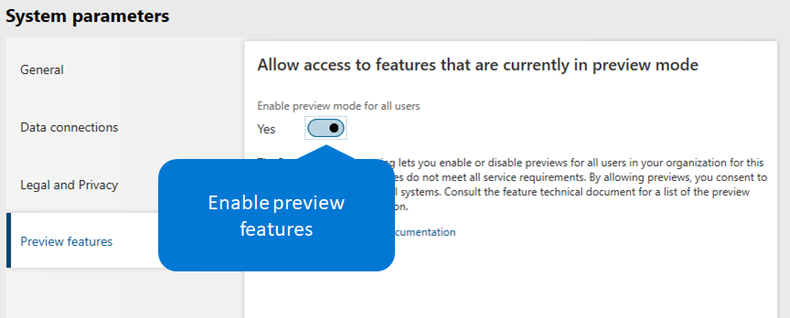

---
# required metadata

title: Access preview features in Microsoft Dynamics 365 for Talent
description: This topic describes how an administrator can enable preview features in Microsoft Dynamics 365 for Talent, and it lists the features that are currently enabled for preview.
author: tracykeya
manager: AnnBe
ms.date: 05/30/2019
ms.topic: article
ms.prod: 
ms.service: dynamics-ax-applications
ms.technology: 

# optional metadata

ms.search.form: 
# ROBOTS: 
audience: Application User
# ms.devlang: 
ms.reviewer: anbichse
ms.search.scope: Talent, Core
# ms.tgt_pltfrm: 
ms.custom: 7521
ms.assetid: 3b953d5f-6325-4c9e-8b9b-6ab0458a73f8
ms.search.region: Global
# ms.search.industry: 
ms.author: trkeya
ms.search.validFrom: 2018-04-30
ms.dyn365.ops.version: AX 7.1.0, Talent April 2019 update

---

# Manage preview features

[!include[banner](../includes/banner.md)]

As part of our continuous rollout of human capital management (HCM) capabilities for Microsoft Dynamics 365 for Talent, we want to let customers experience new features as soon as possible. Administrators can see and use preview features in their environments. These features are almost ready for general availability and have gone through extensive testing. We're just looking for a final round of customer feedback and validation before we release them for general availability.

This topic describes how you can enable preview features, and it lists the features that are currently available for preview. This list will be updated as features are released to general availability and as new features are released to preview. No notification is given when new features are released to preview. Users will just start to see the features. For more information about new features in Talent, see [What's new or changed in Dynamics 365 for Talent](./whats-new.md) and [Dynamics 365 and Power Platform Release Notes](https://docs.microsoft.com/business-applications-release-notes).

## Enable or disable preview features

To access preview features, you must first enable them in your environment. Enabling or disabling preview features is environment-specific.

> [!IMPORTANT]
> When you turn on the **Preview Features** setting, you enable preview features for all users in your organization who are in that environment. When you turn off the setting, you disable preview features and make them inaccessible to your users. Preview features have limited support in Talent. They might use fewer privacy and security measures, and they aren't included in the Talent service level agreement (SLA). You should not use preview features to process personal data (that is, any information that could identify you), or to process other data that is subject to legal or regulatory compliance requirements.

### Attract

1. Sign in to Microsoft Dynamics 365 for Talent: Attract.
2. On the **Setup** menu (the gear symbol) in the upper-right corner, select **Admin center**.
3. On the **Feature management** tab, select the option next to **Preview features** so that it turns blue and says **On**.

    

4. Select or cancel the selection of individual preview features. If you do nothing, all available preview features are enabled.
5. Refresh your browser to start to see the new features. Any users who are already signed in will see the features the next time they sign in, or they can refresh their browser to see the features immediately.

> [!NOTE]
> Some preview features might require additional configuration. Follow the links next to the preview feature to complete the setup for it.

### Core HR

1. Sign in to Talent.
2. Select **System administration**, and then select the **Links** tab.
3. On the **System administration** page, under **Setup**, select **System parameters**.
4. On the **System parameters** page, select the **Preview features** tab.
5. Set the **Enable preview mode for all users** option to **Yes** to make preview features available.

    

> [!NOTE]
> To disable preview features, use the same steps, but set the **Enable preview mode for all users** option to **No**. When you disable preview features, they become inaccessible to your users, and errors might occur in processes that are associated with the features.

### Onboard

No preview features are currently available for Microsoft Dynamics 365 for Talent: Onboard.

## Features that are currently in preview

### Attract

- [Candidate recommendation](./intelligent-recommendations.md#candidate-recommendations) – If more than ten candidates have resumes or complete profiles, the candidates who most closely meet a job's requirements appear in the **Applicants to consider** section on that job's page.
- [Job recommendation](./intelligent-recommendations.md#job-recommendations) – If more than ten jobs are posted on your career site, Attract provides job recommendations to prospects.
- [Broadbean integration](./posting-jobs-external.md#post-jobs-to-broadbean) – You can post jobs from Attract to Broadbean, an external job posting site. After you enable this preview feature, you must complete the setup by entering your Broadbean username, client ID, and encryption token.
- [Analytics](./analytic-reports.md) – In the Analytics Hub, hiring teams can view key metrics for a single job, plus aggregated metrics across all jobs.
- [EEO](./activities-attract.md) – New activity types let you use a predefined form to collect Equal Employment Opportunity (EEO) and Office of Federal Contract Compliance Program (OFCCP) data from a candidate. The predefined form can't be edited.
- [Prospect recommendation](./intelligent-recommendations.md#prospect-recommendations) – Attract reviews past applicants and current candidates to provide a list of prospects who are a good match for your job.
- [Relevance search](./attract-talent-pools.md#search-and-view-candidate-profiles) – You can search your whole candidate database for specific skills, names, or educational backgrounds. Attract searches the whole profile and highlights all the matches that it finds. Attract also searches all documents that are available for a candidate and intelligently ranks the search results.
- [Activity audience](./whats-new-talent-march-20.md#setting-the-audience-on-activities) – You can set the audience for activities (such as Interview, Schedule, or Feedback) to **All candidates**, **Internal candidates**, or **External candidates**. You can deliver customer activities, such as YouTube videos, web content, and Microsoft Forms, to all candidates, internal candidates only, external candidates only, or the hiring team.
- [Apply with LinkedIn](./career-site.md#enable-applying-for-jobs-with-linkedin-profiles) – You can set up an option on your Attract career site to let job candidates apply by using LinkedIn. This feature streamlines the application process for your candidates by letting them use their LinkedIn profile to automatically fill in their applications on your career site.
- [Source tracking](./source-tracking.md) – Attract tracks the source of candidate applications to provide valuable information that can help you target your recruiting efforts. You can also select an application source when you're adding a candidate to a job or talent pool.
- [Silver medalist](./whats-new-talent-march-20.md#designate-silver-medalists-to-assign-high-value-applicants-for-future-positions) – If any candidates are a great fit for your organization, but you didn't extend an offer to them for your current position, you can designate them as silver medalists. This feature helps reduce your time to hire the next time you have a similar position available.

### Core HR

- [Validate position hierarchy data](./whats-new-talent-may-13-2019.md#new-page-to-validate-position-hierarchy-data) – You can validate the managerial hierarchy for any circular references that were inadvertently imported.
- [Specify reason codes on leave types](./whats-new-talent-may-13-2019.md#specify-reason-codes-on-leave-types) – You can specify reason codes for leave types.
- [Require reason codes on time-off requests](./whats-new-talent-may-13-2019.md#require-reason-codes-for-specific-leave-types-on-time-off-requests) – In addition to specifying reason codes for leave types, you can require reason codes for time-off requests.
- [Provide a leave and absence transaction list for HR](./whats-new-talent-may-13-2019.md#provide-a-leave-and-absence-transaction-list-for-hr) – You can view a list of leave and absence transactions to help provide insights into time-off balances.

### Onboard

No preview features are currently available for Onboard.

## Feedback

We want to hear from you about your experience with any of these preview features. We encourage you to regularly post your feedback on the following sites as you use these or any other features:

- [Community](https://community.dynamics.com/enterprise/f/759?pi53869=0&category=Talent) – This site is a great resource where users can discuss use cases, ask questions, and get community help.
- Let us know about features that you want to see in the product, or let us know about any changes you think we should make to existing features. Suggest product ideas on the following sites:

    - [Attract ideas](https://powerusers.microsoft.com/t5/Ideas-for-Attract/idb-p/Attract)
    - [Core HR ideas](https://powerusers.microsoft.com/t5/Ideas-for-Human-Resources/idb-p/HumanResources)
    - [Onboard ideas](https://powerusers.microsoft.com/t5/Ideas-for-Onboard/idb-p/Onboard)

Make sure that you don't include personal data (any information that could identify you) in your feedback or product review submissions. Collected information might be analyzed further and isn't used to answer requests under applicable privacy laws. Personal data that is collected separately under these programs is subject to the [Microsoft Privacy Statement](https://privacy.microsoft.com/privacystatement).

> [!TIP]
> Bookmark this topic, and check back often to stay up to date about new preview features as we release them.

## See also

- [Try or buy Talent apps](https://dynamics.microsoft.com/talent/overview/)
- [What's new](./whats-new.md)
- [Release notes](https://docs.microsoft.com/business-applications-release-notes/index)
- [Get support for Talent](./talent-support.md)
