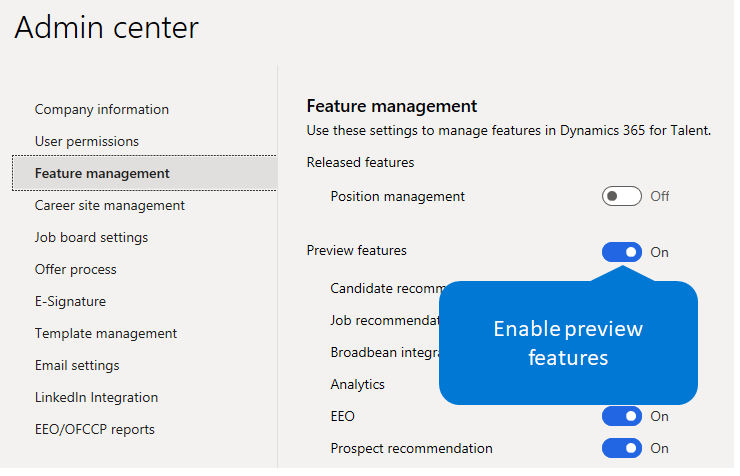

---
# required metadata

title: Manage features
description: This topic describes how an administrator can enable preview features in Microsoft Dynamics 365 Talent, and it lists the features that are currently enabled for preview.
author: andreabichsel
manager: AnnBe
ms.date: 02/03/2020
ms.topic: article
ms.prod: 
ms.service: dynamics-human-resources
ms.technology: 

# optional metadata

ms.search.form: 
# ROBOTS: 
audience: Application User
# ms.devlang: 
ms.reviewer: anbichse
ms.search.scope: Talent, Core
# ms.tgt_pltfrm: 
ms.custom: 7521
ms.assetid: 3b953d5f-6325-4c9e-8b9b-6ab0458a73f8
ms.search.region: Global
# ms.search.industry: 
ms.author: anbichse
ms.search.validFrom: 2020-02-03
ms.dyn365.ops.version: AX 7.1.0, Talent

---

# Manage features

[!include [banner](includes/banner.md)]

As part of our continuous rollout of human capital management (HCM) capabilities for Microsoft Dynamics 365 Human Resources, we want to let customers experience new features as soon as possible. Administrators can see and use preview features in their environments. These features are almost ready for general availability and have gone through extensive testing. We're just looking for a final round of customer feedback and validation before we release them for general availability.

This topic describes how you can enable preview features, and it lists the features that are currently available for preview. This list will be updated as features are released to general availability and as new features are released to preview. No notification is given when new features are released to preview. Users will just start to see the features. For more information about new features in Talent, see [What's new or changed in Dynamics 365 Talent](./whats-new.md) and [Dynamics 365 and Power Platform Release Notes](https://docs.microsoft.com/business-applications-release-notes).

## Enable or disable preview features

To access preview features, you must first enable them in your environment. Enabling or disabling preview features is environment-specific.

> [!IMPORTANT]
> When you turn on the **Preview Features** setting, you enable preview features for all users in your organization who are in that environment. When you turn off the setting, you disable preview features and make them inaccessible to your users. Preview features have limited support in Talent. They might use fewer privacy and security measures, and they aren't included in the Talent service level agreement (SLA). You should not use preview features to process personal data (that is, any information that could identify you), or to process other data that is subject to legal or regulatory compliance requirements.

### Attract

1. Sign in to Microsoft Dynamics 365 Talent: Attract.
2. On the **Setup** menu (the gear symbol) in the upper-right corner, select **Admin center**.
3. On the **Feature management** tab, select the option next to **Preview features** so that it turns blue and says **On**.

    

4. Select or cancel the selection of individual preview features. If you do nothing, all available preview features are enabled.
5. Refresh your browser to start to see the new features. Any users who are already signed in will see the features the next time they sign in, or they can refresh their browser to see the features immediately.

> [!NOTE]
> Some preview features might require additional configuration. Follow the links next to the preview feature to complete the setup for it.

## Feedback

We want to hear from you about your experience with any of these preview features. We encourage you to regularly post your feedback on the following sites as you use these or any other features:

- [Community](https://community.dynamics.com/enterprise/f/759?pi53869=0&category=Talent) – This site is a great resource where users can discuss use cases, ask questions, and get community help.
- Let us know about features that you want to see in the product, or let us know about any changes you think we should make to existing features. Suggest product ideas on the following sites:

    - [Attract ideas](https://powerusers.microsoft.com/t5/Ideas-for-Attract/idb-p/Attract)
    - [Onboard ideas](https://powerusers.microsoft.com/t5/Ideas-for-Onboard/idb-p/Onboard)

Make sure that you don't include personal data (any information that could identify you) in your feedback or product review submissions. Collected information might be analyzed further and isn't used to answer requests under applicable privacy laws. Personal data that is collected separately under these programs is subject to the [Microsoft Privacy Statement](https://privacy.microsoft.com/privacystatement).

> [!TIP]
> Bookmark this topic, and check back often to stay up to date about new preview features as we release them.

## See also

- [Try or buy Talent apps](https://dynamics.microsoft.com/talent/overview/)
- [What's new or changed in Dynamics 365 Talent](./whats-new.md)
- [Release plans](https://docs.microsoft.com/business-applications-release-notes/index)
- [Get support for Microsoft Dynamics 365 Talent](./talent-support.md)
