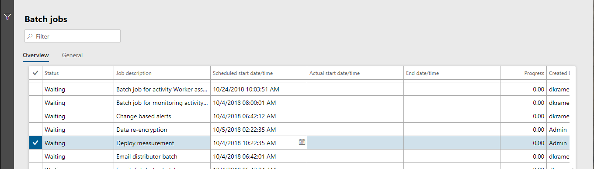

---
# required metadata

title: Analytic reports are not updated
description: This topic explains what to do if a customer's data changes don't appear in any of the customer's workspaces.
author: andreabichsel
manager: AnnBe
ms.date: 11/02/2018
ms.topic: article
ms.prod: 
ms.service: dynamics-365-talent
ms.technology: 

# optional metadata

# ms.search.form: 
# ROBOTS: 
audience: Application User
# ms.devlang: 
ms.reviewer: anbichse
ms.search.scope: Talent
# ms.tgt_pltfrm: 
ms.custom: 
ms.assetid: 
ms.search.region: Global
# ms.search.industry: 
ms.author: anbichse
ms.search.validFrom: 2018-11-02
ms.dyn365.ops.version: Talent

---

# Analytic reports are not updated

[!include [banner](includes/banner.md)]

**Issue**

A customer's data changes don't appear on the **Analytics** tabs of any of the customer's workspaces.

**Cause**

By default, Microsoft Power BI reports are refreshed every four hours, according to the schedule of the Deploy measurement batch job.

**Resolution**

This issue might just be a matter of timing. Follow these steps to start the batch job and update the analytics workspaces.

1. Open the **Batch jobs** page at **System administration \> Links \> Batch jobs \> Batch jobs**. Alternatively, use Search, and enter **Batch Jobs**.
1. Find the **Deploy measurement** job in the list.
1. Select **Edit** at the top of the page, and set the scheduled start date/time to a value that will refresh the analytics closer to the current time.

