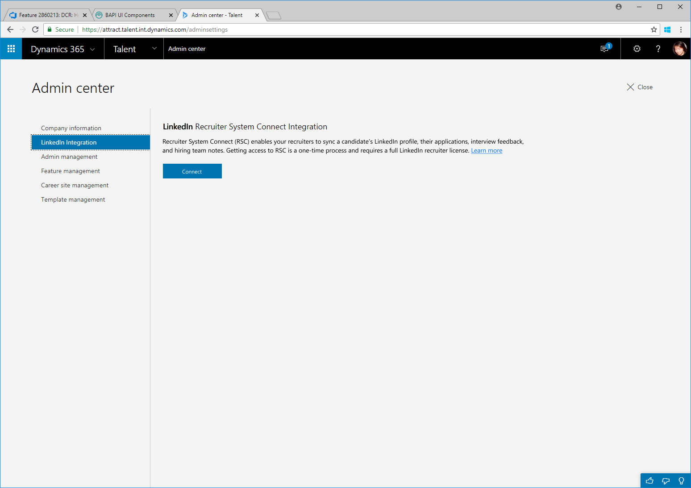
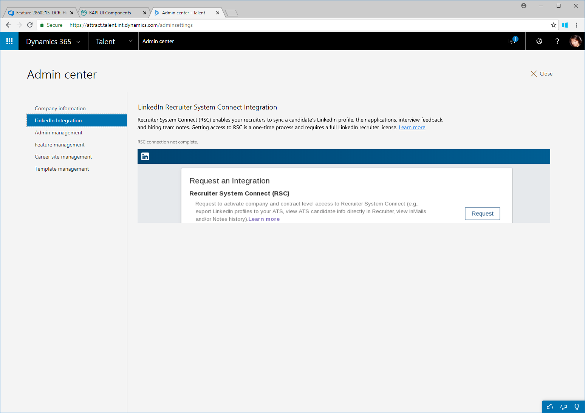
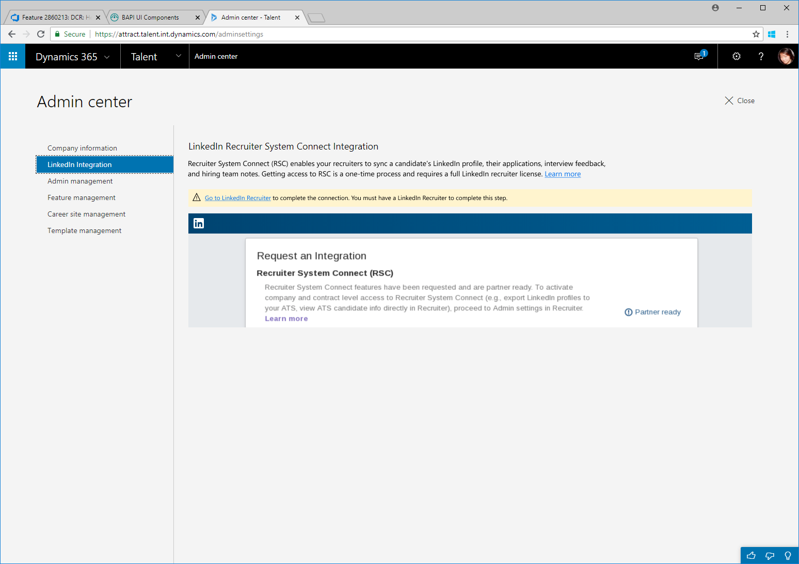
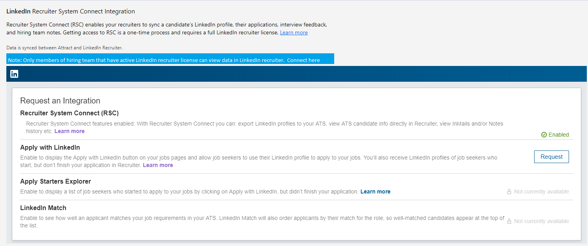

---
# required metadata

title: Set up LinkedIn integration with Attract
description: This topic explains how to configure LinkedIn integration for Microsoft Dynamics 365 Talent - Attract so that you can easily post jobs to LinkedIn from Attract, and so that your recruiters can sync their recruiting information with a candidate's LinkedIn profile.
author: andreabichsel
manager: AnnBe
ms.date: 07/08/2019
ms.topic: article
ms.prod: 
ms.service: dynamics-365-talent
ms.technology: 

# optional metadata

ms.search.form: 
# ROBOTS: 
audience: Application User
# ms.devlang: 
ms.reviewer: anbichse
# ms.search.scope: Talent, Core
# ms.tgt_pltfrm: 
ms.custom: 7521
ms.assetid: 3b953d5f-6325-4c9e-8b9b-6ab0458a73f8
ms.search.region: Global
# ms.search.industry: 
ms.author: anbichse
ms.search.validFrom: 2019-07-08
ms.dyn365.ops.version: Talent October 2018 update

---

# Set up LinkedIn integration with Attract

[!include [banner](includes/banner.md)]

Help your recruiters and hiring managers attract top talent by configuring LinkedIn integration with Microsoft Dynamics 365 Talent: Attract. Attract lets you post jobs directly to LinkedIn, the largest professional online network.

Jobs that you post to LinkedIn through Attract are Limited Listings and are provided at no extra cost to your company. These listings are available only through LinkedIn software partners such as Attract. They don't appear in the **Careers** panel on your company's LinkedIn page, because only paid listings appear there. However, they are shown when potential candidates view all available jobs. Limited Listings are also shown in LinkedIn job searches.

Attract provides two ways to integrate with LinkedIn to help you source candidates from this popular career site:

- Post jobs from Attract to LinkedIn.
- Source candidates from LinkedIn to Attract.

You configure both options on the **LinkedIn Integration** tab in the Admin center. To open the Admin center, go to <https://attract.talent.dynamics.com/adminsettings>.

> [!NOTE]
> To use LinkedIn Recruiter integration with Attract, you need the [Comprehensive hiring add-on](https://docs.microsoft.com/dynamics365/unified-operations/talent/attract-comprehensive-hiring) and [LinkedIn Recruiter licenses](https://business.linkedin.com/talent-solutions/cx/17/08/recruiter-demo-fs2-k18). For more information, see [Which version of Microsoft Dynamics 365 Talent - Attract](./attract-comprehensive-hiring.md).

If you're having trouble posting jobs to LinkedIn, see [Troubleshooting integration with LinkedIn and Microsoft Dynamics 365 Talent - Attract](./attract-troubleshoot-linkedin.md).

For information about other ways to post jobs to LinkedIn, see [Attract integration with LinkedIn FAQ](./attract-linkedin-faq.md).

## Configure job posting to LinkedIn

Before you can post jobs from Attract to LinkedIn, you need a [LinkedIn Company ID](https://aka.ms/findID). Your LinkedIn Company ID is a string of numbers that uniquely identifies your company in LinkedIn. For more information, see [Associating your LinkedIn Company ID with the LinkedIn Job Board - Frequently Asked Questions](https://aka.ms/findID).

Attract sends a feed of your job postings to LinkedIn, and LinkedIn checks for the feed approximately once per day. It can take up to 48 hours for your jobs to be posted to the site.

Jobs that are posted to LinkedIn appear on the live LinkedIn site. LinkedIn doesn't have a test environment for posting jobs. Therefore, make sure that you don't accidentally post any test jobs. 

1. On the **Setup** menu (the gear symbol) in the upper-right corner, select **Admin center**. Alternatively, go to <https://attract.talent.dynamics.com/adminsettings>.
2. Select the **LinkedIn Integration** tab.
3. Under **Company name**, enter the name of your company, and under **Company ID**, enter your LinkedIn Company ID. Make sure that the company name matches the name that appears on your company's LinkedIn page. For more information about LinkedIn Company IDs, see [Associating your LinkedIn Company ID with the LinkedIn Job Board - Frequently Asked Questions](https://www.linkedin.com/help/linkedin/answer/98972).

    If you need to change any information for your organization, see [Change your organization's address, technical contact, and more](https://docs.microsoft.com/office365/admin/manage/change-address-contact-and-more). If you still have issues, contact [LinkedIn support](https://www.linkedin.com/help/linkedin).

4. Select **Save**.

## Set up LinkedIn Recruiter with Attract 

To allow recruiters to source jobs through LinkedIn Recruiter, you must configure integration with LinkedIn Recruiter in Attract. To complete the configuration process, you must work with the user who is an admin on your organization's LinkedIn Recruiter contract.

1. On the **Setup** menu (the gear symbol) in the upper-right corner, select **Admin center**. Alternatively, go to <https://attract.talent.dynamics.com/adminsettings>.
2. Select the **LinkedIn Integration** tab.

    

3. Select **Connect** to start the setup. You will be guided through the LinkedIn sign-in process.
4. If you have seats on multiple LinkedIn contracts, select the contract that you want to connect to the Attract system. If you have a seat on only one LinkedIn contract, you can skip this step.
5. Under **Recruiter System Connect (RSC)**, select **Request**.

    

6. The **Recruiter System Connect (RSC)** setting should now appear as **Partner ready**. If you see **Notify partner** on this page, wait a few seconds, select **Notify partner**, and then refresh the page. The setting should now appear as **Partner ready**.

    

7. To complete the following steps, you must have admin privileges on your LinkedIn Recruiter contract.

    1. Sign in to LinkedIn by using your admin account, and then select **LinkedIn Recruiter** in the upper right. 
    2. On the **More** menu at the top of the page, select **Admin Settings**, and then select the **ATS** tab.
    3. To enable one-click export for just one contract, turn on **Contract Level access (for every seat on this contract**. To enable it for the whole company, turn on **Company Level access (for every contract in your company**.

    

8. In the Attract Admin center, select the **LinkedIn integration** tab. The **Recruiter System Connect (RSC)** setting should now appear as **Enabled**.

    

## Set up Apply with LinkedIn in Attract

You can allow candidates to apply to your jobs by using their LinkedIn profiles. For more information about Apply with LinkedIn, see [The Power of LinkedIn Everywhere: Apply with LinkedIn](https://blog.linkedin.com/2011/07/24/apply-with-linkedin).

This feature is currently in preview. Before you follow these steps, make sure that Apply with LinkedIn is enabled. For more information about how to enable preview features, see [Access preview features in Microsoft Dynamics 365 Talent](./access-preview-feature.md).

1. On the **Setup** menu (the gear symbol) in the upper-right corner, select **Admin center**. Alternatively, go to <https://attract.talent.dynamics.com/adminsettings>.
2. Select the **LinkedIn Integration** tab.

    

3. Next to **Apply with LinkedIn**, select **Connect** to start the setup. You will be guided through the rest of the process with LinkedIn.

## See also

[Attract integration with LinkedIn FAQ](./attract-linkedin-faq.md)

[Post jobs to external career sites from Attract](./posting-jobs-external.md)

[Source candidates with LinkedIn Recruiter in Microsoft Dynamics 365 Talent - Attract](./attract-linkedin-recruiter.md)

[Create, approve, and post jobs in Attract](./creating-jobs-attract.md)

[Troubleshooting integration with LinkedIn and Microsoft Dynamics 365 Talent - Attract](./attract-troubleshoot-linkedin.md)
