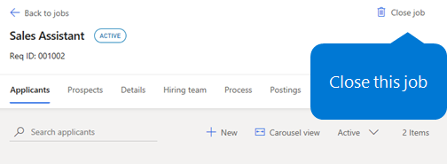
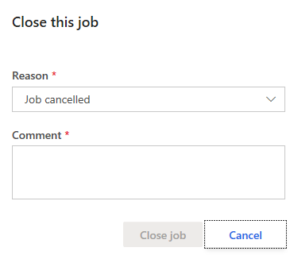
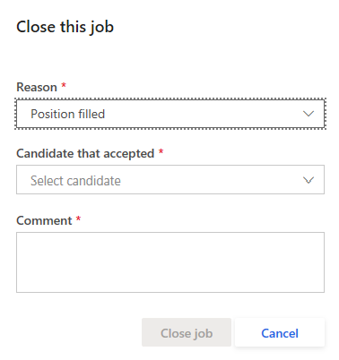

---
# required metadata

title: Close a job in Attract
description: This topic explains how to close a job in Microsoft Dynamics 365 Talent - Attract.
author: andreabichsel
manager: AnnBe
ms.date: 07/10/2019
ms.topic: article
ms.prod: 
ms.service: dynamics-365-talent
ms.technology: 

# optional metadata

# ms.search.form: 
audience: Application User
# ms.devlang: 
ms.reviewer: anbichse
# ms.search.scope: Talent
# ms.tgt_pltfrm: 
# ms.custom: 
ms.search.region: Global
# ms.search.industry: 
ms.author: anbichse
ms.search.validFrom: 2010-07-10
ms.dyn365.ops.version: Talent 2019 Wave 1 update

---

# Close a job in Attract

[!include [banner](includes/banner.md)]

In Microsoft Dynamics 365 Talent: Attract, you can close a job as either **Job cancelled** or **Position filled**. You can cancel a job at any time.

If you want to indicate that the position was filled, a candidate must have accepted an offer for the job.

## Cancel a job

You can cancel a job in Attract at any time.

1. In the **Jobs** tab in Attract, select the job you want to cancel.

2. Select **Close job**.

   

3. In the **Close this job** dialog box, select **Job cancelled**, add any comments, and then select **Close job**.

   

## Close a job as Position filled

You can close a job as **Position filled** after at least one prospect has completed the Offer stage.

1. In the **Jobs** tab in Attract, select the job you want to cancel.

2. Select **Close job**.

   

3. In the **Close this job** dialog box, select **Position filled**, select the candidate who accepted the offer, add any comments, and then select **Close job**.

   

   > [!NOTE]
   > You can only close a job as **Position filled** when at least one prospect has completed the Offer stage. If the job application doesn't have **Offer accepted** selected, or if the application doesn't display a status of **Accepted** in Offer, the **Position filled** option won't display in the **Reason** dropdown.

