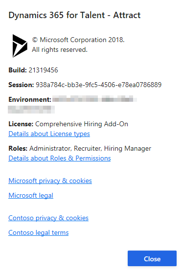

---
# required metadata

title: Choose a version of Attract
description: This topic provides information about the capabilities in the different versions of Microsoft Dynamics 365 Talent - Attract.
author: andreabichsel
manager: AnnBe
ms.date: 04/04/2019
ms.topic: article
ms.prod: 
ms.service: dynamics-365-talent
ms.technology: 

# optional metadata

ms.search.form: 
# ROBOTS: 
audience: Application User
# ms.devlang: 
ms.reviewer: anbichse
# ms.search.scope: Talent, Core
# ms.tgt_pltfrm: 
ms.custom: 7521
ms.assetid: 3b953d5f-6325-4c9e-8b9b-6ab0458a73f8
ms.search.region: Global
# ms.search.industry: 
ms.author: anbichse
ms.search.validFrom: 2018-10-15
ms.dyn365.ops.version: Talent October 2018 update

---

# Choose a version of Attract

[!include [banner](includes/banner.md)]

The version of Microsoft Dynamics 365 Talent: Attract that is right for you depends on your organization's size and needs. The basic version of Attract provides a subset of functionality that is targeted at smaller teams or organizations where the hiring manager is the primary user. You can start to use the basic version of Attract with one or more licenses.

Attract with the Comprehensive Hiring Add-On is targeted at medium to large teams or organizations where the recruiter or talent specialist is the primary user. The Comprehensive Hiring Add-On requires that licenses be purchased through a [Microsoft Dynamics 365 partner](https://dynamics.microsoft.com/partners/find-a-partner/).

> [!NOTE]
> The Attract trial showcases Attract with the Comprehensive Hiring Add-On. This add-on provides comprehensive recruiting and hiring capabilities, such as the ability to post jobs to an Attract career site or an external recruiting site such as LinkedIn. If you choose the basic version of Attract, your subscription will include a subset of the capabilities that are provided in the trial version.

For more information about pricing and licensing, see the [Microsoft Dynamics 365 Licensing Guide](https://go.microsoft.com/fwlink/?LinkId=866544).

## Feature comparison

| Capability | Attract | Comprehensive Hiring Add-On |
| ---------- | :-----------: | :-------------------: |
| Basic dashboard | :heavy_check_mark: | :heavy_check_mark: |
| Manage security and roles | :heavy_check_mark: | :heavy_check_mark: |
| Manage job requisitions | :heavy_check_mark: | :heavy_check_mark: |
| Create a job-level hiring process | :heavy_check_mark: | :heavy_check_mark: |
| Create candidates, and manage profiles | :heavy_check_mark: | :heavy_check_mark: |
| Create a single talent pool | :heavy_check_mark: | :heavy_check_mark: |
| Schedule interviews | :heavy_check_mark: | :heavy_check_mark: |
| Provide candidate access to application details | :heavy_check_mark: | :heavy_check_mark: |
| Create approval flows for job requisitions | | :heavy_check_mark: |
| Manage organization-level hiring processes | | :heavy_check_mark: |
| Post jobs to Attract and external career sites | | :heavy_check_mark: |
| Create candidate application flows through an Attract career site | | :heavy_check_mark: |
| Provide candidate access to a full profile and application history | | :heavy_check_mark: |
| Connect with LinkedIn Recruiter  This capability requires a LinkedIn Recruiter license, which must be    purchased separately through LinkedIn.</blockquote> | | :heavy_check_mark: |
| Manage offers | | :heavy_check_mark: |
| Create shared and global talent pools | | :heavy_check_mark: |
| Manage email templates | | :heavy_check_mark: |
| Provide candidate and job recommendations | | :heavy_check_mark: |

## Find out which version of Attract you have

1. In Attract, select the question mark (**?**) in the upper-right corner of the page.
2. Select **About**.

    The window that appears shows which type of license you have for Attract.

    

## Frequently asked questions

### Why don't I see all the features that were included in the Attract trial?

There are several reasons why you might not see all the features that were included in the Attract trial:

- The Attract trial showcases Attract with the Comprehensive Hiring Add-On, and you now have the basic version of Attract. The basic version of Attract includes a subset of features that is targeted at hiring managers for small teams and organizations.
- You have Attract with the Comprehensive Hiring Add-On, but you haven't been assigned the correct roles to use all the features. For more information, see [Security and role management in Attract](security-attract.md).

### Why don't I see all the Attract features that my coworker sees?

There are several reasons why you might not see all the Attract features that your coworker sees:

- Your coworker is working with a trial or a license for Attract with the Comprehensive Hiring Add-On, whereas you're working with the basic version of Attract.
- You have Attract with the Comprehensive Hiring Add-On, but you haven't been assigned the correct roles to use all the features. For more information, see [Security and role management in Attract](security-attract.md).
