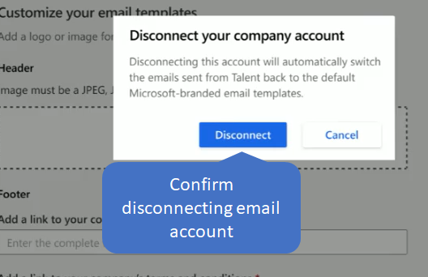
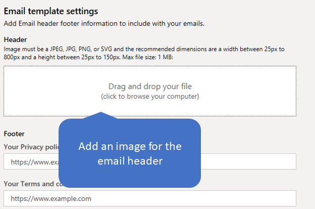

---
# required metadata

title: Configure email settings in Attract
description: This topic explains how to configure settings for email that is sent by Microsoft Dynamics 365 Talent - Attract.
author: andreabichsel
manager: AnnBe
ms.date: 06/04/2019
ms.topic: article
ms.prod: 
ms.service: dynamics-365-talent
ms.technology: 

# optional metadata

ms.search.form: 
# ROBOTS: 
audience: Application User
# ms.devlang: 
ms.reviewer: anbichse
ms.search.scope: Talent, Core
# ms.tgt_pltfrm: 
ms.custom: 7521
ms.assetid: 3b953d5f-6325-4c9e-8b9b-6ab0458a73f8
ms.search.region: Global
ms.search.industry: 
ms.author: anbichse
ms.search.validFrom: 2019-06-04
ms.dyn365.ops.version: Talent October 2018 update

---

# Configure email settings in Attract

[!include [banner](includes/banner.md)]

Your brand establishes trust and helps you build a relationship with candidates before they even apply for your positions. Positive brand perception attracts top talent and increases the loyalty of existing employees. Microsoft Dynamics 365 Talent: Attract lets you configure emails so that they reflect your company's brand. Therefore, you can provide a consistent experience to job candidates as they progress through the application process.

Attract lets you perform these actions:

- Configure email settings so that your company's Microsoft Exchange email service account is used. In this way, candidates know that the emails are coming from your company. For example, you can configure your settings so that candidates receive emails from `recruiting@contoso.com` instead of `contoso@microsoft.com`.
- Create consistent branding for all your email communications by setting a global header and footer for email templates. 

> [!NOTE]
> To configure Attract so that it uses your company's email service account to send email, you need the Comprehensive hiring add-on.

## Connect an email service account

By connecting your company's email service account, you can create a branded email experience for your job candidates. If you don't connect your company account, Attract uses the default Microsoft-branded email service account.

1. Select **Settings** (the gear symbol in the upper-right corner), and then select **Admin center**.
2. On the **Email settings** tab, under **Email service accounts**, select **Connect a company account**.

    

    For more information about how to create a shared email account, see [Shared mailboxes in Exchange Online](https://docs.microsoft.com/exchange/collaboration-exo/shared-mailboxes).

3. In the Microsoft sign-in window, sign in by using your corporate credentials.
4. If you haven't yet set up an email service account, or if you want to add a new one, select **Add new service account**, and then enter your email information. If you've already set up the email service account that you want to use, select it.

When your email service account is successfully configured, you will see it listed under **Email service accounts**.

## Disconnect an email service account

If you want to stop using your company's domain in email communications through Attract, you can disconnect an email service account.

1. Select **Settings** (the gear symbol in the upper-right corner), and then select **Admin center**.
2. On the **Email settings** tab, under **Email service accounts**, select the **More** button (three vertical dots) next to the email service account that you want to disconnect.
3. Select **Disconnect email account**.

    

4. When you're prompted to confirm the operation, select **Disconnect**.

    

If you don't connect a different email service account, emails that are sent from Attract will use the default Microsoft-branded email service account.

## Configure email template settings

You can upload an image of your company's logo and other information as a branded header for your emails. You can also provide links to your privacy policy and terms of use in email footers.

> [!NOTE]
> You must comply with all applicable laws of your country or region, and also the country or region that governs the email recipient. These laws include anti-spam regulations.

1. Select **Settings** (the gear symbol in the upper-right corner), and then select **Admin center**.
2. On the **Email settings** tab, under **Email template settings**, drag the image that you want to use as your email header into the image box, or click in the image box to browse for the file. To replace an existing image, you must first select **Remove** next to it. The image must be a JPEG, JPG, PNG, or SVG file. The recommended size for images is between 25 and 800 pixels wide, and between 25 and 150 pixels high. The maximum file size for the header is 1 megabyte (MB).

    

3. Under **Your Privacy policy for communications**, provide a link to your company's privacy policy. Under **Your Terms and conditions for communication**, provide a link to your company's terms of use.

    

4. Select **Save** to save your email template settings.
