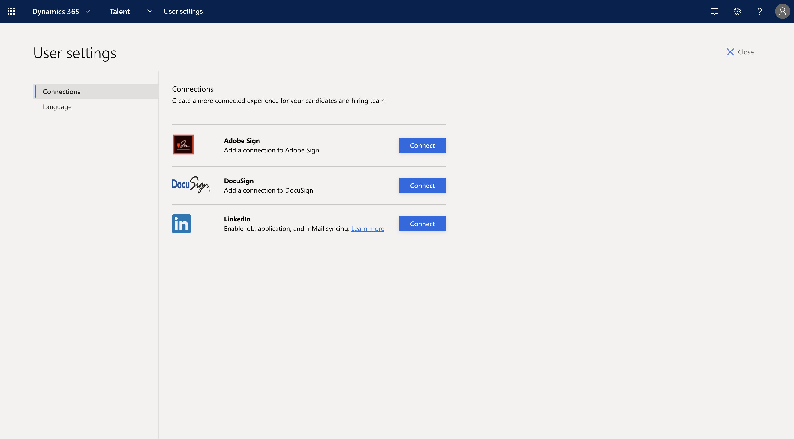
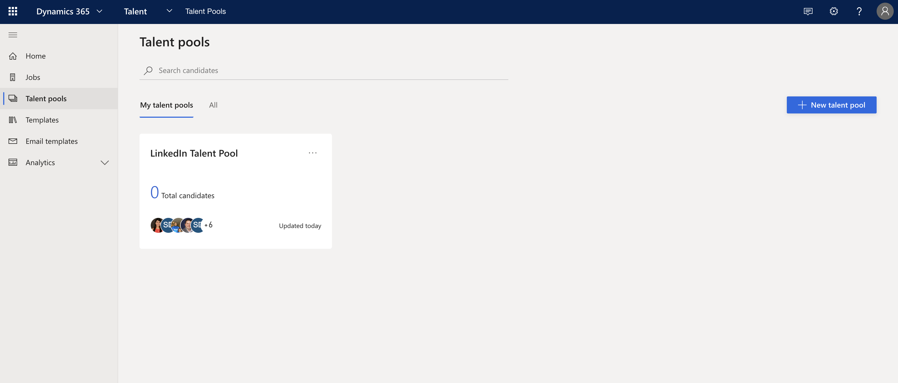
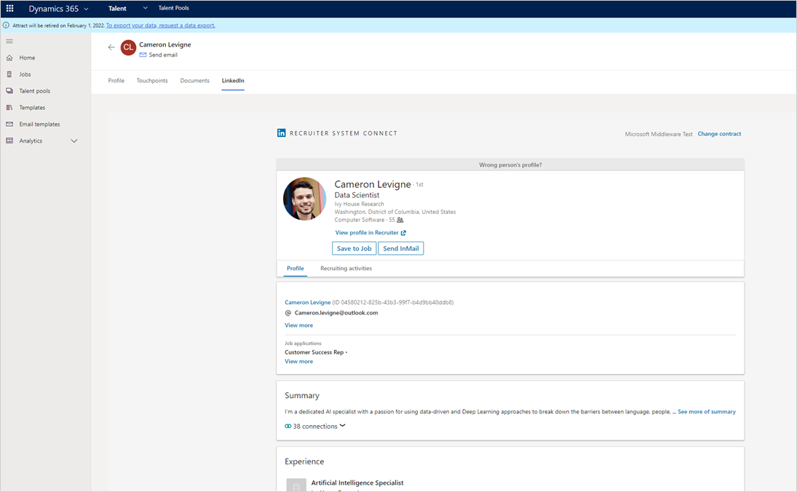
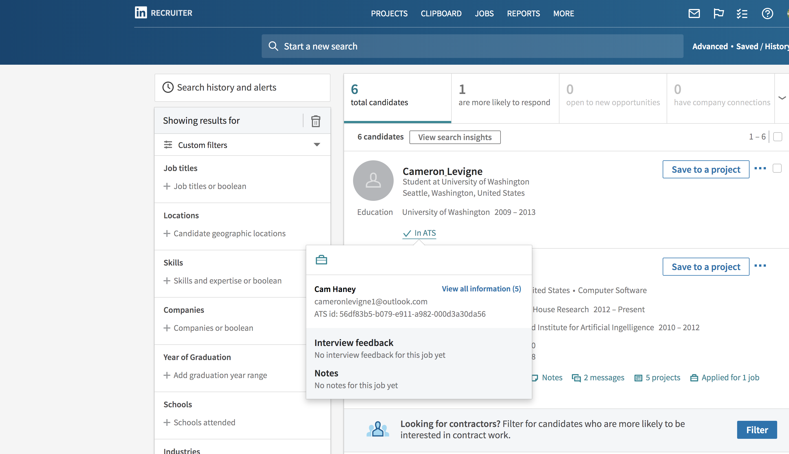

---
# required metadata

title: Source candidates with LinkedIn Recruiter in Attract
description: Use the LinkedIn integration provided by Microsoft Dynamics 365 Talent - Attract to source job candidates through LinkedIn Recruiter.
author: andreabichsel
manager: AnnBe
ms.date: 08/31/2020
ms.topic: article
ms.prod: 
ms.service: dynamics-365-talent
ms.technology: 

# optional metadata

ms.search.form: 
# ROBOTS: 
audience: Application User
# ms.devlang: 
ms.reviewer: anbichse
ms.search.scope: Talent, Core
# ms.tgt_pltfrm: 
ms.custom: 7521
ms.assetid: 3b953d5f-6325-4c9e-8b9b-6ab0458a73f8
ms.search.region: Global
ms.search.industry: 
ms.author: anbichse
ms.search.validFrom: 2018-10-15
ms.dyn365.ops.version: Talent October 2018 update

---

# Source candidates with LinkedIn Recruiter in Attract

[!include [banner](includes/banner.md)]

LinkedIn is the world's largest online professional network, giving you access to the world's top talent. Microsoft Dynamics 365 Talent: Attract lets you source candidates directly from LinkedIn. Therefore, it's easier than ever to find the talent that you need to fill your open positions. After you set up your connection with LinkedIn through Attract, you can view potential LinkedIn candidates for your positions and export them into Attract with just one click.

If you don't seem to have this capability, contact your admin. Before you can take advantage of LinkedIn Recruiter from Attract, your admin must [set up integration with LinkedIn](./attract-admin-linkedin.md). You can then set up your connection with LinkedIn Recruiter and start finding candidates.

>[!IMPORTANT]
>As of July 1, 2020, LinkedIn no longer supports Internet Explorer 11. Users can still access LinkedIn with Internet Explorer 11, but will be prompted to upgrade or use a different browser. For more information, see [Supported Internet Browsers for LinkedIn](https://www.linkedin.com/help/linkedin/answer/4135/supported-internet-browsers-for-linkedin).

## Set up your connection with LinkedIn Recruiter

Before you can start working with LinkedIn Recruiter through Attract, you must set up your connection with LinkedIn Recruiter. For this step, you need your LinkedIn Recruiter credentials.

1. Select the **Settings** button (gear icon) in the upper-right corner of the page.
2. Select **User settings**.
3. On the **Connections** tab, select **Connect** next to **LinkedIn**. Follow the instructions that are provided by LinkedIn.

    ](./media/attract-set-up-linkedin-recruiter-connection.png)

## View LinkedIn candidates in Attract

After you're connected to LinkedIn Recruiter, you can view candidates' LinkedIn profiles in Attract.

>[!NOTE]
>If you have a Recruiter seat assigned to you, you can see the candidates' full information. 
>If you have a Hiring Manager seat or no seat assigned to you, be sure to sign out of LinkedIn or LinkedIn Recruiter before navigating to the LinkedIn tab for a candidate in Attract. You'll be able to see the candidate's basic public profile data, such as their first and last name.

1. In Attract, select **Jobs** or **Talent pools** on the left, and then select an applicant.

    ](./media/attract-view-linkedin-candidates.png)

2. In the candidate's profile, select the **LinkedIn** tab. You can view the candidate's profile and InMail history.

   

From here, you can perform the following actions:

- Select the **Recruiting activities** tab to view:
   
   - Recruiter notes (both public and private). By default, notes are private and only visible to the owner of the notes.
   - InMail activity (but not the InMail content). Scroll to the bottom of the page to view the InMail exchange with your prospect and view other users in your organization who are interacting with your prospect.
   - Candidate rejection activity

- Select **Send InMail** to send InMail without having to leave Attract.

- Select **Save to a job** to save the job without leaving Attract.

> [!NOTE]
> A candidate's LinkedIn profile will display in Attract when the candidate's Attract information matches the LinkedIn information. Here are the matching rules that are used:
> 
> 1. If the email address and LinkedIn member ID match in Attract and LinkedIn, the candidate's profile is shown. Candidates still have the option to link or unlink their LinkedIn profile from Attract.
> 2. If the email address or LinkedIn member ID doesn't match, you see a list of possible candidates. You can then select a candidate in the list and link the profile.
> 3. If there are no good matches, you're notified that no match was found.

## Export LinkedIn candidates to Attract with one click

While you're reviewing candidates in LinkedIn Recruiter, you can export them to jobs that you currently have open in Attract. For this step, you need Recruiter or Hiring Manager permissions in Attract. For more information about roles in Attract, see [Security and role management in Attract](https://docs.microsoft.com/dynamics365/unified-operations/talent/security-attract).

You must also make sure that the job has a Prospect stage. For more information, see [Prospect activity](./activities-attract.md#prospect-activity).

1. In Attract, create a job, assign the appropriate roles, and activate the job.
2. In LinkedIn Recruiter, find a good candidate for the job, and go to the candidate's profile.
3. In the job search box in the contact card, find the job by using the title or the Job ID that was activated in Attract. If you can't find the job, select **Change ATS** to find the correct Attract instance.
4. Select the job, and then select **Export**.
5. In Attract, open the job. The exported candidate will appear on the **Prospect** tab of the job.

## View Attract information in LinkedIn Recruiter

In LinkedIn Recruiter, you can track whether a candidate applied to other jobs in your organization, see where the candidate is in the various stages for job applications, and view feedback and comments from Attract.

1. Open LinkedIn Recruiter, and select a candidate profile.
2. Hover over **In ATS**.
3. Select any of the following options to view the candidate information that is stored in Attract:

    - **Jobs & Statuses** – See jobs that the candidate is part of, the latest status, and how the candidate is progressing for each job.
    - **Interview Feedback** – See feedback that interviewers have submitted in Attract.
    - **Notes** – See any notes that have been entered for this candidate in Attract.

    ](./media/attract-view-information-from-linkedin-recruiter.png)

> [!NOTE]
> Candidate and application data won't be synced with LinkedIn Recruiter if the candidate hasn't moved past the Prospect stage.

## View LinkedIn talent pools

If candidates agree to share their LinkedIn profiles with any user in your organization, a new candidate record is created in Attract. These candidates then appear in a system-created LinkedIn talent pool.

1. In Attract, select **Talent pools** on the left.
2. Select the LinkedIn talent pool. You will see a list of candidates and their stub profiles from LinkedIn. Stub profiles contain the candidate's first and last names and email address, if the candidate chose to share it.

## See also

[Attract integration with LinkedIn FAQ](./attract-linkedin-faq.md)

[Set up integration with LinkedIn for Microsoft Dynamics 365 Talent - Attract](./attract-admin-linkedin.md)

[Create, approve, and post jobs in Attract](./creating-jobs-attract.md)

[Post jobs to LinkedIn from Microsoft Dynamics 365 Talent - Attract](./attract-post-jobs-to-linkedin.md)

[Troubleshooting integration with LinkedIn and Microsoft Dynamics 365 Talent - Attract](./attract-troubleshoot-linkedin.md)
