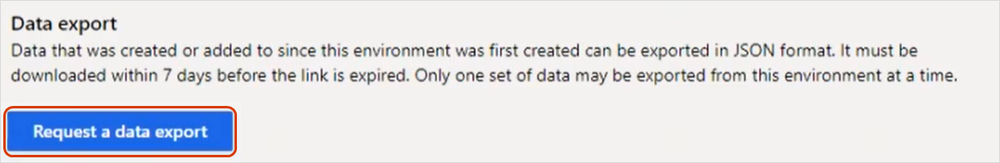
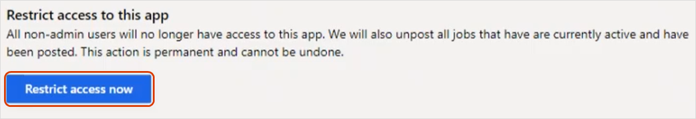
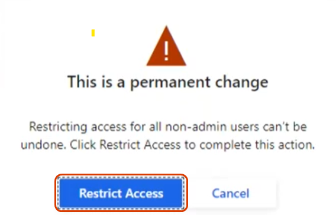
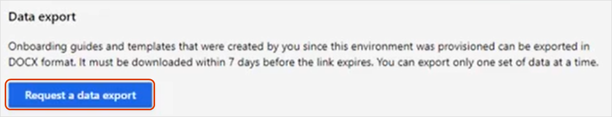
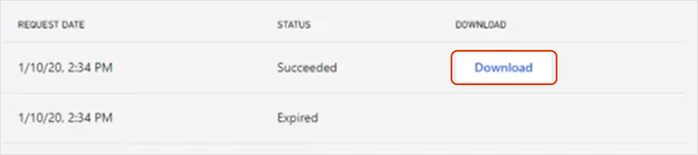

---
# required metadata

title: Export data from Attract and Onboard
description: Export data from Dynamics 365 Talent - Attract and Onboard.
author: andreabichsel
manager: AnnBe
ms.date: 01/14/2020
ms.topic: article
ms.prod: 
ms.service: dynamics-365-talent
ms.technology: 

# optional metadata

ms.search.form: 
# ROBOTS: 
audience: Application User
# ms.devlang: 
ms.reviewer: anbichse
ms.search.scope: Talent, Core
# ms.tgt_pltfrm: 
ms.custom: 7521
ms.assetid: 3b953d5f-6325-4c9e-8b9b-6ab0458a73f8
ms.search.region: Global
ms.search.industry: 
ms.author: anbichse
ms.search.validFrom: 2020-01-14
ms.dyn365.ops.version: Talent October 2019 update

---

# Export data from Attract and Onboard

[!include [banner](includes/banner.md)]

As announced in [Retiring Dynamics 365 Talent: Attract and Dynamics 365 Talent: Onboard Apps](https://community.dynamics.com/365/talent/b/dynamics365fortalent/posts/retiring-dynamics-365-talent-attract-and-onboard-apps), we're retiring Dynamics 365 Talent: Attract and Dynamics 365 Talent: Onboard on February 1, 2022. To help with your migration to another product, both apps now provide data export capabilities.

## Export data from Attract

You can export your data without restricting access to your environment. You might want to do this for testing purposes or to understand our data structure. When you're ready to migrate, restrict access to your Attract environment using the instructions after this procedure. Be sure to export your data again. 

1. Go to [https://aka.ms/AttractDataExport](https://aka.ms/AttractDataExport).

2. Under **Data export**, select **Request a data export**.

   ](./media/attract-onboard-export-data-attract-request.png)

3. When the **Your request is being processed** message box appears, select **OK**. The data export can take up to 20 minutes, depending on the size of your export.

4. When your export completes, select the **Download** button next to it. 

   >[!NOTE]
   >All data exports are available for seven days, at which point the **Download** link expires. 
   
The download contains a .zip file with your Attract data, including the following folders:

| Folder name | Description |
| --- | --- |
| Admin settings | Attract admin center configurations. |
| Candidates | All candidates that were added to jobs or talent pools. |
| Email templates | All email templates that were configured for the environment. |
| Job offer package templates | All job offer package templates that were created, plus their associated configurations. |
| Job offer rule sets |  All rule set files that were uploaded for offer management. |
| Job offer templates | All job offer document templates created for the environment. |
| Job openings | All created jobs. Deleted jobs aren't exported. The sub-folders contain candidate applications, with sub-folders for candidate application attachments and offer packages, where applicable. |
| Job opening templates | Job process templates that were configured in the environment. |
| Talent pools | All created talent pools, their contributors lists, and the candidates lists for the talent pools. |
| Workers | List of all the workers who are present in the environment, plus their roles. |
| (root folder) | A JSON schema file that describes the data structure fields. |

### Restrict access to Attract

When you're ready to migrate, restrict non-admins from accessing your Attract environment and export your data.

>[!IMPORTANT]
>Restricting access to your Attract environment is permanent and can't be undone. If you want non-admin users to continue accessing your environment, skip this step.

1. Go to [https://aka.ms/AttractDataExport](https://aka.ms/AttractDataExport).

2. To restrict non-admins from accessing your Attract environment, under **Restrict access to this app**, select **Restrict access now**. Restricting access also unposts any active jobs that have been posted.

   ](./media/attract-onboard-export-data-attract-restrict-access.png)

3. When you see the warning **This is a permanent change**, select **Restrict access** to permanently restrict non-admin users from this environment. If you're not ready to complete this step, select **Cancel**.

   ](./media/attract-onboard-export-data-attract-warning.png)

   >[!NOTE]
   >Admins can continue to access the data export and person report pages after you restrict access to the Attract environment.

## Export data from Onboard

When you're ready, you can download templates, guides, and candidate data from Onboard.

1. Go to [https://aka.ms/OnboardDataExport](https://aka.ms/OnboardDataExport).

2. Under **Data export**, select **Request a data export**. 

   ](./media/attract-onboard-export-data-onboard-request.png)

3. When the **Your request is being processed** message box appears, select **OK**. The data export can take up to 20 minutes, depending on the size of your export.

4. When your export completes, select the **Download** button next to it. 

   ](./media/attract-onboard-export-data-onboard-download.png)

   >[!NOTE]
   >Your data export is available for seven days. After seven days, the **Download** link expires, and you must request a new export if you need to download your data again. When you start a new data export, any existing downloads will expire after the new export succeeds.

The download is a .zip file that contains:

- A **Templates** folder that contains your Onboard templates in Word document format.

- A **Guides** folder that contains your Onboard guides in Word document format.

## See also

[Retiring Dynamics 365 Talent: Attract and Dynamics 365 Talent: Onboard Apps](https://community.dynamics.com/365/talent/b/dynamics365fortalent/posts/retiring-dynamics-365-talent-attract-and-onboard-apps)