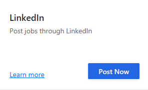

---
# required metadata

title: Post jobs to LinkedIn from Attract
description: This topic explains how to use Dynamics 365 Talent - Attract to post jobs to LinkedIn.
author: andreabichsel
manager: AnnBe
ms.date: 07/08/2019
ms.topic: article
ms.prod: 
ms.service: dynamics-365-talent
ms.technology: 

# optional metadata

# ms.search.form: 
audience: Application User
# ms.devlang: 
ms.reviewer: anbichse
# ms.search.scope: Core, Talent
# ms.tgt_pltfrm: 
ms.custom: 
ms.assetid: 
ms.search.region: Global
# ms.search.industry: 
ms.author: anbichse
ms.search.validFrom: 2019-07-08
ms.dyn365.ops.version: Platform update 24
---

# Post jobs to LinkedIn from Attract

[!include [banner](includes/banner.md)]

LinkedIn is the largest online professional network, giving you access to the world's top talent. Microsoft Dynamics 365 Talent: Attract helps you get the talent that you need by letting you post your jobs directly from Attract to LinkedIn.

Attract lets you post Limited Listings to LinkedIn at no extra cost. These listings are available only through LinkedIn software partners such as Attract. They don't appear in the **Careers** panel on your company's LinkedIn page, because only paid listings appear there. However, they are shown when potential candidates view all available jobs. Limited Listings are also shown in LinkedIn job searches.

After you [create a job](./creating-jobs-attract.md) in Attract, you just have to select a button to put your job in front of thousands of potential candidates on LinkedIn.

The following table shows the actions that you can perform on LinkedIn, depending on your user role.

| Role | Actions that you can take |
|---|---|
| Admin | Post, repost, and unpost |
| Hiring manager | Read only |
| Recruiter | Post, repost, and unpost |
| Interviewer | No access |
| Read-only | Read only |

For more information about user roles in Attract, see [Security and role management in Attract](./security-attract.md).

If you're an admin and need more information about how to configure LinkedIn integration with Attract, see [Set up integration with LinkedIn for Microsoft Dynamics 365 Talent - Attract](./attract-admin-linkedin.md).

Jobs that are posted to LinkedIn appear on the live LinkedIn site. LinkedIn doesn't have a test environment for posting jobs. Therefore, make sure that you don't accidentally post any test jobs.

## Post jobs to LinkedIn

1. In Attract, open the job that you want to post to LinkedIn.
2. On the **Postings** tab, select the **Post Now** button that corresponds to LinkedIn.

    

3. In the **Create an "Apply now" web address** dialog box, select an option under **Candidates can apply using a**. We recommend that you select **Link in Attract**.
4. Select **Done**.
5. In the **Submit for posting** message box, select **Confirm**.

After LinkedIn successfully completes the posting, the **Postings** section of the job in Attract shows the LinkedIn status as **Posted**. It can take up to 48 hours for your job to appear in LinkedIn.

When interested candidates select **View** next to your listing, they will see the full job details, together with your information about how to apply.

All job postings that are done through Attract are Limited Listings. For more information about Limited Listings on LinkedIn, see [Limited Listings vs Premium Job Slots for Job Wrapping](https://www.linkedin.com/help/recruiter/answer/79049).

If you're having trouble posting jobs to LinkedIn, see [Troubleshooting integration with LinkedIn and Microsoft Dynamics 365 Talent - Attract](./attract-troubleshoot-linkedin.md).

## See also

[Attract integration with LinkedIn FAQ](./attract-linkedin-faq.md)

[Set up integration with LinkedIn for Microsoft Dynamics 365 Talent - Attract](./attract-admin-linkedin.md)

[Create, approve, and post jobs in Attract](./creating-jobs-attract.md)

[Source candidates with LinkedIn Recruiter](./attract-linkedin-recruiter.md)

[Troubleshoot integration with LinkedIn](./attract-troubleshoot-linkedin.md)
