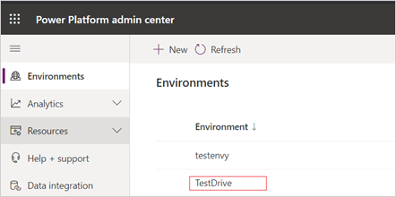
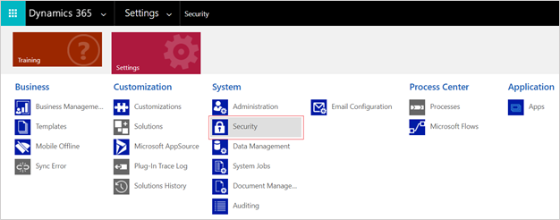
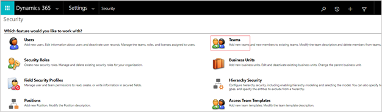

---
# required metadata

title: Attract users can't apply for jobs from career portal
description: This topic explains how to troubleshoot an issue where Attract users can't apply for jobs from the career portal.
author: andreabichsel
manager: AnnBe
ms.date: 09/23/2020
ms.topic: article
ms.prod: 
ms.service: dynamics-365-talent
ms.technology: 

# optional metadata

# ms.search.form: 
audience: Application User
# ms.devlang: 
ms.reviewer: anbichse
# ms.search.scope: Core, Talent
# ms.tgt_pltfrm: 
ms.custom: 
ms.assetid: 
ms.search.region: Global
# ms.search.industry: 
ms.author: anbichse
ms.search.validFrom: 2020-09-23
ms.dyn365.ops.version: Platform update 24
---

# Attract users can't apply for jobs from career portal

[!include [banner](includes/banner.md)]

## Issue

Attract users can't apply for jobs from the career portal. When they try to apply for a job that was created in Dynamics 365 Talent: Attract, the browser loads the page continuously and doesn't complete the action.

## Cause

This problem occurs when the Talent Relationship Team doesn't have the Talent user role.

## Resolution

Assign the Talent user role to the Talent Relationship Team.

1. Sign in to the [Power Platform admin center](https://admin.powerplatform.microsoft.com) with any of the following admin credentials:

   - Dynamics 365 admin
   - Global admin
   - Power Platform admin

2. In the navigation pane, select **Environments**, and then select the environment in which to assign the Talent user role to the Talent Relationship Team.

   

3. In the **Environments** pane, select the **Environment URL** and sign in to the environment's admin portal (for example, https:<orgname>.crm.dynamics.com).

4. Select **Settings**, select **System**, and then select **Security**.

   

5. Select **Teams**.

   

6. Search for **Talent Relationship Team** in the search box, and then select the team from the search results.

7. Select **MANAGE ROLES** from the ribbon.

8. In the **Manage Team Roles** dialog, select **Talent user** from the list of available roles, and then select **OK** to apply the role.

   

9. Test your changes:

   1. Sign in to the career portal from a new browser window.
   2. Apply for the job from the career portal. 