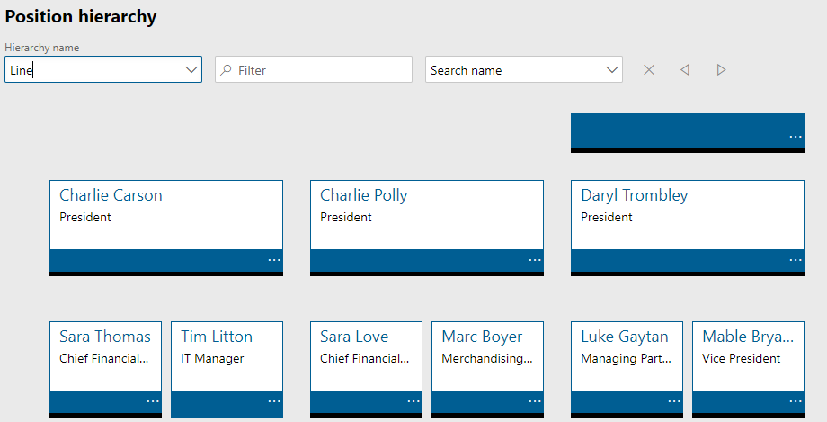
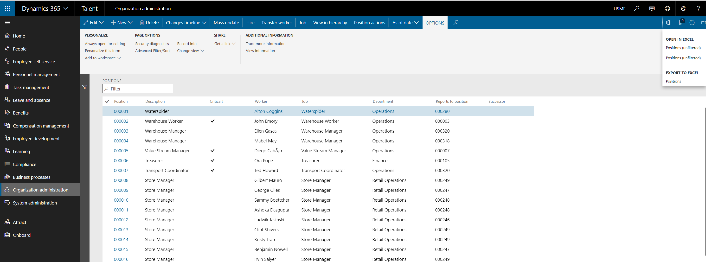
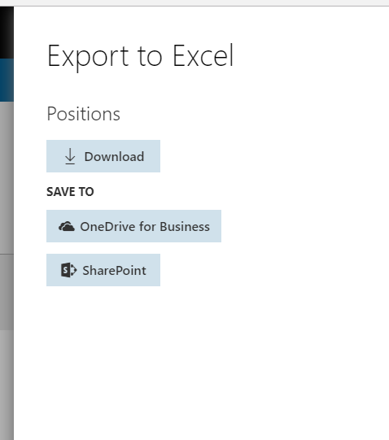
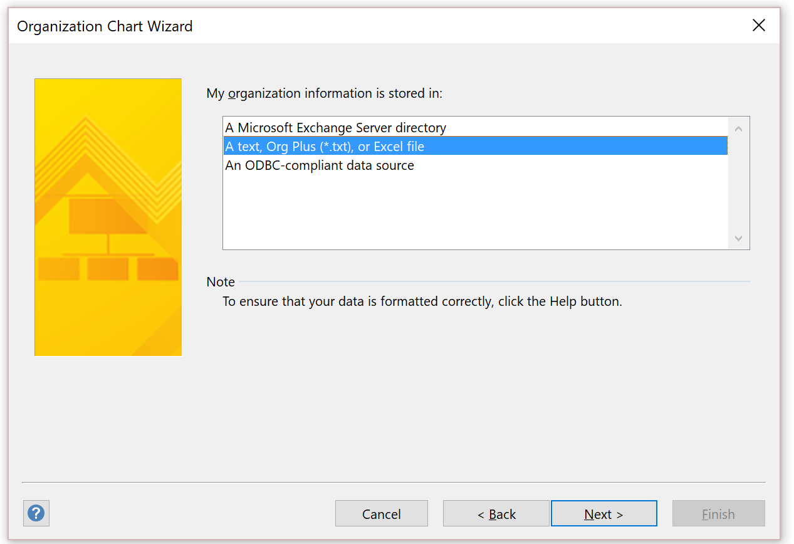
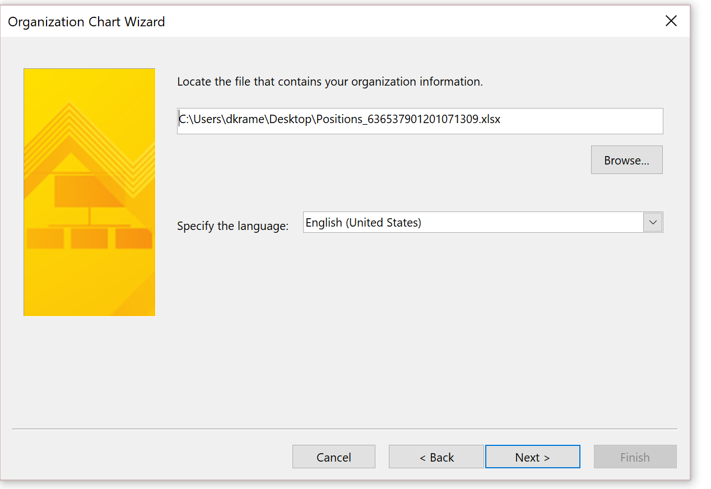
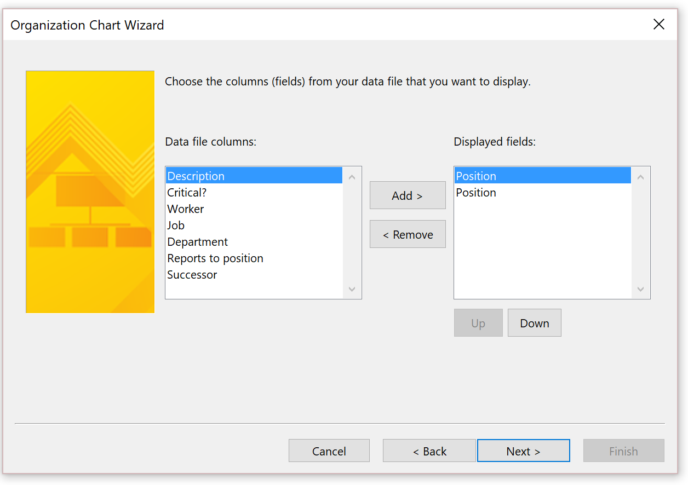

---

# required metadata

title: How to avoid text truncation on position hierarchy and export to Visio
description: When I view the position hierarchy in Talent the names of individuals and
positions are truncated, making it impossible to screenshot or print the
hierarchy and distribute it.
author: Darinkramer
manager: AnnBe
ms.date: 11/02/2018
ms.topic: article
ms.prod: 
ms.service: dynamics-365-talent
ms.technology: 

# optional metadata

# ms.search.form: 
# ROBOTS: 
audience: Application User
# ms.devlang: 
ms.reviewer: josaw
ms.search.scope: Talent
# ms.tgt_pltfrm: 
ms.custom: 
ms.assetid: 
ms.search.region: Global
# ms.search.industry: 
ms.author: dkrame
ms.search.validFrom: 2018-11-02
ms.dyn365.ops.version: Talent

---

# How to avoid text truncation on position hierarchy and export to Visio

[!include [banner](includes/banner.md)]

**Issue:**

When I view the position hierarchy in Talent the names of individuals and
positions are truncated, making it impossible to screenshot / print the
hierarchy and distribute.

**Cause:**

By design.  

**Resolution:**

Unfortunately the size of the text is not something that is easily modified by
the user.However, you can export out of Talent and an import into Visio. This
article was written for AX 2012, but the process is still applicable for Talent
as well.

[https://docs.microsoft.com/en-us/dynamicsax-2012/appuser-itpro/export-a-position-hierarchy-to-microsoft-visio
](https://docs.microsoft.com/en-us/dynamicsax-2012/appuser-itpro/export-a-position-hierarchy-to-microsoft-visio)

Steps to export to Visio

1.  Open the positions list. (note if you want to include more information in
    the Org structure diagram, add fields to the Position list to make them
    available during the Wizard Phase below.

2.  Click the ‘Export to Excel’ button in the action pane (Ctrl-T)

1.  Save the Excel file that has been exported.

1.  Open Visio - Create New within Visio and choose the Business template
    category.

1.  Choose the ‘Organization Chart Wizard’ and click Create.

1.  Choose to create from information already stored in a file or database and
    click Next.

1.  Choose to create from an Excel file and click Next.

1.  Choose to create from your recently created Excel file containing the
    hierarchy and click Next.

1.  Set **Name** to ‘Position’ and **Reports to** to ‘Reports to position’ and
    click Next.

1.  Choose the fields to display on each node and click Next.

1.  Choose the ‘Position’ column to appear as shape data fields and click Next.

1.  Click Next

2.  Pictures aren’t currently available

3.  Select to automatically break across pages

1.  Finish.

    1.  If there are positions not in the structure you will be asked to include
        those in the diagram.

    2.  Diagram will show each manager on a worksheet with in Visio.

    3.  Based on what you included in the diagram you will see that information
        when you generate the Visio file in each node.

**Additional option:**

In Talent, you may also be able to leverage the People workspace as well to view
some hierarchy related information.
