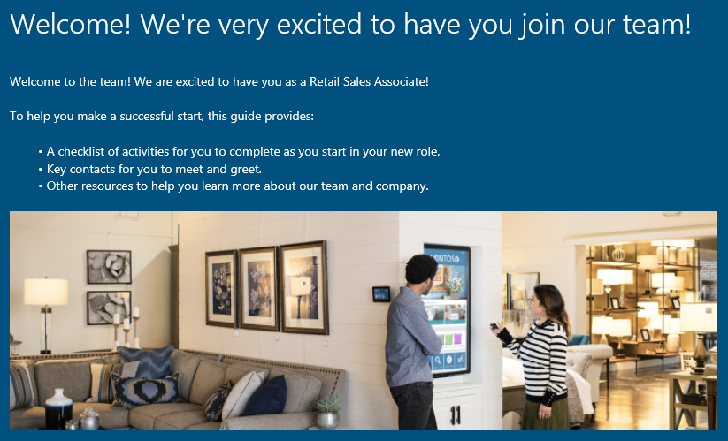

---
# required metadata

title: Get started with Onboard
description: This topic will help you get started with Microsoft Dynamics 365 Talent - Onboard. Onboard helps your new hires get off to a strong start by giving them a guide that takes them smoothly through the onboarding process.
author: andreabichsel
manager:
ms.date: 06/21/2019
ms.topic: article
ms.prod:
ms.service: dynamics-365-talent
ms.technology:

# optional metadata

ms.search.form: HcmCourseType, HcmCourseTypeGroup, HRMCourseTable
# ROBOTS:
audience: Application User
# ms.devlang:
ms.reviewer: anbichse
# ms.search.scope: Core, Operations, Talent
# ms.tgt_pltfrm:
# ms.custom:
# ms.assetid:
ms.search.region: Global
# ms.search.industry:
ms.author: anbichse
ms.search.validFrom: 2017-06-30
ms.dyn365.ops.version: Talent July 2017 update
---

# Get started with Onboard

[!include [banner](includes/banner.md)]

By using Microsoft Dynamics 365 Talent: Onboard, you can help your new employees perform more effectively and gain a sense of belonging in their new roles. An effective onboarding process helps new hires understand their new roles. It also gives them a head start in establishing valuable relationships that will help ensure their success.

Onboard lets you quickly create an onboarding guide that will welcome your new hires and make them excited about joining your organization.

To learn how to get and use the Onboard app, see the following topics:

- [Get the Dynamics 365 Talent - Onboard app](./onboard-get-app.md)
- [Create and send an onboarding guide by using Dynamics 365 Talent - Onboard](./onboard-create-guide.md)
- [Create an onboarding template by using Dynamics 365 Talent - Onboard](./onboard-create-template.md)
- [Edit onboarding guides and templates in Dynamics 365 Talent - Onboard](./onboard-edit-guides-templates.md)
- [Share content with other contributors in Dynamics 365 Talent - Onboard](./onboard-share-template.md)
- [View the status of onboarding employees and your taskss](./onboard-view-status.md)
- [Create a hiring team by using Dynamics 365 Talent - Onboard](./onboard-create-team.md)

## See also

- [Try or buy the Onboard app](https://dynamics.microsoft.com/talent/onboard/)
- [What's new or changed in Dynamics 365 Talent](./whats-new.md)
- [Release plans](https://docs.microsoft.com/business-applications-release-notes/index)
- [Get support for Microsoft Dynamics 365 Talent](./talent-support.md)
