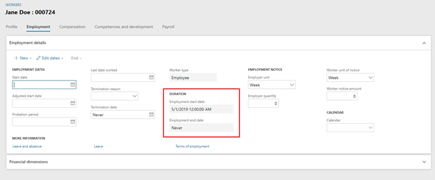
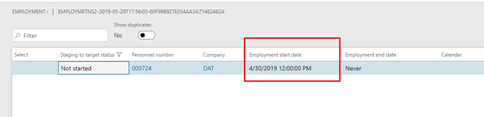

---
# required metadata

title: Understanding Date Time fields & Time Zones on the Dynamics 365 platform 
description: Date time fields are a fundamental concept in Dynamics 365 for Talent and Dynamics 365 for Finance and Operations. The intent of this document is to provide some clarity into what a user should expect when interacting with date time data in a Dynamics 365 form, an external (Data management framework) source or the database.  
author: Darinkramer
manager: AnnBe
ms.date: 06/06/2019
ms.topic: article
ms.prod: 
ms.service: dynamics-365-talent
ms.technology: 

# optional metadata

ms.search.form: 
# ROBOTS: 
audience: Application User
# ms.devlang: 
ms.reviewer: anbichse
ms.search.scope: Talent
# ms.tgt_pltfrm: 
ms.custom: 
ms.assetid: 
ms.search.region: Global
# ms.search.industry: 
ms.author: dkrame
ms.search.validFrom: 2019-06-06
ms.dyn365.ops.version: Talent

---

# DateTime fields and time zones in Talent

[!include [banner](includes/banner.md)]

Date time fields are a fundamental concept in Dynamics 365 for Talent and Dynamics 365 for Finance and Operations. The intent of this document is to provide some clarity into what a user should expect when interacting with date time data in a Dynamics 365 form, an external (Data management framework) source or the database.

## Understanding the difference between dates and date times

Date time fields differ from dates in the product as date time fields are time zone aware. Dates do not hold any time zone information and the date shown in the client will be the same regardless of the location that it is viewed in. A date field that is entered in the user interface is always the same date written to the database. 

For a date time field, the Dynamics client will adjust the date time based on the user time zone found in the user options form (Common>Setup>User Options). The date time that is entered in the user interface may not be the same as date time written to the database.  

## Understanding date time fields on forms 

When entering data in a date time field, like what we have here below on the Employee form the data shown in the user interface will not be the same date time that is stored in the database if the user time zone is not set to Coordinated Universal Time ‎(UTC)‎. Date time data is always stored in UTC. 

## Understand date time fields in the database 

When a date time value from a form is written to the database, it will store the data in Coordinated Universal Time ‎(UTC)‎. This allows users to see any date time data in the user interface relative to the time zone defined in their User options.
 
In the example above the start time is point in time, not a particular date. By changing the time zone of the logged in user from GMT +12:00 to GMT UTC, the same record just created shows 04/30/2019 12:00:00 instead of 05/01/2019 12:00:00 as in the previous screenshot.
  
In the example screenshot below, employee 000724’s employment will become active at the same time regardless of time zone. The employee will be active on 04/30/2019 in the GMT time zone which is the same as 05/01/2019 in GMT+12:00 time zone. Both of refer to the same point in time and not a particular date. 

# Data Management Framework/Excel/Common Data Service/Power BI 

The Data Management Framework, Excel Add In, Common Data Service and Power BI reporting are all designed to interact with data directly on the database level. Since there is no client to adjust date time data to the time zone of the user, all date time data will be in UTC and this can lead to some incorrect assumptions when data is entered or viewed via these means.  
 
Date time data that is submitted via DMF, Excel, or CDS is assumed to be in UTC by the database. This can cause some confusion when the submitted date time value is not what displays in the Dynamics client because the user viewing the data doesn't have their user time zone option set to UTC. 
 
The same thing can happen in reverse when data is exported. The date time data in the exported DMF entity can be different then what is displayed in the Dynamics client. 
 
When using external sources like DMF to view or author data it is important to keep in mind that the date time values are by default considered to be in UTC regardless of the time zone of the user's computer or their current User time zone option setting. 

## Examples of the same record being displayed in different product areas 

**Talent with user time zone set to UTC**
Worker form

**Talent with user time zone set to GMT +12:00** 
Worker form 

**Excel Via OData**

**DMF Staging**

**DMF Export**

**Excel via Common Data Service**

### References

(Date and time data)(https://docs.microsoft.com/en-us/dynamics365/unified-operations/fin-and-ops/organization-administration/date-time-zones)
(User preferred time zones)(https://docs.microsoft.com/en-us/dynamics365/unified-operations/fin-and-ops/organization-administration/tasks/set-users-preferred-time-zone) 
