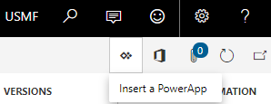
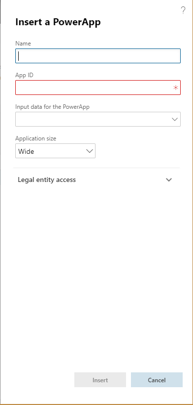
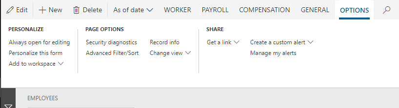
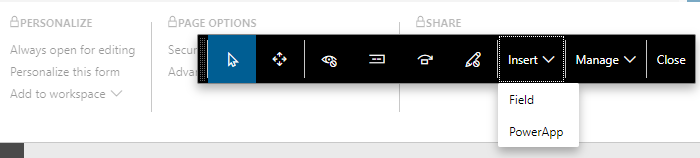

---
# required metadata

title: Embed Power Apps apps in Dynamics 365 Human Resources
description: This topic explains how to resolve the issue where the Microsoft Power Apps menu item has disappeared from the System administration module.
author: andreabichsel
manager: AnnBe
ms.date: 11/02/2018
ms.topic: article
ms.prod: 
ms.service: dynamics-365-talent
ms.technology: 

# optional metadata

# ms.search.form: 
# ROBOTS: 
audience: Application User
# ms.devlang: 
ms.reviewer: anbichse
ms.search.scope: Talent
# ms.tgt_pltfrm: 
ms.custom: 
ms.assetid: 
ms.search.region: Global
# ms.search.industry: 
ms.author: anbichse
ms.search.validFrom: 2018-11-02
ms.dyn365.ops.version: Talent

---

# Embed Power Apps apps in Dynamics 365 Human Resources

**Issue**

The **Power Apps** menu item has disappeared from the **System administration** module.

**Cause**

The user interface (UI) design has been changed, and Microsoft Power Apps is now included in the standard personalization model.

**Resolution**

The way that Power Apps are embedded has been changed. Power Apps are now added through the personalization model. You can add Power Apps to almost all pages in Microsoft Dynamics 365 Talent.

For information about how to embed Power Apps in Talent, see [Embed Power Apps](https://docs.microsoft.com/dynamics365/unified-operations/fin-and-ops/get-started/embed-power-apps).

Any Power Apps customer who embedded apps before the change should have been upgraded to the new model.

The **Power Apps** button is in the upper-right corner of almost every page in Talent. You can use this button to insert apps.

Here is an example.

1. Go to **Personnel management \> Links \> Workers \> Employees**.
2. Select the **Power Apps** button, and then select **Add an app from Power Apps**.

    

3. Complete the fields in the **Add an app from Power Apps** dialog box.

    

Alternatively, follow these steps.

1. On the page's Action Pane, on the **Options** tab, in the **Personalize** group, select **Personalize this page**.

    

    The personalization toolbar appears.

2. On the toolbar, select **Add an app from Power Apps**.

    
