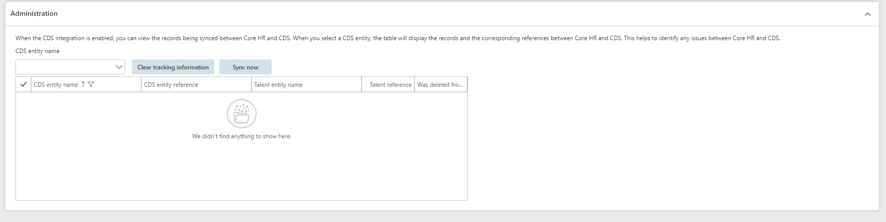
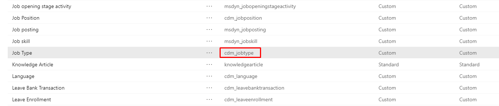
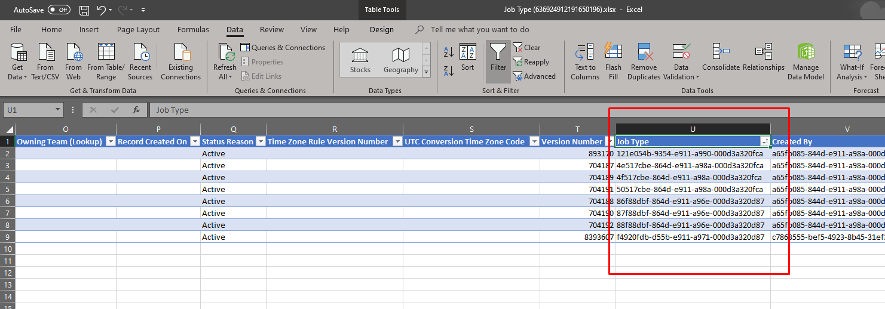
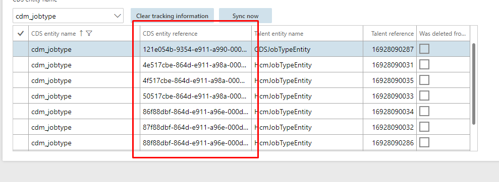
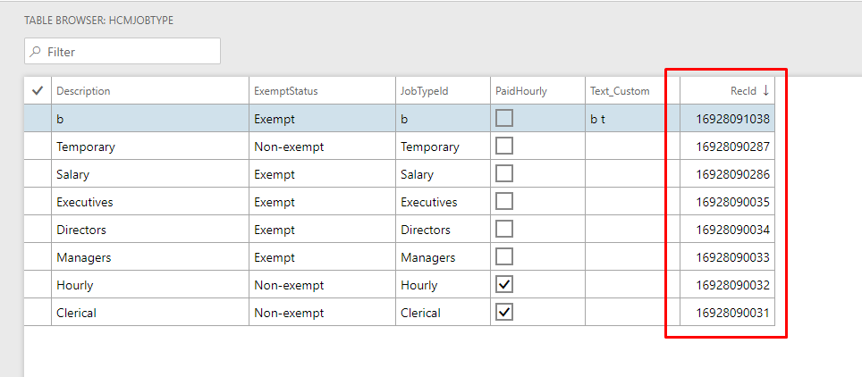

---
# required metadata

title: Dynamics 365 Talent Common Data Service configuration form 
description: The Common Data Service configuration is a form that allows an administrator or data management administrator some flexibility and insights with the Common Data Service (CDS).
author: andreabichsel
manager: AnnBe
ms.date: 10/08/2019
ms.topic: article
ms.prod: 
ms.service: dynamics-365-talent
ms.technology: 

# optional metadata

ms.search.form: 
# ROBOTS: 
audience: IT Pro
# ms.devlang: 
ms.reviewer: anbichse
ms.search.scope: Talent, Core
# ms.tgt_pltfrm: 
ms.custom: 
ms.assetid: 
ms.search.region: Global
# ms.search.industry: 
ms.author: anbichse
ms.search.validFrom: 2019-10-08
ms.dyn365.ops.version: Talent October 2019 update

---

# Dynamics 365 Talent Common Data Service configuration form

[!include[banner](../includes/banner.md)]

## Overview
The Common Data Service configuration is a form that allows an administrator or data management administrator some flexibility and insights with the Common Data Service (CDS). The form allows to do things like enable/disable the CDS integration with the Talent instance and allows the administrator to see the sync details between the Talent instance and the CDS. 

## Navigation
The Common Data Service configuration form can be found on the links page of the System Administration workspace.

## Overview

## Enable/Disabling the CDS integration 
The Common Data Service integration form allows an Administrator or a Data Management Administrator to manage the active connection to the CDS. When the integration is disabled, this allow a user to make changes in Talent or in the CDS without the changes syncing between the two environments. *The CDS integration is off by default on new environments that don’t include the provided demo data. New environments with demo data will have the integration turned on and will start syncing data when the environment is provisioned*. 

Some scenarios where it may be beneficial to disable the integration. 
 - The system is being populated with data through the Data Management Framework and the data needs to be imported multiple times before it is in a correct state. 
 - If there happens to be a data issue in either Talent or the CDS, by disabling the integration an administrator can then go delete a record in either Talent or the CDS and that will not trigger a delete in the other system. When the integration is turned back on, the record from the side that wasn’t deleted, will sync back to the other system. 
 
NOTE: When the environments data is in a state where it is ready to sync to CDS, enabling the integration will tell the system that it is ready to start syncing data during the next execution of the "Common Data Service integration missed request sync” batch job.  

NOTE: When disabling the integration, it is not recommended to edit the same record in both systems. When this happens, the record will be in a dual master state and the last one edited should end up syncing to both systems. It is possible that data loss could occur if both systems were not edited in the same way. 

### Environment Information 
The CDS environment information can be found on the Common Data Service integration form. This is the same information that can also be found on the about box for the Talent instance. 

### Administration Grid 
The grid in the administration fast tab gives an administrator a view into how the CSD and Talent records are linked together.  

Using the CDS Entity name field enables an administrator to see the records that are linked between for a specific entity.  Note: Currently, not all CDS entities will show in this list. The only entities that show up in the tracking table are entities that support the use of custom fields. More entities are being added here on a continual basis. 

Explanation of the fields in the grid 
*CDS entity name*: This is the name of the entity that is in the CDS 

*CDS entity reference*: This is the identifier that the CDS uses to identify a record. It is the CDS equivalent to a Talent RecId. The identifier can be found when opening the CDS entity in excel. 

*Talent entity name*: This is purely informational. It specifies which entity last synced data to the CDS. It makes no difference if it has the CDS or other prefix on it. 
 
*Talent reference*: This is the RecId associated with the record in talent.  

*Clear Tracking Button*: The clear tracking button will remove the association in talent from the CDS. When this action is performed, this means that CDS will no longer know that there is a relation to Talent for that record. If changes are made to a record or record is deleted in CDS, those changes will not sync to Talent. If changes are made in Talent, a new tracking record will be created the record in the CDS will be updated. This functionality is useful if the issues appear between in the integration between Talent and the CDS. Clearing the tracking and letting the tracking table resync has been shown to clear up some issues. 
 
*Sync Now Button*: By first selecting the entity in the drop down and then pressing the sync now, it will allow the administrator to run a full sync on a single entity between the CDS and Talent. This is useful if the system is having timing issues with changes from CDS showing up in Talent in a timely manner or to refresh the tracking table after it has been cleared. 
