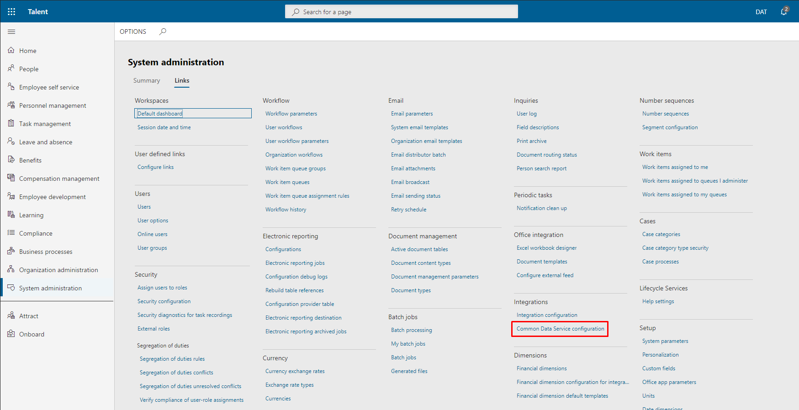
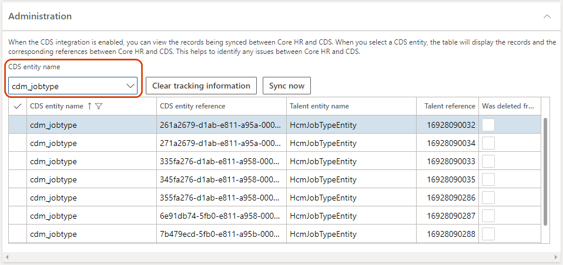

---
# required metadata

title: Configure Common Data Service integration 
description: Enable or disable integration between Dynamics 365 Talent and Common Data Service.
author: andreabichsel
manager: AnnBe
ms.date: 10/08/2019
ms.topic: article
ms.prod: 
ms.service: dynamics-365-talent
ms.technology: 

# optional metadata

ms.search.form: 
# ROBOTS: 
audience: IT Pro
# ms.devlang: 
ms.reviewer: anbichse
ms.search.scope: Talent, Core
# ms.tgt_pltfrm: 
ms.custom: 
ms.assetid: 
ms.search.region: Global
# ms.search.industry: 
ms.author: anbichse
ms.search.validFrom: 2019-10-08
ms.dyn365.ops.version: Talent October 2019 update

---

# Configure Common Data Service integration

[!include[banner](../includes/banner.md)]

You can enable or disable integration between Common Data Service and an instance of Microsoft Dynamics 365 Talent. You can also view the sync details, clear tracking data, and resync an entity to help troubleshoot data issues between the two environments.

When you disable integration, users can make changes in Talent or Common Data Service, and the changes won't sync between the two environments.

By default, integration between Talent and Common Data Service is:

- **Off** for new environments without demo data

- **On** for new environments with demo data

New environments with demo data will begin syncing data when they're provisioned.

You might want to disable integration if:

- You're populating data through the Data Management Framework and need to import it multiple times to get it into a correct state. 

- There are issues with data in either Talent or Common Data Service. If you disable integration, you can delete a record in one environment without deleting it in the other. When you turn integration back on, the record in the environment where it wasn't deleted will sync back to the one where it was. Syncing begins with the next **Common Data Service integration missed request sync** batch job.

> [!WARNING]
> When you disable data integration, be sure not to edit the same record in both environments. When you turn integration back on, the record you last edited will sync. This could result in data loss if you don't make the same changes to the record in both environments.

## Access the Common Data Service integration page
 
1. In the Talent instance where you want to view or configure settings for integration with Common Data Service, select the **System administration** tile.

   

2. Select **Links**.

   

3. Under **Integrations**, select **Common Data Service configuration**.

   

## Enable or disable data integration between Talent and Common Data Service

- To enable integration, set **Enable the integration to the Common Data Service** to **Yes**.

- To disable integration, set the toggle to **No**. 

> [!NOTE]
> When you enable integration, your data will sync the next time the **Common Data Service integration missed request sync** batch job runs. All data should be available after the batch job completes.

## View data integration details

You can see how records are linked together between Talent and Common Data Service under **Administration** on the **Common Data Service integration** page.

To view the records for an entity, select the entity from the **CDS entity name** dropdown.

This shows you all the records that linked to a specific entity.

> [!NOTE]
> Currently, not all Common Data Service entities appear in this list. The only entities that appear in the table are those that support the use of custom fields. New entities become available with continuous releases of Talent.

The fields in the table are as follows:

- **CDS entity name**: The name of the entity that is in Common Data Service

- **CDS entity reference**: The identifier that Common Data Service uses to identify a record. This is equivalent to a Talent **RecId**. You can find the identifier when you open the Common Data Service entity in Microsoft Excel.

- **Talent entity name**: The entity that last synced data to Common Data Service. It doesn't matter whether it contains the Common Data Service prefix or other prefix.

- **Talent reference**: The RecId associated with the record in Talent.

- **Was deleted from CDS**: Indicates whether the record was deleted from Common Data Service.

## Remove the association of a record in Talent from Common Data Service

If you experience issues with data syncing between Talent and Common Data Service, it can help to clear the tracking and let the tracking table resync. If you remove the association and then change or delete a record in Common Data Service, the changes won't sync to Talent. If you make changes in Talent, a new tracking record is created and the record is updated in Common Data Service.

- To remove the association of a record between Talent and Common Data Service, select the entity from the **CDS entity name** dropdown and then select **Clear tracking information**.

To run a full sync on the entity after clearing the tracking, see the next procedure.

## Sync an entity between Talent and Common Data Service

Use this procedure if changes from Common Data Service are taking too long to appear in Talent, or if you need to refresh the tracking table after clearing it.

- To run a full sync on an entity between Talent and Common Data Service, select the entity from the **CDS entity name** dropdown and then select **Sync now**.

