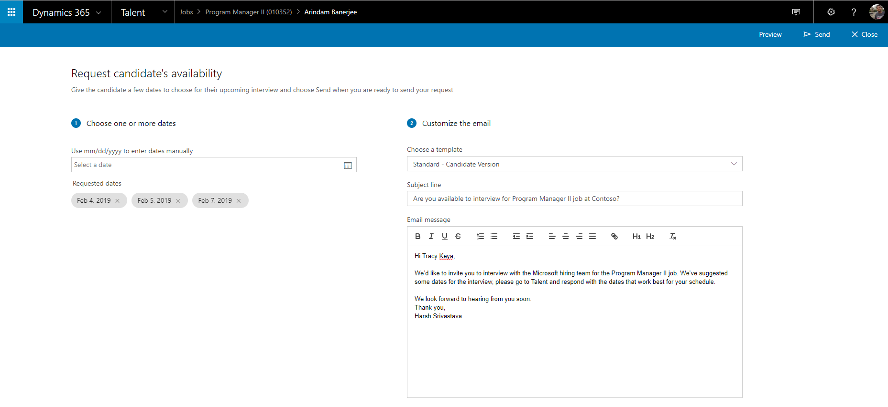
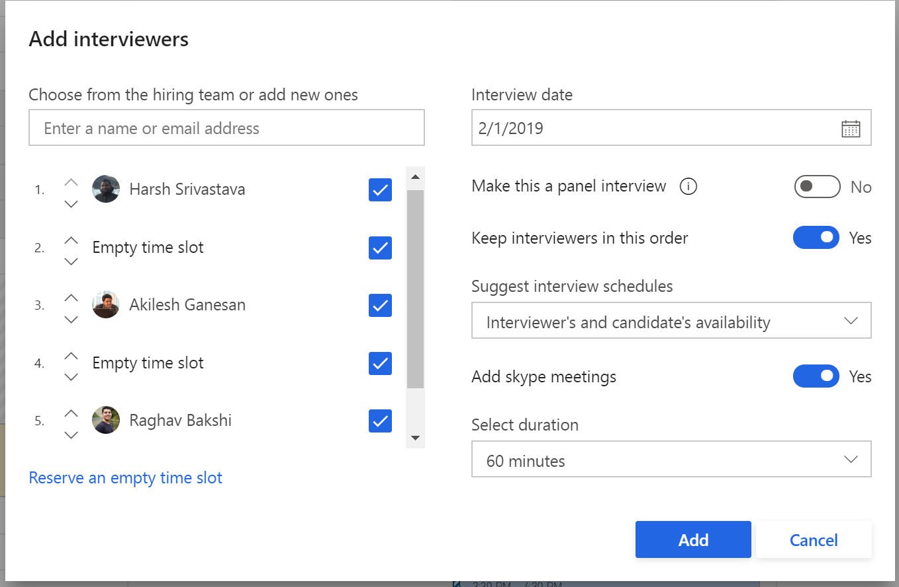
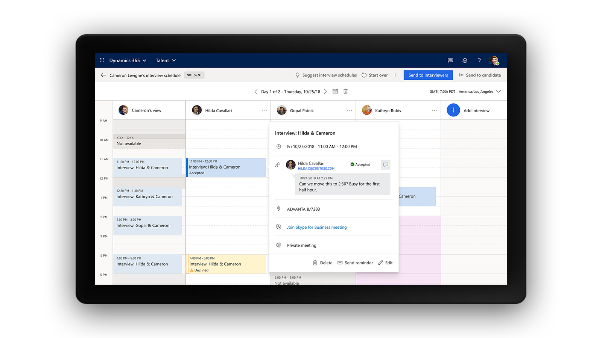

---
# required metadata

title: Schedule interviews in Attract
description: This topic provides information about interview scheduling and feedback activities in Attract.
author: hasrivas
manager: AnnBe
ms.date: 04/10/2019
ms.topic: article
ms.prod: 
ms.service: dynamics-365-talent
ms.technology: 

# optional metadata

ms.search.form: 
# ROBOTS: 
audience: Application User
# ms.devlang: 
ms.reviewer: anbichse
# ms.search.scope: Talent, Core
ms.search.region: Global
# ms.search.industry: HR, Human Resources
ms.author: shielas

---

# Schedule interviews in Attract

[!include [banner](includes/banner.md)]

## Scheduler activity

The scheduler activity is optional and has two components: Candidate availability request and Schedule. The Candidate availability component lets you use email to request a candidate's availability. The Schedule component provides the ability to schedule interviews with the candidate and the hiring team.

To set up the scheduler activity to include or limit the candidates to be scheduled, select a value in the **Who are you scheduling** field. The available options are **All Candidates**, **External Candidates**, and **Internal Candidates**. For example, if you want to skip internal candidates in the first round of scheduling, you can assign the schedule activity only to external candidates by setting **Who are you scheduling** to **External Candidates**.

### Candidate availability request

To send an email to candidates requesting their availability, select the **Request candidate availability** field. If the field is not selected, this step won't be shown in the hiring process for the job.

To send the availability request, click **Send request**, choose the available dates and an email template, and then send the mail to the candidate.

When the candidate receives an email to respond to the request, they can sign in to their candidate portal, choose the dates that match their availability, and click **Submit**.

### Schedule
There are multiple configurations available for the interview scheduler to use and quickly create and send the interview loop to the interviewers and the candidate.

1. Click **Create schedule**, and in the **Add interviewers** box, list all the interviewers that are going to be part of the interview loop.
   
    If the candidate had responded to the interview request availability, the **Interview date** field will be pre-populated with their selection. You can select a different date if needed.
    
    If you select the **Make this a panel interview** field, the group of interviewers on the left are moved in to a single panel loop to create the interview. You will then need to define a specific sequence for the interviews.
    
    The interview schedule should be arranged to best match the participants’ availability. If it’s an internal candidate, you can include their availability as part of the schedule recommendation.
    
    To have an online meeting, select the **Add Skype meetings** field and each interview event will have a **Skype for Business** link available.

2. Select the interview duration for each interview event, and then click **OK** to start creating the schedule.

    If **Recommendations** are selected, suggestions will be shown and the interview grid will be pre-populated. You will be able to see the current calendar availability of all the selected interviewers. You will also be able to view the candidate’s calendar if they're an internal candidate. For the interviewers and internal candidates, you can view their busy time slots, their working hours, their out of office hours and also identify if they have marked their calendars as working elsewhere for specific time slots. 

3. If there are no suggestions available, in the **Interviewers** column, click in a time slot, provide the interview title, details, and populate the location details, as necessary. You can choose to include the **Skype for Business** link for the interview.

4. To include additional interviewers, click the **Add interview** grid column to select one or more interviewers. You can use the ellipsis (...) option to remove an interview from the loop.
    
5. If the interviews are scheduled in a different time-zone, pick the required city/time-zone from the drop-down list in the upper right. The interviewer availability grid will be updated to reflect the new time zone. This time-zone selection will now also display in the **Interview summary** view, which will be shared with the interviewers and the candidate. 

6. Click **Send to interviewers** to send the meeting invites to the interviewers involved.

    After the interview requests have been sent to the interviewers, they can respond directly from the email invite that they receive.

    >[!NOTE]
    > For all 1:1 interviews, reminders are sent to the interviewers every 24 hours if the interviewer has not responded (accepted or declined) to the interview request.

    > For all panel interviews, there are no automated reminders for the interview request. To trigger a reminder manually, edit the interview and use the **Update & Send** option to send the request back to the interviewers.

    Interviewer responses are captured and shown in Attract. If an interviewer declines the invite, you will be notified to make a change. To view their response in the **Scheduler** grid view, click the bubble icon.

7. After the interview schedule is ready to be shared with the candidate, click **Send to candidate**. You can choose to hide or show the interviewer names and slots with the candidate.

8. Select an email template and send the interview summary to the candidate. The candidate can view this information in their email as well as on their candidate portal.
    
>[!NOTE] 
> The calendar availability of a candidate is shown only if the candidate is internal. Similarly, only an internal candidates can be used to enhance interview schedule recommendations. Currently, candidates (external or internal) don't receive an email meeting invite, instead the candidate receives only a summary of the interviews.

Candidates will receive the email summarizing their interview loop. The emails contain an .ics file which can be saved to their personal calendars for easier access and notfications about the interview.

>[!TIP] 
> In case you re-send the interview schedule to the candidate, they will receive another .ics file attachment. We recommend updating the email templates for the candidate's interview summary to ensure candidates delete the previously added interview events and do not see duplicates on their calendar. 

## Feedback activity

The feedback activity is optional in a job template. This activity lets interview participants enter recommendations or feedback comments for an applicant. 

To include or limit the candidates to provide feedback on, select a value in the **Who should interviewers provide feedback on** field.  The available options are **All Candidates**, **External Candidates**, and **Internal Candidates**. For example, if you want to skip internal candidates in the first round of scheduling, set **Who should interviewers provide feedback on** to **External Candidates**.

If you select the **Inherit feedback participants from Hiring Team** field, the recruiter, hiring manager, and interviewers are automatically entered in the feedback activity. Organizations can allow interviewers to view the feedback of other people before they submit their own feedback. Organizations can also allow interviewers to edit their feedback after they submit it. Interviewers are reminded to submit feedback for the interviews they have recently conducted based on the preset configuration as part of the job template. The hiring manager or a recruiter on the job can also choose to manually remind an interviewer to submit feedback.

## Interview activity

The interview activity is an optional activity with three components: **Candidate availability request**, **Schedule**, and **Feedback**. Use the interview activity in the job template if you want all of the candidate’s availability request, schedule, and feedback as part of the process instead of using them individually.

To include or limit the candidates to be interviewed, select a value in the **Who are you interviewing** field. The available options are **All Candidates**, **External Candidates**, and **Internal Candidates**. For example, if you want to skip internal candidates in the first round of interviewing, set **Who are you interviewing** to **External Candidates**.
