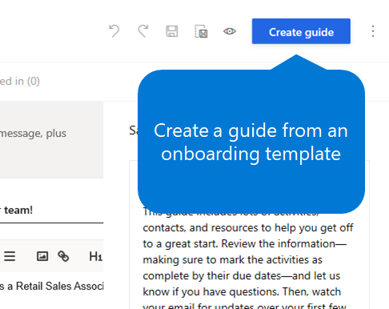
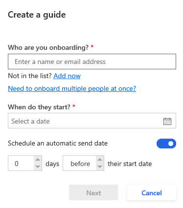
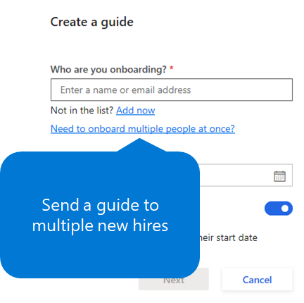
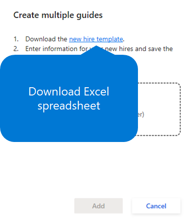
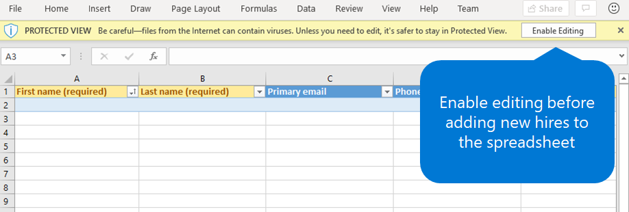
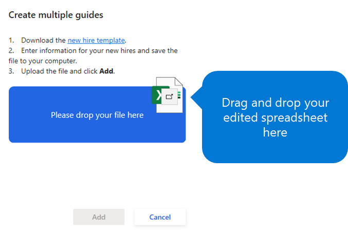
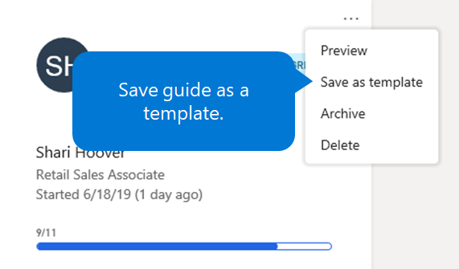

---
# required metadata

title: Create and send an onboarding guide by using Dynamics 365 Talent - Onboard
description: This topic explains how to use the Microsoft Dynamics 365 Talent - Onboard app to create an onboarding guide for your new hires. This task is an essential first step in a human capital management (HCM) hire-to-retire strategy.
author: andreabichsel
manager:
ms.date: 05/02/2019
ms.topic: article
ms.prod:
ms.service: dynamics-365-talent
ms.technology:

# optional metadata

ms.search.form: HcmCourseType, HcmCourseTypeGroup, HRMCourseTable
# ROBOTS:
audience: Application User
# ms.devlang:
ms.reviewer: anbichse
# ms.search.scope: Core, Operations, Talent
# ms.tgt_pltfrm:
# ms.custom:
# ms.assetid:
ms.search.region: Global
# ms.search.industry:
ms.author: anbichse
ms.search.validFrom: 2019-05-06
ms.dyn365.ops.version: Talent
---

# Create and send an onboarding guide

[!include [banner](includes/banner.md)]

Microsoft Dynamics 365 Talent: Onboard lets you create onboarding guides from templates that you created yourself, from templates that are available in a gallery, or from scratch.

After you've created an onboarding guide, you can send it to a new hire. Alternatively, you can send it to multiple new hires that you specify in a Microsoft Excel file that you download from the Onboard app.

## Create an onboarding guide from a template and send it to a single new hire

1. On the left menu, select **Templates**.
2. Under **My templates**, select the template that you want to set up as an onboarding guide for the new hire.
3. Edit the template as you desire. Be sure to save your work as you go.
4. When you've finished editing the template, select **Create guide**.

    

5. In the **Create a guide** window, under **Who are you onboarding**, enter the new hire's name or email address. If the new hire isn't in the system yet, select **Add now**, and enter the employee's information.

    ](./media/onboard-create-a-guide-window.png)

6. Under **When do they start**, select a start date.
7. If the onboarding guide should be sent automatically to the new hire on a specific date, make sure that the **Schedule an automatic send date** option is turned on, and then select the automatic send date. To send the guide immediately, turn off the **Schedule an automatic send date** option.
8. Select **Done**.
9. When you've finished editing the onboarding guide, select **Send** in the upper-right corner. Then follow one of these steps:

    - To send the new hire a link to the onboarding guide, select **copy a link**, and then select **Copy**.
    - To customize the email for the onboarding guide before you send it, select **Customize the email before sending**, select **Next**, customize the email as you desire, and then select **Send**.
    - To send the email without customizing it, select **Next**, and then select **Send**.

## Create an onboarding guide from a template and send it to multiple new hires

Onboard lets you send an onboarding guide to multiple new hires at the same time.

1. On the left menu, select **Templates**.
2. Under **My templates**, select the template that you want to set up as an onboarding guide for the new hires.
3. Edit the template as you desire. Be sure to save your work as you go.
4. When you've finished editing the template, select **Create guide**.
5. In the **Create a guide** window, select **Need to onboard multiple people at once**.

    

6. Select **new hire template**.
7. After the .xlsx file is downloaded, select **Open**, enter the employees' information in the Excel workbook, and save the workbook.

    

    > [!NOTE]
    > Before you can edit the workbook, you must select **Enable editing** in Excel.
    > 
    > 

8. Drag the Excel workbook to the designated area in the **Create multiple guides** window, or click anywhere in that area to browse for the file on your computer.

    

9. When you've finished editing the onboarding guide, select **Send** in the upper-right corner. Then follow one of these steps:

    - To send the new hires a link to the onboarding guide, select **copy a link**, and then select **Copy**.
    - To customize the email for the onboarding guide before you send it, select **Customize the email before sending**, select **Next**, customize the email as you desire, and then select **Send**.
    - To send the email without customizing it, select **Next**, and then select **Send**.

## Create a guide without using a template

You don't always have to create a guide from a template. If you prefer, you can create a guide from scratch instead.

1. On the left menu, select **Guides**, and then select the **Add** button (the plus sign \[**+**\]).
2. In the **Create a guide** window, under **Who are you onboarding**, enter the new hire's name or email address. If the new hire isn't in the system yet, select **Add now**, and enter the employee's information.

    ](./media/onboard-create-a-guide-window.png)

3. Under **When do they start**, select a start date.
4. If the onboarding guide should be sent automatically to the new hire on a specific date, make sure that the **Schedule an automatic send date** option is turned on, and then select the automatic send date. To send the guide immediately, turn off the **Schedule an automatic send date** option.
5. Select **Done**.

## Save a guide as a template

You can save an onboarding guide as a template. In this way, you can save time when you must create more onboarding guides later.

1. On the left menu, select **Guides**.
2. Select the **More** button (the ellipsis \[**...**\]) for the guide that you want to create a template from, and then select **Save as template**.

    ](./media/onboard-save-guide-as-template.png)

3. In the **Save as a new template** window, enter a name for your new template, and then select **Save**.

## Next steps

- [Edit onboarding guides and templates](./onboard-edit-guides-templates.md)
- [Share content with other contributors](./onboard-share-template.md)
- [View the status of tasks and onboarding employees](./onboard-view-status.md)
- [Create hiring teams in Onboard](./onboard-create-team.md)

### See also

- [Try or buy the Onboard app](https://dynamics.microsoft.com/talent/onboard/)
- [What's new or changed in Dynamics 365 Talent](./whats-new.md)
- [Release plans](https://docs.microsoft.com/business-applications-release-notes/index)
- [Get support for Microsoft Dynamics 365 Talent](./talent-support.md)
