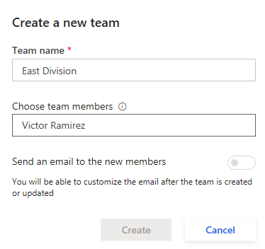
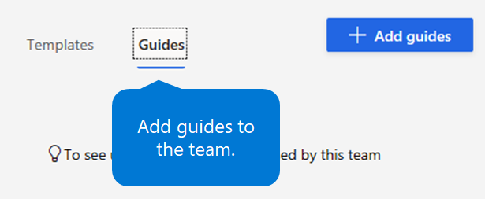
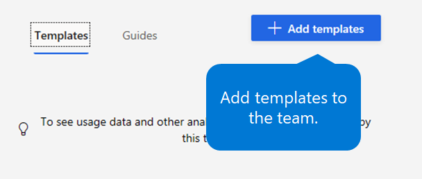
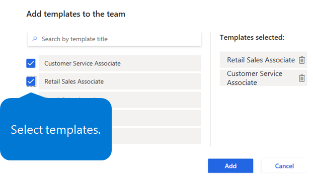

---
# required metadata

title: Create a hiring team by using Dynamics 365 Talent - Onboard
description: This topic explains how to use the Microsoft Dynamics 365 Talent - Onboard app to create onboarding teams.
author: andreabichsel
manager:
ms.date: 05/02/2019
ms.topic: article
ms.prod:
ms.service: dynamics-365-talent
ms.technology:

# optional metadata

ms.search.form: HcmCourseType, HcmCourseTypeGroup, HRMCourseTable
# ROBOTS:
audience: Application User
# ms.devlang:
ms.reviewer: anbichse
# ms.search.scope: Core, Operations, Talent
# ms.tgt_pltfrm:
# ms.custom:
# ms.assetid:
ms.search.region: Global
# ms.search.industry:
ms.author: anbichse
ms.search.validFrom: 2019-05-06
ms.dyn365.ops.version: Talent
---

# Create a hiring team

[!include [banner](includes/banner.md)]

In Microsoft Dynamics 365 Talent: Onboard, you can create hiring teams. You can then assign onboarding guides and templates to each team.

## Create a hiring team

1. On the left menu, select **Teams**.
2. Under **Teams**, select the **Add** (plus sign \[**+**\]) tile.
3. In the **Create a new team** dialog box, under **Team name**, enter a name for the hiring team.

    ](./media/onboard-create-team.png)

4. Under **Choose team members**, enter the name or email address of each team member.

    To remove team members, select the **X** that appears next to their name under the box.

5. To email new team members, turn on the **Send an email to the new members** option.
6. Select **Create**.
7. If you indicated that you want to email new team members, edit the email in the next dialog box, and then select **Done**.

## Assign onboarding guides to a hiring team

1. On the left menu, select **Teams**.
2. Select the team.
3. On the **Guides** tab, select **Add guides**.

    ](./media/onboard-add-guides-to-team.png)

4. Select the check box for each onboarding guide that you want to assign to the team, and then select **Add**.

    ](./media/onboard-select-guides.png)

## Assign onboarding templates to a hiring team

1. On the left menu, select **Teams**.
2. Select the team.
3. On the **Templates** tab, select **Add templates**.

    ](./media/onboard-add-templates-to-team.png)

4. Select the check box for each template that you want to assign to the team, and then select **Add**.

    ](./media/onboard-select-templates.png)

### See also

- [Try or buy the Onboard app](https://dynamics.microsoft.com/talent/onboard/)
- [What's new or changed in Dynamics 365 Talent](./whats-new.md)
- [Release plans](https://docs.microsoft.com/business-applications-release-notes/index)
- [Get support for Microsoft Dynamics 365 Talent](./talent-support.md)
