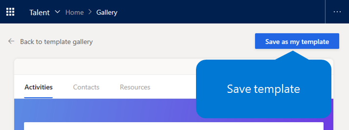

---
# required metadata

title: Create an onboarding template by using Dynamics 365 Talent - Onboard
description: This topic explains you to use the Dynamics 365 Talent - Onboard app to create a template for an onboarding guide for your new hires. This task is an essential first step in a human capital management (HCM) hire-to-retire strategy.
author: andreabichsel
manager:
ms.date: 05/02/2019
ms.topic: article
ms.prod:
ms.service: dynamics-365-talent
ms.technology:

# optional metadata

ms.search.form: HcmCourseType, HcmCourseTypeGroup, HRMCourseTable
# ROBOTS:
audience: Application User
# ms.devlang:
ms.reviewer: anbichse
# ms.search.scope: Core, Operations, Talent
# ms.tgt_pltfrm:
# ms.custom:
# ms.assetid:
ms.search.region: Global
# ms.search.industry:
ms.author: anbichse
ms.search.validFrom: 2019-05-06
ms.dyn365.ops.version: Talent
---

# Create an onboarding template

[!include [banner](includes/banner.md)]

Microsoft Dynamics 365 Talent: Onboard provides various templates that can help you create an onboarding guide as quickly as possible. You can use one or more of these templates, or you can create your own templates. Onboard provides sample text that you can use when you create your own templates. Therefore, the process is easy even if you start from scratch.

## Create an onboarding template from an existing template

1. On the left menu, select **Templates**.
2. Under **Popular templates from the gallery** or **My templates**, select a template. To view more templates, select **More in template gallery**.
3. Follow one of these steps:

    - If the template is from the gallery, select **Save as my template**, enter a new name for the template, and select **Save**.
    - If the template is from **My templates**, select **Save as template**, enter a new name for the template, and select **Save**.

    

## Create a new onboarding template

1. On the left menu, select **Templates**.
2. Under **My templates**, select the **Add** (plus sign \[**+**\]) tile.

    

3. In the **Create a guide template** dialog box, enter a name for the template, and then select **Save**.

## Next steps

- [Edit onboarding guides and templates](./onboard-edit-guides-templates.md)
- [Share content with other contributors](./onboard-share-template.md)
- [View the status of tasks and onboarding employees](./onboard-view-status.md)
- [Create hiring teams in Onboard](./onboard-create-team.md)

### See also

- [Try or buy the Onboard app](https://dynamics.microsoft.com/talent/onboard/)
- [What's new or changed in Dynamics 365 Talent](./whats-new.md)
- [Release plans](https://docs.microsoft.com/business-applications-release-notes/index)
- [Get support for Microsoft Dynamics 365 Talent](./talent-support.md)
