---
# required metadata

title: Edit onboarding guides and templates in Dynamics 365 Talent - Onboard
description: This topic explains how to add activities and other information to onboarding guides and templates in Microsoft Dynamics 365 Talent - Onboard.
author: andreabichsel
manager:
ms.date: 06/19/2019
ms.topic: article
ms.prod:
ms.service: dynamics-365-talent
ms.technology:

# optional metadata

ms.search.form: HcmCourseType, HcmCourseTypeGroup, HRMCourseTable
# ROBOTS:
audience: Application User
# ms.devlang:
ms.reviewer: anbichse
# ms.search.scope: Core, Operations, Talent
# ms.tgt_pltfrm:
# ms.custom:
# ms.assetid:
ms.search.region: Global
# ms.search.industry:
ms.author: anbichse
ms.search.validFrom: 2019-06-19
ms.dyn365.ops.version: Talent
---

# Edit onboarding guides and templates

[!include [banner](includes/banner.md)]

After you create an onboarding guide or template in Microsoft Dynamics 365 Talent: Onboard, you must add an introduction, activities, contacts, and resources. Onboard lets you include rich content in your onboarding guides, including:

- YouTube videos
- Microsoft Sway presentations
- Microsoft PowerApps apps
- Microsoft Stream videos
- Microsoft Forms forms
- Iframes that contains web content

## Edit introductions or activities imported from a template

If you create an onboarding guide from a template, or if you import activities from one template into another, you'll notice a **Lock** button on the imported activities. These are called *managed activities*.

[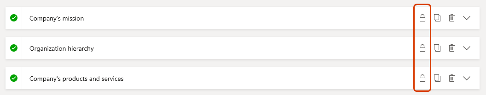](./media/onboard-edit-guide-managed-activities.png)

When you select a managed activity, you can see the source template at the top of the activity.

[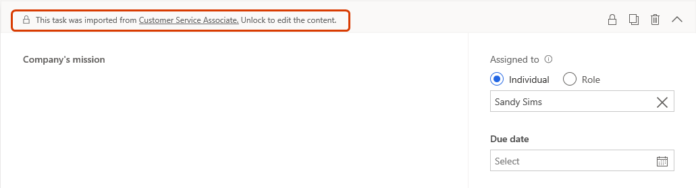](./media/onboard-edit-guide-managed-activity-source.png)

If you edit an activity in a template, Onboard will push the changes to all templates and unsent guides that are based on that template. If you select an unsent guide based on a template you edited and then select the **Activities** tab in the guide, you will see a notice that your guide has changed. To dismiss the notification, select **OK**. 

You'll see a black dot next to the updated activities.

[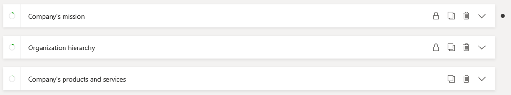](./media/onboard-edit-guide-changed-activity.png)

You can't edit managed activities outside of the original template, except to add an assignee, due date, or other information in the right-hand section of the activity.

If you want to edit a managed activity, or if you don't want an activity to receive updates from the template it came from, select the **Lock** button for that activity. The **Lock** button will disappear. The activity will no longer be managed by the original template, and it will no longer receive updates from that template. Updates you make to an activity do not affect the original template.

If you delete an activity from a guide and push changes from that guide's template, the activity will remain deleted in the guide.

> [!NOTE]
> Contacts and resources aren't managed by templates. In addition, sections aren't managed, so if you add or edit a section in a template, the changes won't be pushed to any guides or templates that use that template.
> 
> If you add new activities to a template, the new activities are pushed to guides and templates based on that template, and the new activities display at the top.

## Import activities from another template

You can import activities from one or more templates into a guide or template.

1. Select the guide or template you want to edit.

2. Select the **Activities** tab.

3. Select the **Import** tab in the section on the right.

   

4. To preview the tasks in a new tab in your browser, select the **Open in new tab** button on any template.

   [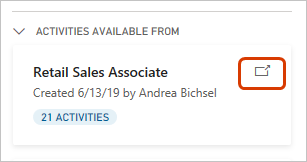](./media/onboard-edit-guide-preview-activities.png)

5. Drag and drop the desired template to the place in your guide template where you want the activities to appear. Continue editing your guide or template.

The imported activities will contain a **Lock** button, which indicates those activities are managed by the template you imported from. When you make changes to the template you imported, those activities will update in the template you imported them to. However, the changes will not be pushed automatically to any guides created from the template you imported to.

## Push changes from a template to other templates or guides

If you edit a template that contains activities that are used in other templates or guides, you must push the changes if you want them to appear in the other templates or guides.

If you're not sure whether your template's activities are used in other templates or guides, select the **Used in** tab to view where those activities appear.

   [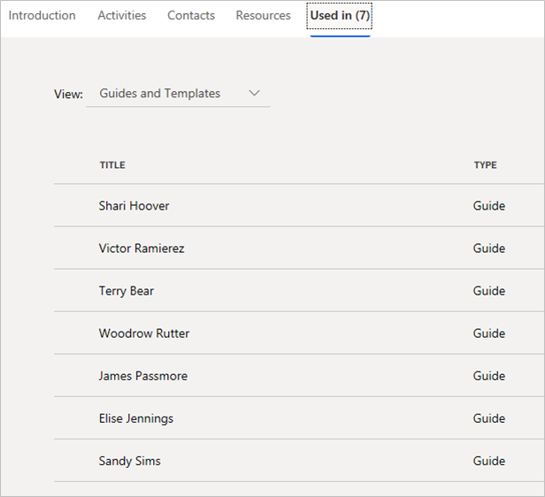](./media/onboard-edit-guide-view-used-in.png)

To push your changes:

1. Save your changes by selecting the **Save** button. If you don't do this, you'll be prompted to save your changes in the next step.

2. Select **Push these changes**.

   
## Add or edit an introduction

1. On the **Introduction** tab, enter a title for your guide and an opening message. To use the sample text, select **Use this message**.

    [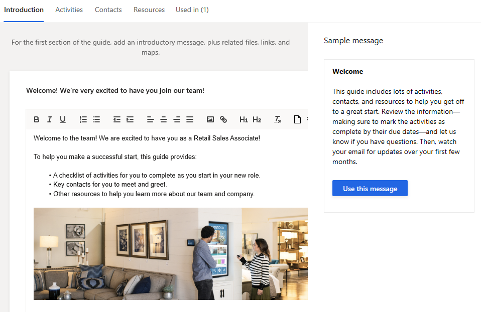](./media/onboard-template-introduction.png)

2. Use the formatting buttons to call out text as you require, or to add images or links.
3. Select **Save** to save your work.

## Add or edit activities

1. On the **Activities** tab, drag items from the right to the editing area.
2. To organize your guide into sections, drag the **New section** item to the editing area, and enter a name and an optional description for the section.

    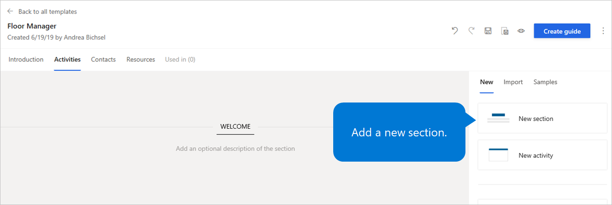](./media/onboard-edit-add-section.png)

3. To add activities for your new hire to complete, drag the **New activity** item to the editing area, and enter a name and description for the activity.

    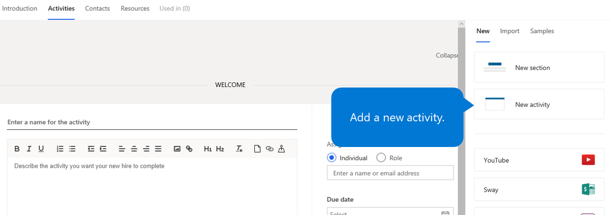](./media/onboard-edit-add-activity.png)

4. Add rich content to your onboarding guide:

    - To add a YouTube video, drag the **YouTube** item to the editing area, enter a name and description for the activity, and enter the URL for the YouTube video.
    - To add a Sway presentation or newsletter, drag the **Sway** item to the editing area, enter a name and description for the activity, and enter the embedded URL for the Sway presentation or newsletter.
    - To add a Microsoft Power Apps app, drag the **Power Apps** item to the editing area, enter a name and description for the activity, and either select the Power Apps app or enter the Power Apps app ID.
    - To add a Microsoft Stream video, drag the **Microsoft Stream** item to the editing area, enter a name and description for the activity, and enter the URL for the Microsoft Stream video.
    - To add a Microsoft Forms form, drag the **Microsoft Forms** item to the editing area, enter a name and description for the activity, enter the URL for the Microsoft Forms form, and specify the size of the screen area.
    - To add an iframe that contains web content, drag the **Web Content (iframe)** item to the editing area, enter a name and description for the activity, enter the URL for the web content, and specify the size of the screen area.

    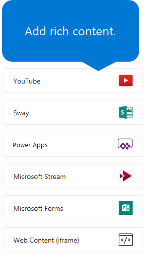](./media/onboard-edit-add-rich-content.png)

2. Optional: In the area on the right of each activity, assign the activity to a specific person or role, add a due date and contact person, and assign a category color. When you assign an activity to a person or role, a task is created for each individual. This task appears on the **Tasks** menu in Onboard.

    [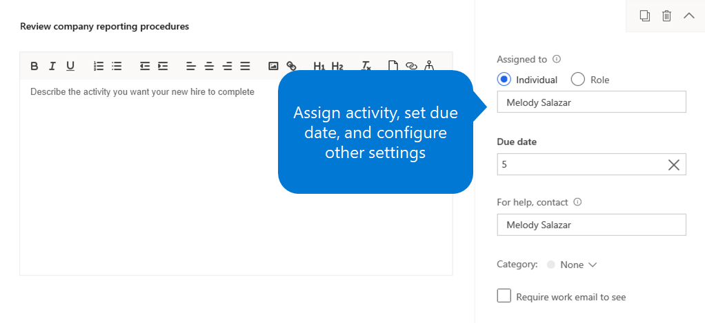](./media/onboard-assign-activity.png)

3. Select **Save** to save your work.

To delete an activity or section, select the **Delete** button (the trash can symbol) in the upper-right corner of the activity or section.

To rearrange activities and sections, drag them to a new location.

## Add or edit contacts

You can add contact people who can help your new hire succeed from day one. These contacts can be recruiters, teammates, onboarding buddies, mentors, admins, and IT support staff.

1. On the **Contacts** tab, select **New contact**.
2. In the **Add team member** dialog box, enter the contact person's name or email address, enter a short description that explains how the contact person can help the new hire, and then select **Add**. 

    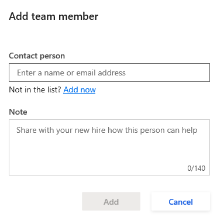](./media/onboard-edit-add-contact.png)

    Alternately, you can select one or more contacts under **Suggestions**.

3. Select **Save** to save your work.

To delete a contact, select the **Delete** button (the trash can symbol) to the right of the contact.

To edit a contact, select the **Edit** button (the pencil symbol) to the right of the contact.

## Add or edit resources

You can add useful files, maps, and links to the **Resources** section of your onboarding guide.

1. On the **Resources** tab, select **New resource**.
2. Follow one of these steps:

    - To add a file, select the **File** tab, and drag the file into the designated area. (Alternatively, click anywhere in that area to browse for the file on your computer, or select **Browse OneDrive**.) Enter a name for the file, and then select **Add**.
    - To add a link, select the **Link** tab, enter a name and address for the link, and then select **Add**.
    - To add a map, select the **Map** tab, enter a name and address for the map, and then select **Add**. Onboard will include a map of the address that you specify.

    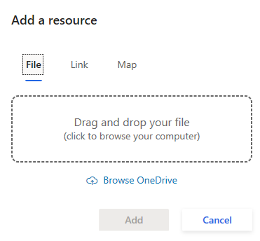](./media/onboard-edit-add-resource.png)

3. Select **Save** to save your work.

To delete a resource, select the **Delete** button (the trash can symbol) to the right of the resource.

To edit a contact, select the **Edit** button (the pencil symbol) to the right of the resource.

## Next steps

- [Share content with other contributors](./onboard-share-template.md)
- [View the status of tasks and onboarding employees](./onboard-view-status.md)
- [Create hiring teams in Onboard](./onboard-create-team.md)

### See also

- [Try or buy the Onboard app](https://dynamics.microsoft.com/talent/onboard/)
- [What's new or changed in Dynamics 365 Talent](./whats-new.md)
- [Release plans](https://docs.microsoft.com/business-applications-release-notes/index)
- [Get support for Microsoft Dynamics 365 Talent](./talent-support.md)
