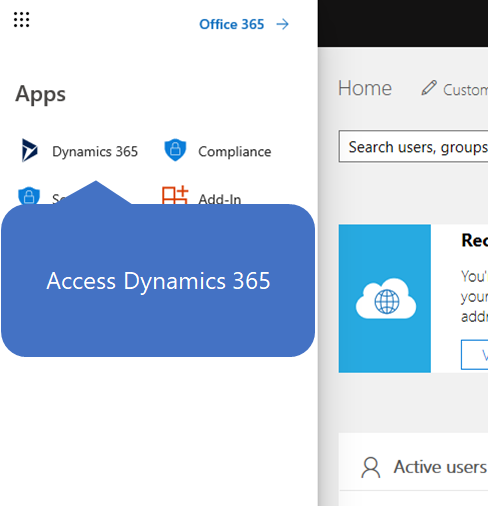
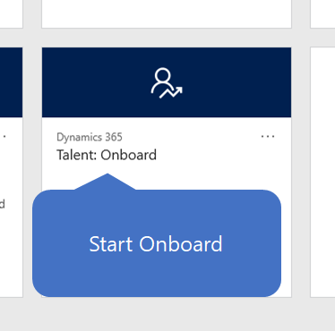
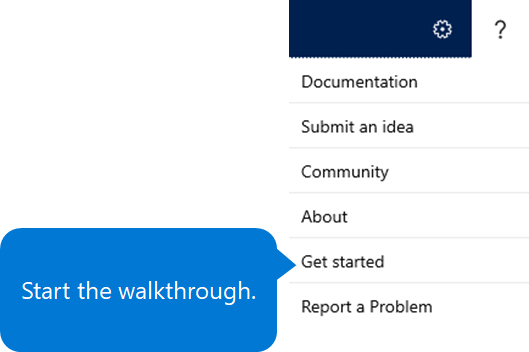

---
# required metadata

title: Get the Dynamics 365 Talent - Onboard app
description: This topic explains how to get the stand-alone version of the Microsoft Dynamics 365 Talent - Onboard app or the version that includes the Comprehensive Hiring Add-On.
author: andreabichsel
manager:
ms.date: 05/02/2019
ms.topic: article
ms.prod:
ms.service: dynamics-365-talent
ms.technology:

# optional metadata

ms.search.form: HcmCourseType, HcmCourseTypeGroup, HRMCourseTable
# ROBOTS:
audience: Application User
# ms.devlang:
ms.reviewer: anbichse
ms.search.scope: Core, Operations, Talent
# ms.tgt_pltfrm:
# ms.custom:
# ms.assetid:
ms.search.region: Global
# ms.search.industry:
ms.author: anbichse
ms.search.validFrom: 2019-05-06
ms.dyn365.ops.version: Talent July 2017 update
---

# Get the Onboard app

[!include [banner](includes/banner.md)]

You can view a demo and try the Microsoft Dynamics 365 Talent: Onboard app for free from the [Onboard product page](https://dynamics.microsoft.com/talent/onboard/).

> [!NOTE]
> The free trial requires a business email account.

You can purchase a subscription to Onboard as either a stand-alone app or part of Dynamics 365 Talent. For more information about how to purchase Onboard, see the [Onboard product page](https://dynamics.microsoft.com/talent/onboard/).

During the trial or purchase process, you will set up your Microsoft 365 email address and password. Be sure to make a note of these values.

> [!WARNING]
> You can't migrate data from your trial to your paid subscription environment. <!--Reviewers: please verify.-->

To find out about new features in Talent, see [What's new or changed in Dynamics 365 Talent](./whats-new.md) and [Dynamics 365 and Power Platform release notes](https://docs.microsoft.com/business-applications-release-notes/index). If you want to preview new features in Onboard, see [Access preview features in Microsoft Dynamics 365 Talent](./access-preview-feature.md).

If you're an IT professional and want to learn more about how the two versions of the Onboard app are provisioned, see [Provisioning for the Dynamics 365 Talent - Onboard app](./modular-app-tech-faq.md).

## Get started with Onboard

When you open Onboard for the first time, you're invited to start a tour of the Microsoft 365 admin center. The admin center is where you set up your organization, manage users, and manage your subscriptions. (One of those subscriptions is your Onboard subscription.) For more information about the Microsoft 365 admin center, see [About the Microsoft 365 admin center](https://docs.microsoft.com/office365/admin/admin-overview/about-the-admin-center?view=o365-worldwide).

To get to the Onboard app, follow these steps.

1. Open the [Microsoft sign-in page](https://portal.office.com/).
2. When you're prompted, enter your Microsoft 365 email address and password.
3. Select the app launcher in the upper left, and then select **Dynamics 365**.

    

4. Select the **Talent: Onboard** tile.

    

Your first sign-in might take a few minutes, because the environment must be initialized.

## Try the walkthrough

When you first open Onboard, you can select **Start the walkthrough** to get started with a working template.

If you skip the walkthrough, you can access it later by selecting the **Help** button (**?**) and then selecting **Get started**.

](./media/onboard-start-walkthrough.png)

## Change the domain name

If you accepted the default domain name when you signed up with Onboard, you can change it to another domain later. (The default domain name ends in **onmicrosoft.com**.)

1. Open the [Microsoft sign-in page](https://portal.office.com/).
2. When you're prompted, enter your Microsoft 365 email address and password.
3. If you see a recommendation to add your own domain under **Recommended for you**, select **View recommendation**, and follow the prompts. If you don't see the recommendation, select **Show all** on the menu on the left, select **Setup**, select **Domains**, and then select either **Add domain** or **Buy domain**. Then follow the prompts.

## Next steps

- [Create an onboarding guide](./onboard-create-guide.md)
- [Create an onboarding template](./onboard-create-template.md)
- [Edit onboarding guides and templates](./onboard-edit-guides-templates.md)
- [Share content with other contributors](./onboard-share-template.md)
- [View the status of tasks and onboarding employees](./onboard-view-status.md)
- [Create hiring teams in Onboard](./onboard-create-team.md)

### See also

- [Try or buy the Onboard app](https://dynamics.microsoft.com/talent/onboard/)
- [What's new or changed in Dynamics 365 Talent](./whats-new.md)
- [Release plans](https://docs.microsoft.com/business-applications-release-notes/index)
- [Get support for Microsoft Dynamics 365 Talent](./talent-support.md)
