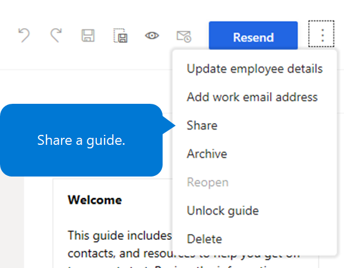
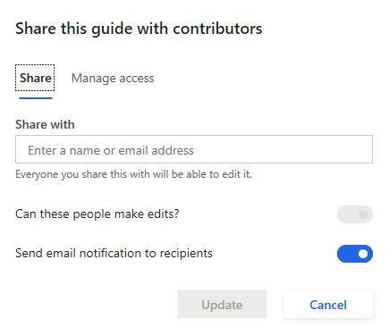
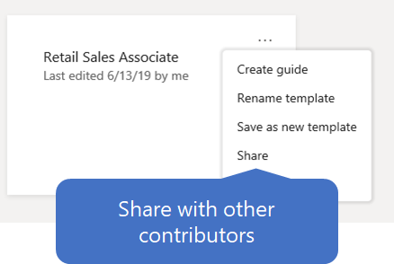

---
# required metadata

title: Share content with other contributors in Dynamics 365 Talent - Onboard
description: This topics explains how to share onboarding guides and templates with other contributors in the Microsoft Dynamics 365 Talent - Onboard app.
author: andreabichsel
manager:
ms.date: 05/20/2019
ms.topic: article
ms.prod:
ms.service: dynamics-365-talent
ms.technology:

# optional metadata

ms.search.form: HcmCourseType, HcmCourseTypeGroup, HRMCourseTable
# ROBOTS:
audience: Application User
# ms.devlang:
ms.reviewer: anbichse
# ms.search.scope: Core, Operations, Talent
# ms.tgt_pltfrm:
# ms.custom:
# ms.assetid:
ms.search.region: Global
# ms.search.industry:
ms.author: anbichse
ms.search.validFrom: 2019-05-06
ms.dyn365.ops.version: Talent
---

# Share content with other contributors

[!include [banner](includes/banner.md)]

Microsoft Dynamics 365 Talent: Onboard lets you share onboarding guides and templates with other contributors so that they can review the documents and make changes.

## Share an onboarding guide with other contributors

1. On the left menu, select **Guides**, and then select the guide that you want to share.
2. Select the **More** button (the three vertical dots) in the upper-right corner of the page, and then select **Share**.

    ](./media/onboard-share-guide.png)

3. Under **Share with**, if recipients should be able to revise the guide, set the **Can these people make edits?** option to **On**. If recipients should be notified by email that you've shared the guide with them, set the **Send email notification to recipients** option to **On**.

    ](./media/onboard-share-guide-with-contributors.png)

4. Enter a name or email address, and select the desired recipient in the drop-down list.
5. On the **Manage access** tab, you can review or change what recipients can do with the guide. To change a recipient's access, in the drop-down list next to the recipient's name, select **Can View**, **Can edit**, or **Remove**, as appropriate.
6. When you've finished adding or modifying recipients, select **Update**.

## Share an onboarding template with other contributors

1. On the left menu, select **Templates**.
2. Under **My templates**, select the **More** button (the ellipsis \[**...**\]) in the upper-right corner of the template that you want to share, and then select **Share**.

    

3. Under **Recipient**, if recipients should be able to revise the template, set the **Can these people make edits?** option to **On**. If recipients should be notified by email that you've shared the template with them, set the **Send email notification to recipients** option to **On**.

    

4. Enter a name or email address, and select the desired recipient in the drop-down list.
5. On the **Manage access** tab, you can review or change what recipients can do with the template. To change a recipient's access, in the drop-down list next to the recipient's name, select **Can View**, **Can edit**, or **Remove**, as appropriate.
6. When you've finished adding or modifying recipients, select **Update**.

## Next steps

- [Share content with other contributors](./onboard-share-template.md)
- [View the status of tasks and onboarding employees](./onboard-view-status.md)
- [Create hiring teams in Onboard](./onboard-create-team.md)

### See also

- [Try or buy the Onboard app](https://dynamics.microsoft.com/talent/onboard/)
- [What's new or changed in Dynamics 365 Talent](./whats-new.md)
- [Release plans](https://docs.microsoft.com/business-applications-release-notes/index)
- [Get support for Microsoft Dynamics 365 Talent](./talent-support.md)
