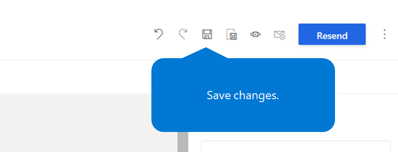
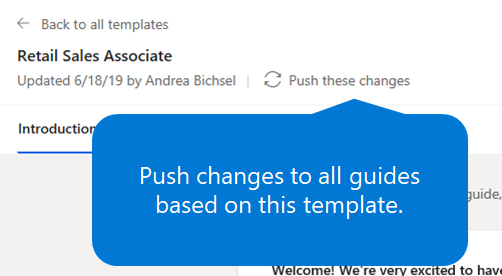

---
# required metadata

title: Update onboarding guides in Dynamics 365 Talent - Onboard
description: This topic explains how to update onboarding guides in Microsoft Dynamics 365 Talent - Onboard, and how to push changes to existing guides.
author: andreabichsel
manager:
ms.date: 06/21/2019
ms.topic: article
ms.prod:
ms.service: dynamics-365-talent
ms.technology:

# optional metadata

ms.search.form: HcmCourseType, HcmCourseTypeGroup, HRMCourseTable
# ROBOTS:
audience: Application User
# ms.devlang:
ms.reviewer: anbichse
# ms.search.scope: Core, Operations, Talent
# ms.tgt_pltfrm:
# ms.custom:
# ms.assetid:
ms.search.region: Global
# ms.search.industry:
ms.author: anbichse
ms.search.validFrom: 2019-06-21
ms.dyn365.ops.version: Talent
---

# Update onboarding guides

[!include [banner](includes/banner.md)]

If you must make changes to onboarding guides in Microsoft Dynamics 365 Talent: Onboard, you can update them and push the changes, even if you've already sent the guides. You have two options for updating an onboarding guide:

- Edit the onboarding guide directly, and save your changes.
- Edit the onboarding template, and then push the changes to all the onboarding guides that were created from it.

## Edit an onboarding guide directly

1. On the left menu, select **Guides**.
2. Select the guide that you want to edit.
3. Make all the desired changes, and then select the **Save** button (the disk symbol).

    ](./media/onboard-save.png)

Onboard will automatically send the new hire an email that indicates what the changes are. For easy identification, a red **New** tag will appear next to each change.

## Update multiple guides by editing the onboarding template

1. On the left menu, select **Templates**.
2. Under **My templates**, select the template that you want to edit.
3. Make all the desired changes, and then select the **Save** button (the disk symbol).
4. To push your changes to all the guides that are based on the template, select **Push these changes**.

    ](./media/onboard-push-changes.png)

The changes will be visible to new hires who open the onboarding guides. However, Onboard won't send email alerts to new hires to let them know that their onboarding guide has changed. For easy identification, a red **New** tag will appear next to each change. 
