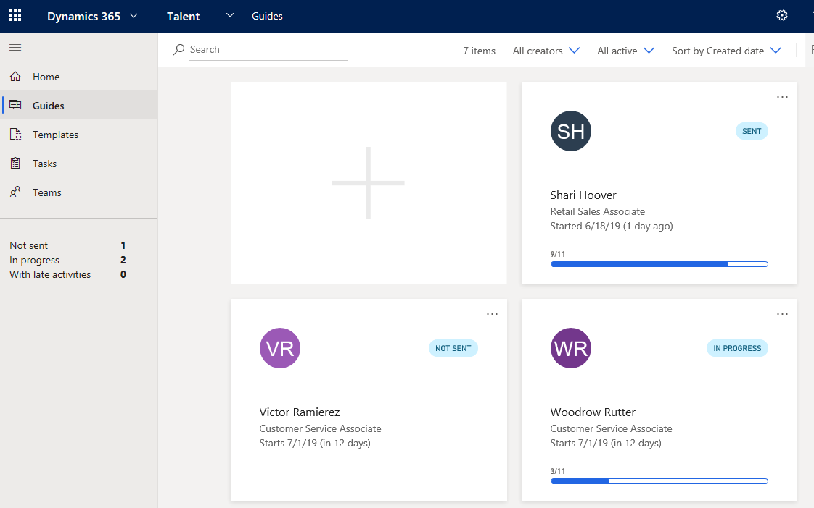
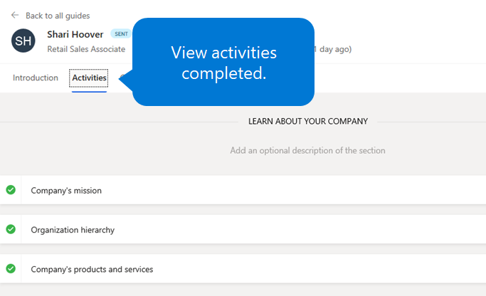

---
# required metadata

title: View the status of onboarding employees and your tasks
description: This topic explains how to use the Microsoft Dynamics 365 Talent - Onboard app to track where new hires are in their onboarding process.
author: andreabichsel
manager:
ms.date: 05/02/2019
ms.topic: article
ms.prod:
ms.service: dynamics-365-talent
ms.technology:

# optional metadata

ms.search.form: HcmCourseType, HcmCourseTypeGroup, HRMCourseTable
# ROBOTS:
audience: Application User
# ms.devlang:
ms.reviewer: anbichse
# ms.search.scope: Core, Operations, Talent
# ms.tgt_pltfrm:
# ms.custom:
# ms.assetid:
ms.search.region: Global
# ms.search.industry:
ms.author: anbichse
ms.search.validFrom: 2019-05-06
ms.dyn365.ops.version: Talent
---

# View the status of onboarding employees and your tasks

[!include [banner](includes/banner.md)]

Microsoft Dynamics 365 Talent: Onboard lets you view the progress that your new hires are making in their onboarding activities. You can also view any tasks that have been assigned to you from onboarding guides.

## View the status of onboarding employees

1. On the left menu, select **Guides**. You see an overview of the progress for all the onboarding guides that you've sent.

    ](./media/onboard-guide-status.png)

2. To drill down, select the guide that you want to view.
3. Select the **Activities** tab to see which activities your new hire has completed.

    ](./media/onboard-status-activities.png)

## View onboarding tasks that are assigned to you

1. On the left menu, select **Tasks**. You see an overview of all the onboarding tasks that have been assigned to you from the onboarding guides that were sent to employees.
2. To drill down, select the desired task.
3. Follow up with the new hire as required.
4. When you've completed the task, mark it as completed by adding a check mark to the circle.

## Next steps

- [Create hiring teams in Onboard](./onboard-create-team.md)

### See also

- [Try or buy the Onboard app](https://dynamics.microsoft.com/talent/onboard/)
- [What's new or changed in Dynamics 365 Talent](./whats-new.md)
- [Release plans](https://docs.microsoft.com/business-applications-release-notes/index)
- [Get support for Microsoft Dynamics 365 Talent](./talent-support.md)
