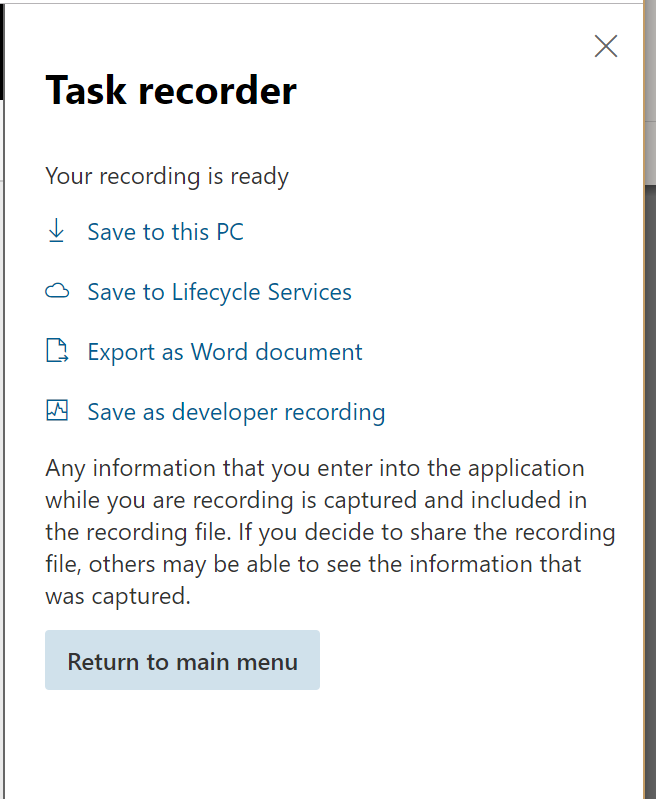

---
# required metadata

title: How to save task guides to LCS and replay them
description: This topic describes how to save task guides to LCS and then replay them.
author: Darinkramer
manager: AnnBe
ms.date: 11/02/2018
ms.topic: article
ms.prod: 
ms.service: dynamics-365-talent
ms.technology: 

# optional metadata

# ms.search.form: 
# ROBOTS: 
audience: Application User
# ms.devlang: 
ms.reviewer: josaw
ms.search.scope: Talent
# ms.tgt_pltfrm: 
ms.custom: 
ms.assetid: 
ms.search.region: Global
# ms.search.industry: 
ms.author: dkrame
ms.search.validFrom: 2018-11-02
ms.dyn365.ops.version: Talent

---

# How to save task guides to LCS and replay them

[!include [banner](includes/banner.md)]

**Environment details:** 

Talent deployed via Lifecycle Services (LCS).

**Problem:**

The customer wants to save new task recordings to their LCS project and replay the saved task guides.

  

**How to Save to LCS:**

1.  Sign in to LCS.

2.  Select the project and click the **Business process modeler** tile.

3.  View the page in the "Updated BPM experience".

4.  Select a library and **Copy**. Name the BPM model.

5.  Log into Talent from LCS.

6.  In the **Search** field, type "help". This will bring you to the Lifecycle Services help.

7.  Select the **Refresh** button for Lifecycle Services help configuration.

8.  Your new BPM library should appear and should be active.

9.  Close the page.

10. Create a new task recording.

11. When complete choose to **Save to LCS**.
    

    

12. Select the BPM library and node where you want to save the recording.

**How to replay from LCS:**

1.  Open Task recorder.

2.  Select **Open from LCS**.

3.  Select the library and the BPM node with the saved task guide.

4.  Open the task guide.

