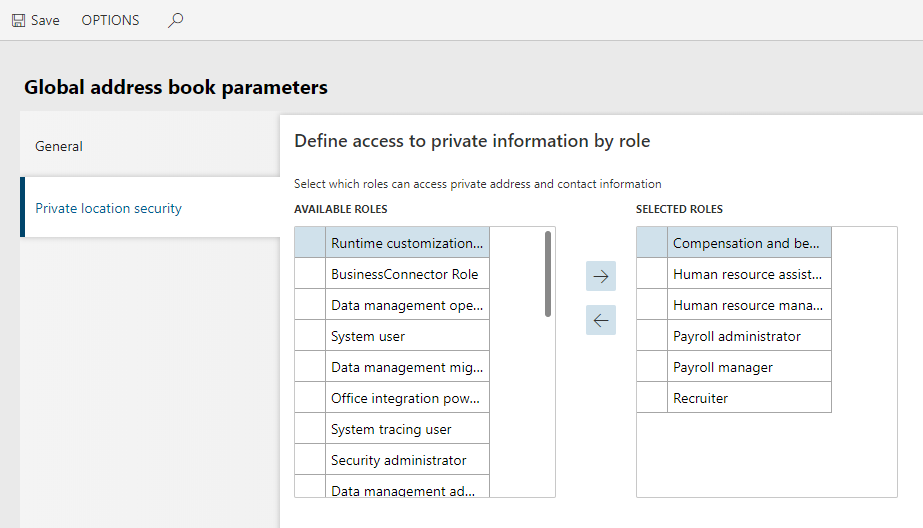

---
# required metadata

title: Access to private addresses by security role
description: The customer is unable to access private addresses.
author: Darinkramer
manager: AnnBe
ms.date: 11/02/2018
ms.topic: article
ms.prod: 
ms.service: dynamics-365-talent
ms.technology: 

# optional metadata

# ms.search.form: 
# ROBOTS: 
audience: Application User
# ms.devlang: 
ms.reviewer: josaw
ms.search.scope: Talent
# ms.tgt_pltfrm: 
ms.custom: 
ms.assetid: 
ms.search.region: Global
# ms.search.industry: 
ms.author: dkrame
ms.search.validFrom: 2018-11-02
ms.dyn365.ops.version: Talent

---

# Access to private addresses by security role

[!include [banner](includes/banner.md)]

**Issue:**

After duplicating a Security Role and logging in as that new Role, the customer isn't
able to see addresses that were marked as private. In order to resolve this
issue, the customer needs to perform the following steps with the duplicated security
role.

**Resolution:**

1. Navigate to **Organization administration > Global address book > Global address book parameters**.

2. Select **Private location security**.

3. Move the new security role from the **Available Roles** list to the **Selected Roles** list and then click **Save**.

